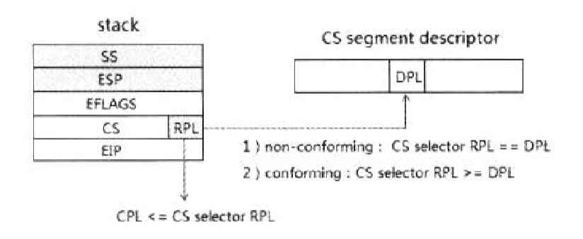
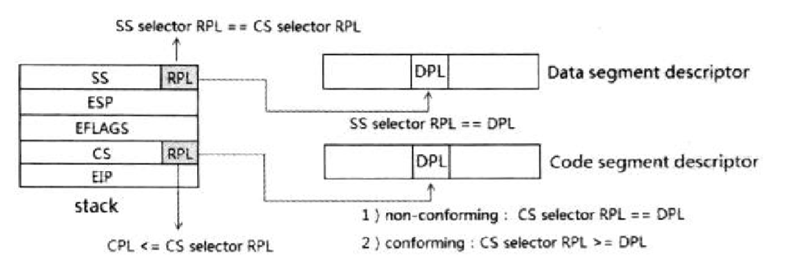
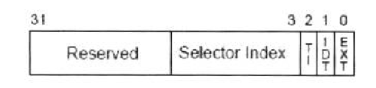
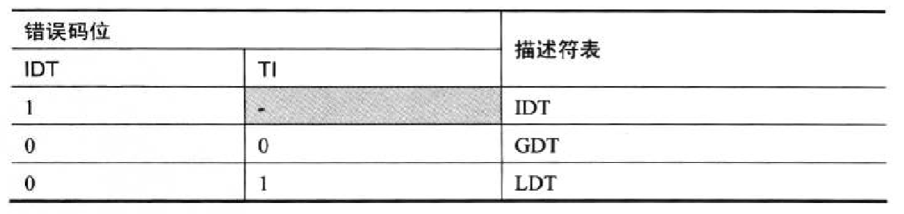
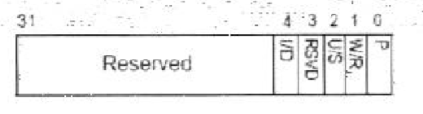

- 概述
- 1 返回时的任务切换
- 2 IRET指令的operand size
    - 2.1 IRET指令的助记符
    - 2.2 指令operand size的判断及行为
- 3 IRET指令返回前的检查
    - 3.1 CS Selector及Code Segment Descriptor类型的检查
    - 3.2 CS Selector及Code Segment Descriptor权限的检查
    - 3.3 64位模式下的Stack
- 4 返回到低权限级别时
    - 4.1 权限和stack的切换
        - 4.1.1 读取SS Selector与ESP值
        - 4.1.2 SS Selector及Data Segment Descriptor的类型检查
        - 4.1.3 SS Selector及Data Segment Descriptor的权限检查
    - 4.2 寄存器的加载
        - 4.2.1 CS、EIP与SS、ESP寄存器的加载
        - 4.2.2 EFLAGS寄存器的加载
        - 4.2.3 更新CPL值
        - 4.2.4 更新ES、DS、fS、GS寄存器
- 5 同级返回
- 6 错误码
    - 6.1 错误码格式
    - 6.2 确定descriptor table
    - 6.3 external event（外部事件）
    - 6.4 Selector Index
    - 6.5 #PF（Page Fault）异常的错误码

# 概述

从中断/异常处理程序中返回，使用IRET指令，在64位模式下应该使用IRETQ指令。返回的过程异常复杂。我们看看这个返回流程。

# 1. 返回时的任务切换

IRET指令返回时将eflags.NT标志位机进行检查。

```c
    if (eflags.NT == 1) {           // 嵌套任务
        if (IA32_EFER.LMA == 1) {   // IA-32e mode
            // failed：raise #GP Exception
        } else {                    // legacy mode
            // 产生任务切换
        }
    }
```
- 在IA-32e模式下：不支持任务切换机制，eflags.NT置位将产生#GP异常。
- 在Legacy模式下：eflags.NT置位，将会产生任务切换。

# 2. IRET指令的operand size

在中断/异常处理程序返回时IRET指令将从Stack中POP出处理器状态，如何POP出值由IRET指令的operand size来决定。

## 2.1 IRET指令的助记符

IRET指令的3种operand size对应着3个Mnemonics（助记符）：
1. 16位operand size形式：iret
2. 32位operand size形式：iretd或者iret（与16位operand size可以一样）
3. 64位operand size形式：iretq

在16位和32位operand size下IRET指令时同一个opcode，因此，在32位operand size可以使用iret或者iretd，在64位operand size下使用iretq指令，它的opcode前需要加上REX prefix（REX.W=1，也就是48H）值。

## 2.2 指令operand size的判断及行为

这个operand size的判断有着复杂的逻辑，如以下代码所示。

```c
    if (IA32_EFER.LMA == 1 && CS.L == 1) {              // IA-32e mode
    
        if (REX.W == 1) {                               // 64bit operand size
            pop(temp_rip);
            pop(temp_cs);
            pop(temp_rflags);
            pop(temp_rsp);
            pop(temp_ss);
        } else if (prefix == 66H) {                     // 16bit operand size
            pop(temp_ip);
            pop(temp_cs);
            pop(temp_flags);
            pop(temp_sp);
            pop(temp_ss);
        } else {                                        // 32bit operand size
            pop(temp_eip);
            pop(temp_cs);
            pop(temp_eflags);
            pop(temp_esp);
            pop(temp_ss);
        }
        
    } else {                                            // compatibility 或 legacy 模式
        if (CS.D == 1) {                                // defalut operand szie is 32bit
            
            if (prefix == 66H) {                        // 16 bit operand size
                pop(temp_ip);
                pop(temp_cs);
                pop(temp_flags);
            } else {                                    // 32 bit operand size
                pop(temp_eip);
                pop(temp_cs);
                pop(temp_eflags);
            }
            
        } else {
            
            if (prefix == 66H) {                        // 32 bit operand size
                pop(temp_eip);
                pop(temp_cs);
                pop(temp_eflags);
            } else {                                    // 16 bit operand size
                pop(temp_ip);
                pop(temp_cs);
                pop(temp_flags);
            }
        }
    }
```
我们看到，在64位模式下IRET指令可以使用3种operand size。
1. 64位的operand size：由REX prefix的W位来决定，当W=1时使用64位operand size。
2. 32位的operand size：在64位模式下，IRET指令默认的operand size就是32位。
3. 16位的operand size：IRET指令加上前缀66H（Default operand size override prefix）变为16位。

IRET指令执行在64位模式下，处理器会无条件POP出Stack种的RIP、CS、RFLAGS、RSP以及SS值，临时保存起来。
- 当使用64位operand size时，POP出64位的值；
- 当使用32位operand size时，POP出32位的值；
- 当使用16位operand size时，POP出16位的值；

而当处于compatibility模式下，它的行为与legacy模式是一样的：会依据是否发生权限的切换而选择POP出ESP与SS值。

Intel Manual中对IA-32模式的描述符包括了对64位于compatibility模式情形下的描述，Mannul上说：当使用32位与16位operand size时只会pop出EIP、CS及EFLAGS值。

实际上，在64位模式下会无条件pop出包括stack内的ESP与SS值，不包括在compatibility模式下（在compatibility模式下取决于是否发生权限的切换）。

在legacy和compatibility模式下，处理器先POP出EIP/IP、CS、EFLAGS/FLAGS值，临时保存起来用于检查是否需要进行权限和stack的切换。

POP出值的时，在legacy和compatibility模式下，处理器会检查当前的ESP寄存器是否超出SS.limit值。而在64位下不会检查（在Intel手册描述里还会检查）。

# 3. IRET指令返回前的检查

从Stack中POP出来的值被临时保存起来，用于处理器的检查，然后在确定下一步工作。

## 3.1 CS Selector及Code Segment Descriptor类型的检查

POP出来的CS Selector值被临时保存起来，处理器将对这个CS Selector及由这个CS Selector所引用的code segment descriptor进行检查。
1. 对CS Selector的检查：是否为Null Selector，是否超出GDT或LDT的limit值。
2. 对CS Selector所引用的code segment descriptor的检查：描述符的类型是否属于代码段，并且需要S=P=1。

```c
    if (IA32_EFER.LMA == 1) {               // in IA-32e mode
        if (code_descriptor.L == 1) {
            // 返回到64位模式
        } else {
            // 返回到compatibility模式
        }
    }
```
上面的代码说明，在IA-32e模式下，IRET指令根据code segment descriptor的L标志位来判断，将要返回64位模式（L=1）还是compatibility模式（L=0）。

那么，IRET指令就有可能产生下面的4种情况（从IRET指令执行的角度看）。
1. 在64位模式下：返回到64位模式的代码。
2. 在64位模式下：返回到compatibility模式的代码。
3. 在compatibility模式下：返回到64位模式的代码。
4. 在compatibility模式下：返回到compatibility模式的代码。

然而，对于IA-32e模式下的中断和异常处理程序来说，只可能会从64位模式下返回到64位模式或compatibility模式代码，并不存在从compatibility模式返回。

这是因为，在IA-32e模式下的所有中断和异常处理程序必然是运行在64位模式下，不可能运行在compatibility模式下。

## 3.2 CS Selector及Code Segment Descriptor权限的检查

处理器检查temp_cs的RPL与当前的CPL，如下代码所示。
```c
    if (code_segment.C == 1) {                          // 属于conforming类型
    
        if (temp_cs.RPL < code_segment.DPL) {
            // failed：conforming segment DPL必须小于等于CS Selector RPL
        }
        
    } else if (temp_cs.RPL != code_segment.DPL) {       // 属于non-conforming类型
        // failed：CS Selector RPL不等于code segment descriptor DPL，raise #GP Exception
    }
    
    if (CPL < temp_cs.RPL) {                            // 返回到低级权限
        // 进行权限和stack切换，执行权限外的中断返回
    } else if (CPL == temp_cs.RPL) {                    // 返回到同级权限
        // 执行同级中断返回
    } else {
        // failed：不能返回到高级别权限，raise #GP Exception
    }
```
对于返回的CS Selector，所需要的权限如下：
- 当前的CPL <= CS selector的RPL值
- IRET指令只能返回到同级（CPL == CS Selector RPL）或者低权限（CPL < CS Selector RPL），当尝试返回到高权限时会产生#GP异常。

处理器也会检查所引用的code segment descriptor的权限，它依赖于code segment属于conforming类型还是non-conforming类型。
1. conforming类型：CS Selector RPL >= Code Segment Descriptor DPL。
2. non-conforming类型：CS Selector RPL == code Segment Descriptor DPL。

返回到conforming类型的code segment，权限和stack不会发生切换，code segment descriptor DPL必须小于等于CS selector RPL。

返回到non-conforming类型的code segment，code segment descriptor DPL必须等于CS selector的RPL值，如下所示。



图中stack里的SS和ESP值的读取依赖于是否发生stack的切换，以及是否处于64位模式下（64位模式下将POP出）。

## 3.3 64位模式下的Stack

在64位模式下执行IRETQ指令，处理器会无条件依次POP出RIP、CS、RFLAGS、RSP以及SS值，无论是否发生权限和stack的切换，而POP出来的值大小依赖于operand size。

除了上图所标注的检查外，处理器会额外检查。
1. 当返回到64位模式时：code segment descriptor的L=1并且D=0（指示为64位的代码）。
2. 当返回到compatibility模式时：code segment descriptor的L=0（D标志决定于default operand size）。

同时，我们下面将会看到，处理器还会对SS selector和它所引用的Data Segment Descriptor进行类型及权限的检查。

# 4. 返回到低权限级别时

当CPL < CS selector RPL时，意味着将返回到更低权限的代码，这将会发生权限和stack的切换。

## 4.1 权限和stack的切换

权限和stack的切换时基于stack中的CS selector与SS selector进行的。

### 4.1.1 读取SS Selector与ESP值

在legacy和compatibility模式下，当返回到低权限级别时，为了可以进行权限和stack的切换，处理器将继续POP出ESP和SS值，如以下代码所示。
```c
    if (CPL < temp_cs.RPL) {                        // 返回到低权限级别
    
        if (IA32_EFER.LMA == 0 || CS.L == 0) {      // legacy模式或compatibility模式
        
            if (operand_size == 32) {               // 32位 operand size
                pop(temp_esp);
                pop(temp_ss);
            } else {                                // 16位 operand size
                
            }
        }
        
        // 后续处理
    }
```
前面我们知道在64位模式下，处理器已经POP出了RSP和SS值。这些POP出的SS Selector和ESP值，也被临时保存起来，已备处理器检查。

### 4.1.2 SS Selector及Data Segment Descriptor的类型检查

接着处理器对POP出来的SS值（临时保存起来）进行检查，这个类型检查如下。

```c
    if (IA32_EFER.LMA == 1) {           // IA-32e模式下
        
        if (code_descriptor.L == 1) {   // 返回到64位模式
            
            if (temp_ss == 3) {
                // failed：SS Selector不能使用3级的Null Selector
            }
            
        } else if (temp_ss == 0 || temp_ss == 1 || temp_ss == 2 || temp_ss ==3) {
            // 返回到compatibility模式
            // failed：SS Selector不能使用Null Selector
        }
        
    } else if (temp_ss == 0 || temp_ss == 1 || temp_ss == 2 || temp ==3) {
        // failed：SS Selector不能使用Null Selector
    }
```
在IA-32e模式下，有两种情形：
1. 当返回到64位模式（目标代码段的L=1）时：如果返回的SS Selector的值为3（这个一个3级权限的Null Selector）将会产生#GP异常。
2. 当返回到compatibility模式（目标代码段的L=0）时：返回的SS Selector不能是Null Selector（即0、1、2、3），否则将产生#GP异常。

返回到64位模式里允许返回的SS Selector是非3级的Null Selector（即返回的权限级别不是3级）。在legacy模式下和compatibility模式里返回的SS Selector不能是Null Selector，否则将产生#GP异常。

处理器检查SS Selector是否超出GDT或LDT的limit（那个表依赖于temp_ss.TI值）。通过检查后，处理器由SS Selector读取Data Segment Descriptor，并进行检查。

```c
    base = temp_ss.TI > LDTR.base : GDTR.base;
    data_descriptor = base + (temp_ss & 0xFFF8);        // 读取Data Segment Descriptor
    
    if (data_descriptor.C_D == 1) {
        // failed：属于Code Segment，raise #GP Exception
    }
    
    if (data_descriptor.S == 0) {
        // failed：属于System Segment，raise #GP Exception
    }
    
    if (data_descriptor.W == 0) {
        // failed：属于Read-only Segment，raise #GP Exception
    }
    
    if (data_descriptor.P == 0) {
        // failed：non-present，raise #SS Exception
    }
```
如以上代码所示，SS Selector所引用的descriptor必须属于：
- Writable（可写的）
- Data Segment descriptor（数据段）
- P=1，即Present。

### 4.1.3 SS Selector及Data Segment Descriptor的权限检查

处理器还会进行一系列的权限检查，如下所示。



```c
    if (temp_ss.RPL != temp_cs.RPL) {
        // failed：raise #GP Exception
    }
    
    if (temp_ss.RPL != data_descriptor.DPL) {
        // failed：raise #GP Exception
    }
```
在x86/x64体系里，任何情况下（任何权限级别下，任何运行时刻）必须要：
1. CS.RPL = SS.RPL，当前CPL来自CS.RPL或者SS.RPL。
2. SS.DPL = SS.DPL，在加载SS寄存器时，data segment descriptor的DPL必须等于Selector RPL。

因此，这个权限和stack切换中的权限检查中，需要：
1. SS Selector RPL = data segment descriptor的DPL（也等于CS Selector RPL）。
2. SS Selector RPL =  CS Selector RPL。

实际上，在这个IRET指令执行产生的权限和Stack切换场景中，当目标code segment属于non-conforming类型时，CS selector RPL、SS selector RPL、code segment descriptor DPL，以及data segment descriptor DPL四者是相等的。

> 在x86/x64保护模式体系里，对于non-conforming类型的code段，CS.RPL的值是由code segment descriptor的DPL更新而来（DPL加载到CS.RPL里）。

然而，当目标code segment是conforming类型时，CS.RPL的值并不是由code segment descriptor的DPL更新（并不更新CS.RPL值），而是保持当前的CPL值。

因此，当执行conforming段时允许code segment DPL <= CS selector RPL。

## 4.2 寄存器的加载

当处理器完成对CS Selector、SS Selector，以及它们所引用的Code和Data段描述符的类型和权限检查后，处理器将会加载这些值到相应的寄存器里。

### 4.2.1 CS、EIP与SS、ESP寄存器的加载

返回到64位模式，处理器会判断RIP和RSP是否属于canonical地址形式，如果返回非64位模式则会判断EIP和ESP值是否超出limit值，然后在加载，如下所示。
```c
    if (IA32_EFER.LMA == 1 && code_descriptor.L == 1) {         // 返回到64位模式
        //判断rip是否为canonical形式
        if (temp_rip & 0xFFFF0000_00000000 == 0xFFFF0000_00000000) {
            // pass：属于canonical地址形式
        } else if (temp_rip & 0xFFFF0000_00000000 == 0) {
            // pass：属于canonical地址形式
        } else {
            // failed：不属于canonical地址形式，raise #GP Exception
        }
        
        // 判断rsp值是否为canonical形式
        if (temp_rsp & 0xFFFF0000_00000000 == 0xFFFF0000_00000000) {
            // pass：属于canonical地址形式
        } else if (temp_rsp & 0xFFFF0000_00000000 == 0) {
            // pass：属于canonical地址形式
        } else {
            // failed：不属于canonical地址形式，raise #GP Exception
        }
        
        rip = temp_rip;         // 加载RIP寄存器
        rsp = temp_rsp;         // 加载RSP寄存器
    } else {        // legacy模式或compatibility模式
        if (temp_eip > temp_cs.limit || temp_esp > temp.ss.limit) {
            // failed：超越Limit，raise #GP Exception
        }
        
        eip = temp_eip;         // 加载EIP寄存器
        esp = temp_esp;         // 加载ESP寄存器
    }
    
    cs = temp_cs;               // 加载CS寄存器
    ss = temp_ss;               // 加载SS寄存器
```
当返回到compatibility模式时，无须判断stack中的RIP和RSP值是否属于canonical地址（实际上着没必要判断，compatibility模式下只使用32位的地址）。

在legacy模式下和返回compatibility模式，将加载32位的值到目标寄存器，当使用16位operand size时只会pop低16位置。
```c
    if (operands_size == 16) {
        eip = (dword)temp_ip;           // eip & 0x0000FFFFF
        esp = (dword)temp_sp;           // esp & 0x0000FFFFF
    }
```
实际上等于POP出的16位值零扩展到32位的寄存器上。

### 4.2.2 EFLAGS寄存器的加载

由于EFLAGS寄存器的某些标志位更新需要权限，因此有下面的情形。

```c
    // 更新eflags寄存器，除了IOPL标志和IF标志外，需要额外判断
    if (operand_size == 16) {
        flags = temp_flags;
    } else if (operrand_size == 32) {
        eflags = temp_eflags;
    } else {
        rflags = temp_rflags;
    }
    
    if (CPL <= eflags.IOPL) {           // 是否有权限更新IF标志
        eflags.IF = temp_eflags.IF ;    // 可以更新IF标志
    }
    
    if (CPL == 0) {                     // 是否有权限更新IOPL值
        eflags.IOPL = temp_eflags.IOPL; // 可以更新IOPL标志
    }
```

IF标志位在CPL <= eflags.IOPL的权限下才可以更新，而IOPL标志位只有在0级下才能被更新。

值得注意的是，这个CPL是在执行IRET指令时候的CPL值，并不是权限切换后的CPL值。

在64位模式下不支持virtual-8086模式，因此不能更新VM标志。

### 4.2.3 更新CPL值

当更新完EFLAGS寄存器后，处理器的CPL被更新为CS.RPL值。
```c
    CPL = CS.RPL;       // 更新当前CPL为CS.RPL或SS.RPL
```
现在，CPL已经变更为权限切换后的CPL值。

### 4.2.4 更新ES、DS、fS、GS寄存器

在切换到低权限级别的情形里，处理器会加载一个Null Selector到这些寄存器里。

```c
    if (CPL > ES.DPL) {
        ES = 0;             // 加载Null Selector并更新ES寄存器Cache
    }
    
    if (CPL > DS.DPL) {
        DS = 0;             // 加载Null Selector并更新DS寄存器Cache
    }
    
    if (CPL > FS.DPL) {
        FS = 0;             // 加载Null Selector并更新FS寄存器Cache
    }
    
    if (CPL > GS.DPL) {
        GS = 0;             // 加载Null Selector并更新GS寄存器Cache
    }
```
处理器分别判断ES、DS、FS、GS寄存器的DPL值是否低于当前的CPL（这个是切换后新的CPL值），如果是将加载0值的Null Selector到这些寄存器，这个动作将使用这些寄存器的cache刷新为无效的（目的是防止在低权限里读取高权限的数据段）。

# 5. 同级返回

当CPL = CS Selector RPL时，意味着返回相同权限级别的代码。

```c
    if (CPL == temp_cs.RPL) {
        if (IA32_EFER.LMA == 1 && code_descriptor.L == 1) {     // 返回到64位模式
            // 1. 检查RIP是否为canonical地址形式
            // 2. 加载RIP寄存器
        }
        
        // 1. 加载CS与EIP寄存器
        // 2. 加载EFLAGS寄存器
    }
```
除了在legacy模式和compatibility模式下不会POP出SS和ESP值，不会产生权限和stack的切换外，其余的步骤是一致的。

# 6. 错误码

在前面的中断vector表里列出了哪些异常需要加入error code。除了表中不产生error code的异常外，下面的情形也不会产生error code：
1. 由INT、INT3、INTO指令调用中断/异常处理器程序，处理器不会产生error code。
2. 由硬件产生的中断和异常，不会产生error code。包括：由INTR引脚和NMI引脚产生的中断，以及由APIC产生的中断和异常。

## 6.1 错误码格式

error code的格式如下：



error code与segment selector的结构很像，包括4个部分：
1. EXT位（bit0）：当置位时，指示异常发生于处理器正在调用另一个时间的处理程序中。
2. IDT位（bit1）：当置位时，指示selector index指向IDT的gate描述符。
3. TI位（bit2）：当置位时，指示selector index指向LDT的描述符。
4. selector的index域（bit15 ~ bit3）：这是segment selector的index部分。

## 6.2 确定descriptor table

我们看到error code的IDT位和TI位用来确定selector index指向哪个descriptor table（描述符表），如下表所示。



- 当IDT位为0时，TI位才有意义。
- 当IDT位为1时，TI被忽略，这是selector index指向的是IDT（中断描述符表）。

## 6.3 external event（外部事件）

当一个程序产生一个event，处理器在这个event的提交过程（未处理）中又发生了异常时，这个异常的错误码的EXT位被置位，指示异常时发生在另一个时间的处理过程中。

典型地如前面所述的有可能发生#DF（double fault）异常的情景下，当处理器正在准备调用中断或异常的处理程序时发生了另一个异常。

例如，在执行int 0x80指令来调用中断时：
1. 处理器在IDT里读取gate描述符。
2. 可是这个gate描述符的P=0（not present），这时又引发另一个#NP异常。那么这个#NP异常的错误码中EXT位被置为1。

上面这个例子中#NP异常时发生在处理器正在调用0x80号中断处理程序时，如前面所述，如果#NP异常时发生在处理器正准备调用#GP异常处理器程序时，那么最终会产生#DF（double fault）异常。

## 6.4 Selector Index

错误码中的selector index是一个中断vector或者segment selector的index域。如前所述，当使用int 0x80指令调用中断处理程序时，由于IDT内的gate描述符P=0而引发#NP异常。

那么，#NP异常的错误码中：
1. EXT=1。
2. IDT=1。
3. TI=0或1（被忽略）。
4. selector index域为0x80，中断vector值。

- EXT位为1，指示异常发生在处理器正准备调用中断服务例程中。
- IDT位为1，指示selector index将指向IDT的gate描述符。
- TI位的值无所谓。
- selector index值就是在此例中的中断vector号0x80。

接上例，假设异常发生在gate描述符的code segment selector身上，当selector所引用的segment descriptor是Data segment（数据段）而非Code segment（代码段）时，会产生#GP异常。
那么，这个#GP异常的错误码将是：
1. EXT=1。
2. IDT=0。
3. TI=0（在GDT表时）或者TI=1（在LDT表时）。
4. selector index域的值是gate描述符内的这个code segment selector的index域。

这时候，IDT=0，因为指向GDT或LDT（依赖于selector.TI值），而错误码的selector index则是code segment selector的index值。

## 6.5 #PF（Page Fault）异常的错误码

在#PF异常中，错误码的格式又变得不一样，如下所示。



错误码的bit4到bit0位指示引发#PF异常的条件：
- P位（bit0）
    - P=0时，指示异常由not-present而引发，即table entry的P标志为0。
    - P=1时，指示异常由其他条件引发（如访问权限或者保留位，依赖于其他位）。
- W/R位（bit1）
    - W/R=0时，指示异常由读的时候引发。
    - W/R=1时，指示异常由写的时候引发。
- U/S位（bit2）
    - U/S=0时，指示异常由当前运行在supervisor权限（0、1、2级）时引发。
    - U/S=1时，指示异常由当前运行在User权限（3级）时引发。
- RSVD位（bit3）
    - RSVD=0时，指示保留位正常，没引发异常。
    - RSVD=1时，指示异常由保留位引发，即保留位为1值。
- I/D位（bit4）
    - I/D=0时，instruction fetch时正常，没引发异常。
    - I/D=1时，指示异常由instruction fetch时引发，即XD=1时取执行page，或者当前运行在supervisor权限时取执行user的page（前提是XD=1，且CR4.SEMP=1）。
