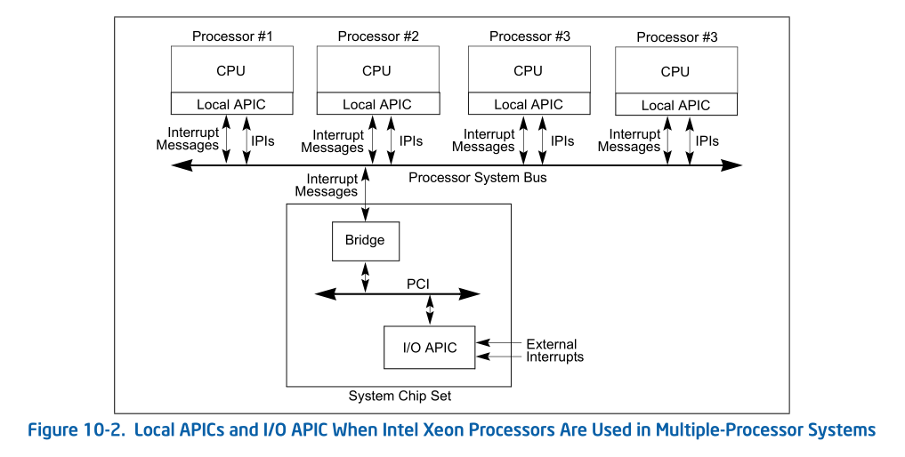

- 概述
- 1 APIC体系概述
    - 1.1 local APIC
    - 1.2 I/O APIC
- 2 local APIC接收到的中断源
    - 2.1 本地中断
        - 2.1.1 链接到LINT0和LINT1口的中断源
        - 2.1.2 CMCI
        - 2.1.3 APIC timer中断
        - 2.1.4 Thermal sensor中断
        - 2.1.5 Performance monitoring counter中断
        - 2.1.6 APIC内部错误产生中断
    - 2.2 外部中断
    - 2.3 处理器间的中断消息
- 3 APCI体系的版本
    - 3.1 APIC与xAPIC
    - 3.2 x2APIC

# 概述

intel从pentium处理器开始进入了APIC（Advanced Programmable Interrupt Controller）机制，直译为高级可编程中断控制器。引入APIC机制使为了适应multiple processor（MP，多处理器）环境。

# 1. APIC体系概述

整个APIC体系可以分为两大部分：local APIC和I/O APIC，Local APCI使整个APIC体系的核心，它就在处理器内部；而I/O APIC是芯片组的一部分，它在PCI-to-ISA bridge（或称PCI-to-LPC bridge）的LPC控制器内。

多核处理器环境的Local APIC与I/O APIC结构图，处理器内部的local APIC通过system bus接受来自处理器间的中断信息（IPI）和外部的中断消息（包括I/O APIC及外部设备）。

## 1.1 local APIC

每个logical processor（逻辑处理器）都有自己的local APIC，每个local APIC包括一组local APIC寄存器，用来控制local和external中断的产生、发送和接收等，也产生发送IPI（处理器间的中断信息）。

local APIC寄存器组以内存映射形式映射到物理地址空间上，因此软件可以使用mov指令进行访问。

然而在x2APIC模式上local APIC寄存器映射到MSR寄存器组来代替映射内存，软件使用rdmsr和wrmsr指令来访问local APIC寄存器。

在支持Intel Hyper-Threading Technology的MP系统上，两个logical processor（逻辑线程）共享一个processor core执行单元。

每个local APIC有自己的local APIC ID，这个ID决定了logical processor在system bus上的地址，可以用于处理器间消息接收和发送，也可以用于外部中断消息的接收。

## 1.2 I/O APIC

典型地，8259兼容类的legacy中断控制器是在uni-processor（单处理器）系统上使用，已不能适应于多核处理器环境，而I/O APIC能适用于multi-processor（多处理器）环境上。I/O APIC可以发送中断消息到指定的logical processor上。

I/O APIC属于芯片组的一部分，现称为PCH（platform controller Hub），位于PCI-to-SAI bridge（南桥芯片）的LPC控制器上。I/O APIC也有自己的寄存器，同样也以内存映射形式映射到物理地址空间上。

# 2. local APIC接收到的中断源

local APIC可以接收的中断源有：
1. local Interrupt（本地中断）
2. external Interrupt（外部中断）
3. inter-processor Interrupt message（IPI，处理器间的中断消息）

## 2.1 本地中断

local APIC有一组LVT（local vector table）寄存器用来产生和接收local interrupt source。

### 2.1.1 链接到LINT0和LINT1口的中断源

由LVT的LINT0和LINT1寄存器对应着处理器的LINT0和LINT1 pin，它们可以直接接收外部I/O设备或链接8259兼容类的外部中断控制器。

典型地，LINT0作为处理器的INTR pin接着外部8259类的中断控制器的INTR输出端，LINT1作为处理器的NMI pin接着外部设备的NMI请求。

### 2.1.2 CMCI

CMCI（corrected machine-check error interrupt）是machine-check机制上的一个增强功能。允许在处理器的corrected machine-check error 
interrupt（修正的机器检查错误）的count计数达到了一个临界值时，产生一个CMCI中断来报告信息。

### 2.1.3 APIC timer中断

local APIC的LVT timer寄存器可以被编程来产生APIC timer中断。

### 2.1.4 Thermal sensor中断

LVT thermal monitor寄存器可以被编程来产生由温度传感器触发的中断。

### 2.1.5 Performance monitoring counter中断

PMI（performance monitoring interrupt）由LVT的performance monitor寄存器编程支持，在使用性能监控时由counter溢出而产生中断。

### 2.1.6 APIC内部错误产生中断

LVT error寄存器记录着APIC内部发生的错误，当检测到LVT error错误时产生中断。

## 2.2 外部中断

芯片组上的I/O APIC接收来自链接到它的IRQ线上的I/O设备中断请求后，产生中断消息经过host bridge通过system bus发送到目标processor core的local APIC处理。

## 2.3 处理器间的中断消息

system bus上的logical processor可以使用local APIC的ICR（interrupt command register）发送一个中断给自己或其他logical processor，页可以发送中断到一组logical processor。

# 3. APCI体系的版本

APIC经历了4个版本，如下表所示。

版本 | 模式 | 备注
---|---|---
1 | 82489DX芯片 | 外部芯片
2 | APIC | APIC on chip
3 | xAPIC | APIC on chip
4 | x2APIC | APIC on chip

最初的APIC属于外部设备，以外部的82489DX芯片形式存在。在P6家族和Pentium处理器后，以APIC on chip形式存在，引入了处理器内部的local APIC架构，和82489DX外部APIC相比较功能得到了扩展和增强。

Pentium4和intel Xeon处理器在APIC的基础上进一步赶紧，形成了xAPIC体系，以及最后在xAPIC基础上在一次扩展的x2APIC体系。

## 3.1 APIC与xAPIC

在P6和Pentium处理器使用的APIC版本里，处理器之间以及local APIC与I/O APIC间的通信通过APIC bus。而Pentium4后续处理器基于扩展的xAPIC版本使用system bus代替APIC bus，APIC上的功能在xAPIC上得到扩展和修改。现在常用的是xAPIC版本。

## 3.2 x2APIC

x2APIC是进一步扩展的版本，并向下兼容xAPIC，新增了一组MSR寄存器来代替内存映射的寄存器。在x2APIC中处理器的ID地址被扩展为32位。