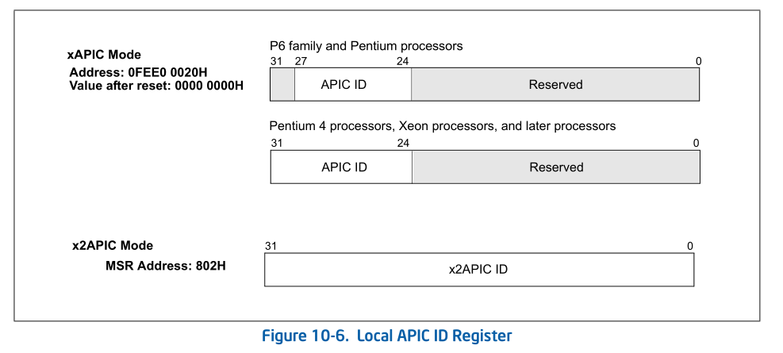
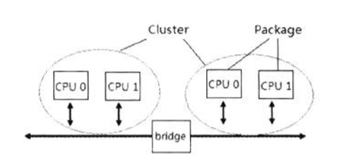
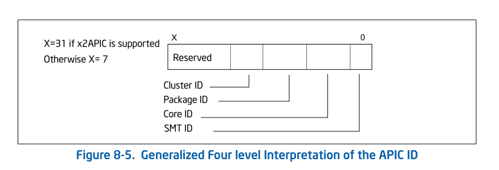
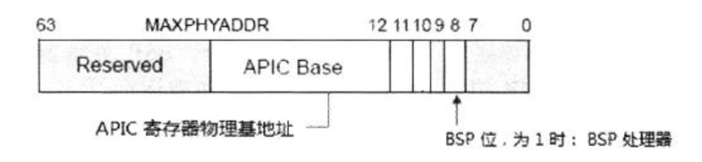
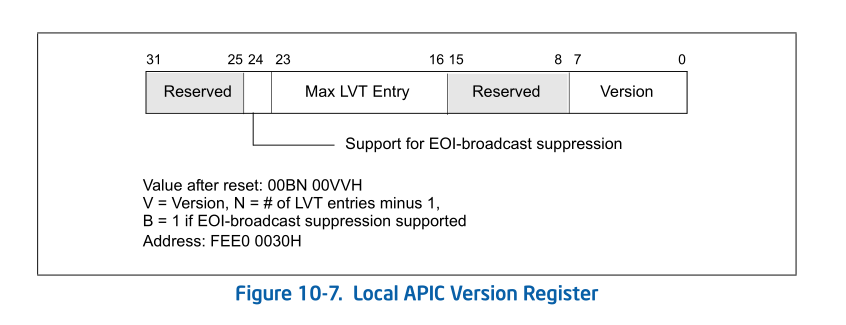
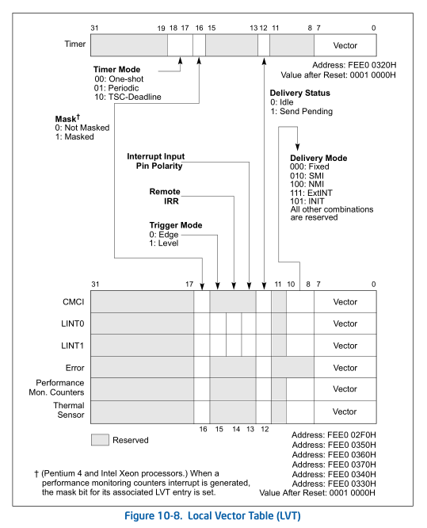
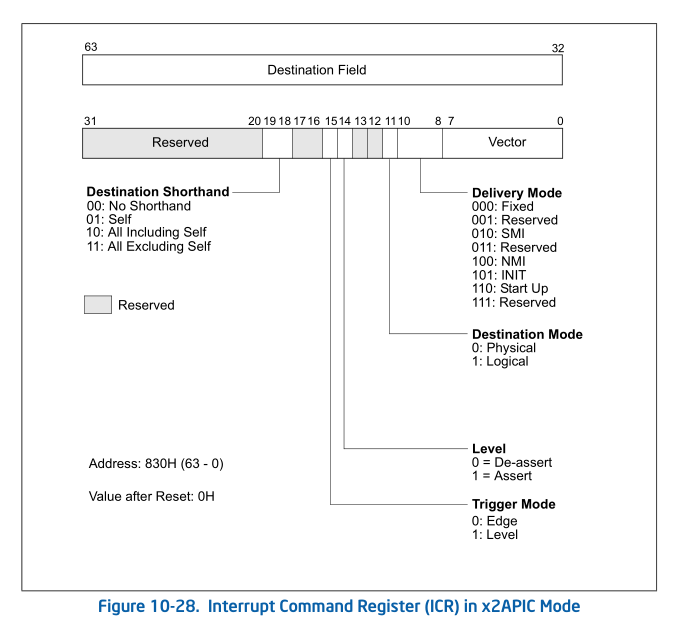

- 1 local APIC寄存器
    - 1.1 local APIC寄存器地址
        - 1.1.1 local APIC寄存器基地址
        - 1.1.2 local APIC寄存器重定位
    - 1.2 local APIC寄存器列表
- 2 local APIC ID
    - 2.1 local APIC ID寄存器
    - 2.2 Multi-core
    - 2.3 Hyper-Threading
    - 2.4 Multi-Threading
    - 2.5 检测处理器是否支持multi-threading
    - 2.6 Multi-threading下的APIC ID
        - 2.6.1 xAPIC ID
    - 2.7 multi-threading处理器编程
        - 2.7.1 枚举所有处理器的APIC ID
        - 2.7.2 BSP与AP处理器
        - 2.7.3 枚举所有processor
- 3 local APIC版本寄存器
- 4 LVT寄存器
- 5 ICR（Interrupt Command register）
    - 5.1 Destination shorthand域
    - 5.2 Destination Mode域
    - 5.3 Destination Field域
    - 5.4 Lowest Priority模式
    - 5.5 Start Up模式

# 1. local APIC寄存器

APIC和xAPIC版本中，local APIC寄存器映射到物理内存中。而x2APIC模式中local APIC寄存器映射到MSR寄存器组。

## 1.1 local APIC寄存器地址

local APIC寄存器的地址是以APIC\_BASE作为基地址，每个local APIC寄存器都有自己对应的偏移量，以local APIC ID寄存器的地址为例：它的偏移量是20H，那么local APIC ID寄存器的地址就是APIC\_BASE+20H。

### 1.1.1 local APIC寄存器基地址

local APIC寄存器的基地址来自IA32\_APIC\_BASE寄存器。


当处理器power-up或reset时APIC base值为FEE00000h。APIC base值的宽度依赖于MAXPHYADDR值（36位，40位或52位），低12位为0，因此APIC base地址将在4K边界上。

在分页机制下，由于APIC base是物理地址，而软件代码里使用的是Virtual address，因此系统必须负责某个区域的Virtual address映射到APIC base的物理地址上，以便于软件里使用mov指令访问local APIC寄存器。

> 由于APIC base物理地址提交到local APIC硬件上，因此APIC base的物理地址必须以stong uncacheable（不可cache）的内存映射类型。

### 1.1.2 local APIC寄存器重定位

xAPIC版本的local APIC寄存器的地址允许被重定位，使用IA32\_APIC\_BASE寄存器提供一个新值。在开启分页机制的环境下，我们必须考虑上面说的映射page的内存类型。

```asm
; input:
;   esi: 低32位， edi:高半部分
set_apic_base:
    call get_MAXPHYADDR     ; 得到MAXPHYADDR值
    mov ecx, 64
    sub ecx, eax
    shl edi, cl
    shr edi, cl             ; 去掉MAXPHYADDR以上的位
    mov ecx, IA32_APIC_BASE
    rdmsr
    mov edx, edi
    and esi, 0xfffff000
    and eax, 0x00000fff     ; 保持原来的IA32_APIC_BASE寄存器低12位
    or eax, esi
    wrmsr
    ret 
```

## 1.2 local APIC寄存器列表

下面是local APIC寄存器的完整列表，APIC寄存器的基地址是FEE00000H。


偏移量 | 寄存器
---|---
20h | local APIC ID
30h | local APIC Version
80h | TPR(task priority register)
90h | APR(arbitration priority register)
a0h | PPR(processor priority register)
b0h | EOI register
c0h | RRD(remote read register)
d0h | LDR(logical destination register)
e0h | DFR(destination format register)
f0h | SVR(spurious interrupt vector register)
100h | ISR[31:0] (in-service register)
110h | ISR[63:32] (in-service register)
120h | ISR[95:64] (in-service register)
130h | ISR[127:96] (in-service register)
140h | ISR[159:128] (in-service register)
150h | ISR[191:160] (in-service register)
160h | ISR[223:192] (in-service register)
170h | ISR[255:224] (in-service register)
180h | MTR[31:0] (rigger mode register)
190h | MTR[63:32] (rigger mode register)
1a0h | MTR[95:64] (rigger mode register)
1b0h | MTR[127:96] (rigger mode register)
1c0h | MTR[159:128] (rigger mode register)
1d0h | MTR[191:160] (rigger mode register)
1e0h | MTR[223:192] (rigger mode register)
1f0h | MTR[255:224] (rigger mode register)
200h | IRR[31:0] (interrupt request register)
210h | IRR[63:32] (interrupt request register)
220h | IRR[95:64] (interrupt request register)
230h | IRR[127:96] (interrupt request register)
240h | IRR[159:128] (interrupt request register)
250h | IRR[191:160] (interrupt request register)
260h | IRR[223:160] (interrupt request register)
270h | IRR[255:224] (interrupt request register)
280h | ESR (error status register)
2f0h | LVT CMCI regster
300h | ICR[31:0] (interrupt command register)
310h | ICR[63:32] (interrupt command register)
320h | LVT Timer register
330h | LVT Thermal Sensor register
340h | LVT Performance Monitoring Counter register
350h | LVT LINT0 register
360h | LVT LINT1 register
370h | LVT Error register
380h | Timer initial count register
390h | Timer current count register
3e0h | Timer divde configuration register

这些local APIC寄存器共占据了4K的页空间，每个local APIC寄存器地址都是16字节边界对齐的，寄存器宽度分别位32位、64位，以及256位。

下面的寄存器是256位的：
1. ISR（In-Service Register）
2. TMR（Trigger Mode Register）
3. IRR（Interrupt Request Register）

这些寄存器的每一位对应一个中断vector（共256个Interrupt vector），而64位寄存器只有一个ICR（Interrupt Command Register），其余寄存器都是32位的。

因此，访问一个完整的64位寄存器需要2次DWORD访问，256位寄存器需要进行8次DWORD访问。

# 2. local APIC ID

Local APIC ID是非常重要的。在处理器power-up或reset后，处理器和bus硬件上赋予每个local APIC唯一的initial APIC ID值，这个唯一的APIC ID值基于system bus上的拓扑结构构件，可以使用下面的方法查询这个值。

1. 在处理器支持CPUID 0B leaf的情况下，使用CPUID.0B:EDX[31:0]得到32位的APIC ID值。
2. 不支持CPUID 0B leaf时，使用CPUID.01:EBX[31:24]得到8位的APIC ID值。

然后，在处理器power-up或者reset期间，这个initial值被写入到local APIC ID寄存器里（在支持CPUID 0B leaf但不支持x2APIC模式下，只保存32位APIC ID值的低8位）。

APIC ID实际也是每个logical processor在system bus上的唯一标号。这个编号可以被使用在处理器进行通信，系统软件可以使用这个编号动态调度任务给某个某些处理器执行。

## 2.1 local APIC ID寄存器

local APIC ID寄存器保存着APIC ID值，地址在偏移量20h位置上，如下所示。



处理器上的xAPIC版本里APIC ID值是8位的，x2APIC版本上使用32位的APIC ID值。

## 2.2 Multi-core

Multi-core使用的是物理core技术，一个physical package上有两个物理core单元。

## 2.3 Hyper-Threading

Hyper-Threading使用逻辑core技术，两个logical processor共用一个physical package（物理处理器）。

## 2.4 Multi-Threading

Multi-Threading技术部单只Hyper-Threading（超线程），也包括了multi-core（多处理器核心）技术。
现在Intel的处理器上的multi-threading实现了Hyper-Threading与Multi-core相结合。

## 2.5 检测处理器是否支持multi-threading

对于处理器是否支持multi-threading技术，软件可以使用CPUID.01:EDX[28]位进行检测，为1时表示支持。

```asm
support_multi_threading:
    mov eax, 1
    cpudi
    bt edx, 28      ; HTT位
    setc al
    movzx eax,al
    ret
```
> support_multi_threading函数用来检测处理器是否支持multi-threading技术，然而，这里无法得知是支持Hyper-threading还是multi-core技术。

## 2.6 Multi-threading下的APIC ID

在Multi-threading技术下，initial APIC ID通常分成3-level或4level的拓扑结构，因此一个完整的APIC ID将分为3或4个sub-field（子域），某些处理器的32位x2APIC ID还可以超过4level，这些具体的sub-field信息需要通过CPUID的相关leaf进行查询。

### 2.6.1 xAPIC ID

当MP系统里包含cluster时，8位的initial APIC ID被分成4-level结构，最高层为Cluster ID，下面是一个使用cluster bridge链接各个cluster的示意图，每个cluster内有数个physical package。



在没有Cluster的MP系统里，initial xAPIC ID被分成3-level结构。


如上所示，8位的initial xAPIC ID结构的3个子域分分别如下：
1. Package ID：APIC ID最上层是Package ID，在一个MP（multi-processor）系统里，system bus会有多个physical page，每个physical package就是一个物理处理器。
2. Core ID：Package ID下一层是Core ID，用阿里区分physical Package内的processor core，在一个单核处理器上，Core ID的值为0。
3. SMT ID：Core ID下一层是SMT ID，每个SMT ID代表一个logical processor，SMT ID用来区分processor core内的logical processor。

> SMT（Simultaneous Multi-Threading）直译为同步的多线程，就是指Intel的Hyper-Threading技术，在processor core内实现两个共享物理core执行单元的线程。这些线程拥有自己的处理器资源（处理器的state信息），包括有自己的local APIC。logical processor就是指SMT单元。

x2APIC ID值的排列规则是由Packge/Core/SMT的MASK_WIDTH值造成。



## 2.7 multi-threading处理器编程

在multi-threading技术处理器下，system bus上抱有多个logical processor，每个logical processor被赋予一个唯一的APIC ID值，APIC ID是在system bus上识别logical processor的标识符。logical processor之间根据这个APIC ID值相互通信。

### 2.7.1 枚举所有处理器的APIC ID

BIOS或OS初始化期间需要枚举处system bus上所有的logical processor信息，包括：共有多少个处理器；它们的APIC ID是多少等。这些信息需要被记录下来。

BIOS或OS的另一个重要工作时对所有的processor进行必要的设置和初始化工作。

### 2.7.2 BSP与AP处理器

在处理器power-up或reset阶段，由硬件选出一个processor作为BSP（bootstrap processor）处理器，BSP处理器的IA32\_APIC\_BASE寄存器的bit8被置位，指示属于BSP处理器。

剩下的processor都为AP（application processor）处理器，IA32\_APIC\_BASE寄存器bit8被清0，如下所示。



在BIOS执行阶段，由BSP处理器执行BIOS的自举代码，其余的AP处理器处于等待BSP处理器发送信息状态。

### 2.7.3 枚举所有processor

BSP处理器执行BIOS自举代码进行初始化后，需要通过发送IPI消息格式（Intel推荐依次发送INIT-SIPI-SIPI消息序列）来唤醒和初始化所有AP处理器。

# 3. local APIC版本寄存器

在local APIC内有一个version register，指示了local APIC的版本。



local APIC版本寄存器分为三个部分：
1. version：指示local APIC使用外部的82489DX芯片，还是使用处理器内部的APIC。
2. Max LVT Entry：指示local APIC支持多少个LVT寄存器，这个值需要加上1才是真正的LVT寄存器的个数。
3. bit24：这个位指示是否支持SRV（Spurious Interrupt Vector Register）的bit12位，为1时支持，否则不支持。

SRV[12]是Suppress EOI Broadcast（抑制EOI广播到APIC）位，在版本寄存器的bit24为1时，可以对SVR[12]进行置位（当SRV[12]置位时，delivery mode为Fixed模式，且属于level触发中断，它的中断服务例程完毕后，发送EOI命令时将不会发送到I/O APIC）。

# 4. LVT寄存器

LVT（Local Vector Table）寄存器是local APIC本地中断源生产者，在新的处理器上local APIC支持最多7个LVT寄存器，分别如下：
1. LVT CMCI寄存器：偏移地址量在2f0h。
2. LVT Timer寄存器：地址偏移量在320h。
3. LVT Thermal Monitor寄存器：地址偏移量在330h。
4. LVT Performance Counter寄存器：地址偏移量在340H。
5. LVT LINT0寄存器：地址偏移量在350h。
6. LVT LINT1寄存器：地址偏移量在360h。
7. LVT Error寄存器：地址偏移量在370h。

软件对这些寄存器进行编程设置，可以接收和产生local Interrupt源。每个寄存器由若干部分组成，并不是每个寄存器的子域都相同。



如上所示，这些子域如下。
1. vector(bit7 ~ bit0)：由软件设置local Interrupt的中断vector，和一般的中断处理一样，这个vector值被用于在IDT中查找Interrupt描述符。
2. delivery mode(bit10 ~ bit8)：这个3位值提供5个delivery mode（交付模式），即Fixed模式（000B）、SMI模式（010B）、NMI模式（100B）、ExtINT模式（111B）以及INIT模式（101B），其他的组合值是保留的。
3. delivery status(bit12)：这个位指示中断在delivery时的状态，0位idle（空闲）状态，当前没有中断在交付中，或者中断已经交付给processor进行处理；1为pending（悬挂）状态，当前的中断已经delivery，但processor未进行处理。
4. Interrupt input pin polarity(bit 13)：这个位只用于LVT LINT0和LVT LINT1寄存器，它们分别对应于处理器的INTR和NMI pin。这个位设置两个pin的level触发模式：为0时为high-level，为1时为low-level。
5. remote IRR flag(bit 14)：这个位只用于LVT LINT0和LVT LINT1寄存器，使用在delivery模式为Fixed，level触发模式中。为1时，local APIC已经接受并处理由INTR和NMI交付的中断；为0时，接受到EOI命令。
6. trigger mode(bit15)：仅用于LVT LINT0和LVT LINT1寄存器，设置它们的触发模式。0为edge触发，1为level触发。
7. mask(bit16)：设置local Interrupt的屏蔽位，为1时设置为屏蔽中断的响应。
8. timer mode(bit18 ~ bit17)：仅适用于LVT Timer寄存器，设置Timer count计数模式。00：one-shot（一次性计数）；01：periodic周期计数；10：TS-deadline（指定TCS值计数）。

# 5. ICR（Interrupt Command register）

logical processor可以使用ICR（interrupt command register）向一个或一组logical processor发送inter-processor interrupt（IPI）进行通信。



上图是在xAPIC模式下，64位的ICR分为两部分映射在物理地址上，高32位地址偏移量是310h，低32位地址偏移量是300h（在x2APIC模式下使用RDMSR和WRMSR指令访问的MSR地址是830h）。ICR与LVT寄存器部分域作用是相同的，此外还增加了几个域。

## 5.1 Destination shorthand域

这个域设置发送IPI消息的目标类型。
1. 00（No Shorthand）：这个模式用户可以提供发送的指定目标。
2. 01（Self）：logical processor给自己发送IPI命令。
3. 10（All includeing self）：给所有logical processor发送IPI命令，包括自己。
4. 11（all excluding self）：给所有logical processor发送IPI命令，但不包括自己。

## 5.2 Destination Mode域

这个域使用在No Shorthand模式下，提供查找目标processor的方式。0为physical 方式，1为logical方式。它们的使用依赖于LDR（Logical Destination Register）和DFR（Destination Format Register）。

## 5.3 Destination Field域

这个域提供目标processor地址。在ICR的delivery mode里增加了2个交付模式：Lowest Priority模式和Start Up模式，去掉了ExtINT模式。

## 5.4 Lowest Priority模式

使用lowest priority交付模式匹配了目标logical processor或一组logical processor运行在地优先级下。

## 5.5 Start Up模式

logical processor可以发送SIPI（Start-up IPI）消息给目标logical processor或一组logical processor。在MP系统里所有的AP（Application Processor，应用处理器）在完成自己初始化后，进入wait-for-SIPI状态。等待BSP（Bootstrap proces，自举处理器）发送过来的SIPI消息，然后每个AP处理器执行自己的配置程序。
