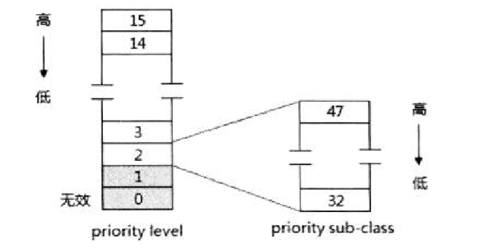
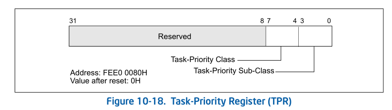
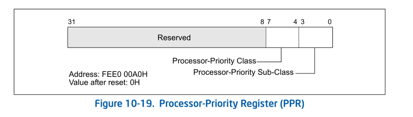
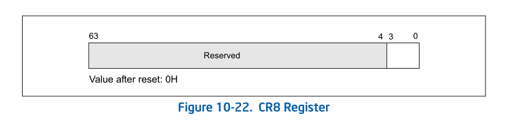

- 1 LVT寄存器及ICR的设置
    - 1.1 delivery mode的设置
    - 1.2 trigger模式的设置
- 2 中断vector及priority
    - 2.1 local interrupt的vector设置
    - 2.2 有效的vector值
    - 2.3 local interrupt的优先级
    - 2.3.1 TPR（Task Priority Register）
    - 2.3.2 处理器当前的优先级PPR（Processor Priority Register）
    - 2.4 IA-32e模式下的优先级

# 1. LVT寄存器及ICR的设置

在power-up或reset后，所有LVT寄存器初始化为00010000h，它们的mask位置1，指示这些local interrupt都是屏蔽的，ICR并没有mask位，它的初始化值为0。

## 1.1 delivery mode的设置

在LVT寄存器中：
1. CMCI寄存器、Thermal monitor寄存器和Performance monitor寄存器只能使用Fixed、SMI及NMI交付模式。
2. LINT0和LINT1寄存器只能使用Fixed、ExtINT及NMI交付模式。

在ICR中，delivery mode的使用依赖于destination shorthand模式，如下表所示。

Destination shorthand | delivery mode
---|---
00（No shorthand）| 所有delivery模式
01（self）| Fixed
10（All including self）| Fixed
11（All excluding self）| Fixed、Lowest priority、NMI、INIT、SMI、Start-up

## 1.2 trigger模式的设置

在LVT LINT0和LINT1寄存器里可以由用户设置中断的触发模式，其他LVT寄存器使用固定触发模式，依赖于delivery mode。

在LVT寄存器中：
1. Fixed模式：LINT0和LINT1寄存器bit15为0时使用edge触发，为1时使用level触发。
2. NMI、SMI及INIT模式：固定使用edge触发模式。
3. ExtINT模式：固定使用level触发模式。

LVT timer和LVT error寄存器固定使用edge触发模式。

在ISR中：
    只支持edge触发模式，当设置为level触发时local APIC将忽略，使用edge触发模式代替。

# 2. 中断vector及priority

LVT寄存器和ICR的vector域提供local interrupt的vector值，这个vector的使用将和保护模式下中断/异常处理的vector一致，从IDT里读取interrupt描述符。

## 2.1 local interrupt的vector设置

在LVT寄存器和ICR里vector域的设置依赖于它们的delivery mode。
1. Fixed模式：允许在vector里提供自定义的vector值。
2. NMI模式：vector值被忽略，processor将使用固定的2号NMI vector值。
3. SMI模式：vector值必须设置为0值。
4. ExtINT模式：使用在LVT寄存器里，ICR不支持。使用ExtINT模式，processor将接受由外部中断控制器经data bus发送过来的vector值。
5. INIT模式：vector值必须设置为0值。
6. Lowest priority模式：使用在ICR中，允许在vector提供自定义的vector值。
7. Start-up模式：使用在ICR中，允许在vector提供自定义的vector值。

## 2.2 有效的vector值

在前面所述的需要提供vector值时，不应该使用x86体系中预定义的0 ~ 31号作为vector，正常的中断向量号应该使用32 ~ 255（用户自定义的vector）。

使用0 ~ 15时：vector设置为0~15，它是无效的中断向量号，中断不会被响应。local APIC将在ESR（Error status regsiter）里记录这个错误。从而发生LVT error中断，在未屏蔽时将执行由LVT error寄存器设置的错误处理程序。

使用16 ~ 31时：vector设置为16~31，local APIC不会认为它是无效的。可以当local interrupt使用这个范围内的中断向量号将会和系统所定义中断/异常处理例程产生冲突。引起调用OS中预定义的异常处理例程，导致执行错误的中断处理。

## 2.3 local interrupt的优先级

在local APIC里，中断的优先级基于中断vector来判定，vector的值越大，优先级越高。将256个中断向量号分为16个priority level（中断优先等级）或称为priority class，基于下面的算法。
```
priority_level = vector / 16 
```
那么，priority将分成0~15的等级，每个等级对应16个中断向量号。



等级0对应的vector为0 ~ 15，等级1对应的vector为16 ~ 31，因此这两个在local APIC中属于无效的priority level（等级0无效，等级1不应该使用）。

那么有效的priority level是2 ~ 15，如上图所示，等级2对应于32 ~ 47的中断向量号。等级15是最高级，等级2最低。

根据前面所述，通常一个中断向量号，可以分为两部分，高4位对应于priority level，低4位是rank或sub-class值。在同一等级里，rank值高则优先级高。

### 2.3.1 TPR（Task Priority Register）

local APIC提供了一个TPR（task priority register，任务优先级寄存器），在TPR里设定一个值，允许local APIC只响应优先级高于这个值的中断。



如上所示，TPR[7:4]设定一个中断坎值。假如软件设置TPR[7:4]值为0则local APIC允许响应所有的中断请求；加入TPR[7:4]值为15，则抑制所有的中断。下面是TPR的使用算法。

```c
if (vector[7:4] > TPR[7:4]) { /* 中断请求的优先级是否高于TPR的坎值 */
    /* 响应中断请求 */
} else {
    /* 低于或等于：中断请求被屏蔽 */
}
```
> 使用NMI、SMI、INIT、ExtINT以及Start-up交付模式的中断不受TPR的影响。

### 2.3.2 处理器当前的优先级PPR（Processor Priority Register）

然而，一个中断请求能得到响应，并不是只依据TPR[7:4]的值，还需要依赖于ISR（In-Service Register），在TPR和ISR的相互作用下产生"处理器当前的优先级"。

```c
if (TPR[7:4] >= MSB_OF(ISR)) {  /* TPR[7:4]和ISR记录的最高中断服务例程vector[7:4]进行比较 */
    PPR[7:0] = TPR[7:0];
} else {
    PPR[7:4] = MSB_OF(ISR) & 0xf0; /* PPR的[7:4]位 */
    PPT[3:0] = 0;       /* 低4位0 */
}
```

在TPR[7:4]和ISR记录的正在服务的最高中断优先级服务例程的vector[7:4]间进行比较，两者中最高值就是"处理器当前的优先级"，它记录在只读的PPR（Processor Priority Register，处理器优先级寄存器）里。



PPR和TPR这两个寄存器的结构和意义是一样的。当ISR的值为0时PPR的值就等于TPR的值。中断请求的优先级只有高于PPR[7:4]才能被响应。

## 2.4 IA-32e模式下的优先级

在x64体系里，提供了CR8寄存器作为TPR（Task Priority Register）的编程接口，CR8寄存器尽在IA-32e模式下有效：



访问CR8寄存器需要0级的权限，CR8寄存器仅使用低4位（bit3 ~ bit0），这个值是前面所述的16个priority level（优先等级）。

```c
void wirte_cr8(int priority_level)
{
    cr8 = priority_level & 0x0f;    /* 写CR8寄存器 */
    TPR[7:4] = cr8[3:0];            /* 更新TPR */
    TPR[3:0] = 0;
}

int read_cr8()
{
    cr8[3:9] = TPR[7:4];            /* 从TPR里读 */
    return cr8;
}
```

CR8寄存器的作用是和TPR一致的。从上面的函数我们可以看到：
1. 当写CR8寄存器时，TPR[7:4]值将被更新位CR8的值。
2. 当读CR8寄存器时，CR8寄存器的值从TPR[7:4]里得到。

> 因此，CR8的值和TPR[7:4]里的值是相同的。当然，local APIC需要被enable。