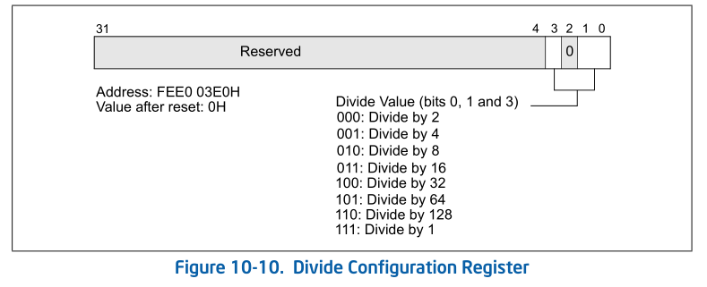
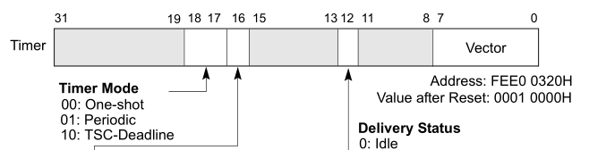
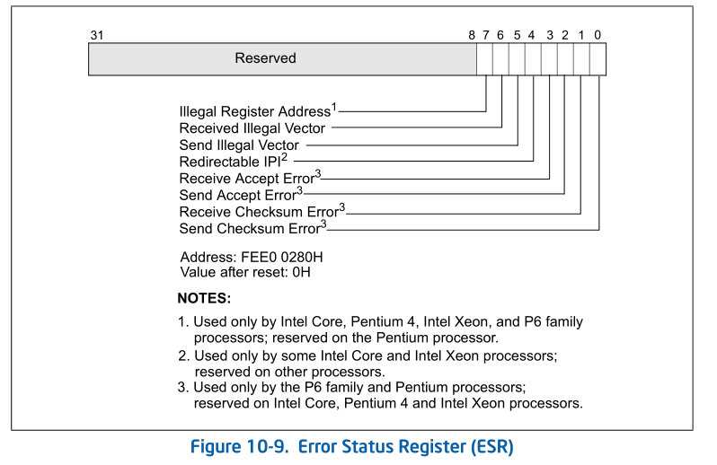
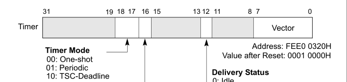

- 1 APIC timer
    - 1.1 LVT timer寄存器
        - 1.1.1 一次性计数模式
        - 1.1.2 周期计数模式
        - 1.1.3 TSC-deadline（达到TCS值）计数模式
- 2 错误处理
- 3 Performance Monitoring
    - 3.1 LVT performance monitor寄存器

# 1. APIC timer

local APIC的timer是非常简单易用的。它由以下4个部分组成。
1. LVT timer寄存器
2. Initial-count（初始化计数器）寄存器
3. Current-count（当前计数器）寄存器
4. Devide configuration（clock频率配置）寄存器

divide configuration寄存器用来配置timer计数的时钟频率，和time-stamp counter一样，local APIC timer的计数器使用固定的clock评率，但是它可以通过divide configuration寄存器进行具体频率的配置，如下所示。



Timer的计数频率使用system bus评率除以上图所列出来的值，当配置使用除1时，将使用于TSC（time-stamp counter）及IA32\_FIXED\_CTR2计数器相同的计数频率。这个寄存器的初始化值为0，即使用system bus频率除以2的计数频率。

initial-count与current-count寄存器是32位寄存器，在开始计数时，软件需要在initial-count（初始计数）寄存器提供一个非0的初始计数值。一旦设置初始计数值，local APIC会将初始计数值复制到只读的current-count（当前计数）寄存器里。

current-count寄存器的值开始减1，直至为0值。current-count减为0时产生timer中断。APIC timer支持三种计数模式，在LVT timer寄存器里设置。

## 1.1 LVT timer寄存器

LVT timer寄存器属于7个local vector table寄存器之一。使用timer前，软件对APIC timer进行相关的编程设置，如下所示。



LVT timer只能使用Fixed delivery模式和edge触发，并且必须提供一个vector值。LVT timer提供了三种计数模式：
1. One-shot（一次性）计数模式
2. Periodic（周期性）计数模式
3. TSC-deadline（达到TSC值）计数模式

### 1.1.1 一次性计数模式

在one-shot模式里，当current-count的值减为0时，产生timer中断，current-count的值维持在0不变，除非写入新的initial-count值。

```asm
    ; 设置LVT timer
    mov DWORD [APIC_BASE + LVT_TIMER], TIMER_ONE_SHOT | APIC_TIMER_VECTOR
    
    ; 写入initial-count值
    mov DWORD [APIC_BASE + TIMER_ICR], 256
```

上面的代码向LVT timer寄存器写入设置的值使用了one-shot模式。initial-count寄存器被写入256值。
一旦写入initial-count值，APIC timer就开始计数。

### 1.1.2 周期计数模式

使用periodic计数模式，当current-count减为0时，产生timer中断。local APIC将在current-count寄存器里装入initial-count值重新开始计数，从而周期性地产生timer中断，除非写入0值到initial-count寄存器里。

```asm
    ; 设置LVT timer
    mov DWORD [APIC_BASE + LVT_TIMER], 0x00020030   ; 使用periodic模式
    
    ; 写入initial-count值
    mov DWORD [APIC_BASE + TIMER_ICR], 0xff
```

当写入新的initial-count值时，local APIC将重新装入新的initial-count值进行计数。

### 1.1.3 TSC-deadline（达到TCS值）计数模式

当CPUID.01.ECX[24]为1时，APIC timer允许使用TCS-deadline计数模式。在TSC-deadline计数模式里，initial-count寄存器被忽略，current-count寄存器读出来为0。IA32\_TSC\_DEADLINE寄存器设置一个目标的TSC（time-stamp counter）值。

软件向64位的IA32\_TCS\_DEADLINE寄存器写入非0值时，APIC timer开始计数。当TSC（Time Stamp Counter）值大于或等于IA32\_TSC\_DEADLINE寄存器的值时，将产生timer中断。

```asm
    ; 测试是否支持APIC timer TCS-deadline模式
    mov eax,1
    cpuid
    bt ecx, 24      ; TSC-deadline bit
    jnc no_support
    
    ; 设置TSC-deadline模式
    mov DWORD [APIC_BASE + LVT_TIMER], 0x00040030
    
    ; 写入目标TSC值
    rdtsc           ; 读当前TSC值
    mov ecx, IA32_TSC_DEADLINE
    add eax, 256    ; current_TSC + 256
    wrmsr           ; 写入目标TSC值
    ;;

no_suport:
    ; ... ...
```

上面代码显示，当处理器支持TSC-deadline计数模式时，将LVT timer寄存器设置为TSC-deadline模式，软件通过读取当前的TSC值，将目标TSC值设置为当前的TSC值加上256。

当往IA32\_TSC\_DEADLINE寄存器写入0时，将停止APIC timer的运作。

# 2. 错误处理

当在local APIC处理中断时检测到错误的发生，local APIC的ESR（error status register，错误状态寄存器）将记录发生的错误条件。



ESR共可记录8个发生的错误，途中的Receive Accept Error（bit 3）、Send Accept Error（bit 2）、Receive Checksum Error（bit 1），以及Send Checksum Error（bit 0）这些状态位使用于P6和Pentium处理器上，这里我们忽略这些状态位。

1. Redirection IPI（bit4）：当local APIC发送一个lowest-priority delivery模式的IPI消息时，如果处理器的local APIC是不支持该类型的delivery模式，则将发生错误记录在ESR寄存器的bit4位上。
2. Send Illegal Vector（bit5）：当local APIC发送一个IPI消息时，使用了无效的vector值，ESR的bit5将被置位记录这个错误。
3. Recevie Illegal Vector（bit6）：当local APIC接收到一个IPI消息，或者从LVT产生的本地中断源里，检测到使用了无效的vector值时，ESR的bit 6被置位记录这个错误。值得注意的是，这个错误发生后IPI和本地中断请求没有被提交到处理器，因此IRR（Interrupt request register）也没有置位指示有中断请求发生。
4. Illegal register address（bit7）：当软件尝试访问保留的local APIC寄存器地址（即不支持的local APIC寄存器）时，产生错误记录在ESR的bit7位。

Intel明确提到，ESR是可读/写寄存器，在读ESR之前，应先写ESR，如下面的read_esr函数所示。

```asm
    read_esr:
        mov DWORD [APIC_BASE + ESR], 0      ; 写入ESR（任意值）
        mov eax, [APIC_BASE + ESR]
        ret
```

往ESR写入一个值，将使得local APIC更新ESR的状态信息，这个状态时ESR最新的状态。这个写入的值不影响ESR的读出值。

# 3. Performance Monitoring

## 3.1 LVT performance monitor寄存器

在性能监控里由于被监控的时间的counter（计数器）溢出而产生PMI（performance monitor Interrupt），从而需要调用PMI handler进行相应的处理。

那么local APIC里的LVT performance monitor寄存器需要设置来提供对PMI handler相应的支持，如下图所示。



当bit16位的mask被置位时，PMI是被屏蔽的，PMI支持下面几个delivery模式：
1. Fixed模式（000B）：需要显示提供PMI的中断服务例程vector。
2. SMI模式（010B）：LVT performance monitor寄存器的vector域必须为0值。
3. NMI模式（100B）：PMI使用NMI的vector值（即2），performance monitor寄存器的vector域必须为0。

因此，INIT与ExtINIT delivery模式不支持使用在performance monitor寄存器上。

