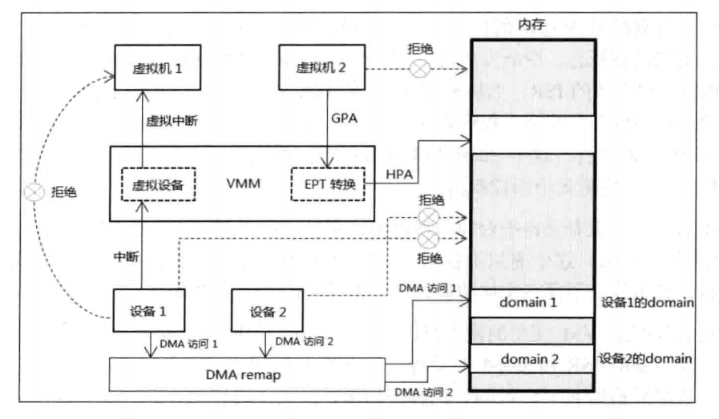
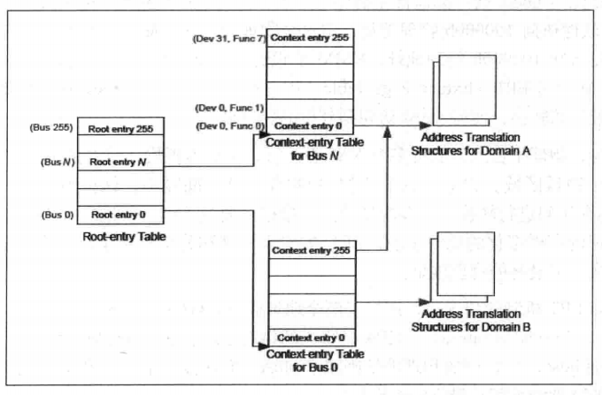

- 1 VMX架构
- 2 虚拟化概述
    - 2.1 虚拟设备
    - 2.2 地址转换
    - 2.3 设备的I/O访问

# 1. VMX架构

为了支持虚拟机环境，在计算机体系结构中的**CPU域**和**PCI总线域**上，Intel提供了**三个层面的虚拟化技术**（Intel Virtualization Technology）。

1. 基于处理器的虚拟化技术（Intel VT-x）：全称为Virtualization Technology for x86，在处理器上实现了虚拟化技术，它的实现架构是Virtual-Machine Extensions（VMX）。在VMX下引入了两种处理器模式，即VMX root与VMX non-root，分别支持Host与Guest软件的运行，使Guest软件能直接在处理器硬件上运行。
2. 基于PCI总线域设备实现的I/O虚拟化技术（Intel VT-d）：全称Virtualization Technology for Directed I/O，这个虚拟化技术实现在芯片组（Chipset）层面上，提供了诸如DMA remapping与Interrupt remapping等技术来支持外部设备I/O访问的直接虚拟化。
3. 基于网络的虚拟化技术（Intel VT-c）：全称为Virtualization Technology for Connectivity，部署在Intel的网络设备上，这也是基于PCI总线域设备的虚拟化技术。

根据Intel的介绍在所有Intel的10 Gigabit Server Adapter和部分Gigabit Server Adapter上，VT-c提供了两个关键技术：
- Virtual Machine Device Queues（VMDq）：VMDq可以做到为各个Guest OS处理分已分类的packet，能明显地提高I/O吞吐量。
- Virtual Machine Direct Connect（VMDc）：VMDc使用PCI-SIG Single Root I/O（SR-IOV）技术，允许虚拟机直接访问网络I/O硬件改善虚拟化性能。

# 2. 虚拟化概述

虚拟机的运用需要以处理器平台提供Virtualization Technology（VT，虚拟化技术）作为前提，是对资源的虚拟化管理的结果。
在虚拟化技术出现之前，软件运行在物理机器上，对物理资源进行直接控制，譬如设备的中断请求，Guest的内存访问，设备的I/O访问等。
软件更改这些资源的状态将直接反应在物理资源上，或者设备的请求得到直接相应。

在CPU端的虚拟化里，实现了VMX（Virtual-Machine Extensions，虚拟机扩展）架构。在这个虚拟机架构里，存在两种角色环境：
1. VMM（Virtual Machine Monitor）虚拟机监管者
2. VM（Virtual Machine）虚拟机

Host端软件运行在VMM环境里，可以仅仅作为Hypervisor角色存在（作为全职的虚拟机管理者），或者包括VMM（虚拟机监管者）职能的Host OS。

Guest端软件运行在VM环境里，一个VM代表一个虚拟机实例，一个处理器平台可以有多个虚拟机实例存在，由于VM里的资源被虚拟化，每个VM是彼此独立的。

Guest软件访问的资源受到VMM的监管，Guest希望修改某些物理资源时，VMM返回一个虚拟化后的结果给Guest。
例如，Guest软件对8259中断控制器状态进行修改，VMM拦截这个修改，进行虚拟化操作，实施修改或者不修改8259中断控制器的物理状态，返回一个不真实的结果给Guest软件。

下图展示了前面提及的虚拟机资源环境里的三种虚拟化管理：
1. 设备中断请求
2. Guest内存访问
3. 设备的I/O访问

设备的中断请求经由VMM监管，模拟出虚拟设备反馈一个虚拟中断给Guest执行，在这个模型里，设备中断请求不直接发给Guest执行。
而Guest访问的物理地址也不是最终的物理地址，，而是经过EPT进行转换才得到最终物理地址。
设备1和设备2使用DMA访问时，它们最终的目标物理地址经过VT-d技术的DMA重新映射功能映射到属于自己的domain（区域）。

## 2.1 虚拟设备

在设备发生中断请求时，这就产生了设备的ISR（中断服务例程）是由VMM（或Host OS）处理，还是直接由VM（Guest OS）处理（或由VMM转发给VM）的问题，
即ISR是运行在Host还是Guest端的问题。

依赖于VMM对外部设备所有权的设计产生了两种模型：
- 设备是属于Host所有，物理设备的ISR由VMM来执行。
- 设备分配给VM使用，那么ISR将在Guest环境里运行。

Host和Guest都有自己的IDT（中断描述符表），Host Vector对应着物理设备ISR在Host IDT的位置，而Guest Vector对应着VMM反馈给Guest的中断请求在Guest IDT上的位置。中断请求通过VMM给VM使用injection event（注入事件）的手段来实现。

Host Vector和Guest Vector并不相等，但在设备分配给VM使用的模型里，如果外部中断的控制权在Guest手中，那么Guest Vector可以对应物理设备ISR在Guest IDT的位置，也就是物理设备ISR完全由Guest执行，而VMM并不监管或转发。

如果外部中断的控制权需要掌握在VMM手中，通过开启“external-interrupt exiting”功能，并且结合“acknowledge interrupt on exit”位的设置来实现。
当发生外部中断时，VM停止工作，处理器控制权切换回VMM。

在设备所有权归VMM的模型里，虚拟设备应运而生，它是VMM的物理设备之上抽象出的虚拟设备概念。
当中断发生时，VMM的Vector是物理设备对应在Host IDT里，VMM执行物理设备的ISR。
然后模拟Guest的ISR处理流程，如发送EOI命令给中断控制器，更新中断控制器状态。
根据对应的Guest Vector注入一个外部中断给Guest在自己的IDT找到ISR执行，这个Guest ISR可能并不能做实际的首尾工作，如发送EOI命令（被VMM接管）或更新中断控制器。

Host Vector代表着来自平台的物理设备，而Guest Vector代表着来自虚拟设备，这两个Vector值不一致，这个虚拟设备由VMM维护而代表着物理设备在VM环境中的名字。
虚拟设备可能并不存在实体功能，只是逻辑表述的抽象概念。

在设备分配给VM使用的模型里，Guest Vector与Host Vector可能一致也可能不一致，但物理设备的ISR由Guest去运行，代表着ISR的收尾工作由Guest执行。
VMM截取中断请求后根据Guest Vector，同样使用事件注入手段转发外部中断给Guest执行，而VMM可能并不做其他工作。
这是在Host夺取外部中断控制权的前提下，前面所述在Guest掌控外部中断权时，设备ISR直接在Guest里执行。

当然，VMM也可以不拦截外部中断，这样外部中断就直接通过Guest IDT进行deliver执行，而不需要经过VMM转发。

## 2.2 地址转换

Host软件与Guest软件都运行在物理平台上，需要Guest不能干扰VMM的执行。譬如，Guest软件访问0x100000物理地址，但这个物理地址可能属于Host的私有空间，或者Host也需要访问0x100000物理地址。
VMM的设计需要Guest不能访问到这个真实的物理地址，VMM通过EPT（Extend Page Table，扩展页表）来实现**Guest端物理地址到Host端物理地址**的转换，使得Guest访问到其他的物理区域。

也因为，物理平台上可能有多个VM在运行，例如虚拟机1与虚拟机2可能会访问到同一个物理区域。
位保证每个VM的物理地址空间隔离，保持独立性，页需要将Guest的内存访问进行转换。
内存虚拟化是一项很重要的工作，引进的EPT（扩展页表）机制是实现内存虚拟化的重要手段。
EPT的实现原理和分页机制里的转换页表一样，经过多级转换产生最终的物理地址。

在开启EPT机制的情况下，产生了两个地址概念：
- GPA（Guest Physical Address）
- HPA（Host Physical Address）

HPA是真正的物理地址。Guest软件访问的物理地址都属于GPA，而Host软件访问的物理地址则属于HPA。
在没开启用EPT机制的情况下，Guest软件访问的物理地址就是最终的物理地址。

这里还有一个重要的概念：Guest Paging-Structure Table（Guest的页结构表），也就是Guest内保护模式分页机制下的线性地址到物理地址转换使用的页表。
这个页表项内使用的物理地址是GPA（例如CR3的页目录指针基址），而EPT Paging-Structure table（EPT页表结构）页表项使用的是HPA。

## 2.3 设备的I/O访问

在由CPU发起访问外部设备时，需要通过PCI/PCIe总线的内存读写事务，I/O读写事务或配置读写事务进行。
当Guest软件发起这样的访问时，VMM可以通过内存虚拟化和I/O地址虚拟化达到虚拟化设备的目的。

当由设备主动发起访问内存时（即DMA读写事务），在DMA读写下CPU不参与其中的执行过程，也就不能为这个读写内存提供地址转换，
VMM单纯依赖CPU来监控设备的访问时比较困难的。

于是，基于PCI总线域的虚拟化需要提供，VT-d技术正是为了解决这些而提出的。
VT-d的其中一个重要功能是进行DMA remapping（DMA重新映射），DMA remapping机制在芯片组或PCI设备上实现地址转换功能，其原理和分页机制下的虚拟地址转换到物理地址是相似的。

DMA remapping需要识别设备的source-id，这个source-id代表着发起DMA访问设备（即requester，请求者）的身份，
实际上它就是PCI总线域的ID，由bus、device、function组成。根据source-id找到设备对应的页表结构，然后通过页表进行转换。

下图所示，首先，一个被称为Root-entry table的结构需要在内存中构造，由Root-entry指出Context-entry table，
再由context-entry得到页表结构，最后经页表得到最终的物理地址。

Root-entry table的基址被提供在MCH（Memory Control Hub）部件，一般位于Bus0、Device0、Function0设备（内存控制器）扩展空间里的
MEREMAPBAR寄存器，在这个寄存器提供一个remapping MMIO空间，其中的RTADDR_REG寄存器提供Root-entry table指针值，但是对于不同的处理器，
这个remap MMIO空间的基址也存放在不同的位置。

DMA remapping提出了一个domain（域）的概念，实际上就是为设备在内存中分配一个对应的区域。
例如，为设备1分配domain1，为设备2分配domain2，它们访问各自独立的区域。这个domain值可能被用做标记，处理器使用它来标记内部的cache。
当然，不同的设备也可以访问同一个domain，但必须使用同一个domain值。

