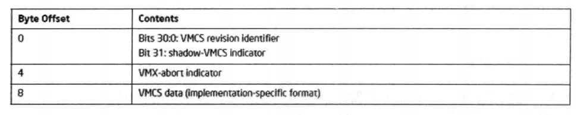
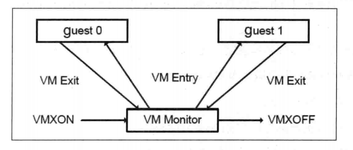

- 1 概述
    - 1.1 进入VMX operation模式
    - 1.2 进入VMX operation的制约
        - 1.2.1 IA32_FEATURE_CONTROL寄存器
        - 1.2.2 CR0与CR4固定位
        - 1.2.3 A20M模式
    - 1.3 设置VMXON区域
        - 1.3.1 分配VMXON区域
        - 1.3.2 VMXON区域初始设置
    - 1.4 退出VMX operation模式
- 2 VMX operation 模式切换
    - 2.1 VM entry
    - 2.2 VM exit
    - 2.3 SMM双重监控处理下

# 1. 概述

前面提及，在VMX架构下，处理器支持一种新的VMX operation模式。VMXON指令只能在开启允许进入VMX operation模式后才能使用，
其余的VMX指令只能在VMX operation模式下使用。VMX operation模式里又分为两个操作环境，以支持VMM与VM软件的运行。

- VMX **root** operation
- VMX **non-root** operation

VMX模式的root与non-root可以理解为：VMX管理者与Guest用户使用的环境。因此，VMM运行在VMX root operation环境下，VM则运行在VMX non-root operation环境下。

- 从root环境切换到non-root环境被称为**VM-entry**。
- 从non-root环境切换回root环境称为**VM-exit**。

当软件运行在VMX root operation环境时，处理器的**CPL**（Current Privilege Level）必须为0，拥有最高的权限，可以访问所有的资源，包括新引进的VMX指令。

在VMX non-root operation环境里，当前的CPL值不必为0。根据VMM的相应设置，Guest软件的访问权限受到了限制，部分指令的行为页发生改变。
在VMX non-root operation模式下，Guest软件执行任何一条VMX指令（除VMFUNC指令外）都会导致被称为**VM-exit**的行为发生。
另外，软件执行MOV指令对CR0寄存器进行设置时，写CR0寄存器的行为将发生改变，导致CR0寄存器的值允许写入或被拒绝修改。


## 1.1 进入VMX operation模式

如前面所示，在启用处理器的虚拟化机制前，必须先开启VMX模式的允许（开启CR4.VMXE位），表明允许执行VMXON指令进入VMX operation模式。

在执行VMXON指令切换到VMX operation模式之前，还需要做一些列的准备工作，这里简单地了解一下。
1. 首先检查处理器是否已经进入VMX operation模式。是则直接返回，否则进行下一步。
2. 检测是否支持VMX架构。
3. 开启CR4.VMXE控制位，表明允许进入VMX operation模式。
4. 初始化VMXON区域。
5. 执行VMON指令，提供一个VMXON区域的物理指针作为操作数，这个指针被称为VMXON指令，注意这个指针使用的是物理地址。
6. 对VMXON指令进行检查看是否执行成功，分别检查CF与ZF标志位，当CF1=或ZF=1时，表明操作失败。

VMXON指令执行成功后，表明处理器此时已经进入VMX operation模式，也就是已经处于root环境，行使VMM的管理职能。

## 1.2 进入VMX operation的制约

执行VMXON指令的基本要求是：
- 需要开启CR4.VMXE位。
- 不能在实模式、virtual-8086模式以及compatibility模式下执行，否则将产生#UD异常。
- 不能在非0级权限下执行，否则会产生#GP异常。

### 1.2.1 IA32_FEATURE_CONTROL寄存器

IA32\_FEATURE\_CONTROL寄存器也影响着VMXON指令的执行，这个寄存器的bit0为lock位，bit1与bit2分别是SMX模式的inside与outside位。
Inside位指示允许在SMX内使用VMX，outside位指示允许在SMX外使用VMX（这是开启VMX模式最基本的条件）。

1. 当lock位为0时，执行VMXON指令将产生#GP异常。因此，执行VMXON指令前确保lock位为1值，也就是锁上IA32\_FEATURE\_CONTROL寄存器。上锁后如果对IA32\_FEATURE\_CONTROL寄存器进行写操作，将产生#GP异常。
2. Enable VMX inside SMX位（bit1），指示当前处理器处于SMX（Safer Mode Extensions）模式时，允许开启VMX operation模式。当inside=0且处于SMX模式时，执行VMXON指令将引发#GP异常。
3. Enable VMX outside SMX位（bit2），指示允许在SMX模式之外开启VMX operation模式。当outside=0且不在SMX模式时，执行VMXON指令将引发#GP异常。

只有支持VMX与SMX模式时，才允许对bit1置位（即CPUID.01H:ECX[6:5]=11B）。
在支持VMX模式时，才允许对bit2置位（即CPUID.01H:ECX[5]=1）。

> 注意："Enable VMX ouside SMX"位需要置位，这是运行VMX模式的基本条件。bit1与bit2允许同时置位，此时表示无论是SMX模式内还是模式外都可以开启VMX模式。

### 1.2.2 CR0与CR4固定位

进入VMX operation模式前，CR0与CR4寄存器也必须满足VMX operation模式运行条件：
1. CR0寄存器需要满足**PG**（bit31）、**NE**（bit5）、**PE**（bit0）位为1。也就是需要开启分页机制的保护模式，x87 FPU数字异常的处理模式需要使用native模式。
2. CR4寄存器需要开启**VMXE**位（bit13）。

这些位在IA32\_VMX\_CR0\_FIXED0寄存器里属于Fixed to 1（固定为1）位，否则执行VMXON指令将会产生#GP异常。
由于CR0.PG与CR0.PE位必须为1，因此VMX operation不能从实模式和非分页的保护模式里进入。
如果需要在SMX模式里进入VMX，那么CR0.SMXE位（bit14）也需要为1值。

在VMCS区域的字段设置里，也有很多类似这样的约束条件存在，某些位必须为1值，某些位必须为0值，某些位可以为0值也可以为1值。
例如，上面的CR0与CR4寄存器列举的位必须为1值。因此，软件需要检测制约条件而进行相应的设置，这些设置页可能随着处理器架构的发展而有所改变。

上面所述的CR0与CR4寄存器固定位从第一代支持VMX的处理器开始就被确定了，后面我们将会看到使用IA32\_VMX\_CR0\_FIXED0与IA32\_VMX\_CR0\_FIXED1对CR0的固定位进行检测，使用IA32\_VMX\_CR4\_FIXED0与IA32\_VMX\_CR4\_FIXED1对CR4寄存器固定位进行检测。

CR0与CR4寄存器设置的算法是一样的，通过“或”固定为1值，然后"与"固定为0值，得出最后需要的值。

根据CR0寄存器的限制，处理器在VMX operation模式（包括VMX root operation与VMX non-root operation模式）必须要开启分页保护模式，那么Guest软件必须运行在分页保护模式，进入Guest端时，处理器会检查是否符合这个要求。
当不符合这个制约条件时，将产生VM-entry失败。如果需要Guest软件执行实模式代码，那么可以选择进入Virtual-8086模式。

后续的处理器可能会支持在VMX non-root operation模式下使用实模式，软件需要检测是否支持**unrestricted guest**（不受限制的guest）功能。
在支持且开启“unrestricted guest”功能后，guest软件允许运行在**实模式**或者**未分页的保护模式**。

在这种情况下，进入guest时，处理器将不会检查CR0.PE与CR0.PG控制位，而忽略CR0的Fixed to 1（固定为1）中的相应位。但是，如果CR0.PG为1，则CR0.PE必须为1。

### 1.2.3 A20M模式

还有一个制约就是：当处理器处于A20M模式（即A20线mask模式），也不允许进入VMX operation模式，执行VMXON指令将引发#GP异常。
A20M模式会屏蔽A20地址线产生所谓的"Wrapping"现象，从而模拟8086处理器的1M地址内访问行为。

## 1.3 设置VMXON区域

在虚拟化平台中，可能只有一份VMM存在，当可以有多分VM实例存在。每个VM需要有对应的VMCS（虚拟机控制结构）区域来控制，而VMM本身需要一个
VMXON区域来进行一些记录或者维护工作。

```asm
    vmxon [ebp + PCB.VmxonPhysicalPointer]
```
如上面代码所示，执行VMXON指令，需要提供一个VMXON指针作为操作数，这个指针是物理地址，指向VMXON区域。

### 1.3.1 分配VMXON区域

在执行VMXON指令进入VMX operation模式前，需要分配一块物理内存区域作为VMXON区域。这块物理内存区域需要在4K字节边界上。
VMXON区域的大小和内存cache类型可以通过检查IA32\_VMX\_BASIC寄存器来获得。

### 1.3.2 VMXON区域初始设置

VMXON区域的首8个字节结构与VMCS区域是一样的，首4个字节为VMCS ID值，下一个DWORD位置是VMX-abort indicator资源，存放VMX-abort发生后的ID值，如下图所示。



这个**VMCS ID**值可以从IA32\_VMX\_BASIC[31:0]来获得，执行VMXON指令前必须将这个VMCS ID值写入VMXON区域首DWORD位置。
如果VMCS ID值域处理器当前VMX版本下的VMCS ID值不符，则产生VMfailInvalid失败，此时CF=1，指示VMCS指针无效。

> 注意：由于VMXON区域是物理内存区域，那么在设置VMXON区域之前，必须将VMXON区域映射到一个虚拟地址，然后通过虚拟地址进行写入操作。

## 1.4 退出VMX operation模式

处理器在VMX operation模式里不允许关闭CR4.VMXE位，只能在VMX operation模式外进行关闭，软件执行VMXOFF指令将退出VMX operation模式。

在执行VMXOFF指令后，必须检查指令是否执行成功。
- 当CF=1时，指示当前的VMCS指针无效
- 当ZF=1时，指示VMXOFF指令执行遇到错误
- 当CF=1，ZF=0时，指示VMXOFF是成功的

在VMX开启SMM dual-monitor treatment（SMM双重监控处理）机制的情况下，必须先关闭SMM双重监控处理机制，才能使用VMXOFF指令关闭VMX模式。
否则VMXOFF指令将会失败。

# 2. VMX operation 模式切换

进入VMX operation模式后，VMM运行在root环境里，而VM需要运行在non-root环境里。虚拟化平台中经常会发生从VMM进入VM，或者从VM返回到VMM的情况。
有两个属于来描述它们之间的切换。

- VM entry（VM进入）：从VMX root operation切换到VMX non-root operation就是VM entry，表示从VMM进入到VM执行Guest软件。
- VM exit（VM退出）：从VMX non-root operation切换到VMX root operation就是VM exit，表示从VM返回到VMM。VMM接管工作，VM失去处理器控制权。

VM的entry与exit，顾名思义，是以VM的角度来定义。如果处理器要执行Guest软件，那么VMM需要发起VM-entry操作，切换到VMX non-root operation模式执行。
VM会获得控制权，直到某些引发VM exit的事件发生。

VM-exit发生后，处理器控制权重新回到VMM。VMM设置"VM exit"退出的条件是基于虚拟化处理器目的。因此，VMM需要检查VM遇到了什么事件退出，从而虚拟化某些资源，返回一个虚拟化后的结果给guest软件，然后再次发起VM-entry，切入VM让guest软件继续执行。

首次进入VM和退出后再次进入VM恢复执行，使用不同的指令进行。VMLAUNCH指令发起首次进入VM，VMRESUME指令恢复被中断的VM执行。

下图描述了VMM与VM之间的切换关系。利用VM entry与VM exit行为，VMM在多个VM之间来回切换。这个过程类似于OS对进程的调度，而每个VM就像一个进程，VMM其中的一个职能类似于OS进程调度器。



## 2.1 VM entry

首次进入VM环境，VMM使用VMLAUNCH指令发起，VMLAUNCH指令隐式地使用当前VMCS指针作为操作数。
在发起VM entry操作前，VMM需要对VM环境进行一些必要的配置工作，当前的VMCS指针也必须先装载，下面是进入VM的简单流程。

1. 分配一个物理内存区域作为VMCS区域，这个区域需要在4K字节边界上对齐，并且需要满足内存的cache类型。区域的大小以及支持的cache类型，需要在IA32\_VMX\_BASIC寄存器里查询获得。
2. 写入VMCS ID值到这个VMCS区域的首4个字节里，这个VMCS ID值同样需要在IA32\_VMX\_BASIC寄存器里得到。
3. 提供这个VMCS的物理指针作为操作数，执行VMCLEAR指令，这个操作将置VMCS的launch状态为**clear**，处理器置当前VMCS指针为FFFFFFFF\_FFFFFFFFh值。VMCS的launch状态和当前指针值由处理器动态维护，Intel手册没明确说明它们存放在哪里，但推断应该是存放在VMXON区域内（进入VMX operation模式时被VMXON指令使用）。
4. 提供这个VMCS物理指针作为操作数，执行VMPTRLD指令，将装载这个VMCS指针作为当前的VMCS指针，处理器会维护这个VMCS指针。
5. 对VMCS区域的初始化设置，执行一些列的VMWRITE指针，将必要的数据写入当前VMCS指针指向的区域内（current-VMCS区域）。VMWRITE指令需要提供VMCS区域的一个Index值，这个Index值将用来指向VMCS区域的数据位置。
6. 在第5步初始化VMCS区域完成后，执行VMLAUNCH指令进入VM环境，成功后处理器将切换到VMX non-root operation模式运行。guest软件执行的进入点由VMCS初始化时写入Guest State Area（Guest状态区域）的RIP字段里。

需要注意的是，每次执行VMX指令都需要检查CF与ZF标志，确定指令是否成功，除非你能确保指令时成功的。
例如，执行一系列的VMREAD与VMWRITE指令来读写VMCS区域，需要确保当前VMCS指针是正确有效的，并且提供的Index值是VMCS区域是存在的，
这样大可不必在每次读写执行后进行烦琐的检查。

当VM exit产生后，VMM需要重新进入VM环境，那么需要使用VMRESUME指令来恢复VM的运行。VMRESUME指令也是隐式使用当前VMCS指针作为操作数，
但是VMRESUME指令执行的假定前提是由于VM退出后再次进入VM。因此，VMCS的launch状态必须为**launched**，区别于首次进入VM时的launch状态位**clear**（执行VMCLEAR指令后的结果）。

## 2.2 VM exit

在VM中，Guest软件无法知道自己是否处于VM之中（Intel保证Guest软件没有任何途径可以检测）。因此，Guest软件不可能主动放弃控制权进行VM exit操作。

只有guest软件遇到一些**无条件VM exit事件**或者**VMM的设置引发VM exit的条件**发生，VM才在不知不觉中失去了控制，VMM将接管工作。
Guest软件也无法知道自己什么时候发生了VM exit行为。

导致VM exit发生的三大类途径如下：
1. 执行无条件引发VM exit的指令，包括CPUID、GETSEC、INVD、XSETBV指令以及所有VMX指令（除了VMFUNC指令外）。
2. 遇到无条件引发VM exit的**未被阻塞**的事件。例如，INIT信号、SIPI消息等。
3. 遇到VMM设置引发VM exit的条件，包括执行某些指令或者遇到某些事件发生。譬如，VMM设置了"HLT exiting"条件，而Guest软件执行了HLT指令而引发VM exit。又如，VM遇到了external-Interrupt的请求，VMM设置了"external-interrupt exiting"条件而导致VM exit。

一些事件的发生能无条件地导致VM exit发生。例如，Triple Fault（三重Fault异常）事件和接收到INIT信号与SIPI信号，以及在使用EPT（扩展页表）机制的情况下，遇到了EPT violation（EPT违例）或者EPT misconfiguration（EPT 配置不当）发生也能引发VM exit。

后面将讲到，INIT信号与SIPI信号在Virtual Processor（虚拟处理器）的一些状态下能被阻塞，这里所说的**虚拟处理器**是指进入VM环境后的处理器，因为它的状态及资源可以被VMM设置，而呈现出一个**虚拟**的概念，并非指虚拟的处理器。虚拟处理器在VM entry完成后，它的活动状态被加载位VMCS区域的"Guest State Area"内的Activity State字段设置的状态值。

虚拟处理器在wait-for-SIPI状态下INIT信号将被阻塞，不会产生VM-exit。而SIPI信号能导致VM exit也仅仅当虚拟处理器处于wait-for-SIPI状态之下时才有效。INIT与SIPI信号在VMX root operation模式下都被阻塞（也就是在VMM下），它们被忽略。

在其他状态下（包括active，HLT以及shutdown状态），虚拟处理器接收到INIT信号将无条件产生VM-exit。当发生triple fault事件退出时，VMM可以选择将虚拟处理器置为shutdown状态。

在OS里的进程执行中，当时间片用完，需要被切换出控制权。而在VT-x技术里，除了因Guest遇到可引发VM exit产生的事件而导致VM exit外，类似的，VMM也可以为每个VM设置一个时间片，时间片用完导致VM exit发生。

新近的VMX架构也引入了**VMX-preemption timer**机制，VMM设置了启用"activate VMX-preemption timer"功能，提供一个"VMX-preemption timer value"作为计数值，在VM entry切换进行时，计数值就开始递减1，当这个计数值减为0时引发VM exit。

这个preemption timer计数值递减的步伐依赖于TSC与IA32\_VMX\_MISC[4:0]值。

## 2.3 SMM双重监控处理下

在SMM dual-monitor treatment机制下，VMX定义了另外两类的VM exit与VM entry，它们是**SMM VM-exit**与**VM-entry that return form SMM**（从SMM返回中进入）。

- SMM VM-exit：可以从VMM（VMX root operation）或者VM（VMX non-root operation）中产生VM退出行为，然后进入SMM模式执行称为**SMM-transfer Monitor**（切入SMM监控者）的代码。
- VM-entry that return from SMM：将从SMM模式退出，然后返回到原来的VMM或VM中继续执行。

这个SMM双重监控处理是使用VMM的两端代码：VMX端以及SMM端。也就是说，SMM模式下也有VMM代码在运行。当发生SMI（System Manage Interrupt）请求时，在SMM双重监控处理器机制下，VMM将从**VMX模式切入SMM模式**，然后执行SMM模式里的代码。

VMM在VMX端的代码被称为**Executive Monitor**，在SMM端的代码被称为**SMM-transfer Monitor**。执行在VMX端时使用的区域被叫做**executive VMCS**，而SMM段使用的是**SMM-transfer VMCS**。