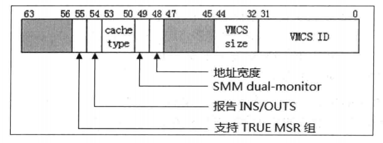
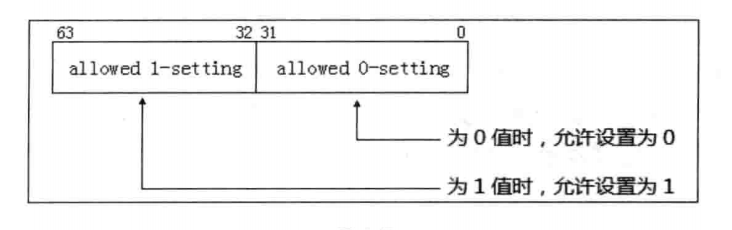
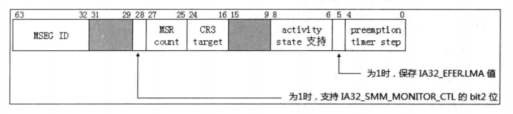
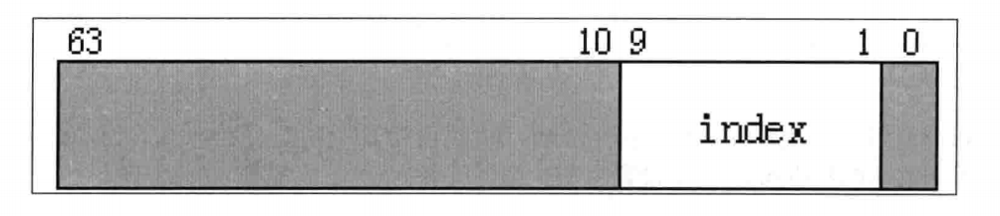
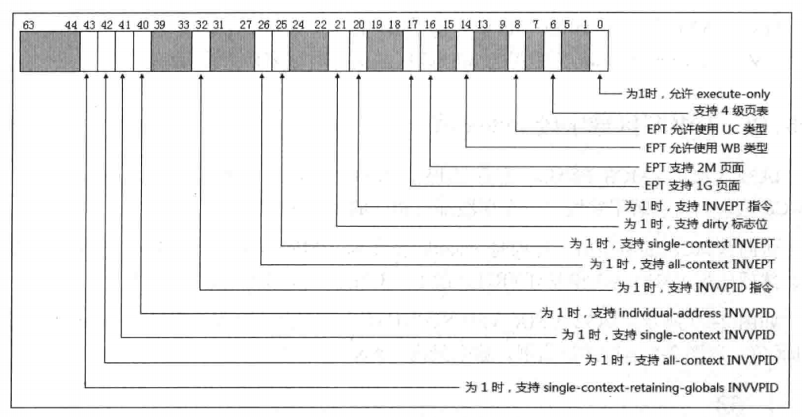

- 1 概述
    - 1.1 检测是否支持VMX
    - 1.2 通过MSR组检查VMX能力
    - 1.3 基本信息检测
    - 1.4 允许为0以及允许为1位
        - 1.4.1 决定VMX支持的功能
        - 1.4.2 控制字段设置算法
    - 1.5 VM-execution Control字段
        - 1.5.1 Pin-based VM-execution Control字段
        - 1.5.2 Primary processor-based VM-execution Control字段
        - 1.5.3 Secondary processor-based VM-execution Control字段
    - 1.6 VM-exit Control字段
    - 1.7 VM-entry Control字段
    - 1.8 VM-function Control字段
    - 1.9 CR0与CR4的固定位
        - 1.9.1 CR0与CR4寄存器设置算法
    - 1.11 VMX 杂项信息
    - 1.12 VMCS区域字段index值
    - 1.13 VPID与EPT能力

# 1. 概述

VMX架构中的许多功能可能再不同的处理器架构里有不同的支持，新加入的VMX特性也可能在新近的处理器才支持，
允许使用较早前的处理器不支持的一些非常使用的功能，比如前面所说的VMX-preemption timer功能。
因此，VMM需要检测当前VMM架构下有什么能力，进行相应的设置。

## 1.1 检测是否支持VMX

软件需要检测处理器是否支持VMX架构，使用CPUID.01H:ECX.VMX[5]位来进行检测。

## 1.2 通过MSR组检查VMX能力

VMX架构提供了众多项目能力的检测，包括：VMX的基本信息、杂项信息、VPID与EPT能力，还有对VMCS内的control field（控制字段）允许设置的位。
而控制字段的位允许被置为1时，代表着处理器拥有这个能力。

譬如，secondary processor-based control字段的bit7是Unrestricted Guest位，当它允许被置1时，表明处理器支持unrestricted guest（不受限制的Guest端）功能。反之，则表示处理器不支持该功能。

VMX的这些能力的检测提供在几组共14个MSR（Model Specific Register）里，如下表所示，除了这些，还有4个扩展了TRUE系列寄存器。

序号 | 寄存器 | 索引 | 描述
---|---|---|---
1 | IA32_VMX_BASIC | 0x00000480 | 提供VMX基本信息
2 | MSR_IA32_VMX_PINBASED_CTLS | 0x00000481 | 决定Pin-based控制字段
3 | MSR_IA32_VMX_PROCBASED_CTLS | 0x00000482 | 决定Processor-based控制字段
4 | MSR_IA32_VMX_EXIT_CTLS | 0x00000483 | 决定VM-exit控制字段
5 | MSR_IA32_VMX_ENTRY_CTLS | 0x00000484 | 决定VM-entry控制字段
6 | MSR_IA32_VMX_MISC | 0x00000485 | 提供VMX杂项信息
7 | MSR_IA32_VMX_CR0_FIXED0 | 0x00000486 | 决定CR0的固定为0位
8 | MSR_IA32_VMX_CR0_FIXED1 | 0x00000487 | 决定CR0的固定为1位
9 | MSR_IA32_VMX_CR4_FIXED0 | 0x00000488 | 决定CR4的固定为0位
10 | MSR_IA32_VMX_CR4_FIXED1 | 0x00000489 | 决定CR4的固定为1位
11 | MSR_IA32_VMX_VMCS_ENUM | 0x0000048a | 决定VMCS Index值
12 | MSR_IA32_VMX_PROCBASED_CTLS2 | 0x0000048b | 决定secondary Pin-based控制字段
13 | MSR_IA32_VMX_EPT_VPID_CAP | 0x0000048c | 决定EPT及VPID能力
14 | MSR_IA32_VMX_VMFUNC | 0x00000491 | 决定VM-function控制字段

```c
#define MSR_IA32_FEATURE_CONTROL        0x0000003a
```

IA32\_FEATURE\_CONTROL寄存器的值为0x5，表示lock位上锁，使用了"VMX in outside SMX"模式

## 1.3 基本信息检测

IA32\_VMX\_BASIC寄存器用来检测VMX的基本能力信息，如下图所示。



- bit[31:0]为VMCS ID值，在初始化VMXON及VMCS区域时，需要用VMCS ID值来设置首DOWRD位置。
- bit[44:32]指示VMCS及VMXON区域的大小，这些区域大小以1K为单位，最高支持4K字节，并且地址需要在4K字节边界上。
- bit[48]指示VMXON区域、VMCS预取以及VMCS内所引用的区域（例如I/O bitmap区域、MSR bitmap区域等）的宽度。为1时这些物理地址基址限定在32位内，为0时，物理地址宽度在MAXPHYADDR值内。在支持64位的平台上，bit48为0。
- bit[49]为1时，表明支持SMM及SMI的dual-monitor treatment功能。
- bit[54]为1时，表明支持当VM-exit是由于INS或OUTS指令而引发时，在VMCS的"VM-exit instruction information"字段里记录相应的信息。
- bit[55]为1时，表示支持4个TRUE寄存器，这4个TURE寄存器将影响最终的VMCS中的某些控制位，如下表所示。

影响的VMCS字段 | bit 55=0 | bit 55=1
---|---|---
Pin-Based Control | IA32_VMX_PINBASED_CTLS | IA32_VMX_TRUE_PINBASED_CTLS
Processor-Based Control | IA32_VMX_PROCBASED_CTLS | IA32_VMX_TRUE_PROCBASED_CTLS
VM-exit Contorl | IA32_VMX_EXIT_CLTS | IA32_VMX_TRUE_EXIT_CTLS
VM-entry Contorl | IA32_VMX_ENTRY_CTLS | IA32_VMX_TURE_ENTRY_CTLS

bit55的值决定谁来控制这些VMCS字段固定位的设置。
当bit[55]为0时，这些VMCS字段的固定位值需要分别收到IA32\_VMX\_PINBASED\_CTLS、IA32\_VMX\_PROCBASED\_CTLS、IA32\_VMX\_EXIT\_CLTS、IA32\_VMX\_ENTRY\_CTLS寄存器影响。为1时，则受对应的TRUE寄存器影响。

- bit[53:50]这4位组成一个值，它指示VMCS区域以及VMCS区域内所引用的区域（例如I/O bitmap，MSR bitmap等）所支持的内存cache类型。
    - 为0值时，支持Uncacheable（UC）类型
    - 位6值时，支持WriteBack（WB）类型

VMX目前支持这两种cache类型，其他会（1 ~ 5 以及7 ~ 15）都没使用（WC、WT、WP以及UC-类型不支持）。

IA32\_VMX\_BASIC寄存器的其余位（bit[47:45]以及bit[63:56]）是保留位，为0值。

## 1.4 允许为0以及允许为1位

上表里列举的两组寄存器（在IA32\_VMX\_BASIC[55]=1时，使用TRUE寄存器），共8个寄存器，它们的结构和使用方法是一致的，结构如下图所示。



这些64位的寄存器低32位是allowed 0-setting（允许设置为0）位值，高32位是allowed 1-setting（允许设置为1）位值。
这两组32位值对应一个VMCS区域的control field（控制字段）值，这些控制字段是32位置，用法如下所示。

- bits[31:0]的用法：当其中的位为0值时，对应的控制字段相应的位允许为0值。
- bits[63:32]的用法：当其中的位为1值时，对应的控制字段相应的位允许为1值。

推广开来，这8个寄存器，都使用相同的设置原理，不同的是设置的目标字段不一样。我们看到对于一个控制字段的设置：**某些位必须为1，某些位必须为0**（它们属于保留位）。

> 注意：这些必须为0值的保留位被称为defualt0位，必须为1值的保留位被称为default1位。这与通常接触到的数据结构中的保留位必须为0值有些区别（例如PTE中的保留位）。

当控制字段的保留位不符合这些default0和default1值，在VM entry操作时，字段的检查会失败，从而导致VM entry失败。

### 1.4.1 决定VMX支持的功能

前面所述，控制字段中必须为0及必须为1值的位都是保留位。当一个位可以设置为1值时，表明处理器将支持该功能。也就是**非保留位**指示支持该位对应的功能。

以Pin-based VM execution control字段为例，它的bit6时"activate VMX-peemption timer"功能，只有bit6设置为1时，才代表处理器支持VMX-preemption timer功能。如果IA32\_VMX\_PINBASED\_CTLS低32位（bit6=0）设置defalut0，bit6只能设置为0值。因此，这个处理器并不支持该项功能。

又如，该字段的bit0为"external-interrupt exiting"功能位，而该位可以设置为0或1值，因而表明处理器支持该项功能。

### 1.4.2 控制字段设置算法

根据前面所述的VMX能力寄存器allowed 0-setting与allowed 1-setting位，对VMCS区域中的相应的控制字段设置，可以分两步进行。
1. 首先根据自身的设计需要设置相应位，这是一个初始值。
2. 然后使用allowed 0-settting与allowed 1-setting位合成最终值。

合成最终值算法如下：
1. Result1 = 初始值 OR allowed 0-setting值
2. Result2 = Result1 AND allowed 1-setting值

这个Result2就是最终值，这个值确保满足在VM-entry时处理器对控制字段的检查。

```asm
    ; 设置pin-based控制域
    ; 1. [0] - external-interrupt exiting: Yes
    ; 2. [3] - NMI exiting: Yes
    ; 3. [5] - Virutal NMIs: No
    ; 4. [6] - Activate VMX preemption timer: Yes
    ; 5. [7] - Process posted interrupts: No
    
    mov eax, EXTERNAL_INTERRUPT_EXITING | NMI_EXITING | ACTIVATE_VMX_PREEMPTION_TIMER
    or eax, [ebp + PCB.PinBasedCtls]            ; OR allowed 0-setting
    and eax, [ebp + PCB.PinbasedCtls + 4]       ; AND allowed 1-setting
    
    ; 写入Pin-based VM-execution Control值
    mov [ExecutionControlBufBase + EXECUTION_CONTROL.PinControl], eax
```
代码中对Pin-based VM-execution control字段的初始值设为49H，然后根据上面的算法合成最终值。
这是必须进行的一步，否则在执行VM-entry操作时，将由于检查Pin-based VM-execution control字段defalut位不满足要求而失败。

## 1.5 VM-execution Control字段

在VMCS区域的三个VM-execution control字段需要检查VMX能力寄存器来确认default0与default1位。如下所示：
- Pin-based VM-execution Control字段
- Primary Processor-based VM-execution Control字段
- Secondary Processor-based VM-execution Control字段

当IA32\_VMX\_BASIC[55]=1时，使用TRUE系列寄存器。此时，pin-based VM-execution Control字段的值由IA32\_VMX\_TURE\_PINBASED\_CTLS寄存器来决定设置，primary processor-based VM-execution Control字段的值由IA32\_VMX\_TRURE\_PROCBASED\_CTLS寄存器来决定设置，但secondary processor-based VM-execution Control字段没有对应的TRUE寄存器，它只由IA32\_VMX\_PROCBASED\_CTLS2寄存器来决定设置。

### 1.5.1 Pin-based VM-execution Control字段

- 当IA32\_VMX\_BASIC的bit55为0时，IA32\_VMX\_PINBASED\_CTLS寄存器决定Pin-based VM-execution Control字段的设置。
- 当IA32\_VMX\_BASIC的bit55为1时，忽略IA32\_VMX\_PINBASED\_CTLS寄存器，Pin-based VM-execution Control字段由IA32\_VMX\_TRUE\_PINBASED\_CTLS寄存器来决定设置。

这两个MSR的用法是一样的，分别为低32位于高32位。具体用法如下所示。
1. bit[31:0]（allowed 0-setting）：某位为0时，Pin-based VM-execution control字段相应的位允许设为0值。
2. bit[63:32]（allowed 1-setting）：某位为1时，Pin-based VM-execution control字段相应的位允许设为1值。

Pin-based VM-execution Control字段属于32位值，因此MSR的高32位（allowed 1-setting）也是对应Pin-based VM-execution Control字段的bit[31:0]。

### 1.5.2 Primary processor-based VM-execution Control字段

- 当IA32\_VMX\_BASIC的bit55为0时，IA32\_VMX\_PROCBASED\_CTLS寄存器决定Primary processor-based VM-execution Control字段的设置。
- 当IA32\_VMX\_BASIC的bit55为1时，忽略IA32\_VMX\_PROCBASED\_CTLS寄存器，Primary processor-based VM-execution Control字段的由IA32\_VMX\_TRUE\_PROCBASED\_CTLS寄存器来决定设置。

这两个MSR的用法是一样的，分别为低32位于高32位。具体用法如下所示。
1. bit[31:0]（allowed 0-setting）：某位为0时，Primary processor-based VM-execution Control字段相应的位允许设为0值。
2. bit[63:32]（allowed 1-setting）：某位为1时，Primary processor-based VM-execution Control字段相应的位允许设为1值。

Primary processor-based VM-execution Control字段属于32位值，因此MSR的高32位（allowed 1-setting）也是对应Primary processor-based VM-execution Control字段的bit[31:0]。

### 1.5.3 Secondary processor-based VM-execution Control字段

由于Secondary processor-based VM-execution Control字段没有对应的TRUE寄存器。因此，它只受到IA32\_VMX\_PROCBASED\_CTLS2寄存器的影响。

这两个MSR的用法是一样的，分别为低32位于高32位。具体用法如下所示。
1. bit[31:0]（allowed 0-setting）：某位为0时，Secondary processor-based VM-execution Control字段相应的位允许设为0值。
2. bit[63:32]（allowed 1-setting）：某位为1时，Secondary processor-based VM-execution Control字段相应的位允许设为1值。

Secondary processor-based VM-execution Control字段也是属于32位值，高32位的allowed 1-setting也是对应Secondary processor-based VM-execution Control字段的bit[31:0]。

## 1.6 VM-exit Control字段

- 当IA32\_VMX\_BASIC的bit55为0时，IA32\_VMX\_EXIT\_CTLS寄存器决定VM-exit control字段的设置。
- 当IA32\_VMX\_BASIC的bit55为1时，忽略IA32\_VMX\_EXIT\_CTLS寄存器，VM-exit control字段由IA32\_VMX\_TURE\_EXIT\_CTLS寄存器来决定设置。

这两个MSR的用法是一样的，分别为低32位于高32位。具体用法如下所示。
1. bit[31:0]（allowed 0-setting）：某位为0时，VM-exit Control字段相应的位允许设为0值。
2. bit[63:32]（allowed 1-setting）：某位为1时，VM-exit Control字段相应的位允许设为1值。

VM-exit Control字段也是属于32位值，高32位的allowed 1-setting也是对应VM-exit Control字段的bit[31:0]。

## 1.7 VM-entry Control字段

- 当IA32\_VMX\_BASIC的bit55为0时，IA32\_VMX\_ENTRY\_CTLS寄存器决定VM-entry control字段的设置。
- 当IA32\_VMX\_BASIC的bit55为1时，忽略IA32\_VMX\_ENTRY\_CTLS寄存器，VM-entry control字段由IA32\_VMX\_TURE\_ENTRY\_CTLS寄存器来决定设置。

这两个MSR的用法是一样的，分别为低32位于高32位。具体用法如下所示。
1. bit[31:0]（allowed 0-setting）：某位为0时，VM-entry Control字段相应的位允许设为0值。
2. bit[63:32]（allowed 1-setting）：某位为1时，VM-entry Control字段相应的位允许设为1值。

VM-entry Control字段也是属于32位值，高32位的allowed 1-setting也是对应VM-entry Control字段的bit[31:0]。

## 1.8 VM-function Control字段

当VMX支持"enable VM functions"功能时，当提供IA32\_VMX\_VMFUNC寄存器来决定VM-function control字段那些位可以置位。
与其他控制字段不同，VM-function control字段是64位值。

当下面条件满足时，才支持IA32\_VMX\_VMFUNC寄存器：
1. CPUID.01H:ECX[5]=1，表明支持VMX架构。
2. IA32\_VMX\_PROCBASED\_CTLS[63]=1，表明支持IA32\_VMX\_PROCBASED\_CTLS2寄存器。
3. IA32\_VMX\_PROCBASED\_CTLS2[45]=1，表明支持"enable VM functions"功能。

IA32\_VMX\_VMFUNC寄存器没有allowed 0-setting位，只有allowed 1-setting位，用法如下所示：
- bit[63:0]（allowed 1-setting）：某位为1时，VM-function control字段相应的位允许设为1值。

VM-function control字段没有对应的TURE寄存器，由IA32\_VMX\_VMFUNC寄存器最终决定设置。

## 1.9 CR0与CR4的固定位

CR0与CR4寄存器分别对应各自的FIXED0和FIXED1能力寄存器，如下表所示。

作用 | CR0寄存器 | CR4寄存器
---|---|---
fixed to 1 | IA32_VMX_CR0_FIXED0 | IA32_VMX_CR4_FIXED0
fixed to 0 | iA32_VMX_CR0_FIXED1 | IA32_VMX_CR4_FIXED1

- 编号为0的FIXED寄存器指示固定为1值
- 编号为1的FIXED寄存器指示固定为0值

需要这两个寄存器（FIXED0和FIXED1）来控制，是由于在64位模式下，CR0与CR4寄存器是64位的。
因此，一个用来描述固定为1值，一个用来描述固定为0值。

- 当FIXED0寄存器的位为1时，CR0和CR4寄存器对应的位必须为1值。
- 当FIXED1寄存器的位为0时，CR0和CR4寄存器对应的位必须为0值。

VMX架构还保证了另一种现象：
- 当FIXED0寄存器的位为1时，FIXED1寄存器相应的位也必定返回1值。
- 当FIXED1寄存器的位为0时，FIXED0寄存器相应的位也必定返回0值。

举例来说：
- IA32\_VMX\_CR4\_FIXED0的bit13为1值，那么IA32\_VMX\_CR4\_FIXED1的bit13也会保证为1值。
- IA32\_VMX\_CR4\_FIXED1的bit20为0值，那么IA32\_VMX\_CR4\_FIXED0的bit20也会保证为0值。

> 另外注意：如果FIXED0寄存器的某位为0，而FIXED1寄存器对应的该位为1时，表明这个位允许设为0或者1值。例如，FIXED0的bit1为0，而FIXED1的bit1为1时，则CR0或CR4寄存器的bit1可以为0，也可以为1。实际上，它与前面的控制字段保留位为default0与default1值有相似之处。

那么说明以下几种现象：
1. CR0寄存器的bit0、bit5以及bit31必须为1值（FIXED0与FIXED1寄存器的这些位都为1）。也就是CR0.PE、CR0.NE、CR0.PG位必须为1，表示必须要开启分页的保护模式，并且使用native的x87 FPU浮点异常处理方法。
2. CR4寄存器的bit13必须为1值（FIXED0与FIXED1寄存器的bit13都为1）。也就是CR4.VMEX位必须为1，表示必须开启VMX模式的许可。
3. CR0寄存器的其余位可以为0或1值。
4. CR4寄存器的bits是[12:11]和bits[31:14]必须为0值。

### 1.9.1 CR0与CR4寄存器设置算法

CR0与CR4寄存器的设置和前面所说的控制字段方法是一样的。
```
    1. Result1 = 初始值  OR  FIXED0寄存器
    2. Result2 = Result1 AND FIXED1寄存器
```
这个Result2就是CR0与CR4寄存器的最终合成值，也有下面的算法：
```
    1. FIXED0 AND FIXED1 可以找到那些位必须为1值。
    2. FIXED0 OR  FIXED1 可以找到那些位必须为0值。
```

## 1.11 VMX 杂项信息

IA32\_VMX\_MISC寄存器提供一些VMX的杂项信息，如下图所示。



- bits[4:0]：提供一个X值，当TSC的值的bit X改变时，VMX-preemption timer count计数值将减1。假设这个X值是5，那么表示当TSC的bit发生改变（0变1，1变0）时，preemption timer count计数值减1。也就是说，TSC计数32次时，preemption timer count值减1。

- bit[5]：为1时，表示发生VM-exit行为时，将保存IA32\_EFER.LMA的值在VM-entry control字段的"IA-32e mode guest"位里。只有当VMX支持"unrestricted guest"功能时，这个位才为1值。

- bits[8:6]：是一个mask位置，提供虚拟处理器inactive状态值的支持度，下面由几个inactive状态值：
    - bit6为1时，支持HLT状态
    - bit7为1时，支持shutdown状态
    - bit8为1时，支持wait-for-SIPI状态

只有这些inactive状态被支持时，才允许在guest status区域activity state字段设置相应的inactive状态值。bits[8:6]一般都会返回7（全部支持）。

- bits[24:16]：指示支持的CR3-target值的数量，一般会返回4值，表示支持4个CR3寄存器目标值。

- bits[27:25]：返回一个N值，这个N值用来计算在MSR列表（VM-exit MSR-load、VM-exit MSR-store 以及 VM-entry MSR-load 列表）里推荐的MSR最大个数。

计算方法是：
```
    个数 = (N + 1) x 512
```
一般会返回0值，表示列表里推荐最多支持512个MSR。

- bit[28]：为1时，表示支持IA32\_SMM\_MONITOR\_CTL寄存器的bit2位能被设为1值。这个bit2置位时，表示执行VMXOFF指令，SMI能被解开阻塞。一般情况下VMXOFF指令的执行将阻塞SMI请求。

- bits[63:23]：提供一个MSEG ID值，这个ID值用于SMM双重监控处理机制下。在初始化SMM-transfer Monitor所使用的MSEG区域头部时需要使用该ID值。

## 1.12 VMCS区域字段index值

IA32\_VMX\_VMCS\_ENUM寄存器提供VMCS区域内字段的最高index值。在VMCS区域内含有若干字段，每个字段都有相应的encode值。

访问VMCS的字段时，需要将encode值作为VMREAD和VMWRITE指令的操作数，然后执行VMREAD和VMWRITE指令，对相应的字段进行读写访问。

如下图所示，IA32\_VMX\_VMCS\_ENUM寄存器的bits[9:1]提供encode内最高的index值。



## 1.13 VPID与EPT能力

IA32\_VMX\_EPT\_VPID\_CAP寄存器提供两方面的能力检测，包括EPT（扩展页表）所支持的能力，以及EPT页面cache（TLBs和Paging-Structure cache）的能力。

当下面的条件满足时，才支持IA32\_VMX\_EPT\_VPID\_CAP寄存器。
1. CPUID.01H:ECX[5]=1，表明支持VMX架构。
2. IA32\_VMX\_PROCBASED\_CTLS[63]=1，表明支持IA32\_VMX\_PROCBASED\_CTLS2寄存器。
3. IA32\_VMX\_PROCBASED\_CTLS2[33]=1，表明支持"enable EPT"位。

如下图所示，IA32\_VMX\_EPT\_VPID\_CAP寄存器的结构。




EPT相关：
- bit[0]：为1时，允许在EPT页表里的bits[2:0]使用100b（execute-only页）属性。
- bit[6]：为1时，表明支持4级页表结构。
- bit[16]：为1时，支持使用2M页
- bit[17]：为1时，支持使用1G页
- bit[21]：为1时，支持在页表项里使用dirty标志
- bit[8]：为1时，允许在EPTP字段的bits[2:0]里设为UC类型（值为0）
- bit[14]：为1时，允许在EPTP的bits[2:0]里设置为WB类型（值为6）

EPT cache相关：
- bit[20]：为1时，支持INVEPT指令
- bit[25]：为1时，INVEPT指令刷新类型为single-context刷新类型
- bit[26]：为1时，INVEPT指令刷新类型为all-context刷新类型

- bit[32]：为1时，支持INVVPID指令
- bit[40]：为1时，INVVPID指令刷新类型为individual-address类型
- bit[41]：为1时，INVVPID指令刷新类型为single-context类型
- bit[42]：为1时，INVVPID指令刷新类型为all-context类型
- bit[43]：为1时，INVVPID指令刷新类型为retaining-globals类型