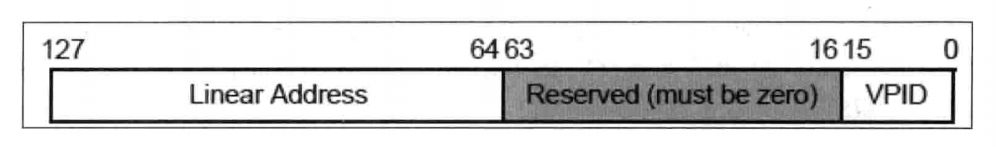

- 1 概述
    - 1.1 VMX指令执行环境
    - 1.2 指令执行的状态
    - 1.3 VMfailValid事件原因
    - 1.4 指令异常优先级
    - 1.5 VMCS管理指令
        - 1.5.1 VMPTRLD指令
        - 1.5.2 VMPTRST指令
        - 1.5.3 VMCLEAR指令
        - 1.5.4 VMREAD指令
        - 1.5.5 VMWRITE指令
    - 1.6 VMX模式管理指令
        - 1.6.1 VMXON指令
        - 1.6.2 VMXOFF指令
        - 1.6.3 VMLUNCH指令
        - 1.6.4 VMRESUME指令
        - 1.6.5 返回到executive monitor
    - 1.7 Cache刷新指令
        - 1.7.1 INVEPT指令
        - 1.7.2 INVVPID指令
    - 1.8 调用服务例程指令
        - 1.8.1 VMCALL指令
        - 1.8.2 VMFUNC指令

# 1. 概述

VMX架构提供13条VMX指令，负责管理4个职能。如下表所示。

管理范围 | 指令 | 描述
---|---|---
VMCS region 管理 | VMPTRLD | 加载一个VMCS指针作为current-VMCS指针
&nbsp; | VMPTRST | 保存current-VMCS指针在内存里
&nbsp; | VMCLEAR | 清VMCS状态，并置current-VMCS指针为FFFFFFFF_FFFFFFFFh值
&nbsp; | VMREAD | 读current-VMCS字段值
&nbsp; | VMWRITE | 写current-VMCS字段值
VMX operation 管理 | VMXON | 进入VMX operation模式
&nbsp; | VMOFF | 退出VMX operation模式
&nbsp; | VMLAUNCH | 发起VM-entry操作，进入VM
&nbsp; | VMRESUME | 恢复VM执行
Cache 刷新 | INVEPT | 刷新全部EPT的TLBs和Paging-structure caches
&nbsp; | INVVPID | 刷新部分EPT的TLBs和Paging-Structure cache
调用服务例程 | VMCALL | Guest调用VMM的服务例程，并退出VM
&nbsp; | VMFUNC | Guest调用VMM服务例程，不退出VM

## 1.1 VMX指令执行环境

VMX架构对CR0和CR4寄存器的设置有基本的限制要求，即需要开启分页的保护模式以及CR4.VMEX=1。下面是VMX指令执行的基本环境：
1. 除了VMXON指令可以在进入VMX operation模式前执行，其他指令必须执行再VMX operation模式里。否则，将产生#UD异常。
2. 不能在实模式、virtual-8086模式以及compatibility模式下执行。否则，将产生#UD异常。除了在支持并开启"unrestricted guest"功能后，在Guest的非分页或非保护模式环境里可以执行VMFUNC指令外。
3. 所有VMX指令必须在root环境里执行（除了VMFUNC指令可以在non-root环境里执行）。否则，将产生VM-exit行为。而VMFUNC指令执行在root环境里，将产生#UD异常。
4. 除了VMFUNC指令外，所有VMX指令必须执行再0级权限里。否则，将产生#GP异常。

VMXON指令时唯一在VMX operation模式外可执行的指令：
- VMXON指令在root内执行会产生下面所说的VMfailValid失败
- VMXON指令在non-root内执行则会产生VM-exit行为

VMFUNC指令时唯一在non-root内正常执行的指令，如果在root内执行则会产生#UD异常。

## 1.2 指令执行的状态

除了可能产生异常外（例如：#GP、#UD），每条VMX指令的执行还可能会产生3个状态：
1. VMsuccessd
2. VMfailInvalid
3. VMfialValid

- VMsuccess：指令执行成功。指令会清所有的eflags寄存器标志位，例如CF与ZF标志。
- VMfialInvalid：表示因current-VMCS指针无效而失败。当current-VMCS指针或VMCS内的ID值是无效时，VMX指令会置CF标志位，指示执行失败。
- VMfailValid：表示遇到某些原因而失败。例如，VMREAD指令读一个VMCS区域内不存在的字段时，VMREAD指令会置ZF标志位，指示执行失败。

在这样的一种情形下，例如，当current-VMCS指针为初始值（FFFFFFFF_FFFFFFFFh），表明没有加载VMCS指针（使用VMPTRLD指令），执行VMREAD指令就会产生VMfailInvalid失败。

一般情况下都需要检查CF与ZF标志位，以确定指令是否执行成功。

VMfailInvalid与VMfailValid的不同之处是：
- VMfailValid：会在当前VMCS内的VM-instruction error field（指令错误字段）记录失败指令的编号。
- VMfailInvalid：是由于遇到无效的VMCS区域（典型地，VMCS ID错误）或current-VMCS指针无效，因此不可能在VMCS内记录错误的信息。

## 1.3 VMfailValid事件原因

VMX指令产生的VMfailValid失败会对应一个编号，这个编号就记录在VM-instruction error字段里。
这个字段是VM-exit信息区域内的其中一个32位字段。如下表所示。

错误编号 | 描述
---|---
1 | VMCALL指令执行再root环境
2 | VMCLEAR指令操作数是无效的物理地址
3 | VMCLEAR指令操作数是VMXON指针
4 | VMLAUNCH执行时，current-VMCS状态是非"clear"
5 | VMRESULT执行时，current-VMCS状态是非"launched"
6 | VMRESULT在VMXOFF指令后
7 | VM-entry操作时，current-VMCS含有无效的VM-execution控制字段
8 | VM-entry操作时，current-VMCS含有无效的host-state字段
9 | VMPTRLD操作数是无效的物理地址
10 | VMPTRLD操作数是VMXON指针
11 | VMPTRLD执行时，VMCS内的VMCS ID值不符
12 | VMREAD/VMWRITE指令读/写current-VMCS内不存在的字段
13 | VMWRITE指令试图写current-VMCS内的只读字段
14 | 保留
15 | VMXON指令执行再VMX root operation里
16 | VM-entry操作时，current-VMCS内含有无效的executive-VMCS指针
17 | VM-entry操作时，current-VMCS内使用了非"launched"状态的executive-VMCS
18 | VM-entry操作时，current-VMCS内的executive-VMCS指针不是VMXON指针
19 | 执行VMCALL指令切入SMM-transfer monitor时，VMCS非"clear"状态
20 | 执行VMCALL指令切入SMM-transfer monitor时，VMCS内的VM-exit control字段无效
21 | 保留
22 | 执行VMCALL指令切入SMM-transfer monitor时，MSEG内的MSEG ID值无效
23 | 在SMM双重监控处理机制下执行VMXOFF指令
24 | 执行VMCALL指令切入SMM-transfer monitor时，MESG内使用了无效的SMM monitor特征
25 | 进行"VM-entry that return from SMM"操作时，在executive VMCS中遇到了无效的VM-execution control字段
26 | VM-entry操作时，VMLAUNCH或VMRESUME被MOV-SS/POP-SS阻塞
27 | 保留
28 | INVEPT/INVVPID指令使用了无效的操作数

上表列出了所有可能发生的VMfailValid原因，编号14、21、27没有使用。其中有数个失败产生于VM-entry和SMM双重监控处理机制下的切入SMM-transfer monitor时。

## 1.4 指令异常优先级

如前面所述，如果VMX指令非正常执行，会出现下面三种情况之一。
1. 产生异常，可能产生的异常为：#UD、#GP、#PF、#SS。
2. 产生VM-exit行为。
3. 产生VMfailInvalid失败或者VMfailValid失败。

VMfailInvalid与VMfailValid失败是在指令允许执行的前提下（即执行指令不会产生异常及VM-exit），它会发生在root环境里。VMFUNC指令执行在non-root环境不会产生失败，只可能产生#UD异常或者VM-exit。

在开启"unrestricted guest"功能后并进入实模式的Guest软件里执行VMX指令时，一个#UD异常的优先级高于VM-exit行为。或者一个由于CPL非0而引发的#GP异常，优先级高于VM-exit行为。

## 1.5 VMCS管理指令

有5条VMX指令涉及VMCS区域的管理，下面将介绍他们的用法。

### 1.5.1 VMPTRLD指令

VMPTRLD指令从内存中加载一个64位的物理地址作为**current-VMCS pointer**（当前VMCS指针），这个当前VMCS指针由处理器内部记录和维护，除了VMXON、VMPTRLD和VMCLEAR指令需要提供VMXON或或VMCS指针作为操作数外，其他的指令都在current-VMCS上操作。

```asm
    vmptrld [gs:PCB.GuestA]         ; 加载64位VMCS地址
```

> 注意：这条指令读取的是64位物理地址值，即使在32位环境下。如上面代码所示，在PCB.GuestA里保存着一个VMCS区域的物理地址值，执行这条指令将更新current-VMCS pointer值。在指令未执行成功时，current-VMCS pointer将维护原有值。

处理器会根据提供的VMCS指针，进行下面的检查事项：
1. 物理地址是否超过物理地址宽度，并且需要在4K地址边界上。当IA32\_VMX\_BASIC[48]为1时，物理地址宽度在32位内，否则为MAXPHYADDR值。
2. VMCS指针是否为VMXON指针。
3. 目标VMCS区域首DWORD值是否符合VMCS ID值。

当上面检查不通过时，如果原来已经存在current-VMCS pointer，则会产生VMfailValid失败，current-VMCS pointer将维持不变，并且在current-VMCS的指令错误字段里记录错误号是11。指示："执行VMPTRLD时，VMCS内的VMCS ID值不符"。否则，产生VMfailInvalid失败。

### 1.5.2 VMPTRST指令

VMPTRST将64位的current-VMCS pointer保存在提供的内存中，如下面示例。
```asm
    vmptrst [gs: PCB.VmcsPhysicalPointer]       ; 保存64位VMCS地址
```
VMPTRST指令不会产生VMfailValid或VMfailInvalid失败，除了产生异常或VM-exit外，它总是成功的。

### 1.5.3 VMCLEAR指令

VMCLEAR指令根据提供的64位VMCS指针，对目标VMCS区域进行一些初始化工作，并将目标VMCS的状态设置为**clear**。这个初始化工作，其中有一项是将处理器内部维护的关于VMCS数据写入目标VMCS区域内。这部分VMCS数据可能于处理器相关，这是正确使用VMCS的前提。

在使用VMLAUNCH指令进入VM时，current-VMCS的launch状态必须为clear。因此，当VMCLEAR指令对目标VMCS进行初始化后，使用VMPTRLD指令将目标VMCS加载为current-VMCS，同时也更新current-VMCS pointer值。

```asm
    vmclear [gs: PCB.GuestA]            ; 对GuestA进行初始化，置clear状态
    vmptrld [gs: PBC.GuestA]            ; 将GuestA加载为current-VMCS
```
执行上述操作后，在后续工作里对GuestA区域进行配置，然后就可以使用VMLAUNCH指令进入VM执行。

VMCLEAR指令也会对目标VMCS指针进行与VMPTRLD指令相同的检查。
如果在执行VMCLEAR指令前已经加载过当前VMCS指针，并且VMCLEAR指令的目标VMCS是current-VMCS，则会设置current-VMCS pointer为FFFFFFFF_FFFFFFFFh值。

### 1.5.4 VMREAD指令

VMREAD指令需要提供一个32位的VMCS字段ID值放在寄存器里作为源操作数。目标操作数是寄存器或者内存操作数，将读取到的相应字段值放在目标寄存器或者内存地址中。

VMREAD指令在32位模式下固定使用32位操作数，在64位模式下固定使用64位操作数。
而VMCS字段由不同宽度，例如，存在16位字段和natural-width类型字段。
natural-width类型的字段在支持64位架构的处理器上是64位，在不支持64位架构的处理器上是32位。

为了适应不同宽度的字段，VMREAD指令使用下面的读取原则：
- 如果VMCS字段的size小于目标操作数size，则VMCS字段值读入目标操作数后，目标操作数的高位部分清0。
- 如果VMCS字段的size大于目标操作数size，则VMCS字段的低位部分读入目标操作数后，VMCS字段的高位部分忽略。

由于VMCS字段ID值为32位，在64位模式下源操作数的bits[63:32]必须为0。否则会因为尝试读取一个不支持的VMCS字段而产生VMfailValid失败。
```asm
    vmread [ebp + EXIT_INFO.ExitReason], eax
    vmread ebx, eax
```
上面的代码中，VMCS字段ID值放在源操作数EAX里，读到的值放在内存及EBX寄存器里。
VMCS的字段ID也被称为"字段 encode"，由几个部分组成，如下图所示。


在前面提到的IA32\_VMX\_VMCS\_ENUM寄存器的bits[9:1]提供最大的VMCS字段index值。
这个最大index值就是指上图字段编码中的index最大值。

VMREAD指令操作在current-VMCS区域。因此，处理器会检查：
1. current-VMCS指针是否无效（例如，为FFFFFFFF_FFFFFFFFh值）。
2. 提供的字段ID值是否有效，即VMCS中是否存在此字段

> 当使用VMCLEAR指令对current-VMCS初始化时，当前VMCS指针就会变为FFFFFFFF_FFFFFFFFh值，此时执行VMREAD指令会产生VMfailInvalid失败。而当不存在VMCS字段时，则会产生VMfailValid失败。

### 1.5.5 VMWRITE指令

VMWRITE指令的源操作数是寄存器或者内存操作数，提供需要写入VMCS字段的值。目标操作数是寄存器，32位的字段ID值提供在目标寄存器操作数里。

VMWRITE指令在32位模式下固定使用32位的操作数，在64位模式下固定使用64位操作数。
而VMCS字段由不同的宽度，例如存在16位字段和natural-width类型的字段。
natural-width类型的字段在支持64位架构的处理器上是64位，在不支持64位架构的处理器上是32位。

为了适合不同宽度的字段，VMWRITE指令使用下面的写入原则：
- 如果写入值的size小于VMCS字段的size，则值写入VMCS字段后，VMCS字段的高位部分清0。
- 如果写入值的size大于VMCS字段的size，则忽略写入值的高位部分，低位部分写入VMCS字段里。

由于VMCS字段ID值为32位，在64位模式下目标操作数的bits[63:32]必须为0。否则会因为尝试写入一个不支持的VMCS字段而产生VMfailValid失败。

与VMREAD指令稍微不同，VMWRITE指令还会检查目标的VMCS字段是否可写。如果对一个Read-only类型的字段进行写操作，将产生VMfailValid失败，错误编号为13。

## 1.6 VMX模式管理指令

此类指令共有4条，分别为：VMXON、VMXOFF、VMLAUNCH以及VMRESUME指令。此类指令在启用SMM的"dual-monitor treatment"功能后，情况会变得复杂些。

### 1.6.1 VMXON指令

执行VMXON指令成功后进入处理器的VMX root-operation模式，并且初始化current-VMCS pointer为FFFFFFFF_FFFFFFFFh值。
在root环境下，**INIT**与**SIPI**信号会无条件地被阻塞，也不允许进入**A20M**模式。
因此，进入VMX operation前必须**启动A20地址线**，关闭地址的"wrapped"机制。

VMXON指令的内存操作数里需要提供64位VMXON区域物理地址，处理器会检查：
1. VMXON指针是否超越物理地址的宽度并且在4K边界上对齐。
2. VMXON区域的头DWORD值是否符合VMCS ID。

这些检查不通过时，产生VMfailInvalid类型失败。

当执行VMXON指令时，如果处理器已经进入到VMX root-operation模式，将会产生VMfailValid失败，指令错误编号是15（即VMXON指令执行再VMX root-operation里）。
指令执行再non-root环境里则会产生VM-exit。

### 1.6.2 VMXOFF指令

VMXOFF指令无操作数，指令执行成功后将处理器的VMX operation模式。如果开启了SMM双重监控处理机制，需要首先关闭SMM双重监控处理机制后再执行VMXOFF指令才能退出VMX operation模式，否则将产生VMfailValid类型失败。

关闭SMM双重监控处理机制做法是：
1. 在root模式里执行VMCALL指令切入SMM-transfer monitor
2. 将当前SMM-transfer VMCS内VM-entry控制字段的"deactivate dual-monitor treatment"位置1
3. 执行VMRESUME指令返回到executive monitor

### 1.6.3 VMLUNCH指令

VMLAUNCH指令被使用于首次发起VM-entry操作。因此current-VMCS的状态必须为"clear"，否则产生VMfailValid类型失败。在发起VM entry操作前的一系列动作里，需要使用VMCLEAR指令将目标VMCS状态置为"clear"状态，然后使用VMPTRLD指令加载该VMCS为current-VMCS。

VM entry操作是一个很复杂的过程，分为三个阶段进行，每个阶段会进行一些必要的检查。检查不通过时，这个三个阶段的后续处理也不同，如下所示。

1. 执行基本检查。包括：
    - 可能产生的指令异常（#UD或者#GP异常）
    - current-VMCS pointer是否有效
    - 前面所说的当前VMCS状态是否为**clear**
    - 执行的VMLAUNCH指令是否被**MOV-SS**指令阻塞
2. 对VMCS内的VM-execution、VM-exit、VM-entry以及host-state区域的各子字段进行检查。
3. 对VMCS的guest-state区域的各个字段进行检查。

在第1步里，需要关注的"blocking by MOV-SS"阻塞状态，在下面的情形里：
```asm
    mov ss, ax          ; 更新SS寄存器，或者执行pop ss指令
    vmlaunch            ; vmlaunch有"blocking by MOV-SS"阻塞状态
```
上述情形，当VMLAUNCH或者VMRESUME指令执行再MOV-SS或POP-SS指令后，那么就会产生VMfailValid失败，产生的指令错误号为26，指示"VMLAUNCH或VMRESUME指令将被MOV-SS阻塞"。

在第2步的检查通不过时，也产生VMfailValid失败。指令错误号为7，指示"VM-entry操作时，current-VMCS内含有无效的控制字段"。

控制字段包括：
- VM-execution
- VM-exit
- VM-entry

也可以产生的指令错误号为8，指示"VM-entry操作时，current-VMCS内含有无效的host-state区域字段"。失败后也执行VMLAUNCH指令的下一条指令。

在第3步里，当检查通不过时会产生VM-exit行为。处理器在Exit reson字段里记录产生VM-exit原因的一个编号。它的编号是33，指示"由于无效的guest-state字段而产生VM-entry失败"。处理器会加载host-state的context信息，然后转入执行host的入口点。

### 1.6.4 VMRESUME指令

VMRESUME指令执行与VMLAUNCH相同的动作，但是VMRESUME指令使用于在VM-exit产生后再次进入VM。
因此，VMRESUME指令检查current-VMCS的状态是否为"launched"，否则产生VMfailValid失败。指令错误编号为5，指示"VM-entry 操作时，current-VMCS状态为非launched"。

### 1.6.5 返回到executive monitor

在启用SMM双重监控处理机制的情况下，有一种VM-entry操作叫做"VM-entry that from SMM"，直译为“从SMM退出进入VM”。注意，这种情况**只会发生在VMRESUME指令**里。

这是两个monitor之间的切换，这种情形时从**SMM-transfer monitor**切换到**executive monitor**。
在这种情况下，处理器还会进行另一些检查（这里的current-VMCS等于SMM-transfer VMCS），如下所示。
1. 检查在current-VMCS内的executive-VMCS pointer字段的executive-VMCS指针是否有效。否则产生VMfailValid失败，错误编号为16，指示："current-VMCS含有无效的executive-VMCS指针"。
2. 如果current-VMCS内的VM-entry字段的"deactivate dual-monitor treatment"位为1，检查executive-VMCS指针是否为VMXON指针。否则产生VMfailValid失败，错误编号为18，指示："current-VMCS 内的executive-VMCS指针不是VMXON指针"。
3. 如果executive-VMCS指针不是VMXON指针，那么executive-VMCS指针在切换到executive monitor后，会被加载为新的current-VMCS指针。此时executive-VMCS的状态必须为launched，否则产生VMfailValid失败，错误编号为17，指示："executive-VMCS的状态为非launched状态"。
4. 当executive-VMCS属于VMXON region时（即返回到root），不会检查VM-execution控制字段。当executive-VMCS不是VMXON region时（即返回non-root），处理器对executive-VMCS的VM-execution控制字段执行所有检查。检查不通过时产生VMfailValid失败，错误编号为25，指示"executive-VMCS内含有无效的VM-execution控制字段"。
5. 当executive-VMCS属于VMXON region时，execu-VMCS不能指示"注入一个事件"（除了pending MTF VM-exit事件外）。
6. 当executive-VMCS属于VMXON region时（返回root），所有Guest-state区域的字段检查基于VM-execution控制字段为0的情况下，activity state字段不能指示为wait-for-SIPI状态。当executive-VMCS不是VMXON时（返回non-root），Guest-state区域字段的检查基于VM-execution控制字段相应的设置。

上面的检查失败后，会执行SMM-transfer monitor中VMRESUME指令的下一条指令。

## 1.7 Cache刷新指令

VMX架构下提供了两条用于刷新cache的指令：INVEPT与INVVPID指令。它们都对TLBs与Paging-Structure Cache进行刷新。

在VMX架构下实现了三类映射途径下的TLB caches与Paging-Structure Cache信息，它们是：
1. **linear mapping**，当EPT机制未启用时（或者在VMX root operation模式下），这类cache信息用来缓存linear address到physical address的转换。
2. **guest-physical mapping**，当EPT机制启用时，这类cache信息用来缓存Guest-Physical address到Host-Physical address的转换。
3. **combined mapping**，当EPT机制启用时，这类cache信息结合了linear address和Guest-physical address到Host-physical address的转换。也就是缓存了linear address到host-physical address的转换信息。

INVEPT与INVVPID指令的不同之处就是：刷新的cache信息以及刷新的cache域。

### 1.7.1 INVEPT指令

在启用EPT机制时，可以使用INVEPT指令对"GPA转换HPA"而产生的相关cache进行刷新。
它根据提供的EPTP（EPT pinter）来刷新Guest-physical mapping（Guest-physical address转换到Host-physical address）和combined mapping（linear address转换到Host-physical address）产生的cache信息。

```asm
    invept rax, [InveptDescriptor]           ; 刷新TLBs及Paging-Structure caches
```
在上面的指令示例里，rax寄存器提供**INVEPT type**，指示使用何种刷新方式。而内存操作数里存放着INVEPT描述符，EPTP值提供在这个INVEPT描述符里，如下图所示。


INVEPT描述符的结构，共16个字节，bits[63:0]存放EPTP值。EPTP值的bits[N-1:12]指向EPT结构的PML4T表，INVEPT指令将EPTP[N-1:12]所引伸出来的层级转换表结构作为依据进行刷新cache，这个EPTP字段bits[N-1:12]（N=MAXPHYADDR）提供的值被称为**EP4TA**（EPT PML4T address，扩展页表的PML4T地址）。

INVEPT指令支持两种刷新类型：single-context与all-context。
1. 当type值为1时，使用single-context刷新方式。处理器刷新INVEPT描述符里提供的EP4TA值所对应的Guest-physical mapping与combined mapping信息。
2. 当type值为2时，使用all-context刷新方式。处理器刷新所有EP4TA值对应的Guest-physical mapping与combined mapping信息。也就是说，此时忽略INVEPT描述符。

另外需要特别注意的是：处理器也刷新**所有VPID与PCID值**所对应的combined mappings信息。软件应该要查询处理器的INVEPT指令是否支持上述的type值。

INVEPT指令支持刷新类型，当使用不支持的类型时产生VMfailValid失败，错误编号为28，指示"无效的INVEPT/INVVPID"操作数。

### 1.7.2 INVVPID指令

INVVPID指令依据提供的VPID值对linear mapping及combined mapping的cache信息进行刷新。也就是INVVPID指令可以刷新EPT机制**启用**或者**未启用**时的线性地址到物理地址转换而产生的cache信息。

```asm
    invvpid rax, [InvvpidDescriptor]        ; 刷新TLBs及Paging-Structure cache
```

INVVPID指令页需要在寄存器操作数里提供**INVVPID type**值，在内存操作数里提供INVVPID描述符。
INVVPID描述符结构如下图所示。



INVVPID描述符的bits[127:64]提供线性地址，bits[15:0]提供VPID值。INVVPID指令根据这两个值进行刷新。

INVVPID指令支持4个刷新类型：
1. 当type值为0时，使用**individual-address**刷新方式。指令将刷新目标VPID，所有PCID以及所有EP4TA域内的目标线性地址匹配的cache信息，具体为：
    - 匹配描述符内提供的目标线性地址与目标VPID值
    - 所有PCID域下对应的linear mappings与combined mappings信息
    - 所有EP4TA域下对应的combined mappings信息
2. 当type值为1时，使用**single-context**刷新方式。指令将刷新目标VPID，所有PCID以及所有EP4TA域的cache信息，具体为：
    - 匹配描述符内提供目标VPID值
    - 所有PCID域下对应的linear mappings与combined mappings信息
    - 所有EP4TA域对应的combined mappings信息
3. 当type值为2时，使用**all-context**刷新方式。指令将刷新默认VPID值（0000H）外的所有VPID，所有PCID以及所有EP4TA域的cache信息，具体为：
    - 所有VPID值（除了0000H）
    - 所有PCID域下对应的linear mappings与combined mappings信息
    - 所有EP4TA域下对应的combined mappings信息
4. 当type值为3时，使用**single-context-retaining-global**刷新方式。指令行为与类型2的single-context刷新方式相同，除了保留global的转换表外。

在所有的刷新方式里，都不能刷新VPID值为0000H的cache信息。否则产生VMfailValid失败，错误编号28，指示"无效的INVEPT/INVVPID操作数"。

软件应该在使用前查询当前处理器支持那种刷新类型。如果提供不支持的刷新类型，也同样产生编号为28的VMfailValid失败。

## 1.8 调用服务例程指令

VMX架构提供了两个调用服务例程指令：VMCALL与VMFUNC指令。它们服务的对象不同，VMCALL指令使用在VMM里，而VMFUNC指令使用在VM里。

### 1.8.1 VMCALL指令

利用VMCALL指令可以实现SMM的dual-monitor treatment（SMM双重监控处理）机制。
VMCALL指令在non-root里执行将会产生VM-exit行为，但在root环境里执行VMCALL指令，当满足检查条件时，在VMM里产被称为**SMM VM-exit**的退出行为，从而切换到SMM模式的SMM-transfer monitor里执行。
这个SMM-transfer monitor入口地址提供在MSEG区域头部（由IA32\_SMM\_MONITOR\_CTL[31:12]提供）。

在VMX root operation里执行VMCALL，除了可能产生异常（#UD或#GP）外，由两种可能：
1. 指令失败（VMfailValid或VMfailInvalid）
2. 产生"SMM VM-exit"，激活SMM双重监控处理功能

IA32\_SMM\_MONITOR\_CTL寄存器的bit0为valid位。只有当bit0为1时，才允许使用VMCALL指令通过切入SMM-transfer monitor执行来激活SMM双重监控处理机制。否则将产生VMfailValid失败，指示"VMCALL指令执行再VMX root operation模式里"。

### 1.8.2 VMFUNC指令

VMFUNC指令时唯一能在non-root环境里使用的VMX指令。当允许并且设置secondary processor-based control字段的"enable VM functions"位为1时，允许VM里执行VMFUNC指令调用服务例程，否则将产生#UD异常。

> 注意，VMFUNC指令在VMX root operation模式里执行也会产生#UD异常。

执行VMFUNC指令前，在eax寄存器里放入功能号。然而，在执行某个功能号时，也需要在VM-functions control字段的相应位置位。VM-functions control字段是一个64位值，因此VMX架构最多支持0 ~ 63的功能号。
如果提供的功能号大于63，则会产生#UD异常。

当启用"enable VM functions"功能，提供一个功能号给eax寄存器执行VMFUNC指令，但VM-functions control字段相应位为0值，则会产生VM-exit行为。在陈宫执行VMFUNC指令的情况下不会产生VM-exit行为。

当前VMX架构只实现一个功能号0，它是**EPTP switching**服务例程。使用它则需要在VM-functions control字段的bit0进行置位。

为了支持EPT switching服务例程，VMX架构添加一个EPTP-list address字段，提供512个EPT值供切换。
使用时需要在EAX寄存器放入0号功能号，在ECX寄存器放入EPT-list entry的编号。当ECX的值大于511时将产生VM-exit。