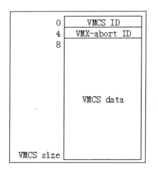
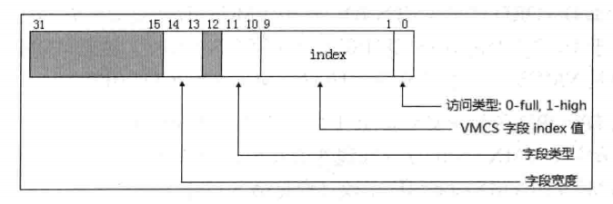

- 1 概述
- 2 VMCS状态
    - 2.1 activity属性
    - 2.2 current属性
    - 2.3 launch属性
    - 2.4 小结
- 3 VMCS区域
    - 3.1 VMXON区域
    - 3.2 Executive-VMCS与SMM-transfer VMCS
    - 3.3 VMCS区域格式
- 4 访问VMCS字段
    - 4.1 字段ID格式
    - 4.2 不同宽度的字段处理
        - 4.2.1 16位字段
        - 4.2.2 32位字段
        - 4.2.3 64位字段
        - 4.2.4 natural-width字段

# 1. 概述

在VMX架构里，当发生VMX operation模式的root与non-root环境之间切换时，VMCS（Virtual Machine Control Struucture）用来配置当前发生切换的逻辑处理器的状态及执行环境。
在VMCS的配置下logical processor（逻辑处理器）可以视为Virtual processor（虚拟处理器）。

- 从root切换到non-root被称为VM-entry，将进入VM环境（虚拟处理器）执行，逻辑处理器从VMCS的Guest-state区域读取相应的字段来更新当前处理器上下文环境。
- 从non-root环境切换到root被称为VM-exit，意味着返回到VMM里。逻辑处理从VMCS的Host-state区域读取相应的字段来更新当前处理器上下文环境。

# 2. VMCS状态

在一个存在多个虚拟机的平台里，每个虚拟处理器对应一个属于自己的VMCS。在虚拟处理器之间的切换也意味着VMCS之间的切换。同一时刻，一个逻辑处理器只有一个VMCS是**current-VMCS**。

根据Intel手册描述，我们可以归纳出用来描述VMCS的三类属性状态，它们是：
1. activity属性，包括active（活动的）及inactive（非活动的）状态
2. current属性，包括current（当前的）及not current（非当前的）状态
3. launch属性，包括clear（干净的）及launched（已启动的）状态

在这些VMCS属性中，current与launch属性是比较重要的。一个VMCS的某一类属性是什么状态，并不影响其余的属性状态。
例如，VMCS可以是active状态，但可能不属于current状态或clear与launched状态。

有一个例外，如果VMCS处于inactive状态，那么它必定是not current状态。

另一种情况是：在刚进入VMX operation模式时，没有任何VMCS处于active状态，因此，也就不存在current及clear状态。

## 2.1 activity属性

如果一个VMCS是active状态，表明它已经被加载过。在刚进入VMX operation模式后，一旦使用VMPTRLD指令加载过某一个VMCS，那么这个VMCS就变成active状态。即使后续又使用VMPTRLD指令加载其他的VMCS，原VMCS还是维持active状态，除非使用VMCLEAR指令强制初始化VMCS。

```asm
    vmptrld [GuestA]                ; A变成active状态
    vmptrld [GuestB]                ; 现在A与B都是active状态
    vmptrld [GuestA]                ; A变成inactive状态
```
要将VMCS变为inactive状态，只能使用VMCLEAR指令初始化VMCS。如上面的示例代码，VMCLEAR指令执行前，A和B都是active状态，VMCLEAR指令执行后，A变成inactive状态。

另外，在虚拟机平台迁移设计里，一个active VMCS不应该对应多个逻辑处理器。

举例来说，VMCS A在逻辑处理器0里已经是active状态，那么在逻辑处理器1上不应该直接使用VMPTRLD指令来加载VMCS A，这样可能会造成VMCS A配置不适合逻辑处理器1使用。逻辑处理器1在加载VMCS A之前，必须使用VMCLEAR指令将VMCS A置为inactive状态，在使用VMPTRLD指令加载VMCS A。

## 2.2 current属性

在一个逻辑处理中，一个时刻只能有一个VMCS处于current状态。这样的VMCS我们可以称为**current-VMCS**，指向它的指针称为**current-VMCS pointer**。处理器会自动记录和维护current-VMCS pointer值。

```asm
    vmptrld [GuestA]                ; 此时A为current-VMCS
    vmptrld [GuestB]                ; 此时B为currnet-VMCS，A变为not current状态
    vmclear [GuestB]                ; 此时B为non current状态
```
上面的示例代码中，每使用一次VMPTRLD指令来加载VMCS，current-VMCS就会更新一次。
而原current-VMCS就会变为not current状态，current-VMCS并不意味着它一定是clear或launched状态。
一旦使用VMCLEAR指令初始化目标VMCS，目标VMCS就会变为not current状态以及clear状态。
并且，如果目标VMCS是current-VMCS，那么current-VMCS pointer的值会被初始化为FFFFFFFF_FFFFFFFFh值。

VMREAD，VMWRITE，VMLAUNCH、VMRESUME及VMPTRST指令的操作都是实施在current-VMCS之上的。
处理器内部使用和维护的current-VMCS pointer值就指向current-VMCS。
根据推测，current-VMCS pointer要么存放在处理器内部寄存器中，要么存放在VMXON区域内。

## 2.3 launch属性

处理器也记录着VMCS的launch属性状态。若一个逻辑处理器管理多个VMCS，那么可能存在多个launched或clear状态的VMCS。

一旦使用VMLAUNCH指令成功进行VM-entry操作，current-VMCS就会变为launched状态。VM-exit后如果current-VMCS变更为另一个VMCS，原current-VMCS还是维持launched状态，除非使用VMCLEAR指令对它显示地初始化。

```asm
    vmptrld [GuestA]                    ; 此时A为current-VMCS
    vmlaunch                            ; A为launched状态
    ......                              ; 产生VM-exit后
    vmptrld [GuestB]                    ; 此时B是current-VMCS，A维持launched状态
    vmlaunch                            ; B为launched状态
    ......                              ; 产生VM-exit后
    vmclear [GuestA]                    ; 此时A为clear状态
```
上面的示例代码中，A经过成功执行VMLAUNCH指令后变为launched状态，后续发生了VM-exit回到VMM，VMM又加载了另一个VMCS B，B此时变成current-VMCS。B经过成功执行VMLAUNCH指令后变为launched状态，但A还是维持launched状态，直至使用VMCLEAR指令对VMCS A进行初始化后，A变为clear状态。

> 注意：VMLAUNCH指令执行时需要current-VMCS为clear状态，而VMRESUME指令执行时需要current-VMCS为launched状态。

## 2.4 小结

VMCS状态随着下面指令的执行而改变：
1. VMCLEAR指令将目标VMCS置为inactive，not current，clear状态。
2. VMPTRLD指令将目标VMCS置为active，current状态，并更新current-VMCS指针。
3. VMLAUNCH指令将current-VMCS置为launched状态。

处理器会记录VMCS的这些状态信息。这些状态信息存放在目标VMCS的不可见字段里，这样处理器就很容易知道VMCS目前处于那种状态。这些不可见字段并没有实现对应的字段ID，因此，不能使用VMREAD与VMWRITE指令进行访问。

# 3. VMCS区域

VMCS结构存放在一个物理地址区域里，这个区域被称为**VMCS region**。VMCS区域需要对齐在4K边界上。
VMCS区域的大小由IA32\_VMX\_BASIC[44:32]域里得到，以KB为单位，最高为4KB。
IA32\_VMX\_BASIC[53:50]报告了VMCS区域支持的cache类型，支持UC与WB类型。

执行VMCLEAR与VMPTRLD指令时，需要提供目标VMCS区域的物理指针作为操作数。
而VMREAD，VMWRITE，VMLAUNCH，VMRESUME，VMPTRST指令隐式地使用current-VMCS pointer作为目标VMCS指针。

前面提到，使用VMCLEAR指令对current-VMCS指针进行初始化时，current-VMCS pointer变为FFFFFFFF_FFFFFFFFh。
这时，执行上面隐式使用current-VMCS pointer的指令，会产生VMfailInvalid失败。

## 3.1 VMXON区域

VMM需要一个被称为**VMXON region**的区域来管理整个VMX operation模式，VMXON区域大小以及所支持的cache类型与VMCS区域是一致的。
指向VMXON区域的指针被称为**VMXON pointer**。进入VMX operation模式前，需要为VMM准备一份VMXON区域，VMXON区域的物理指针作为操作数提供给VMXON指令。

一个VMM对应一个VMXON指针，除非在VMM里关闭VMX operation模式后，在使用另一个VMXON指针来重新开启VMX operation模式。否则，VMXON指针是不会改变的。VMXOFF指令也操作在这个VMXON指针上，用来关闭当前VMXON区域所管理的VMX operation模式。

## 3.2 Executive-VMCS与SMM-transfer VMCS

在SMM双重监控处理机制下，还有两类VMCS，分别是：
1. Executive-VMCS
2. SMM-transfer VMCS

- Executive-VMCS：是对应VMM在VMX operation模式（包括root与non-root）下的VMCS。
- SMM-transfer VMCS：是对应VMM进入SMM模式时使用的VMCS。

Executive-VMCS指针并不是新加载的VMCS指针，它在SMM VM-exit发生后自动更新。
它等于VMXON指针还是current-VMCS指针，取决于进入SMM-transfer monitor时处理器处于VMX root operation还是VMX non-root operation。
- 当SMM VM-exit发生在VMX root operation模式时，Executive-VMCS指针等于VMXON指针。
- 当SMM VM-exit发生在VMX non-root operation模式时，Executive-VMCS指针等于current-VMCS指针。

在**首次**进入SMM-transfer monitor前（执行VMCALL指令），需要使用VMPTRLD指令加载另一个VMCS作为SMM-transfter VMCS指针，但这个VMCS不是current-VMCS。处理器会记录和维护这个SMM-transfer VMCS指针。在进入SMM模式处理SMI后，这个SMM-transfer VMCS指针就被视为SMM模式内的current-VMCS指针。

## 3.3 VMCS区域格式

VMCS区域寄存在物理地址空间，有一个8字节的头部和VMCS数据区域，如下图所示。



VMCS的首DWORD值是VMCS ID，这个VMCS ID值需要在初始化VMCS区域时写入，必须等于IA32\_VMX\_BASIC[31:0]值。

> 注意：VMXON区域的首DWORD值也是VMCS ID，也必须等于IA32\_VMX\_BASIC[31:0]值。

接下来的DOWRD值是VMX-abort ID，当进行VM-exit操作遇到一个错误时，会产生**VMX-abort**。
VMX-abort导致处理器进入shutdown状态，处理器会写入一个非零值到current-VMCS的VMX-abort ID字段。

VMCS数据区包括6个区域，每个区域有若干个字段，如下所示。
1. Guest-state区域：在VM-entry时，处理器的状态信息从guest-state区域中加载；在VM-exit时，处理器的当前状态信息保存在guest-state区域。
2. Host-state区域：在VM-exit时，处理器的状态从host-state区域中加载。
3. VM-execution控制区域：在进入VM后，处理器的行为由VM-execution控制区域中的字段提供控制。例如，可以设置某些条件使得在guest执行中产生VM-exit。
4. VM-exit控制区域：控制处理器在处理VM-exit时的行为，也影响返回VMM后处理器的某些状态。
5. VM-entry控制区域：控制处理器在处理VM-entry时的行为，也决定进入VM后处理器的某些状态。
6. VM-exit信息区域：记录引起VM-exit事件的原因及相关的明细信息。也可以记录VMX指令执行失败后的错误编号。

# 4. 访问VMCS字段

VMCS数据区内的字段与处理器实现相关。在不同架构下的处理器中，这些VMCS字段位置可能会不一致。
并且，在一些较早的处理器中也不支持VMX架构提出的新特性，导致在这些早期的处理器中某些字段是不存在的。

软件不能使用MOV指令来直接访问VMCS字段，原因是：
1. 软件并不知道VMCS字段的位置，也无法查询或推测出具体位置。
2. 使用MOV指令对VMCS区域进行读写，可能会读写到一些不正确的字段值，从而可能导致不可预测的结果发生。

软件必须通过**VMREAD**与**VMWRITE**指令来访问VMCS字段。每个字段定义一个唯一的ID值来对应，这个字段ID值提供给VMREAD与VMWRITE指令作为index值来访问相应的字段。

## 4.1 字段ID格式

字段ID值是32位的，它由几个域组成，如下图所示。



- bit[0]：指示访问的类型，为0时使用full类型，为1时使用high类型访问64位字段的高32位。除了64位字段外，其他宽度字段都是full类型。
- bits[9:1]：是VMCS字段的index值。
- bits[11:10]：指示字段的类型，包括：
    - 为0值时，属于控制区域内的字段。包括VM-execution控制字段，VM-exit控制字段及VM-entry控制字段。
    - 为1值时，属于只读类型的字段。
    - 为2值时，属于guest-state字段。
    - 为3值时，属于host-state字段。
- bits[14:13]：指示字段的宽度，包括：
    - 为0值时，属于16位字段。
    - 为1值时，属于64位字段。
    - 为2值时，属于32位字段。
    - 为3值时，属于natural-width字段。

natural-width字段在支持64位架构的处理器中为64位，在不支持64位架构的处理器中为32位。其他几类则属于固定宽度，不会改变。

> 注意：固定为64位的字段对应着两个字段ID值，分别是full类型字段与high类型字段。例如，guest-state区域内的IA32\_EFER字段是64位字段，它对应如下两个字段ID：full字段ID值为00002806H；high字段ID值为00002807H。

在32位模式下写64位的字段，需要进行两次写入操作。先写入full字段（对应64位字段的低32位部分），在写入high字段（对应64位字段的高32位部分）。其余宽度的字段只有唯一的ID值。

## 4.2 不同宽度的字段处理

VMREAD指令的源操作数提供字段ID值，目标操作数接收读取的VMCS字段值。

VMWRITE指令的目标操作数提供字段ID值，源操作数提供需要写入的值。对于不同宽度的字段有相对应的读写原则。

### 4.2.1 16位字段

- 在32位模式下，VMREAD指令读取VMCS字段值放入目标操作数的bits[15:0]，目标操作数的bits[31:16]清0。VMWRITE指令将源操作数的bits[15:0]写入相应的VMCS字段，源操作数的bits[31:16]忽略。
- 在64位模式下，VMREAD指令读取VMCS字段值放入目标操作数的bits[15:0]，目标操作数的bits[63:16]清0。VMWRITE指令将源操作数的bits[15:0]写入相应的VMCS字段，源操作数的bits[63:16]忽略。

### 4.2.2 32位字段

- 在32位模式下，VMREAD指令读取VMCS字段值放入32位目标操作数。VMWRITE指令将32位源操作数写入VMCS字段。
- 在64位模式下，VMREAD指令读取VMCS字段值放入目标操作数的bits[31:0]，目标操作数的bits[63:32]清0。VMWRITE指令将源操作数的bits[31:0]写入相应VMCS字段，源操作数的bits[63:32]忽略。

### 4.2.3 64位字段

- 在32位模式下，完整的读取需要分两次进行：VMREAD指令读full字段，得到VMCS字段的bits[31:0]值放入目标操作数，VMCS字段的bits[63:32]忽略。VMREAD指令读high字段，得到VMCS字段的bits[63:32]值放入目标操作数，VMCS字段的bits[31:0]忽略。
- 在32位模式下，完整的写入需要分两次进行：VMWRITE指令写full字段，源操作数写入VMCS字段的bits[31:0]，VMCS字段的bits[63:32]被清0。VMWRITE指令写high字段，源操作数写入VMCS字段的bits[63:32]，VMCS字段的bits[31:0]不变。
- 在64位模式下，直接读写full字段，对应完整的64位字段，无须读写high字段。
- 在64位模式下，如果读high字段，则VMCS字段的bits[63:32]值放入目标操作数的bits[31:0]，目标操作数的bits[63:32]清0。如果写high字段，则源操作数的bits[31:0]写入VMCS字段的bits[63:32]，源操作数的bits[63:32]忽略，VMCS字段的bits[31:0]不变。

### 4.2.4 natural-width字段

此类型的字段在支持64位架构的处理器上是64位，否则为32位。natural-width字段只有一个字段ID（full字段，不存在high字段）。natural-width字段的读写分为如下3个方面。

1. 在64位架构处理器的32位模式下
    - VMREAD指令读VMCS字段的bits[31:0]放入目标操作数，VMCS字段的bits[63:32]忽略。
    - VMWIRTE指令将源操作数写入VMCS字段的bits[31:0]，VMCS字段的bits[63:32]清0。
2. 在64位架构处理器的64位模式下
    - VMREAD指令读64位VMCS字段值放入目标操作数。
    - VMWRITE指令将64位操作数写入64位VMCS字段。
3. 在32位架构处理器上，只有32位模式读写方式
    - VMREAD指令读32位VMCS字段值放入目标操作数。
    - VMWRITE指令将32位源操作数写入32位VMCS字段。