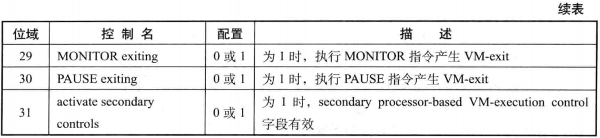

- 1 概述
    - 1.1 Pin-based VM-execution control字段
        - 1.1.1 external-interrupt exiting
        - 1.1.2 NMI exiting
        - 1.1.3 Virtual NMIs
        - 1.1.4 activate VMX-preemption timer
        - 1.1.5 process posted-interrupts
    - 1.2 Processor-based VM-excution control字段
        - 1.2.1 primary processor-based VM-execution control字段
            - 1.2.1.1 interrupt-window exiting
            - 1.2.1.2 Use TSC offsetting
            - 1.2.1.3 HLT exiting
            - 1.2.1.4 INVLPG exiting
            - 1.2.1.5 MWAIT exiting
            - 1.2.1.6 RDPMC exiting
            - 1.2.1.7 RDTSC exiting
            - 1.2.1.8 CR3-load exiting
            - 1.2.1.9 CR3-store exiting
            - 1.2.1.10 CR8-load exiting
            - 1.2.1.11 CR8-sotre exiting
            - 1.2.1.12 Use TPR shadow
            - 1.2.1.13 NMI-window exiting
            - 1.2.1.14 MOV-DR exiting
            - 1.2.1.15 Unconditional I/O exiting
            - 1.2.1.16 Use I/O bitmap
            - 1.2.1.17 Monitor Trap flag
            - 1.2.1.18 Use MSR bitmap
            - 1.2.1.19 MONITOR exiting
            - 1.2.1.20 PAUSE exiting
            - 1.2.1.21 activate secondary controls
        - 1.2.2 secondary processor-based VM-execution control字段
            - 1.2.2.1 virtualize APIC accesses
            - 1.2.2.2 enable EPT
            - 1.2.2.3 descriptor-table exiting
            - 1.2.2.4 enable RDTSCP
            - 1.2.2.5 virtualize x2APIC mode
            - 1.2.2.6 enable VPID
            - 1.2.2.7 WBINVD exiting
            - 1.2.2.8 unrestricted guest
            - 1.2.2.9 APIC-register virtualization
            - 1.2.2.10 virtual-interrupt delivery
            - 1.2.2.11 PAUSE-loop exiting
            - 1.2.2.12 RDRAND exiting
            - 1.2.2.13 enable INVPCID
            - 1.2.2.14 enable VM functions
    - 1.3 execption bitmap字段
    - 1.4 PFEC_MASK与PFEC_MATCH字段
    - 1.5 I/O bitmap address字段
    - 1.6 TCS offset字段
    - 1.7 guest/host mask与read shadow字段
    - 1.8 CR3-target字段
    - 1.9 APIC-access address字段
    - 1.10 Virtual-APIC address字段
    - 1.11 TPR threshold字段
    - 1.12 EOI-exit bitmap字段
    - 1.13 posted-interrupt notification vector字段
    - 1.14 posted-interrupt descriptor address字段
    - 1.15 MSR bitmap address字段
    - 1.16 executive-VMCS pointer
    - 1.17 EPTP字段
    - 1.18 Virtual-processor identifier字段
    - 1.19 PLE_Gap与PLE_Window字段
        - 1.19.1 PLE_Gap值
        - 1.19.2 PLE_window值
    - 1.20 VM-function control字段
    - 1.21 EPTP-list address字段

# 1. 概述

VM-execution控制类字段主要控制处理器在VMX non-root operation模式下的行为能力，典型地可以控制某些条件引发VM-exit事件，也控制着VMX的某些虚拟化功能的开启，例如APIC的虚拟化及EPT机制。

VM-execution控制类字段包括下面所列举的26个项目：
1. Pin-based VM-execution control字段
2. Processor-based VM-execution control字段
3. Secondary processor-based VM-execution control字段
4. Exception bitmap字段，PFEC\_MASK及PFEC\_MATCH字段
5. I/O bitmap A address及I/O bitmap B address
6. TSC offset字段
7. CR0 guest/host mask字段
8. CR0 read shadow字段
9. CR4 guest/host mask字段
10. CR4 read shadow字段
11. CR3-target count字段
12. CR3-target value 0、CR3-target value 1、CR3-target value 2及CR3-target value 3字段
13. APIC-access address字段
14. Virtual-APIC address字段
15. TPR threshold字段
16. EOI-exit bitmap 0、EOI-exit bitmap 1、EOI-exit bitmap 2及EOI-exit bitmap 3字段
17. Posted-interrupt notification vector字段
18. Posted-interrupt descriptor address字段
19. MSR bitmap address字段
20. Executive-VMCS pointer字段
21. EPTP字段
22. Virtual-processor identifier字段
23. PLE_Gap字段
24. PLE_Window字段
25. VM-function control字段
26. EPTP-list address字段

Pin-based VM-execution control字段、Primary processor-base VM-execution control字段、Secondary processor-based VM-execution control字段是32位向量值，每个字段提供最多32个功能控制。

在VM-entry时，处理器检查这些字段。如果检查不通过，产生VMfailValid失败。在VM-exit信息区域的VM-instruction error字段里保存指令错误吗，接着执行VMLAUNCH或VMRESUME指令的下一条指令。

## 1.1 Pin-based VM-execution control字段

Pin-based VM-execution control字段提供基于处理器Pin接口的控制（INTR与NMI），也就是与外部中断和NMI相关的配置（包括一些特色功能），如下表所示。


在这个字段中：
- bits[2:1]及bit[4]属于default1位（保留位为1）。
- bits[31:8]属于default0位（保留位为0）。

软件需要根据IA32\_VMX\_PINBASED\_CTLS与IA32\_VMX\_TRUE\_PINBASED\_CTLS寄存器来确定。

### 1.1.1 external-interrupt exiting

当"external-interrupt exiting"为1时，处理器接收到一个**未被阻塞**的external-interrupt请求时将产生VM-exit。

> 注意：IF标志位不能影响VM-exit（即使IF=0），但是处理器的shutdown及wait-for-SIPI状态能阻塞外部中断产生VM-exit。

另外，local APIC的本地中断能被LVT mask位（bit 16）及TPR寄存器屏蔽，而使用Fixed delivery模式的IPI能被TPR寄存器屏蔽。在这种情况下不能产生VM-exit。

当"external-interrupt exiting"为0时，未被屏蔽与阻塞的外部中断则通过guest-IDT提交给处理器执行中断服务例程。

当VM-exit control字段中的"acknowledge interrupt on exit"也为1时，在退出VM时，处理器会响应中断控制器取得中断向量号，并在VM-exit interruption information字段中保存这个中断向量号及中断类型等信息。

Vm-exit将返回VMM，处理器会**自动清EFLAGS寄存器**（除了bit1固定为1值外）。这个特定使得VMM能够夺取外部中断的delivery。当"acknowledge interrupt on exit"为0时，VMM使用STI指令重新打开interrupt-window时，处理器会响应这个外部中断并取得中断向量号，然后通过host-IDT来提交中断处理。

### 1.1.2 NMI exiting

- 当"NMI exiting"为1，并且不存在"blocking by NMI"阻塞状态时，VMX non-root operation内收到NMI将引发VM-exit产生。
- 当"NMI exiting"为0，通过guest-IDT的vector2来提交NMI处理。

### 1.1.3 Virtual NMIs

只有"NMI exiting"为1时，"virtual NMIs"位才能被置1。

当"virtual NMIs"位为1时，产生了一个Virtual-NMI的概念。interruptibility-state字段的"blocking by NMI"位此时被视为"blocking by virtual-NMI"位，记录着Virtual-NMI是否被阻塞。

Virtual-NMI的delivery是通过**事件注入**方式实现的。当注入一个Virtual-NMI时，如果这个Virtual-NMI在delivery期间遇到一个错误导致VM-exit，此时"blocking by virtual-NMI"位被置位，指示virtual-NMI被阻塞。

"NMI exiting"位影响到IRET指令对NMI与Virtual-NMI阻塞状态的解除作用：
1. 当"NMI exiting"为1时，由于发生NMI会发生VM-exit，IRET指令不能被认为在NMI服务例程内执行。因此，IRET指令的执行对NMI阻塞状态不产生影响。
2. 当"NMI exiting"为0时，处理器认为IRET指令**可能会在NMI服务例程内执行**。因此，IRET指令的执行将解除NMI阻塞状态。
3. 另一方面，一个Virtual-NMI（"NMI exiting"与"Virual NMIs"同时为1时）被提交处理器执行，IRET指令的执行页将解除Virtual-NMI的阻塞状态。

primary processor-based VM-execution control字段的"NMI-window exiting"位页使用在Virtual-NMI上，该控制位指示Virtual-NMI的窗口区域。只有"virtual-NMIs"为1时，"NMI-window exiting"才能被置位。如果"NMI-window exiting"位为1，那么在"blocking by NMI"为0时，完成VM-entry后直接引发VM-exit。

### 1.1.4 activate VMX-preemption timer

当"activate VMX-preemption timer"位为1时，启用VMX提供的定时器功能。
VMM需要在VMX-preemption timer value字段里为VM提供一个计数值。
这个计数值在VM-entry操作开始就进行递减，当减为0时产生VM-exit。
递减的步伐依赖于TCS及IA32\_VMX\_MISC[4:0]值。

### 1.1.5 process posted-interrupts

当"process posted-interrupts"位为1时，启用posted-interrupts processing机制处理器virtual-interrupt的delivery。

只有在下面的位都为1的前提下，"process posted-interrupts"位才能被置1：
- "external-interrupt exiting"位
- VM-exit control字段的"acknowledge interrupt on exit"位
- secondary processor-based VM-execution字段的"virtual-interrupt delivery"位

在一般情况下，由于"external-interrupt exiting"位为1，那么收到一个外部中断将会产生VM-exit。
在posted-interrupts processing机制下，允许收到被称为**通知中断**的外部中断而不产生VM-exit，
继续进行虚拟中断deliver的相关处理。这个通知中断向量号需要提供在posted-interrupt notification vector字段里。

## 1.2 Processor-based VM-excution control字段

Processor-based控制字段提供基于处理器层面上的控制，两个这样的控制字段如下：
- primary processor-based VM-execution control字段
- secondary processor-based VM-execution control字段

这两个字段是32位向量值，每一位都以对应一个功能控制。在进入VMX non-root operation模式后，它们控制着虚拟处理器的行为。
primary processor-based VM-execution control字段与一个TRUE寄存器对应，
而secondary processor-based VM-execution control字段无须TURUE处理器控制。

### 1.2.1 primary processor-based VM-execution control字段

处理器VMX non-root operation模式下的主要行为由这个字段控制，它的bit 31也控制是否启用secondary processor-based VM-execution control字段。

这个字段部分保留位为default1（固定为1值），部分保留位为default0（固定为0值）。需要通过IA32\_VMX\_PROCBASED\_CTLS或IA32\_VMX\_TRUE\_PROCBASED\_CTLS寄存器来决定。




- bit[1]，bits[6:4]，bit[8]，bits[14:13]及bit[26]固定为1值。
- bit[0]及bits[18:17]固定为0值。

其余可设置为0或1值，即关闭和开启某项控制。

#### 1.2.1.1 interrupt-window exiting

所谓的"interrupt-window"是指外部中断可以被响应的一个有效区间。也就是eflags.IF=1并且没有"blocking by MOV-SS"或"blocking by STI"这两类阻塞时。

有两个术语可以应用于interru-window上：
- **打开中断窗口**，是指在eflags.IF=0时，使用STI指令开启中断许可。那么，中断窗口的有效区间是：从STI指令的**下一条指令执行外部**开始直到使用CLI或POPF指令**关闭中断**为止。
- **闭合中断窗口**，是指使用CLI或POPF指令关闭中断许可。

```asm
    ......                  ; IF=0
    sti                     ; 打开interrupt-window
    mov eax, 1              ; blocking by STI
    ......                  ; 此时，产生VM-exit，eax=1
```
在上面的示例代码中，假设STI指令之前eflags.IF=0，STI指令的下一条指令存在"blocking by STI"阻塞状态。
直到下一条指令执行完毕后，中断窗口才算有效。在中断窗口区间内，当"interrupt-window exiting"为1时就会产生VM-exit。

另一种情形时：当IF=1，"interrupt-window exiting"为1并且"blocking by STI"和"bolcking by MOV-SS"为0时，
VM-entry完成后立即产生VM-exit。如果此时"bolcking by STI"或者"blocking by MOV-SS"为1，在VM-entry完成
后执行guest的第一条指令后产生VM-exit。

#### 1.2.1.2 Use TSC offsetting

当"Use TSC offsetting"为1时，在VMX non-root operation中使用RDTSC，RDTSCP或者RDMSR指令读取TSC值，将返回TSC加上一个偏移值。这个偏移值在TSC offset字段中设置。

#### 1.2.1.3 HLT exiting

当"HLT exiting"为1时，在VMX non-root operation中执行HLT指令将产生VM-exit。

#### 1.2.1.4 INVLPG exiting

当"INVLPG exiting"为1时，在VMX non-root operation中执行INVLPG指令将产生VM-exit。

#### 1.2.1.5 MWAIT exiting

当"MWAIT exiting"为1时，在VMX non-root operation中执行MWAIT指令将产生VM-exit。

#### 1.2.1.6 RDPMC exiting

当"RDPMC exiting"为1时，在VMX non-root operation中执行RDPMC指令将产生VM-exit。

#### 1.2.1.7 RDTSC exiting

当"RDTSC exiting"为1时，在VMX non-root operation中执行RDTSC指令将产生VM-exit。

#### 1.2.1.8 CR3-load exiting

当"CR3-load exiting"为1时，在VMX non-root operation中使用MOV to CR3指令来写CR3寄存器时，将根据CR3-target value与CR3-target count字段的值来决定是否产生VM-exit。

当前VMX架构支持4个CR3-traget value字段，CR3-target count字段值指示前N个CR3-target value有效（N <= 4），那么：
- 当写入CR3寄存器的值等于这个N个CR3-target value字段中的其中一个值时，不会产生VM-exit。
- 如果写入CR3寄存器的值不匹配这N个CR3-target value字段中任何一个值或者CR3-target count字段值为0时（N = 0），将产生VM-exit。

当"CR3-load exiting"为0时，向CR3寄存器写入值不会产生VM-exit。

#### 1.2.1.9 CR3-store exiting

当"CR3-store exiting"为1时，在VMX non-root operation中使用MOV from CR3指令读CR3寄存器将产生VM-exit。

#### 1.2.1.10 CR8-load exiting

当"CR8-load exiting"为1时，在VMX non-root operation中使用MOV to CR8指令写CR8寄存器将产生VM-exit。

#### 1.2.1.11 CR8-sotre exiting

当"CR8-store exiting"为1时，在VMX non-root operation中使用MOV from CR8指令读CR8寄存器将产生VM-exit。

#### 1.2.1.12 Use TPR shadow

当"Use TPR shadow"为1时，将启用**virtual-APIC page**页面，在virtual-APIC address字段里提供一个物理地址作为4K的虚拟local APIC页面。

Virtual-APIC page是为了虚拟化local APIC而存在，是物理平台上local APIC页面的一个shadow。
在Virtual-APIC age里存在VTPR、VPPR、VEOI等虚拟local APIC寄存器。

#### 1.2.1.13 NMI-window exiting

只有在"NMI exiting"以及"virtual-NMIs"都为1时，"NMI-window exiting"才能被置位。
这个位实际上被作为**virtual-NMI window exiting**控制位。
NMI-window是指在没有virtual-NMI被阻塞的情况下，即"bocking by NMI"清0时。

当"NMI-window exiting"为1时，在没有virtual-NMI被阻塞的情况下，VM-entry操作完成后将直接引发VM-exit。

#### 1.2.1.14 MOV-DR exiting

当"MOV-DR exiting"为1时，在VMX non-root operation中执行MOV指令对DR寄存器进行访问将产生VM-exit（读或写）。

#### 1.2.1.15 Unconditional I/O exiting

当"Unconditional I/O exiting"为1时，在VMX non-root operation中执行IN/OUT（包括INS/OUTS类）指令将产生VM-exit。
当"Use I/O bitmap"位为1时，此控制位的作用被忽略。

#### 1.2.1.16 Use I/O bitmap

当"Use I/O bitmap"为1时，需要在I/O-bitmap A address及I/O-bitmap B address这两个字段中提供物理地址作为4K的I/O bitmap。

- I/O bitmap A对应端口0000H 到 7FFFH。
- I/O bitmap B对应端口8000H 到 FFFFH。

当使用I/O bitmap时，将忽略"Unconditional I/O exiting"控制位的作用。
I/O bitmap的某个bit为1时，该访问该位对应的端口将产生VM-exit。

#### 1.2.1.17 Monitor Trap flag

当"Monitor Trap flag"为1时，在VM-entry完成后将pending MTF VM-exit事件。
在guest的第一条指令执行完毕后将产生一个**MTF VM-exit**事件，也就是由MTF（Monitor trap flag）引发的VM-exit。

#### 1.2.1.18 Use MSR bitmap

当"Use MSR bitmap"为1时，需要在MSR bitmap address字段中提供一个物理地址作为4K的MSR bitmap区域。
MSR bitmap的某位为1时，访问该位对应的MSR则产生VM-exit。

#### 1.2.1.19 MONITOR exiting

当"MONITOR exiting"为1时，在VMX non-root operation中执行MONITOR指令将产生VM-exit。

#### 1.2.1.20 PAUSE exiting

当"PAUSE exiting"为1时，在VMX non-root operation中执行PAUSE指令将产生VM-exit。

#### 1.2.1.21 activate secondary controls

当"activate secondary controls"为1时，将启用secondary processor-based VM-execution control字段，这个字段提供基于处理器层面上的扩展控制措施。这个字段中所有控制位在"activate secondary controls"为0时属于关闭状态。

### 1.2.2 secondary processor-based VM-execution control字段

随着处理器架构的不断发展，一些新的VMX架构功能也可能被不断地加入。这个字段就用于提供这些扩展的控制功能，
或者说新的VMX功能，如下表所示。只有在primary processor-based VM-execution control字段的"activate secondary controls"位为1时才有效。否则，全部控制位关闭。


这个字段的保留位为default0（固定为0值）。软件通过IA32\_VMX\_PROCBASED\_CTLS2寄存器来检查支持哪个控制位。
当primary processor-based VM-execution control字段的"activate secondary control"控制位为0时，这个字段无效。

#### 1.2.2.1 virtualize APIC accesses

当"virtualize APIC accesses"为1时，将实施local APIC访问的虚拟化。它引入了一个被称为**APIC-access page**的4K页面，这个APIC-access page的物理地址必须提供在APIC-access address字段里。

启用local APIC的访问虚拟化后，guest软件访问APIC-access page页面将产生VM-exit，或者访问到virual-APIC page内的数据，这取决于"use TPR shadow"及"APIC-register virtualization"控制位。

这里需要清楚地理解**访问APIC-access page**的三种方式：
1. **线性地址访问**：线性地址转换的物理地址落在APIC-access page内。
2. **guest-physical address访问**：在启用EPT机制时，guest-physical address转换的物理地址落在APIC-access page内，但这个guest-physical address并不是由线性地址转换而来的。
3. **physical address访问**：直接访问的物理地址落在APIC-access page内，这个物理地址并不是由线性地址转换而来的，也不是由guest-physical address转换而来的。

使用线性地址访问APIC-access page将实施虚拟化，guest-physical address访问APIC-access page则产生VM-exit。
而physical address访问APIC-access page是一种不正确的行为，可能引发VM-exit，也可能访问到Virtual-APIC page内的数据。

guest-physical address访问APIC-access page的情形：
- 在PAE分页模式下，执行MOV to CR3指令更新CR3寄存器时会引起PDPTEs加载。CR3寄存器存放的guest-physical address转换为物理地址落入APIC-access page内。
- 在线性地址的转换过程中，由guest paging-structure结构内的guest-physical address基地址访问了APIC-access page内的物理地址。例如，guest-PDE内的guest-PT基址转换的物理地址落入了APIC-access page内。
- 处理器在更新guest paging-structure表项的access或dirty位时，访问了APIC-access page内的物理地址。例如，更新guest-PTE的dirty位时，guest-PTE的地址属于guest physical address，它转换为物理地址后落入APIC-access page内。

guest-physical address访问APIC-access page的途径：
- 在启用EPT机制时，由EPT paging-structure结构访问了APIC-access page，或者处理器更新EPT paging-structure表项的access或dirty位时访问了APIC-access page。
- 未启用EPT机制时，PAE分页模式下由执行MOV to CR3指令而引起PDPTEs加载访问了APIC-access page。或者由pageing-structure结构访问了APIC-access page，或者处理器更新pageing-structure表项的access或dirty位时访问了APIC-access page。
- 由于访问了VMCS区域（即VMCS区域落入ACIC-access page内），或者访问的VMCS区域内所引用的数据结构（例如，MSR bitmap，I/O bitmap等）的物理地址落在APIC-access page内。

#### 1.2.2.2 enable EPT

当"enable EPT"为1时，启用EPT（Extended Page Table，扩展页表）机制。于是产生了GPA（guest-physical address）和HPA（host-physical address）两个概念。

- guest-physical address，这是guest软件使用的物理地址，但这并不是真正的平台上的物理地址。在启用EPT机制后，VM有独立的guest-physical address空间，每个VM之间的GPA空间互不干扰。在启用分页时，guest软件的线性地址首先需要转换为GPA，最后GPA必须通过EPT转换为最终的平台上的物理地址。
- host-physical address，这是物理平台上的地址。在未启用EPT机制时，guest软件的物理地址就是host-physical address。在启用EPT机制时，guest软件的物理地址是guest-physical address，而host软件的物理地址是host-physical address。VMM软件使用的是host-physical address。

由于这两种物理地址的出现，在guest软件的线性地址转换过程中又产生了与这两种物理地址相应的页转换表结构：
- guest paging-structure，这个页表结构存在于guest端，它是x86/x64体系开启分页机制下的产物，用来将线性地址转换为物理地址。但在guest中，线性地址通过guest paging-structure转换为guest-physical address，而不是真正的平台物理地址。
- EPT paging-structure，这个页表结构只能由VMM进行设置，它的作用是将guest-physical address转换为host-physical address。guest软件并不知道它的存在，因此guest软件不能设置EPT paging-structure。

guest-physical address和host-physical address的产生是为了实现CPU的内存虚拟化管理。
每个VM由自己独立的内存空间而不受VMM或其他VM的干扰。

当"unrestricted guest"位为1时，"enable EPT"位必须为1。表明如果guest使用物理地址，必须启用内存虚拟化。

#### 1.2.2.3 descriptor-table exiting

当"descriptor-table exiting"为1时，VMX non-root operation内使用LGDT，LIDT，LLDT，LTR，SGDT，SIDT，SLDT及STR指令来访问描述符表寄存器将产生VM-exit。

#### 1.2.2.4 enable RDTSCP

当"enable RDTSCP"为1时，VMX non-root operation内允许使用RDTSCP指令。为0时，执行RDTSCP指令将产生#UD异常。

#### 1.2.2.5 virtualize x2APIC mode

当"virualize x2APIC mode"为1时，启用访问x2APIC模式的虚拟化。Guest软件使用RDMSR和WRMSR指令访问x2APIC MSR时将产生VM-exit，或者访问到virtual-APIC page页面内的数据。

- "virtualize x2APIC mode"为1时，"virtualize APIC accesses"必须为0值。
- "use TPR shadow"为0时，"virtualize x2APIC mode"必须为0值。

#### 1.2.2.6 enable VPID

当"enable VPID"为1时，允许为线性地址转换cache提供一个VPID（Virtual Processor Identifier，虚拟处理器ID）值。线性地址转换cache能缓存两类信息：
1. EPT机制未启用时，线性地址转换为物理地址的linear mappings。
2. EPT机制启用时，线性地址转换为HPA的combined mappings。

VPID为每个虚拟处理器定义了一个**虚拟处理器域**的概念，即：每次VM-entry时，为虚拟处理器在virual-processor identifier字段中提供一个VPID值。这个VPID值将对应该虚拟处理器下的所有线性地址转换cache。

INVVPID指令可以用来刷新VPID值对应的所有线性地址转换cache，包括linear mappings（线性映射）级combined mappings（合并映射）。

#### 1.2.2.7 WBINVD exiting

当"WBINVD exiting"为1时，VMX non-root operation内执行WBINVD指令将产生VM-exit。

#### 1.2.2.8 unrestricted guest

当"unrestricted guest"为1时，支持guest使用**非分页的保护模式**或者**实模式**。
在VM-entry时，当"unrestricted guest"为1时，处理器忽略CR0字段PE、PG位的检查。但是，当PG位为1时，PE位必须为1。

> 注意：在"unrestricted guest"为1时，"enable EPT"也必须为1。否则，在VM-entry时会产生VMfailValid失败，在VM-instruction error字段里指示"由于无效的control字段导致VM-entry失败"。如果"unrestricted guest"与VM-entry control字段的"IA-32e mode guest"位同时为1时，处理器会分别执行它们各自对应的检查。例如"enable EPT"和guest-state区域CR0字段的PG位必须为1。

启用unrestricted guest功能（"IA-32e mode guest"此时为0）后，guest在运行过程中可能会切换到IA-32e模式后产生VM-exit。
基于这种考虑，VMX架构支持在VM-exit时处理器自动将当前的IA32\_EFER.LMA值写入VM-entry control字段的"IA-32e mode guest"控制位，用来记录guest是否运行在IA-32e模式里。

此时，会导致"IA-32e mode guest"与"unrestricted guest"位同时为1值。VM-exit control字段的"save IA32\_EFER"为1时，guest IA32\_EFER字段也会得到正确更新。下一次重新进入VM时，VMM无须进行额外的检查和设置，就能保证正确进入guest的IA-32e模式运行环境。

#### 1.2.2.9 APIC-register virtualization

当"APIC-register virtualization"为1时，表明启用local APIC寄存器的虚拟化。软件使用线性地址访问APIC-access page时，会访问到virtual-APIC page内相应的虚拟local APIC寄存器。

> 注意：virtual-APIC page是物理local APIC的一份shadow页面，包括VPTR，VEOI，VISR，VIRR等虚拟local APIC寄存器。

例如，guest软件使用线性地址访问APIC-access page内偏移量20H的位置，将访问到virtual-APIC page内偏移量20H位置上的值（对应APIC ID寄存器），返回一个虚拟local APIC的APIC ID值。
如果"APIC-register virtualization"为0，则表明没有local APIC寄存器虚拟化（除了TPR外），此时访问20H偏移量的值，将会产生VM-exit。

#### 1.2.2.10 virtual-interrupt delivery

只有在"external-interrupt exiting"为1时，才允许设置"virtual-interrupt delivery"位。因此"virtual-interrupt delivery"为1时，一个外部中断请求将产生VM-exit。
可是当改写虚拟local APIC的状态时（包括VPTR，VEOI，VICR），虚拟中断将被评估是否可以delivery。
若此时虚拟中断经评估后允许delivery，则提交到处理器执行。

改写虚拟local APIC状态，也就是前面所述的通过"线性地址写APIC-access page"内的值，最终将改写virtual-APIC page内的虚拟local APIC寄存器值。
只有写VTPR（virtual-TPR），VEOI（virtual-EFI）、VICR-low（virtual-ICR低32位）寄存器才可能发生**虚拟中断的评估与delivery**。

启用posted-interrupt processing机制也可能发生"虚拟中断的评估与delivery"操作。

此外，当"virtual-interrupt delivery"为1时，在VM-entry时也会进行虚拟中断的评估与delivery。
虚拟中断delivery功能在较新的处理器上才支持。软件需要通过IA32\_VMX\_PROCBASED\_CTLS[9]位检查是否支持该功能。

如果不支持该功能，或者"virtual-interrupt delivery"为0，改写VEOI与VICR寄存器状态时最终将产生VM-exit。
而VTPR是个例外，改写VPTR值将写入VPTR。

#### 1.2.2.11 PAUSE-loop exiting

在"PAUSE exiting"为1时，"PAUSE-loop exiting"的作用被忽略。此外，在CPL为非0的情况下也被忽略。

当"PAUSE exiting"为0，"PAUSE-loop exiting"为1，并且CPL=0时，处理器发现PAUSE指令在**PAUSE-loop**里执行的时间超过VMM设置的**PLE_window**值，就会产生VM-exit。PLE\_window是PAUSE指令在一个循环（PAUSE-loop）里的执行时间的上限值。

PAUSE-loop的检测由PLE\_Gap值来决定。这个PLE\_Gap值设置了两条PAUSE指令之间执行时间间隔的上限值，它用来检测PAUSE指令是否出现在一个循环里。

#### 1.2.2.12 RDRAND exiting

当"RDRAND exiting"为1时，在VMX non-root operation中执行RDRAND指令将产生VM-exit。

#### 1.2.2.13 enable INVPCID

当"enable INVPCID"为1时，在VMX non-root operation中允许执行INVPCID指令，否则将产生#UD异常。

#### 1.2.2.14 enable VM functions

当"enable VM functions"为1时，允许在VMX non-root operation中执行VMFUNC指令，而不会产生VM-exit。同时也只是"VM-functions controls"字段有效。

## 1.3 execption bitmap字段

execption bitmap字段是一个32位值，每个位对应一个异常向量。例如，bit 13对应#GP异常（向量号为13），bit 14对应#PF异常（向量号为14）。

在VMX non-root operation中，如果发生异常，处理器检查exception bitmap相应的位，该位为1时将产生VM-exit，为0时则正常通过guest-IDT执行异常处理例程。当一个**triple-fault**发生时，将直接产生VM-exit。

## 1.4 PFEC_MASK与PFEC_MATCH字段

对于#PF异常的VM-exit处理有些特殊，允许根据引发#PF异常的条件进行筛选。
引入两个32位的字段PFEC\_MASK（page-fault error-code mask）与PFEC\_MATCH（page-fault error-code match），这两个字段决定如何进行筛选。

当#PF发生时，产生的#PF异常错误码（PFEC）格式如下图所示。


错误码的bits[4:0]指示#PF产生的原因，如下所示。
- P位（bit0）：为0时，指示#PF由not-present而引发。为1时，说明由其他条件引发。
- W/R位（bit1）：为0时，表示#PF发生时进行了读访问。为1时，表示#PF发生时进行了写访问。
- U/S位（bit2）：为0时，表示#PF发生时当前运行在supervisor权限。为1时，表示#PF发生时当前运行在User权限。
- RSVD位（bit3）：为0时，保留位正常。为1时，指示保留位为1。
- I/D位（bit4）：为0时，说明#PF发生在fech data。为1时，指示在fetch instruction时引发#PF异常。

#PF的错误码实际上描述了#PF异常发生时的访问细节。举例来说，如果错误码的值为03H，说明#PF发生时的情况是：
1. P=1
2. W/R=1，正在写访问
3. U/S=0，处于supervisor权限
4. RSVD=0，保留位正常
5. I/D=0，非执行指令

在PFEC\_MASK与PFEC\_MATCH的控制下，结合PFEC有下面两种情形：
1. PFEC & PFEC\_MASK等于PFEC\_MATCH时，产生VM-exit。
2. PFEC & PFEC\_MASK不等于PFEC\_MATCH时，不会产生VM-exit。

前面的例子（错误码为03H）中，如果希望在non-present时产生VM-exit，则设置PFEC\_MASK为01H值，
而PFEC\_MATCH为0值。如果希望在访问时产生VM-exit则设置PFEC\_MASK为02H，而PFEC\_MATCH为0H。

如果需要所有的#PF异常都产生VM-exit，可以设置PFEC\_MASK与PFEC\_MATCH都为0值。
而如果希望所有的#PF都不产生VM-exit，可以设置PFEC\_MASK为0值，PFEC\_MATCH为FFFFFFFFh值（任何一个非0值都可以）。

## 1.5 I/O bitmap address字段

当"use I/O bitmap"控制位为1时，使用I/O bitmap来控制I/O指令对I/O地址的访问。
I/O bitmap的每个位对应一个I/O地址，当位为1时，访问相应的I/O地址将产生VM-exit。
此外，使用I/O bitmap将忽略"unconditional I/O exitting"控制位的作用。

VMM需要在I/O bitmap address字段中提供I/O bitmap物理地址。在x86/x64体系中共有64K I/O空间，地址从0000H到FFFFh。那么，64K个地址需要有8K字节来对应。
VMX架构里提供了两个I/O bitmap address字段（A与B）。I/O bitmap A对应I/O地址从0000H到7FFFH，I/O bitmap B对应I/O地址从8000H到FFFFH。

## 1.6 TCS offset字段

当"use TSC offsetting"为1时，在TSC offset字段中提供一个64位的偏移值。在VMX non-root operation中执行RDTSC，RDTSCP或者RDMSR指令读取TSC时，返回的值为TSC加上TSC offset。

前提条件是：
1. 使用RDSTC指令时，"RDTSC exiting"位为0值。
2. 使用RDTSCP指令时，"enable RDTSCP"位为1值。
3. 使用RDMSR指令时，MSR read bitmap相应位为0值。

## 1.7 guest/host mask与read shadow字段

有如下两组guest/host mask与read shadow字段：
1. CR0寄存器的guest/host mask与read shadow字段。
2. CR4寄存器的guest/host mask与read shadown字段。

这些字段是natural-width类型的字段，在64位架构处理器上是64位宽，否则为32位宽。
guest/host mask每个位有如下两层意义：
1. 位为1时，表示该位权限属于host所有。
2. 位为0时，表示该位guest有权设置。

- **位属于host**
    - guest读该位时，则返回read shadow对应位的值。
    - guest写该位时，如果写入的值不等于read shadow相应位的值，则产生VM-exit。

- **位guest有权设置**
    - 当guest读该位时，返回CR0/CR4寄存器该位的值。
    - 当guest写该位时，CR0/CR4寄存器该位的值将被写入。

    guest读写该位反映在真实的寄存器上，不会产生VM-exit。

举个例子来说明位的host与guest权利。假设CR4 guest/host mask为00002021H值，CR4 read shadow为00002020H值，而CR4寄存器的值为00002220H。此时，CR4寄存器的bit0，bit5以及bit 13属于host权利，其余位则guest有权利。
```asm
    mov eax, cr4            ; 返回00002220h
    mov eax, 2024h          ; bit 2 = 1
    mov cr4, eax            ; cr4 被写入00002024h值
    mov eax, 2021h          
    mov cr4, eax            ; 失败，产生VM-exit
```

当读CR4寄存器时，将返回00002220h值。返回的bit0，bit5及bit13来自read shadow字段对应的bit0，bit5及bit13，而bit9则来自CR4寄存器的bit9。

当向CR4寄存器写入00002024h值时，由于bit2属于guest由权利，所以bit2值能写入CR4寄存器。
并且bit0，bit5及bit13的值等于read shadow字段对应位的值，所以这个写入是成功的。

当向CR4寄存器写入00002021h值时，由于bit0属于host权利，并且写入值的bit0不等于read shadow字段的bit0值，因此，这个写入失败将产生VM-exit，CR4寄存器的值不变。
  
## 1.8 CR3-target字段

这是一组字段，包括**CR3-target count**字段与4个**CR3-target value**字段（从CR3-target value 0 到CR3-target value3字段）。当前VMX实现的版本最多支持4个CR3-target value值。软件可以查询IA32\_VMX\_MISC[24:16]的值来获得支持CR3-target value的数量。

若写入CR3-target count字段的值大于4，VM-exit时会产生VMfailValid失败。指令错误编号为7，指示"由于无效的控制域字段导致VM-exit失败"。

在"CR3-load exiting"为1时，CR3-target count与CR3-target value将决定写CR3寄存器是否会产生VM-exit。
以CR3-target count字段作为N（N <= 4）：
1. 当向CR3写入的值等于这N个CR3-target值的其中一个时，不会产生VM-exit。
2. 当向CR3写入的值不等于N个CR3-target值中的任何一个时，则产生VM-exit。

N值将决定有几个CR3-target值可以用来做对比。例如CR3-target count设为3时，表示前3个CR3-target value字段的值被用来做对比。

## 1.9 APIC-access address字段

当"virtualize APIC accesses"为1时，APIC-access address字段有效，需要提供一个物理地址作为4K的**APIC-access page**页面。

guest软件线性访问这个区域内的地址时，将虚拟化这个访问行为。结果或者是产生VM-exit，或者virtual-APIC page内访问到虚拟local APIC的数据。

## 1.10 Virtual-APIC address字段

当"use TPR shadow"为1时，virtual-APIC address字段有效，需要提供一个物理地址为4K的**virtual-APC page**页面。

virtual-APIC page是物理平台上local APIC的一份shadow页面，VMM可以初始化和维护virtual-APIC page内的数据。
当"virtualize APIC access"与"use TPR shadow"都为1时，使用一个偏移值线性访问APIC-access page内的数据，
将会访问到virtual-APIC page内偏移值相同的数据。也就是：处理器对APIC-access page的访问转化为对virtual-APIC page的访问。

在"virtualize x2APIC mode"为1时，软件使用RDMSR与WRMSR指令来访问local APIC，最终也会转化对virtual-APIC page的访问。

在"APIC-registers virtualization"为1时，将虚拟化大部分的local APIC寄存器。此时，在virtual-APIC page内可以访问到这个虚拟local APIC寄存器，例如VIRR，VISR等。

## 1.11 TPR threshold字段

TPR threshold字段仅在"use TPR shadow"为1时有效。TPR threshold字段的bits[3:0]提供一个VTPR门坎值，bits[31:4]清为0值。

当写VPTR值，而VPTR[7:4]值低于TPR threshold的bits[3:0]时将产生VM-exit。

## 1.12 EOI-exit bitmap字段

这是一组64位宽的字段，共有4个EOI-exit bitmap，分别为：
1. EOI-exit bitmap 0，对应向量号从00H到3FH。
2. EOI-exit bitmap 1，对应向量号从40H到7FH。
3. EOI-exit bitmap 2，对应向量号从80H到BFH。
4. EOI-exit bitmap 3，对应向量号从C0H到FFH。

这些字段仅在"virtual-interrupt delivery"为1时有效，用于控制发送EOI命令时是否发生VM-exit。

- 当EOI-exit bitmap的位为1时，对应向量号的中断服务例程在发送EOI命令时，将产生VM-exit。
- 当EOI-exit bitmap的位为0时，则进行"虚拟中断的评估与delivery"，最终的结果可能是另一个虚拟中断被delivery执行。

## 1.13 posted-interrupt notification vector字段

在"process posted interrupt"为1时启用posted-interrupt processing机制。

"process posted-interrupts"可以被置位的前提是"external-interrupt exiting"与"virtual-interrupt delivery"都为1值。在一般情况下，guest收到外部中断请求时，要么全部引发VM-exit，要么全部deliver执行。

但是posted-interrupt processing机制允许处理器接收到一个**通知性质**的外部中断而不会产生VM-exit，其他的外部中断仍然会发生VM-exit。这个中断通知处理器进行下面的一些特殊的处理：
- 从一个被称为"posted-interrupt descriptor"的结构中读取预先设置好的中断向量号，并复制virtual-APIC page内的VIRR寄存器里，从而构成virtual-interrupt请求。
- 对virtual-interrupt进行评估。通过评估后，**未屏蔽的虚拟中断**将由guest-IDT进行deliver执行。

这个**通知性质的外部中断向量号**提供在posted-interrupt notification vector字段，这个字段为16位宽。
在使用posted-interrupt processing机制前，VMM需要设置这个通知中断向量号以供处理器进行检查对比。

## 1.14 posted-interrupt descriptor address字段

在posted-interrupt processing机制处理下，VMM在一个被称为"posted-interrupt descriptor"的数据结构里预先设置需要给guest传递执行的中断向量号。

Posted-interrupt descriptor address字段提供这个数据结构的64位物理地址。

## 1.15 MSR bitmap address字段

在"use MSR bitmap"为1时，使用MSR bitmap来控制对MSR的访问。当MSR bitmap的某位为1时，访问该位所对应的MSR将产生VM-exit。

MSR bitmap address字段提供MSR bitmap区域的64位物理地址。

MSR bitmap区域为4K大小，分别对低半部分和高半部分MSR的读及写访问：
1. 低半部分MSR read bitmap，对应MSR范围从00000000H到00001FFFH，用来控制这些MSR的读访问。定位在MSR bitmap的首个4K区域里。
2. 高半部分MSR read bitmap，对应MSR范围从C0000000H到C0001FFFH，用来控制这些MSR的读访问。定位在MSR bitmap的第2个1K区域里。
3. 低半部分MSR write bitmap，对应MSR范围从00000000H到00001FFFH，用来控制这些MSR的写访问。定位在MSR bitmap的第3个1K区域里。
4. 高半部分MSR write bitmap，对应MSR方位从C0000000H到C0001FFFH，用来控制这些MSR的写访问。定位在MSR bitmap的第4个1K区域里。

MSR bitmap的某位为0时，访问该位所对应的MSR不会产生VM-exit。

## 1.16 executive-VMCS pointer

这个字段用于SMM dual-monitor treatment（SMM双重监控处理）机制下，当发生SMM VM-exit时，这个字段用来保存executive-monitor的VMCS pointer。

由于SMM VM-exit可能发生在VMM中，因此，executive-VMCS pointer值可能等于VMXON pointer，也可能等于进入SMM-transfer monitor前的current-VMCS pointer。

处理器读取这个字段，用来决定从SMM是返回到VMM还是VM。如果返回到VMM，那么guest-state区域的VMCS-link pointer字段必须提供之前的current-VMCS pointer。

## 1.17 EPTP字段

在"enable EPT"为1时，支持guest端物理地址转换为host端的最终物理地址。
Guest段的物理地址被称为"guest-physical address"，而最终的物理地址被称为"host-physical address"。

EPT（Extended-Page Table，扩展页表）用于将guest-physical address转换为host-physical address。
EPT的使用原理和保护模式的分页机制下的页表是一样的。
VMX non-root operation内的保护模式分页机制的页表结构被称为**Guest paging-structure**，而EPT页表结构被称为**EPT paging-structure**。

64位的EPTP字段提供EPT PML4T表的物理地址，与分页机制下的CR3寄存器作用类似。它的结构如下图所示。


- bits[2:0]指示EPT paging-structure的内存类型（属于VMM管理的数据区域），当前只支持UC（值为0）与WB（值为6）类型。
- bits[5:3]指示EPT页表结构的层级，这个值加上1才是真正级数。例如，它的值为3时表示有4级页表结构。
- bit[6]为1时，指示EPT页表结构项里的access与dirty标志位有效（EPT表项的bit8与bit9）。处理器会更新EPT表项的这两个标志位。
- bits[N-1:12]提供EPT PML4T表的物理地址（N = MAXPHYADDR），这个值对齐在4K边界上。如果MAXPHYADDR为36，则bits[35:12]提供36位的物理地址的高24位。bits[N-1:12]的地址值也被称为**EP4TA**，作为一个**域标识**用于cache的维护操作。
- bits[11:7]与bits[63:N]是保留位，必须为0值。如果MAXPHYADDR为36，则bits[63:36]是保留位。

## 1.18 Virtual-processor identifier字段

当"enable VPID"为1时，virtual-processor identifier字段提供一个16位的VPID值。这个VPID用来表示虚拟处理器的cache域。
处理器会在cache中维护VPID对应的一份cache。
如果每次VM-exit使用不同的VPID值，这样就为VM指定多个虚拟处理器cache域。

处理器维护每个VPID值对应的一份cache信息。另外，VMX架构引入了INVVPID指令来刷新由VPID对应的cache信息。

## 1.19 PLE_Gap与PLE_Window字段

当"PAUSE-loop exiting"为1，"PAUSE exiting"为0并且CPL=0时，可以控制在包含PAUSE指令的一个循环里，当执行的时间超过设置的上限值后产生VM-exit。
由PLE\_Gap与PLE\_Window这两个32位的字段来共同决定PAUSE-loop exiting行为。

"PAUSE-loop exiting"功能的引进主要是解决在一个长时间的spin lock（自旋锁）等待循环里浪费处理器的时间。
在这个自旋锁等待循环里处理器可以产生VM-exit，从而去执行其他的任务。

```asm
    aquire_lock:
        bts DWORD [spin_lock], 0                    ; 尝试获取自旋锁，并上锁 bts(Bit Test and Set)
        jnc aquire_lock_ok                          ; 成功获取，转入下一步
        
    ; 失败后，下面不断地测试锁，直到锁打开
    test_lock:
        bt DWORD [spin_lock], 0                     ; 测试自旋锁是否打开 bt(Bit Test)
        jnc aquire_lock                             ; 如果锁已经放开，则再次尝试获取自旋锁
        pause
        jmp test_lock                               ; 如果锁还是被锁上，则不断进行检测
    
    ; 后续工作
    aquire_lock_ok:
        .....
        .....
```

上面的代码示例是一个典型自旋锁的**test-test-and-set指令序列**，PAUSE指令出现在测试循环里。
那么，处理器是如何知道PAUSE指令出现在一个循环呢？这是"PAUSE-loop exiting"功能的关键，PLE\_Gap字段就用来完成这项任务。

### 1.19.1 PLE_Gap值

PLE\_Gap用来检测PAUSE指令是否出现在一个循环里，它是两条PAUSE指令执行的时间间隔上限值。
当本次执行PAUSE指令与前一个执行PAUSE指令的时间间隔超过PLE\_Gap时，处理器就认为本次执行的PAUSE指令出现在一个新的循环（即**PAUSE-loop**）里。

如果这个**被认为出现在新的循环里的PAUSE指令**与**下一次执行PAUSE指令**的时间间隔又超过了PLE\_GAP值，那么，处理器会认为下一次执行的PAUSE指令又出现在另一个新的循环里。换言之，之前认为的哪个PAUSE-loop被作废！

周而复始，处理器使用这种方法不断地检测PAUSE-loop的存在。因此，也可能不断地刷新PAUSE-loop的位置（因为不可能不断有新的PAUSE-loop被确认）。

当处理器已经确认了PAUSE-loop的存在后，就会记录PAUSE-loop里的第一条PAUSE指令执行时的时间值。
这里，我们可以用一个变量**first_pause_time**来代表这个时间值。

```c
    /* 如果当前PAUSE指令执行时间与上次PAUSE指令执行时间间隔大于PLE_Gap值，
     * 则认为出现了PAUSE-loop
     */
    if ((current_pause_time - last_pause_time) > PLE_Gap) {
        // PAUSE-loop内的第一条PAUSE指令执行时间为当前PAUSE指令执行时间
        first_pause_time = current_pause_time;
    }
```
在上面C代码的描述里，current\_pause\_time是指本次PAUSE指令执行时的TSC（Time-stamp Counter）时间值。
last\_pause\_time是指上一次PAUSE指令执行的TSC时间值。当然，PLE\_Gap也是一个TSC时间值。

> 注意：PLE_Gap应该是一个很小的值。因为它是指一个循环里两条PAUSE指令执行时间间隔的最大值。而这个时间间隔的最大值。而这个时间间隔是非常短的。如果设置一个比较大的值，就失去了意义和作用。

### 1.19.2 PLE_window值

PLE\_window值用来决定什么时候产生VM-exit，也就是说guest允许在PAUSE-loop中执行多长时间。
它是从**first_pause_time**时间算起直到产生VM-exit的这段时间间隔的TSC值。

> 注意：PLE_window应该是一个较大的值（相对PLE_Gap来说）。因为，它指定了PAUSE-loop执行时间的长短。

接前面所述，当current\_pause\_time（本次PAUSE指令执行时间）与last\_pause\_time（上一次PAUSE指令执行时间）的时间间隔大于PLE\_Gap时，处理器认为本次PAUSE指令出现在一个新的PAUSE-loop里。

但是，当这个时间间隔小于等于PLE\_Gap时，处理器检查current\_pause\_time与first\_pause\_time（PAUSE-loop里第一条PAUSE指令执行时间）之间的时间间隔，如果大于PLE\_window值，将导致VM-exit发生。如果小于等于PLE\_window值，处理器继续执行spin lock等待循环，直到获得spin lock或者发生VM-exit。

```c
    /* 
     * 如果当前PAUSE指令执行时间与上次PAUSE指令执行时间间隔大于PLE_Gap值
     */
    if ((current_pasue_time - last_pause_time) > PLE_Gap) {
        // PAUSE-loop 内的第一条PAUSE指令执行时间为当前PAUSE指令执行时间
        first_pause_time = current_pause_time;
    } else {
        if ((current_pasue_time - first_pause_time) > PLE_window) {
            // 如果PAUSE当前时间与first_pause_time之间的间隔大于PLE_window值，则产生VM-exit
        }
    }
    
    // 注意：last_pause_time会被记录，更新为当前PAUSE指令执行时间
    last_pause_time = current_pasue_time;
```
上面的示例代码中，展示了处理器的"PAUSE-loop exiting"功能全貌。在guest中第一次执行PAUSE指令，他会满足(current\_pause\_time - last\_pause\_time) > PLE\_Gap的条件，找到PAUSE-loop，然后记录first\_pause\_time时间值。

当进入guest后，处理器认为第一次last\_pause\_time时间就是在VM-entry后（即作为首次执行PAUSE指令时间值）。
在随后的每次PAUSE指令执行时都会更新last\_pause\_time时间值。

## 1.20 VM-function control字段

当secondary processor-based VM-execution control字段的"enable VM functions"为1时，这个64位的VM-function control字段有效。它提供对VMFUNC指令在VMX non-root operation内的控制。

VM-functions control字段每个位对应一个VM功能号，最大功能号为63。VMFUNC指令执行时，VM功能号提供在EAX寄存器中，当提供的功能号大于63时，将产生#UD异常。


如上表所示，VMX当前支持0号功能，它是"EPTP switching"功能。字段的"EPTP swiching"位为1时，可以调用这个功能。

在VMX non-root operation内执行VMFUNC指令时，如果使用的功能号在VM-functions control字段相应位为0，将产生VM-exit。例如"EPTP switching"位为0，在执行VMFUNC指令（提供0号功能）时，将产生VM-exit。

软件应该检查IA32\_VMX\_VMFUNC寄存器，确定支持哪个VM功能号。IA32\_VMX\_VMFUNC寄存器在"enable VM functions"位允许被置位下有效。

## 1.21 EPTP-list address字段

在前面所述的VM-functions control字段"EPTP switching"位为1时，EPTP-list address字段有效，提供EPTP list表的64位物理地址。EPTP list表时4KB宽，EPTP list的每个表项为8字节，故共有512个表项。
每个表项就是一个EPTP值，如下图所示。


EPTP switching服务例程根据表项号读取EPTP值，并检查EPTP值。如果EPTP值有效，则写入VMCS的EPTP字段，更新cache的EP4TA域。EPTP值无效则产生VM-exit。

在调用这个例程时，EPTP list的表项号提供在ECX寄存器里，最大的表项号为511。
如果给ECX提供的表项号大于511，则产生VM-exit。