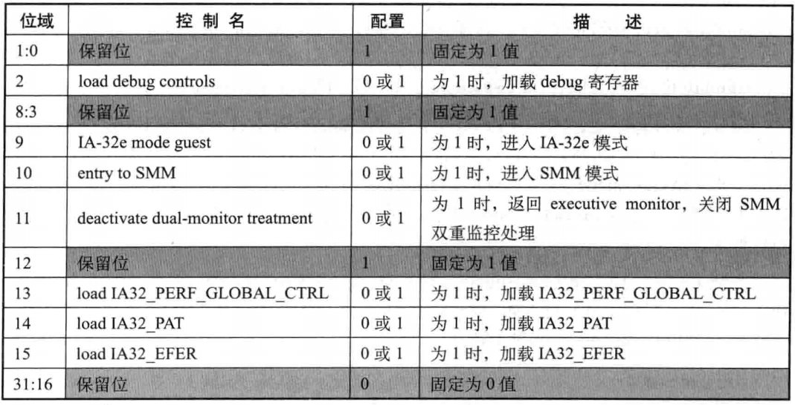
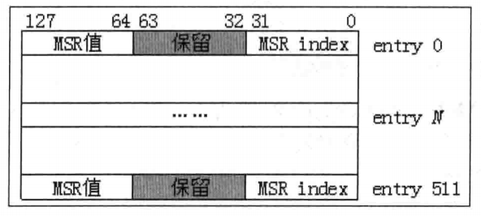
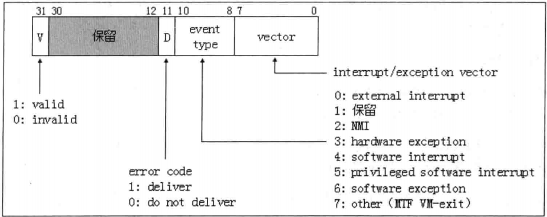
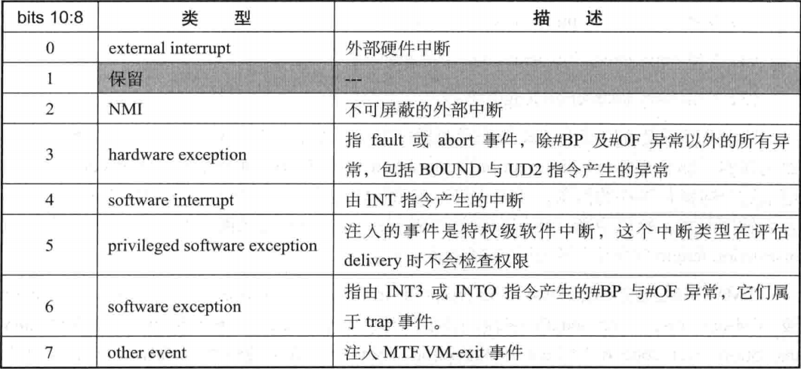

- 1 概述
    - 1.1 VM-entry control字段
        - 1.1.1 load debug controls
        - 1.1.2 IA-32e mode guest
        - 1.1.3 entry to SMM
        - 1.1.4 deactivate dual-monitor treatment
        - 1.1.5 local IA32_PERF_GLOBAL_CTLRL
        - 1.1.6 local IA32_PAT
        - 1.1.7 local IA32_EFER
    - 1.2 VM-entry MSR-load字段
    - 1.3 事件注入控制字段
        - 1.3.1 VM-entry interruption information字段
            - 1.3.1.1 外部中断（类型0）
            - 1.3.1.2 NMI（类型2）
            - 1.3.1.3 硬件异常（类型3）
            - 1.3.1.4 软件异常（类型6）
            - 1.3.1.5 软件中断（类型4）
            - 1.3.1.6 特权级软件中断（类型5）
            - 1.3.1.7 其他事件（类型7）
        - 1.3.2 VM-entry execption error code字段
        - 1.3.3 VM-entry instruction length字段

# 1. 概述

VM-entry区域的控制字段包括下面这些：
1. VM-entry control字段。
2. VM-entry MSR-load count字段。
3. VM-entry MSR-load address字段。
4. VM-entry interruption-information字段。
5. VM-entry execption error code字段。
6. VM-entry instruction length字段。

这些字段用来控制在VM-entry时处理器的行为。在VM-entry时，处理器检查这些字段。如果检查不通过，产生VMfailValid失败，在VM-instruction error字段中保存错误号，接着执行VMLAUNCH或VMRESUME指令下面的指令。

## 1.1 VM-entry control字段

VM-entry control字段是32位宽，每个位对应一个控制功能，如下表所示。

设置时，软件应通过IA32\_VMX\_ENTRY\_CTLS或IA32\_VMX\_TRUE\_ENTRY\_CTLS寄存器来检查当前VMX支持哪个功能，并且要确保保留位的设置是适当的。

- bits[1:0]，bits[8:3]以及bit 12时default1保留位，固定为1值。
- bits[31:16]是default0保留位，固定为0值。

### 1.1.1 load debug controls

当"load debug controls"为1，在VM-entry是将从guest-state区域的相应字段中加载DR7和IA32\_DEBUGCTL寄存器。否则不会加载。

### 1.1.2 IA-32e mode guest

当"IA-32e mode guest"为1时，表明进入VM后，guest运行在IA-32e模式。由CS.L与CS.D指示guest处于64位模式还是compatibility模式。
- CS.L=1 并且 CS.D=0时，进入64位模式。
- CS.L=0时，进入compatibility模式。

只有发起VM-entry操作时，当前的IA32\_EFER.LMA为1（即此时host是IA-32e模式），才允许进入IA-32e模式的guest。
如果host是legacy模式，不可能进入IA-32e模式。

"IA-32e mode guest"与secondary processor-based VM-execution control字段的"unrestricted guest"位可能会同时为1。在支持unrestricted guest功能的处理器中，也支持IA32\_VMX\_MISC[5]为1值。
在每次VM-exit操作时，处理器自动将当前的IA32\_EFER.LMA值写入"IA-32e mode guest"控制位，用来记录guest是否运行在IA-32e模式。

下面是关于"IA-32e mode guest"与"unrestricted guest"位的两点描述：
1. 当"unrestricted guest"为1时，允许guest运行在**非分页保护模式**或者**实模式**。如果guest在这两个模式里运行过程中切换到了IA-32e模式，有可能会在64-bit模式或者compatibility模式中产生VM-exit。那么处理器会将"IA-32e mode guest"置位，并且更新guest-state区域的CS access rights字段的CS.L与CS.D（指示处于64为模式还是compatibility模式）。此时"unrestricted guest"与"IA-32e mode guest"位同时为1。
2. 在x64体系上，IA32\_EFER.LMA等于CR0.PG & IA32\_EFER.LME。也就是在VM-entry完成后CR0.PG与LME位同时为1时，LMA位才被设置（激活IA-32e模式）。当"IA-32e mode guest"与"unrestricted guest"同时为1时，guest-state区域的字段一方面需要满足unrestricted guest条件，另一方面还要满足IA-32e模式对运行环境的设置要求。

实际上，在"IA-32e mode guest"为1时，guest CR0字段的PG与PE必须为1，IA32\_EFER字段的LMA与LME位也必须为1。
在VM-entry完成后，IA32\_EFER.LMA被更新为CR0.PG & IA32\_EFER.LME。

### 1.1.3 entry to SMM

当"entry to SMM"为1时，表明VM-entry后处理器将进入SMM模式。但是，只有处理器当前处于SMM模式，才能将"entry to SMM"置位发起VM-entry进入SMM模式。也就是需要从一个SMM切换到另一个SMM模式。如果处理器在非SMM模式下，将"entry to SMM"置位，然后发起VM-entry，将会产生VMfailValid失败。

什么情况下会产生这种"从SMM模式进入另一个SMM"呢？只有一种可能：在SMM双重监控处理机制下，当切换到STM（SMM-transfer Monitor）代码执行时，处理器是出于SMM模式。在STM代码中又使用VMRESUME指令发起一次VM-entry操作。这时"entry to SMM"可以被置为1值，这将退出STM而在一次进入目标VMCS的SMM模式执行。

实际上，这个"控制位置位发起VM-entry进入SMM模式"的作用并不重要，也没什么意义。只有当"entry to SMM"为0时，才有这个控制位存在的意义。

当有一个SMI请求发生时，处理器切换到STM执行，这表明处理器从executive monitor切换到STM，即从非SMM模式进入SMM模式执行。STM中最终都需要使用VMRESUME指令从STM切换回executive monitor，即退出SMM模式，返回到原来的root或者non-root环境里。这种行为被称为**VM-entry that return from SMM**。

这时，"entry to SMM"设为0值，表明需要返回到非SMM模式，从而VMM履行了一次对SMI的监控职能。
也只有在"entry to SMM"为0的情况下，才能够返回executive monitor。

### 1.1.4 deactivate dual-monitor treatment

在"deactivate dual-monitor treatment"为1时，表明处理器需要关闭SMM双重监控处理机制。
此时，"entry to SMM"必须为0值。处理器是在STM内执行VMRESUME指令返回到executive monitor，从而关闭SMM双重监控处理机制。

在非SMM模式下发起VM-entry操作，"deactivate dual-monitor treatment"必须为0值。
这个位能被置位，必须是在SMM模式下发起VM-entry（即实施"VM-entry that return from SMM"）。

### 1.1.5 local IA32_PERF_GLOBAL_CTLRL

当"load IA32\_PERF\_GLOBAL\_CTRL"为1时，表明在VM-entry时，需要从guest-state区域的IA32\_PERF\_GLOBAL\_CTRL字段中读取加载到IA32\_PERF\_GLOBAL\_CTRL寄存器中。

### 1.1.6 local IA32_PAT

当"load IA32\_PAT"为1时，表明在VM-entry时，需要从guest-state区域的IA32\_PAT字段中读取值加载到IA32\_PAT寄存器中。

### 1.1.7 local IA32_EFER

当"load IA32\_EFER"为1时，表明在VM-entry时，需要将guest-state区域的IA32\_EFER字段值加载到IA32\_EFER寄存器中。Intel推荐64位的VMM每次VM-entry时，"load IA32\_EFER"设为1值，也就是每次都加载IA32\_EFER寄存器。

当"load IA32\_EFER"为0时，在VM-entry时，处理器会自动将"IA-32e mode guest"位的值写入IA32\_EFER.LMA位。
而IA32\_EFER.LME位在guest-state区域CR0字段的PG位为1时，也被写入"IA-32e mode guest"的值。

## 1.2 VM-entry MSR-load字段

由两个字段用来控制VM-entry时guest-MSR列表的加载，它们是：
1. VM-entry MSR-load count字段，这个字段32位宽，提供需要加载MSR的数量值。
2. VM-entry MSR-load address字段，这个字段64位宽，提供MSR列表的物理地址。

当VM-entry MSR-load count字段为0值时，没有任何MSR需要加载。Intel推荐这个count不超过512值，count推荐的最大值可以从IA32\_VMX\_MISC寄存器的bits[27:25]里得到。如果count值超过了推荐的最大值（当前为512），可能会产生一些不可预测的错误。同时也需要保证最后一个MSR数据的上边界不能超过MAXPHYADDR规定的最大物理地址值。

VM-entry MSR-load address字段提供MSR列表的物理地址，MSR列表的每个表项为16字节。

MSR列表的结构如下图所示。

- 每个表项的bits[31:0]是MSR的index值，提供MSR对应的地址值，低部分MSR从00000000H到00001FFFFH，高部分MSR从C0000000H到C0001FFFH。
- bits[63:32]是保留位，必须为0值。
- bits[127:64]存放需要加载的MSR index对应的MSR数据。

在VM-entry时，处理器根据表项的MSR index加载相应的MSR数据，这个过程相当于逐个使用WRMSR指令来写MSR。写MSR的数量由count值决定。

在一般的应用中，我们可以设VM-entry MSR-load地址应该等于VM-exit MSR-store地址，这样保证它们在VM-entry于VM-exit时使用同一份MSR列表。

## 1.3 事件注入控制字段

事件注入是虚拟化平台中最关键的特性之一，是实现虚拟化管理的重要手段。允许在VM-entry完成后，执行任何guest指令前，处理器执行由VMM设置的注入事件。这个事件可以是一个中断或异常，甚至pending MTF VM-exit事件，它们被称为**向量化事件**，而含有注入事件的VM-entry被称为**向量化的VM-entry**。

事件注入机制由如下三个字段来实现：
1. VM-entry interruption information字段。
2. VM-entry exception error code字段。
3. VM-entry instruction length字段。

VMM通过设置这三个字段来配置向量化事件。如果一个VM-exit是由向量化事件而引起的，那么VM-exit interruption information和VM-exit interruption error code字段会记录这个向量化事件的信息。
如果INT3或INTO指令产生的软件引发VM-exit，或者由软件异常、软件中断、特权级软件中断delivery期间出错而引发VM-exit，VM-exit instruction length字段会记录引发VM-exit指令的长度。

VMM可以直接复制VM-exit interruption information，VM-exit interruption error code及VM-exit instruction length字段的值到VM-entry interruption information，VM-entry exception error code及VM-entry instruction字段来完成设置。VMM也可以主动设置这几个字段来注入一个向量化事件给guest执行。

### 1.3.1 VM-entry interruption information字段

这个字段是32位宽，用来设置注入事件的明细信息。包括：中断或异常的向量号、事件类型、错误码的delivery标志位及有效标志位。它的结构图如下所示。

- bits[7:0]设置中断或异常的向量号，当事件类型是NMI时，向量号必须为2。事件类型为other时，向量号必须为0值。
- bit[11]为1时，指示有错误码需要提交。在注入事件delivery时，错误码会被压入栈中。在这个位只有在注入**硬件异常**事件时才能被置1，否则会产生VMfailValid失败。能产生错误码的硬件异常时：#DF，#TS，#NP，#SS，#GP，#PF及#AC这7类。注入其余的硬件异常不能将此位置1。
- bit[31]是有效位，为1时指示VM-entry interruption information字段有效，为0时无效。
- bits[10:8]设置事件类型，包括7个事件类型，如下表所示。

上表列出了可以注入的7种事件类型，对应VM-entry interruption information字段的bits[10:8]位，类型值为1保留未用。

#### 1.3.1.1 外部中断（类型0）

外部中断不能使用0 ~ 15号向量，也不应该使用16 ~ 31号向量，应该使用32 ~ 255号向量。这个事件类型被期望用来注入一个中断控制器（local APIC，I/O APIC 或者 8259A）获得的中断请求。

#### 1.3.1.2 NMI（类型2）

NMI必须使用2号向量。当NMI成功deliver执行后，处理器的"blocking by NMI"状态有效，表示存在NMI阻塞状态，直至IRET指令执行后解除这个阻塞状态。

当"virtual-NMIs"为1时，表示注入的是一个virtual-NMI事件，virtual-NMI delivery后，就存在virtual-NMI阻塞状态，直至IRET指令成功后解除virtual-NMI阻塞。

当注入一个virtual-NMI，而"NMI-window exiting"为1，并且"blocking by NMI"为0，则在VM-entry完成后直接产生VM-exit。

#### 1.3.1.3 硬件异常（类型3）

硬件异常是指除了#BP与#OF异常以外的所有异常，它们属于fault或abort类型的异常。
也包括由BOUND指令产生的#BR异常及由UD指令产生的#UD异常。
所有类型的#DB异常（#DB异常也包括了trap类型）也属于硬件异常。
硬件异常的向量号必须是0 ~ 31。

尽管在64位模式下BOUND指令时无效的，但允许注入#BR异常。

#### 1.3.1.4 软件异常（类型6）

软件异常指由INT3与INTO指令产生的#BP与#OF异常，对应的向量号必须为3与4。
它们属于trap类型。尽管在64位模式下INTO指令时无效的，但允许注入#OF异常。

#### 1.3.1.5 软件中断（类型4）

软件中断指由INT指令执行的中断。软件中断在delivery期间需要进行权限的检查。
对于一个non-conforming代码段，CPL <= Gate的DPL值，并且CPL >= Code段的DPL值。
如果在delivery期间发生权限不符将会产生#PG异常。
如果exception bitmap字段的bit[13]为1，#GP异常会导致VM-exit。此时将在VM-exit interruption information字段中记录中断的向量号和事件类型等。
在VM-exit interruption error code字段记录#GP异常错误码。

注入由INT3或INTO指令产生的软件异常和软件中断一样，在delivery期间同样需要进行权限的检查，处理手法与软件中断一样。

#### 1.3.1.6 特权级软件中断（类型5）

这类事件只能在注入时使用，不可能在执行中遇到。也就是说：在执行过程中不可能产生这类中断，只能通过注入事件的方式产生。根据笔者的测试，除了无须进行权限检查外，其余的处理手法与软件中断是一致的。
由此推断出这类事件的特权由来。

#### 1.3.1.7 其他事件（类型7）

这类事件目前使用在MTF（Monitor Trap Flag）功能上。当事件类型为7时，向量号必须为0。
否则在VM-entry时会产生VMfailValid失败。注入这个类型事件时，将pending 一个MTF VM-exit事件。
当VM-entry完成后会产生**MTF VM-exit**。

> 注意：这个MTF VM-exit事件不受"monitor trap flag"控制位的影响，但必须在支持"monitor trap flag"功能时才能注入MTF VM-exit。

### 1.3.2 VM-entry execption error code字段

这个32位的字段只有在VM-entry interruption information字段的bit[31]及bit[11]为1时才有效，提供一个异常错误码在注入事件delivery期间压入栈中。

只有#DF，#TS，#NP，#SS，#GP，#PF及#AC异常才会产生错误码。因此，注入这几个硬件异常时需要提供错误码。
对于其他硬件异常或者其他类型的时间，这个字段会被忽略。

### 1.3.3 VM-entry instruction length字段

这个字段是32位宽。在事件注入中，它被期望VM-exit由下面的向量化事件引起时使用：
1. 由于执行INT3或INTO指令产生的软件异常而引起VM-exit。
2. 在软件异常、软件中断或者特权级软件中断delivery期间**间接引发VM-exit**。例如，delivery期间产生了异常而导致VM-exit发生，或者由于IDT描述符使用了task-gate尝试任务切换而导致VM-exit发生。

如果由这些向量化事件引起VM-exit，在VM-exit instruction length字段中记录这些指令的长度。

当注入事件属于**软件异常**（类型6）、**软件中断**（类型4）以及**特权级软件中断**（类型5）时，必须在这个字段中提供指令长度。指令长度在1 ~ 15之间，为0值会产生VMfailValid失败。