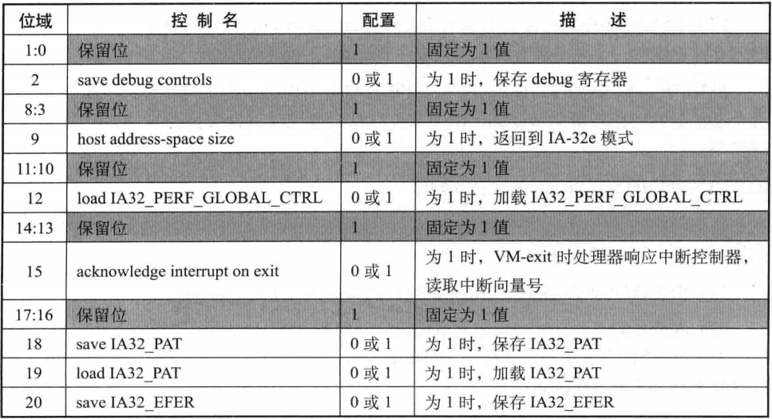
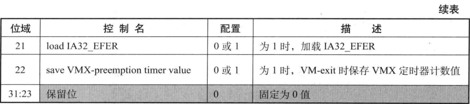

- 1 概述
    - 1.1 VM-exit control字段
        - 1.1.1 save debug controls
        - 1.1.2 host address-space size
        - 1.1.3 load IA32_PERF_GLOBAL_CTRL
        - 1.1.4 acknowledge interrupt on exit
        - 1.1.5 save IA32_PAT
        - 1.1.6 load IA32_PAT
        - 1.1.7 save IA32_EFER
        - 1.1.8 load IA32_EFER
        - 1.1.9 save VMX-preemption timer value
    - 1.2 VM-exit MSR-store 与 MSR-load 字段

# 1. 概述

VM-exit区域的控制字段相对较少，包括下面这些：
1. VM-exit control字段
2. VM-exit MSR-store count与VM-exit MSR-store address字段
3. VM-exit MSR-load count与VM-exit MSR-load address字段

这些字段用来控制发生VM-exit时的处理器行为，决定如何进行VM-exit操作。
在VM-entry时，处理器会检查这些字段。
如果检查不通过，产生VMfailValid失败，并且在VM-instruction error字段中保存错误码，
然后接着执行VMLAUNCH或VMRESUME指令下面的指令。

## 1.1 VM-exit control字段

VM-exit control字段是32位宽，每个位对应一个控制功能，如下表所示。
控制处理器在VM-exit时加载或保存某些寄存器值，或者返回IA-32e mode的host环境。

设置这个字段时，软件应该查询IA32\_VMX\_EXIT\_CTLS或IA32\_VMX\_TRUE\_EXIT\_CTLS寄存器来获得控制位支持度及保留位的默认值。

一般地，bits[1:0]，bits[8:3]，bits[11:10]，bits[14:13]，bits[17:16]是default1位，固定为1值。
bits[31:23]为default0，固定为0值。其余位可正常设置0或者1值。

### 1.1.1 save debug controls

当"save debug controls"为1值时，在VM-exit时，处理器在guest-state区域的相应字段中保存DR7与IA32\_DEBUGCTL寄存器的值。

### 1.1.2 host address-space size

当"host address-space size"为1时，将返回到IA-32e模式的host中。
在发起VM-entry时，当前的IA32\_EFER.LMA为1时（IA-32e模式的host），"host address-space size"位必须设为1值。
当IA32\_EFER.LMA为0时（legacy模式的host），"host address-space size"必须为0值，返回到legacy模式的host里。

在64位VMM管理下，guest可以是IA-32e模式或legacy模式，但VM-exit必须返回到IA-32e模式的host中。同样，32位VMM下，VM-exit必须返回到legacy模式。

在进行VM-exit操作时，"host address-space size"的值也被写入CS.L，IA32\_EFER.LME及IA32\_EFER.LMA位。

### 1.1.3 load IA32_PERF_GLOBAL_CTRL

当"load IA32\_PERF\_GLOBAL\_CTRL"为1值，在VM-exit时，处理器将host-state区域的相应字段中加载IA32\_PERF\_GLOBAL\_CTRL寄存器的值。

### 1.1.4 acknowledge interrupt on exit

当由于外部中断而产生VM-exit时，设置"acknowledge interrupt on exit"为1，处理器将影响中断控制器的中断请求，清外部中断对应的**Request**位。
从中断控制器里获得中断向量号等信息，保存在VM-exit interruption information字段里。

在下次重新VM-entry时，VMM根据这个字段记录的信息来注入一个外部中断事件给guest执行中断服务例程。
实际上，VMM可以直接将VM-exit interruption information字段的值复制到VM-entry interruption information字段，完成事件注入的设置。

当"acknowledge interrupt on exit"为0时，处理器不响应中断控制器，外部中断对应的**Request**位保持有效，外部中断被悬挂着。返回到host后，VMM可以使用STI指令重新打开interrupt window。此时，处理器将响应中断控制器并读取向量号。
中断服务例程将通过host-IDT deliver执行。通过这个手段，VMM可以夺取物理平台的外部中断控制权。

### 1.1.5 save IA32_PAT

当"save IA32\_PAT"为1值时，在VM-exit时，处理器将在guest-state区域的相应字段中保存IA32\_PAT寄存器值。

### 1.1.6 load IA32_PAT

当"load IA32\_PAT"为1值时，在VM-exit时，处理器将在host-state区域的相应字段中加载IA32\_PAT寄存器值。

### 1.1.7 save IA32_EFER

当"save IA32\_EFER"为1值时，在VM-exit时，处理器将在guest-state区域的IA32\_EFER字段中保存IA32\_EFER寄存器。
Intel推荐每次VM-exit时都保存IA32\_EFER值。

### 1.1.8 load IA32_EFER

当"load IA32\_EFER"为1值时，在VM-exit时，处理器将在host-state区域的IA32\_EFER字段中加载IA32\_EFER寄存器。
这个host IA32\_EFER字段的LME与LMA位必须等于"host address-space size"值，在进行VM-entry时，处理器会检查host-state区域的IA32\_EFER字段。

当"load IA32\_EFER"为0值时，处理器将"host address-space size"的值写入IA32\_EFER.LME与IA32\_EFER.LMA位。

### 1.1.9 save VMX-preemption timer value

当"save VMX-preemption timer value"为1时，在VM-exit时处理器将在guest-state区域的相应字段中保存这个VMX定时器计数值。
假如VM-exit是由于定时器超时产生的，那么这个timer value为0值。

## 1.2 VM-exit MSR-store 与 MSR-load 字段

MSR-store字段控制处理器VM-exit时，如何保存guest-MSR列表，由如下两个字段组成：
1. VM-exit MSR-store count字段
2. VM-exit MSR-store address字段

MSR-load字段控制处理器VM-exit时如何加载host-MSR列表，同样由如下两个字段组成：
1. VM-exit MSR-load count字段
2. VM-exit MSR-load address字段

这4个字段的方法和VM-entry MSR-load字段是一样的。VM-exit MSR-store address字段的值与VM-entry MSR-load address字段的值都是guest-MSR列表的地址，一般可以将它们设为相等，这样保证在进入和退出VM时读取同一份guest-MSR列表。