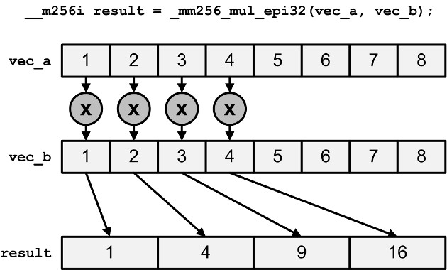
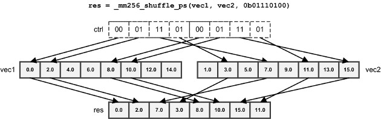

# 1. Overview of Vector Programming

AVX instructions improve an application's performance by processing large chunks of values at the same time instead of processing the values individually. 

These chunks of values are called `vectors`, and AVX vectors can contain up to 256 bits of data.
Common AVX vectors contain:
- four doubles (4 x 64 bits = 256)
- eight floats (8 x 32 bits = 256)
- eight ints (8 x 32 bits = 256)

An example will demonstrate the power of AVX/AVX2 processing. Suppose a function needs to multiply eight floats of one array by eight floats of a second array and add the result to a third array. Without vectors, the function might look like this:

```c
multiply_and_add(const float* a, const float* b, const float* c, float* d) {  

  for(int i=0; i<8; i++) {
    d[i] = a[i] * b[i];
    d[i] = d[i] + c[i];
  }
}
```

Here's what the function looks like with AVX2:
```
__m256 multiply_and_add(__m256 a, __m256 b, __m256 c) {

  return _mm256_fmadd_ps(a, b, c);
}
```

This AVX2 intrinsic function `_mm256_fmadd_ps` processes twenty-four floats, but it doesn't map to a single instruction. Instead, it executes three instructions: `vfmadd132ps`, `vfmadd213ps`, and `vfmadd231ps`. Despite this, it executes quickly and it's much faster than looping through the individual elements.

# 2. Fundamentals of AVX Programming

Most of this article focuses on the math-related intrinsic functions provided by AVX and AVX2. But before looking at the functions, it's important to understand three points:
- Data types
- Function naming conventions
- Compiling AVX applications

This section touches on each of these points and provides a simple application that subtracts one vector from another.

## 2.1 Data Types

A few intrinsics accept traditional data types like ints or floats, but most operate on data types that are specific to AVX and AVX2. There are six main vector types and Table lists each of them.

Data Type | Description
---|---
__m128 | 128-bit vector containing 4 `float`s
__m128d | 128-bit vector containing 2 `double`s
__m128i | 128-bit vector containing integers
__m256 | 256-bit vector containing 8 `float`s
__m256d | 256-bit vector containing 4 `doubel`s
__m256i | 256-bit vector containing integers

Each type starts with two underscores, an `m`, and the width of the vector in bits. 
AVX512 supports 512-bit vector types that start with `_m512`, but AVX/AVX2 vectors don't go beyond 256 bits.

If a vector type ends in `d`, it contains `double`s, and if it doesn't have a suffix, it contains `float`s. 
It might look like `_m128i` and `_m256i` vectors must contain `int`s, but this isn't the case.
An integer vector type can contain any type of integer, from `char`s to `short`s to `unsigned long long`s.
That is, an `_m256i` may contain 32 `char`s, 16 `short`s, 8 `int`s, or 4 `long`s. These integers can be signed or unsigned.

## 2.2 Function Naming Conventions

The names of AVX/AVX2 intrinsics can be confusing at first, but the naming convention is really straightforward. Once you understand it, you'll be able to judge approximately what a function does by looking at its name. A generic AVX/AVX2 intrinsic function is given as follows:

`_mm<bit_width>_<name>_<data_type>`

The parts of this format are given as follows:
1. `<bit_width>` identifies the size of the vector returned by the function. For 128-bit vectors, this is empty. For 256-bit vectors, this is set to `256`.
2. `<name>` describes the operation performed by the intrinsic
3. <data_type> identifies the data type of the function's primary arguments

This last part, `<data_type>`, is a little complicated. It identifies the content of the input values, and can be set to any of the following values:
- `ps` - vectors contain `float`s (`ps` stands for packed single-precision)
- `pd` - vectors cantain `double`s (`pd` stands for packed double-precision)
- `epi8/epi16/epi32/epi64` - vectors contain 8-bit/16-bit/32-bit/64-bit signed integers
- `epu8/epu16/epu32/epu64` - vectors contain 8-bit/16-bit/32-bit/64-bit unsigned integers
- `si128/si256` - unspecified 128-bit vector or 256-bit vector
- `m128/m128i/m128d/m256/m256i/m256d` - identifies input vector types when they are different than the type of the returned vector

As an example, consider `_mm256_srlv_epi64`. Even if you don't know what `srlv` means, the `_mm256` prefix tells you the function returns a 256-bit vector and the `_epi64` tells you that the arguments contain 64-bit signed integers.

As a second example, consider `_mm_testnzc_ps`. The `_mm` implies that the function returns a 128-bit vector. The `_ps` at the end implies that the argument vectors contain floats.

AVX data types start with two underscores and an `m`. Functions start with an underscore and two `m`s. I tend to get this confused, so I came up with a way to remember the difference: a data type represents *m*emory and a function represents a **m**ulti**m**edia operation. That's the best I can do.

## 2.3 Building AVX Applications

To build an application that uses AVX intrinsics, `you don't need to link any libraries`. But you need to include the `immintrin.h` header file. This header includes other headers that map AVX/AVX2 functions to instructions.

The code in hello_avx.c shows what a basic AVX application looks like:

```c
#include <immintrin.h>
#include <stdio.h>

int main() {

        /* Initialize the two argument vectors */
        __m256 evens = _mm256_set_ps(2.0, 4.0, 6.0, 8.0, 10.0, 12.0, 14.0, 16.0);
        __m256 odds = _mm256_set_ps(1.0, 3.0, 5.0, 7.0, 9.0, 11.0, 13.0, 15.0);

        /* Compute the difference between the two vectors */
        __m256 result = _mm256_sub_ps(evens, odds);

        /* Display the elements of the result vector */
        float* f = (float*)&result;
        printf("%f %f %f %f %f %f %f %f\n", f[0], f[1], f[2], f[3], f[4], f[5], f[6], f[7]);

        return 0;
}
```
To build the application, you need to tell the compiler that the architecture supports AVX. The flag depends on the compiler, and gcc requires the `-mavx` flag. Therefore, the hello_avx.c source file can be compiled with the following command:

`# gcc -mavx -o hello_avx hello_avx.c`

In this example, all the functions start with `_mm256` and end with `_ps`, so I hope it's clear that all the operations involve 256-bit vectors containing `float`s. I also hope it's clear that each element in the resulting vector equals 1.0. If you run the application, you'll see that this is the case.

# 3. Initialization Intrinsics

Before you can operate on AVX vectors, you need to fill the vectors with data. Therefore, the first set of intrinsics discussed in this article initialize vectors with data. There are two ways of doing this: initializing vectors with scalar values and initializing vectors with data loaded from memory.

## 3.1 Initialization with Scalar Values

AVX provides intrinsic functions that combine one or more values into a 256-bit vector. Table lists their names and provides a description of each.

There are similar intrinsics that initialize 128-bit vectors, but those are provided by SSE, not AVX. The only difference in the functions' names is that `_mm256_` is replaced with `_mm_`. 

Function | Description
---|---
`_mm256_setzero_ps/pd` | return a floating-point vector filled with zeros
`_mm256_setzero_si256` | return a integer vector whose bytes are set to zero
`_mm256_set1_ps/pd` | fill a vector with a floating-point value
`_mm256_set1_epi8/epi16/epi32/epi64` | fill a vector with an integer
`_mm256_set_ps/pd` | initialize a vector with eight floats(ps) or four doubles(pd)
`_mm256_set_epi8/epi16/epi32/epi64` | initialize a vector with integers
`_mm256_set_m128/m128d/m128i` | initialize a 256-bit vector with two 128-bit vectors
`_mm256_setr_ps/pd` | initialize a vector with eight floats (ps) or four doubles (pd) in reverse order
`_mm256_setr_epi8/epi16/epi32/epi64` | Initialize a vector with integers in reverse order

The first functions in the table are the easiest to understand. 
`_m256_setzero_ps` returns an `__m256` vector containing eight `float`s set to zero.
Similarly, `_m256_setzero_si256` returns an `__m256i` vector whose bytes are set to zero. 

As an example, the following line of code creates a 256-bit vector that contains four doubles set to zero:

`_m256d doubel_vector = _m256_setzero_pd();`

The functions whose names contain `set1` accept a single value and repeat it throughout the vector.
For example, the following line of code creates an `__m256i` whose sixteen short values are set to 47:

`_m256i short_vector = _m256_set1_pd();`

The rest of the functions in Table contain `_set_` or `_setr_`. 
These functions accept a series of values, one for each element of the vector. 
These values are placed in the returned vector, and the order important to understand.
The following function call returns a vector containing eight ints whose values range from 1 to 8:

`_m256i int_vector = _m256_set_epi32(1, 2, 3, 4, 5, 6, 7, 8);`

You might expect the values to be stored in the order in which they're given.
But Intel's architecture is little-endian, so the least-significant value (8), is stored first and the most-significant value (1) is stored last.

You can verify this by casting `int_vector` to an `int` pointer and printing the stored values.

This is shown with the following code:
```c
#include <immintrin.h>
#include <stdio.h>

int main() {

        __m256i int_vector = _mm256_set_epi32(1, 2, 3, 4, 5, 6, 7, 8);
        int *ptr = (int*)&int_vector;

        printf("%d %d %d %d %d %d %d %d\n", ptr[0], ptr[1], ptr[2], ptr[3], ptr[4], ptr[5], ptr[6], ptr[7]);

        return 0;
}
```
> 8 7 6 5 4 3 2 1

If you want the values to be stored in the given order, you can create vectors with one of the `_setr_` functions, where r presumably stands for reverse. The following code shows how this works:

```
#include <immintrin.h>
#include <stdio.h>

int main() {

        __m256i int_vector = _mm256_setr_epi32(1, 2, 3, 4, 5, 6, 7, 8);
        int *ptr = (int*)&int_vector;

        printf("%d %d %d %d %d %d %d %d\n", ptr[0], ptr[1], ptr[2], ptr[3], ptr[4], ptr[5], ptr[6], ptr[7]);

        return 0;
}
```
> 1 2 3 4 5 6 7 8

It's interesting to note that neither AVX nor AVX2 provide intrinsics that initialize vectors with unsigned integers. However, they provide functions that operate on vectors with unsigned integers.

## 3.2 Loading Data from Memory

A common usage of AVX/AVX2 is to load data from memory into vectors, process the vectors, and store the results back to memory.

The first step is accomplished with the intrinsic functions listed in Table . The last two functions are preceded with (`2`) because they're provided by AVX2, not AVX. 

Data Type | Description
---|---
`_mm256_load_ps/pd` | Loads a floating-point vector from an aligned memory address
`_mm256_load_si256` | Loads an integer vector from an aligned memory address
`_mm256_loadu_ps/pd`| Loads a floating-point vector from an unaligned memory address
`_mm256_loadu_si256`| Loads an integer vector from an unaligned memory address
`_mm__mask_load_ps/pd`| Load portions of a 128-bit/256-bit
`_mm256_mask_load_ps/pd`| floating-point vector according to a mask
`(2)_mm_mask_load_epi32/64`| Load portions of a 128-bit/256-bit
`(2)_mm256_mask_load_epi32/64`| integer vector according to a mask

When loading data into vectors, memory alignment becomes particularly important. 
Each `_mm256_load_*` intrinsic accepts a memory address that must be aligned on a 32-byte boundary. 
That is, the address must be divisible by 32. The following code shows how this can be used in practice:

```c
float* aligned_floats = (float*)aligned_alloc(32, 64 * sizeof(float));

... Initialize data ...

__m256 vec = _mm256_load_ps(aligned_floats);
```

Any attempt to load unaligned data with `_m256_load_*` produces a segmentation fault.
If the data isn't aligned at a 32-bit boundary, the `_m256_loadu_*` functions should be used instead.
This is shown with the following code:

```c
float* unaligned_floats = (float*)malloc(64 * sizeof(float));

... Initialize data ...

__m256 vec = _mm256_loadu_ps(unaligned_floats);
```

Suppose you want to process a `float` array using AVX vectors, but the length of the array is 11, which isn't divisible by 8. In this case, the last five `float`s of the second `__m256` vector need to be set to zero so they don't affect the computation.This selective loading can be accomplished with the `_maskload_` functions at the bottom of Table.

Each `_maskload_` function accepts two arguments: a memory address and an integer vector with the same number of elements as the returned vector.For each element in the integer vector whose highest bit is one, the corresponding element in the returned vector is read from memory.If the highest bit in the integer vector is zero, the corresponding element in the returned vector is set to zero.

An example will clarify how these functions are used. The code in mask_load.c reads eight ints into a vector, and the last three should be set to zero.
The function to use is `_mm256_maskload_epi32`, and its second argument should be a `__m256i` mask vector.
This mask vector contains five `int`s whose highest bit equals 1 and three ints whose highest bit is zero. Here's what the code looks like:

```c
#include <immintrin.h>
#include <stdio.h>

int main() {

        int i;

        int int_array[8] = {100, 200, 300, 400, 500, 600, 700, 800};

        /* Initialize the mask vector */
        __m256i mask = _mm256_setr_epi32(-20, -72, -48, -9, -100, 3, 5, 8);

        /* Selectively load data into the vector */
        __m256i result = _mm256_maskload_epi32(int_array, mask);

        /* Display the elements of the result vector */
        int* res = (int*)&result;
        printf("%d %d %d %d %d %d %d %d\n",
                        res[0], res[1], res[2], res[3], res[4], res[5], res[6], res[7]);

        return 0;
}
```
If you run this application on a system that supports AVX2, it will print the following result:
> 100 200 300 400 500 0 0 0

There are three points I'd like to mention:
1. The code sets the mask vector's content with a `_setr_` function instead of `_set_` because it orders the vector's elements as they're delivered to the function.
2. The highest bit of a negative integer is always 1. This is why the mask vector contains five negative numbers and three positive numbers.
3. The `_mm256_maskload_epi32` function is provided by AVX2, not AVX. Therefore, to compile this code with gcc, the `-mavx2` flag must be used instead of `-mavx`.

In addition to the functions listed in Table, AVX2 provides gather functions that load indexed data from memory.

# 4. Arithmetic Intrinsics

Math is the primary reason for AVX's existence, and the fundamental operations are addition, subtraction, multiplication, and division. 
This section presents the intrinsics that perform these operations, and also looks at the new fused multiply-and-add functions provided by AVX2.

## 4.1 Addition and Subtraction

Table lists the AVX/AVX2 intrinsics that perform addition and subtraction. 
Most of them operate on vectors containing integers because of the concern with saturation.

Data Type | Description
---|---
`_mm256_add_ps/pd`| Add two floating-point vectors
`_mm256_sub_ps/pd`| Subtract two floating-point vectors
`(2)_mm256_add_epi8/16/32/64`| Add two integer vectors
`(2)_mm256_sub_epi8/16/32/64`| Subtract two integer vectors
`(2)_mm256_adds_epi8/16`| Add two integer vectors with saturation
`(2)_mm256_adds_epu8/16`| Add two integer vectors with saturation
`_mm256_hadd_ps/pd` | Add two floating-point vectors horizontally
`_mm256_hsub_ps/pd` | Subtract two floating-point vectors horizontally
`(2)_mm256_hadd_epi16/32` | Add two integer vectors horizontally
`(2)_mm256_hsub_epi16/32` | Subtract two integer vectors horizontally
`(2)_mm256_hadds_epi16` | Add two vectors containing shorts horizontally with saturation
`(2)_mm256_hsubs_epi16`	| Subtract two vectors containing shorts horizontally with saturation
`_mm256_addsub_ps/pd` | Add and subtract two floating-point vectors

When adding or subtracting integer vectors, it's important to see the difference between the `_add_/_sub_` functions and the `_adds_/_subs_` functions.
The extra `s` stands for saturation, which is produced when the result requires more memory than the vector can store.
Functions that take saturation into account clamp the result to the minimum/maximum value that can be stored.
Functions without saturation ignore the memory issue when saturation occurs.

For example, suppose a vector contains signed bytes, so the maximum value for each element is 127 (0x7F).
If an operation adds 98 to 85, the mathematical sum is 183 (0xB7).
- If the values are added with `_mm256_add_epi8`, the saturation will be ignored and the stored result will be -73 (0xB7).
- If the values are added with `_mm256_adds_epi8`, the result will be clamped to the maximum value, 127 (0x7F).

As another example, consider two vectors that contain signed short integers. The minimum value is -32,768. If you compute -18,000 - 19,000, the mathematical result is -37,000 (0xFFFF6F78 as a 32-bit integer).
- If the values are subtracted with `_mm256_sub_epi16`, the saturation will be ignored and the stored result will be 28,536 (0x6F78).
- If the values are subtracted with `_mm256_subs_epi16`, the result will be clamped to the minimum value, -32,768 (0x8000).

The `_hadd_/_hsub_` functions perform addition and subtraction horizontally. 
That is, instead of adding or subtracting elements of different vectors, they add or subtract adjacent elements within each vector. 
The results are stored in an interleaved fashion. 

Figure 1 shows how this works for `_mm256_hadd_pd`, which horizontally adds double vectors A and B:


This may seem strange to add and subtract elements horizontally, but these operations are helpful when multiplying complex numbers. This is explained later in this article.

The last function in Table, `_mm256_addsub_ps/pd`, alternately subtracts and adds elements of two floating-point vectors. That is, even elements are subtracted and odd elements are added. 
For example, if `vec_a` contains (0.1, 0.2, 0.3, 0.4) and `vec_b` contains (0.5, 0.6, 0.7, 0.8), `_mm256_addsub_pd(vec_a, vec_b)` equals (-0.4, 0.8, -0.4, 1.2).

## 4.2 Multiplication and Division

Table lists the AVX/AVX2 intrinsics that perform multiplication and division. 
As with addition and subtraction, there are special intrinsics for operating on integers.

Data Type | Description
---|---
`_mm256_mul_ps/pd` | Multiply two floating-point vectors
`(2)_mm256_mul_epi32/(2)_mm256_mul_epu32` | Multiply the lowest four elements of vectors containing 32-bit integers
`(2)_mm256_mullo_epi16/32` | Multiply integers and store low halves
`(2)_mm256_mulhi_epi16/(2)_mm256_mulhi_epu16` | Multiply integers and store high halves
`(2)_mm256_mulhrs_epi16` | Multiply 16-bit elements to form 32-bit elements
`_mm256_div_ps/pd` | Divide two floating-point vectors

If two N-bit numbers are multiplied on a computer, the result can take up 2N bits. 
For this reason, only the four low elements of the `_mm256_mul_epi32` and `_mm256_mul_epu32` intrinsics are multiplied together, and the result is a vector containing four long integers. 

Figure 2 shows how this works:



The `_mullo_` functions are similar to the integer `_mul_` functions, but instead of multiplying low elements, they multiply every element of both vectors store only the low half of each product.

Figure 3 shows what this looks like:


The `_mm256_mulhi_epi16` and `_mm256_mulhi_epu16` intrinsics are similar, but they store the high halves of the integer products.

## 4.3 Fused Multiply and Add (FMA)

As mentioned earlier, the result of multiplying two N-bit numbers can occupy 2N bits. Therefore, when you multiply two floating-point values, a and b, the result is really round(a * b), where round(x) returns the floating-point value closest to x. This loss of accuracy increases as further operations are performed.

AVX2 provides instructions that fuse multiplication and addition together. That is, instead of returning round(round(a * b) + c), they return round(a * b + c). As a result, these instructions provide greater speed and accuracy than performing multiplication and addition separately.

Table 6 lists the FMA intrinsics provided by AVX2 and includes a description of each. Every instruction in the table accepts three input vectors, and I've referred to them as a, b, and c.

Data Type | Description
---|---
`(2)_mm_fmadd_ps/pd/(2)_mm256_fmadd_ps/pd` | Multiply two vectors and add the product to a third (res = a * b + c)
`(2)_mm_fmsub_ps/pd/(2)_mm256_fmsub_ps/pd` | Multiply two vectors and subtract a vector from the product (res = a * b - c)
`(2)_mm_fmadd_ss/sd`| Multiply and add the lowest element in the vectors (res[0] = a[0] * b[0] + c[0])
`(2)_mm_fmsub_ss/sd`| Multiply and subtract the lowest element in the vectors (res[0] = a[0] * b[0] - c[0])
`(2)_mm_fnmadd_ps/pd/(2)_mm256_fnmadd_ps/pd` | Multiply two vectors and add the negated product to a third (res = -(a * b) + c)
`(2)_mm_fnmsub_ps/pd/(2)_mm256_fnmsub_ps/pd` | Multiply two vectors and add the negated product to a third (res = -(a * b) - c)
`(2)_mm_fnmadd_ss/sd`| Multiply the two lowest elements and add the negated product to the lowest element of the third vector (res[0] = -(a[0] * b[0]) + c[0])
`(2)_mm_fnmsub_ss/sd` | Multiply the lowest elements and subtract the lowest element of the third vector from the negated product (res[0] = -(a[0] * b[0]) - c[0])
`(2)_mm_fmaddsub_ps/pd/(2)_mm256_fmaddsub_ps/pd`| Multiply two vectors and alternately add and subtract from the product (res = a * b - c)
`(2)_mm_fmsubadd_ps/pd/(2)_mmf256_fmsubadd_ps/pd`| Multiply two vectors and alternately subtract and add from the product (res = a * b - c)

If an intrinsic's name ends with `_ps` or `_pd`, every element of the input vectors is included in the operation. 
If an intrinsic's name ends with `_ss` or `_sd`, only the lowest element is included. 
The rest of the elements in the output vector are set equal to the elements of the first input vector. 

For example, suppose `vec_a` = (1.0, 2.0), `vec_b` = (5.0, 10.0), and `vec_c` = (7.0, 14.0). 
In this case, `_mm_fmadd_sd(vec_a, vec_b, vec_c)` returns (12.0, 2.0) 
because (1.0 * 5.0) + 7.0 = 12.0 and 2.0 is the second element of `vec_a`.

It's important to see the difference between the `_fmadd_`/`_fmsub_` and `_fnmadd_`/`_fnmsub_` intrinsics. 
The latter functions negate the product of the first two input vectors before adding or subtracting the third input vector.

The `_fmaddsub_` and `_fmsubadd_` intrinsics alternate between adding and subtracting elements of the third vector. 
The `_fmaddsub_` intrinsics add odd elements and subtract even elements. 
The `_fmsubadd_` intrinsics subtract odd elements and add even elements. 

The code in fmatest.c shows how the `_mm256_fmaddsub_pd` intrinsic can be used in practice.

```c
#include <immintrin.h>
#include <stdio.h>

int main() {

        __m256d veca = _mm256_setr_pd(6.0, 6.0, 6.0, 6.0);

        __m256d vecb = _mm256_setr_pd(2.0, 2.0, 2.0, 2.0);

        __m256d vecc = _mm256_setr_pd(7.0, 7.0, 7.0, 7.0);

        /* Alternately subtract and add the third vector
           from the product of the first and second vectors */
        __m256d result = _mm256_fmaddsub_pd(veca, vecb, vecc);

        /* Display the elements of the result vector */
        double* res = (double*)&result;
        printf("%lf %lf %lf %lf\n", res[0], res[1], res[2], res[3]);

        return 0;
}
```
When this code is compiled and executed on a processor that supports AVX2, the printed results are as follows:
> 5.000000 19.000000 5.000000 19.000000
The FMA instructions are provided by AVX2, so you might think the `-mavx2` flag is needed for building the application with gcc. But I've found that the `-mfma` flag is required instead. Otherwise, I get strange compile errors.

# 5. Permuting and Shuffling

Many applications must rearrange vector elements to ensure that operations are performed properly. 
AVX/AVX2 provides a number of intrinsic functions for this purpose, and two major categories are the `_permute_` functions and the `_shuffle_` functions. 
This section presents both types of intrinsics.

## 5.1 Permuting

AVX provides functions that return a vector containing the rearranged elements of a vector. 
Table lists these permute functions and provides a description of each.

Data Type| Description
---|---
`_mm_permute_ps/pd/_mm256_permute_ps/pd`|Select elements from the input vector based on an 8-bit control value
`(2)_mm256_permute4x64_pd/(2)_mm256_permute4x64_epi64`|Select 64-bit elements from the input vector based on an 8-bit control value
`_mm256_permute2f128_ps/pd`| Select 128-bit chunks from two input vectors based on an 8-bit control value
`_mm256_permute2f128_si256`| Select 128-bit chunks from two input vectors based on an 8-bit control value
`_mm_permutevar_ps/pd/_mm256_permutevar_ps/pd` | Select elements from the input vector based on bits in an integer vector
`(2)_mm256_permutevar8x32_ps/(2)_mm256_permutevar8x32_epi32`|Select 32-bit elements (`float`s and `int`s) using indices in an integer vector

The `_permute_` intrinsics accept two arguments: an input vector and an 8-bit control value. 
The bits of the control value determine which of the input vector's elements is inserted into the output. 
For `_mm256_permute_ps`, each pair of control bits determines an upper and lower output element by selecting one of the upper or lower elements in the input vector. 

This is complicated, so I hope Figure 4 will make the operation a little clearer:


As shown in the figure, values of the input vector may be repeated multiple times in the output. Other input values may not be selected at all.

In `_mm256_permute_pd`, the low four bits of the control value select between adjacent pairs of `double`s. 
`_mm256_permute4x4_pd` is similar, but uses all of the control bits to select which 64-bit element is placed in the output. In the `_permute2f128_` intrinsics, the control value selects 128-bit chunks from the two input vectors instead of selecting elements from one input vector.

The `_permutevar_` intrinsics perform the same operation as the `_permute_` intrinsics. But instead of using 8-bit control values to select elements, they rely on integer vectors with the same size as the input vector. 
For example, the input vector of `_mm256_permute_ps` is a `_mm256`, so the integer vector is an `_mm256i`. 
The high bits of the integer vector perform selection in the same way as the bits of the 8-bit control values of the `_permute_` intrinsics.

## 5.2 Shuffling

Like the `_permute_` intrinsics, the `_shuffle_` intrinsics select elements from one or two input vectors and place them in the output vector. Table lists the functions and provides a description of each.

Data Type | Description
---|---
`_mm256_shuffle_ps/pd`|Select floating-point elements according to an 8-bit value
`_mm256_shuffle_epi8/_mm256_shuffle_epi32`| Select integer elements according to an 8-bit value
`(2)_mm256_shufflelo_epi16/(2)_mm256_shufflehi_epi16`|Select 128-bit chunks from two input vectors based on an 8-bit control value

All `_shuffle_` intrinsics operate on 256-bit vectors. In each case, the last argument is an 8-bit value that determines which input elements should be placed in the output vector.

For `_mm256_shuffle_ps`, only the high four bits of the control value are used. If the input vectors contain ints or floats, all the control bits are used. 
For `_mm256_shuffle_ps`, the first two pairs of bits select elements from the first vector and the second two pairs of bits select elements from the second vector. 

Figure 5 illustrates how this works:



To shuffle 16-bit values, AVX2 provides `_mm256_shufflelo_epi16` and `_mm256_shufflehi_epi16`. 
As with `_mm256_shuffle_ps`, the control value is split into four pairs of bits that select from eight elements. But for `_mm256_shufflelo_epi16`, the eight elements are taken from the eight low 16-bit values. 
For `_mm256_shufflehi_epi16`, the eight elements are taken from the eight high 16-bit values.

# 6. Complex Multiplication

Complex multiplication is a time-consuming operation that must be performed repeatedly in signal processing applications. I won't go deeply into the theory, but every complex number can be expressed as a + bi, where a and b are floating-point values and i is the square-root of -1. a is called the real part and b is called the imaginary part. If (a + bi) and (c + di) are multiplied, the product equals (ac - bd) + (ad + bc)i.

Complex numbers can be stored in interleaved fashion, which means each real part is followed by the imaginary part. Suppose `vec1` is a `__m256d` that stores two complex numbers, (a + bi) and (x + yi), and `vec2` is a `__m256d` that stores (c + di) and (z + wi). Figure 6 illustrates how the values are stored. As shown, the prod vector stores the two products: (ac - bd) + (ad + bc)i and (xz - yw) + (xw + yz)i.


I don't know the fastest way to compute complex products with AVX/AVX2. But I've devised a method that has given me good results. It consists of five steps:
1. Multiply `vec1` and `vec2` and store the result in `vec3`.
2. Switch the real/imaginary values of `vec2`.
3. Negate the imaginary values of `vec2`.
4. Multiply `vec1` and `vec2` and store the result in `vec4`.
5. Use horizontal subtraction on `vec3` and `vec4` to produce the answer in `vec1`.

The code in complex_mult.c shows how this can be performed using AVX intrinsics:
```c
#include <immintrin.h>
#include <stdio.h>

int main() {

        __m256d vec1 = _mm256_setr_pd(4.0, 5.0, 13.0, 6.0);
        __m256d vec2 = _mm256_setr_pd(9.0, 3.0, 6.0, 7.0);
        __m256d neg = _mm256_setr_pd(1.0, -1.0, 1.0, -1.0);

        /* Step 1: Multiply vec1 and vec2 */
        __m256d vec3 = _mm256_mul_pd(vec1, vec2);

        /* Step 2: Switch the real and imaginary elements of vec2 */
        vec2 = _mm256_permute_pd(vec2, 0x5);

        /* Step 3: Negate the imaginary elements of vec2 */
        vec2 = _mm256_mul_pd(vec2, neg);

        /* Step 4: Multiply vec1 and the modified vec2 */
        __m256d vec4 = _mm256_mul_pd(vec1, vec2);

        /* Horizontally subtract the elements in vec3 and vec4 */
        vec1 = _mm256_hsub_pd(vec3, vec4);

        /* Display the elements of the result vector */
        double* res = (double*)&vec1;
        printf("%lf %lf %lf %lf\n", res[0], res[1], res[2], res[3]);

        return 0;
}
```
> 21.000000 57.000000 36.000000 127.000000

This code operates on `double` vectors, but the method can easily be extended to support `float` vectors.

# 7. appendix

History:
- 1996  MMX(MultiMedia eXtension)
- 1998 3DNow!: is an extension to the x86 instruction set developed by Advanced Micro Devices (AMD).
- 1999 SSE(Streaming SIMD Extensions)
- 2001 SSE2(Streaming SIMD Extensions)
- 2004 SSE3(Streaming SIMD Extensions)
- 2006 SSSE3(Supplemental Streaming SIMD Extensions 3)
- 2006 SSE4(Streaming SIMD Extensions 4)
- 2008 AVX(Advanced Vector Extensions)
- 2009 F16C: provides support for converting between half-precision and standard IEEE single-precision floating-point formats. 
- 2011 FMA(fused multiply–add)
- 2013 AVX2(256-bit Advanced Vector Extensions 2)
- 2015 AVX512(512-bit Advanced Vector Extensions)

Headerfile | Extension | gcc flag
---|---|---
<mmintrin.h> | MMX | mmx
<xmmintrin.h> | SSE |sse
<emmintrin.h> |SSE2 | sse2
<pmmintrin.h> | SSE3 | sse3
<tmmintrin.h> | SSSE3 | ssse3
<smmintrin.h> | SSE4.1 | sse4_1 
<nmmintrin.h> | SSE4.2 | sse4_2
<wmmintrin.h> | AES  | aes
<immintrin.h> | AVX | avx 
<avx2intrin.h> | AVX2 | avx2

> Project: https://github.com/kunpengcompute/AvxToNeon.git