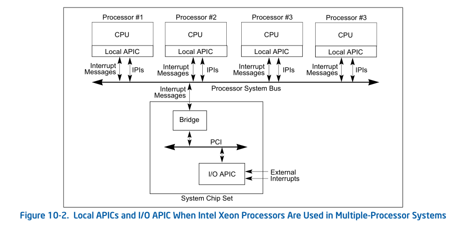
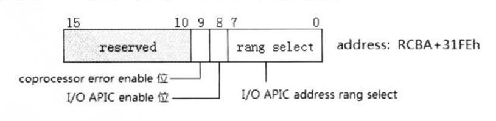
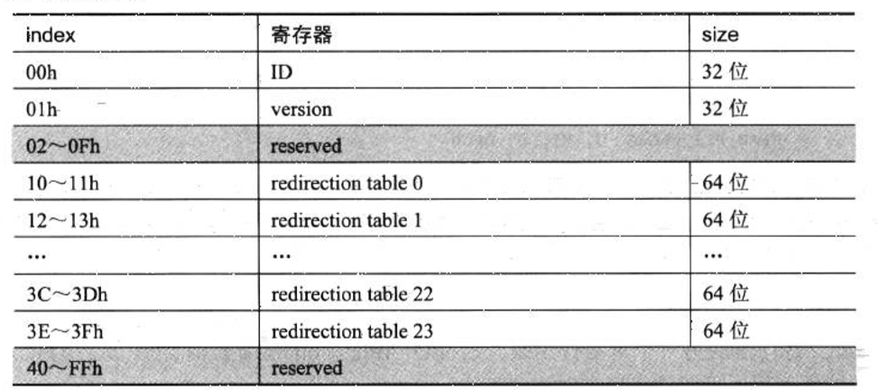
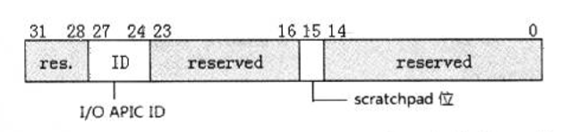
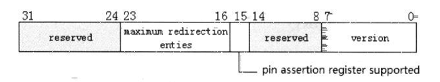
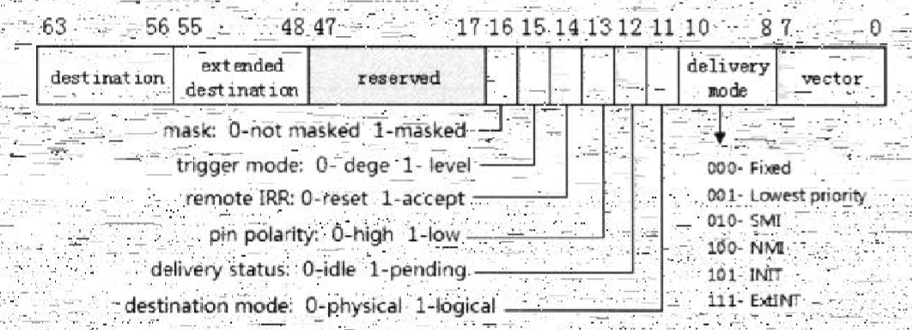
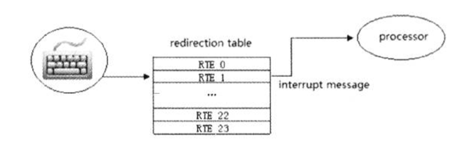
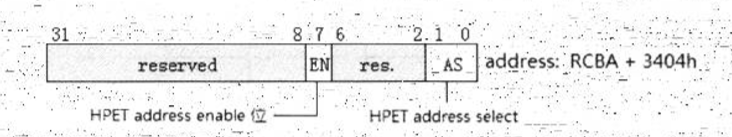
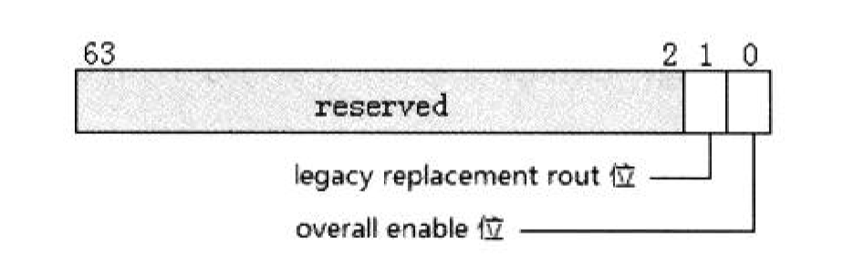
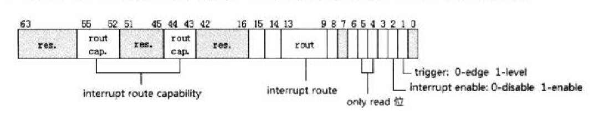

- 1 概述
- 2 I/O APIC寄存器
    - 2.1 直接寄存器（direct register）
        - 2.1.1 I/O APIC寄存器的基址
        - 2.1.2 开启和设置I/O APIC基址
    - 2.2 间接寄存器（indirect register）
        - 2.2.1 I/O APIC ID寄存器
        - 2.2.2 I/O APIC version寄存器
        - 2.2.3 I/O APIC interrupt redirection table寄存器
- 3 I/O APIC的IRQ
- 4 I/O APIC的中断处理
- 5 使用HPET（高精度计时器）
    - 5.1 HPET寄存器基址
    - 5.2 HPET的工作原理
        - 5.2.1 HPET寄存器
        - 5.2.2 HPET counter频率
        - 5.2.3 HPET配置
        - 5.2.4 Timer配置寄存器
        - 5.2.5 Timer 0的配置
        - 5.2.6 HPET status寄存器

# 1. 概述

APIC分为两部分：Local APIC与I/O APIC。local APIC位于处理器内部，而I/O APIC则属于芯片组的一部分。

local APIC与I/O APIC通过system bus进行通信。



上图展示了I/O APIC是如何与处理器通信的，像处理器间通信一样，I/O APIC发送中断消息从PCI Bridge通过system bus到达指定的处理器（或一组处理器）。

I/O APIC与8259兼容类的中断控制器最大的不同是，8259中断口之气的输出口INTR链接到处理器的INTR引脚（当local APIC开启式，链接到local APIC的LINT0口上）。在8259向处理器发送中断请求过程中，8259与处理器需要来回的通信相应。而I/O APIC通过直接写I/O APIC设备内存映射的地址空间，在system bus中传送中断消息，无需处理器发出acknowledge cycle（响应周期）确认。因此，I/O APIC的中断响应更快。

# 2. I/O APIC寄存器

I/O APIC的寄存器也是通过内存映射方式映射到处理器物理地址空间。
I/O APIC的寄存器工作在两种访问方式：
- 直接访问的寄存器（direct register）
- 简介访问的寄存器（indirect register）

**访问I/O APIC寄存器**

通过向index寄存器（直接访问寄存器）写入需要访问的I/O APIC寄存器（间接访问寄存器）的index值，然后从data寄存器读出I/O APIC寄存器的值。

IA-32e模式下：
```asm
    mov DWORD [IOAPIC_INDEX_REG], 10h   ; 向index寄存器写入index值
    mov rax, [IOAPIC_DATA_REG]          ; 读入完整的64位值
```

> 在64位代码下，软件可以一次读取64位I/O APIC寄存器的值，寄存器的index值必须是8byte边界上。

## 2.1 直接寄存器（direct register）

直接访问的寄存器有3个，如下表所示：


寄存器 | 地址 | 宽度 | 默认地址 | 描述
---|---|---|---|---
index | FECxx000h | 8 bit | FEC00000h | 访问前提供8位的寄存器index值
data | FECxx010h | 32 bit | FEC00010h | 根据index值，读/写相应的I/O APIC寄存器数据
EOI | FECxx040h | 32 bit | FEC00040h | level-trigger中断结束后发送EOI命令

软件通过index和data寄存器来间接访问I/O APIC的所有寄存器。
EOI（End Of Interrupt）寄存器仅使用在Level触发模式上，对edge触发模式的中断无影响。

### 2.1.1 I/O APIC寄存器的基址

在上表中的直接访问寄存器里，地址中xx（bit 19 到 bit 12）代表它们的地址是未确定的，最终由OIC（other interrupt controller）控制器来决定。



OIC寄存器的bit7 ~ bit0指定了I/O APIC寄存器的基地址，对应I/O APIC direct寄存器的xx值（bit19 ~ bit12）。

> 在默认情况下，OIC寄存器的值为0h，那么I/O APIC寄存器的地址值就是：</br> index寄存器为0xfec00000. </br> data寄存器为0xfec00010. </br> EOI寄存器为0xfec00040.

BIOS可能会选择修改这个值，软件需要查询或者直接设定一个值来保证正确的访问I/O APIC寄存器。
OIC就存器的地址位于RCBA（root complex base address）寄存器的31FEh偏移量上，需要访问OIC寄存器必须先等到RCBA寄存器的地址。

```
    RCBA register 
        -> OCI register
            -> I/O APIC
```         

使用get_root_complex_base_address()函数用来获得RCBA寄存器地址，RCBA寄存器位于PCI bus上的device 31设备（LPC bridge）。

```asm
get_root_complex_base_address:
    READ_PCI_DWORD 0, 31, 0 0F0h
    and eax, 0FFFFC000h
    ret
```

上面的代码使用READ_PCI_DWORD宏来读取bus 0, device 31, function 0的第F0h偏移量的寄存器，这个寄存器就是RCBA寄存器，其中bit31 ~ bit14就是RCBA基地址（物理地址）。
```
00:1f.0 ISA bridge: Intel Corporation C220 Series Chipset Family H81 Express LPC Controller (rev 04)
```

### 2.1.2 开启和设置I/O APIC基址

OIC寄存器的另一个重要的作用是开启I/O APIC。bit8置位时开启I/O APIC，I/O APIC地址可用，下面的代码来做这项工作：

```asm
%deifne IOAPIC_INDEX_REG    0FEC00000h
%define IOAPIC_DATA_REG     0FEC00010h
%define IOAPIC_EOI_REG      0FEC00040h

enable_ioapic:
    ; 开启ioapic
    call get_root_complex_base_address
    mov esi, [eax + 31FEH]
    bts esi, 8              ; IOAPIC enbale bit
    and esi, 0FFFFFF00h     ; IOAPIC range select
    mov [eax + 31FEH], esi  ; enable IOAPIC
    
    ; 设置IOAPIC ID
    mov DWORD [IOAPIC_INDEX_REG], IOAPIC_ID_INDEX
    mov DWORD [IOAPIC_DATA_REG], 0F000000h      ; IOAPIC ID = 0Fh
    ret
```
得到OIC的值（RCBA+31FEh）后，第8位置位，并且将I/O APIC range select值设为0。
那么我们的I/O APIC将使用默认的值。

> 得到RCBA寄存器返回的是物理地址，但你并不知道RCBA值是多少，会造成映射上的一些困扰，最好是在开启paging机制前开启I/O APIC和设置I/O APIC基地址。

## 2.2 间接寄存器（indirect register）

现在PCH（platform controller hub）芯片上的I/O APIC只有3组间接访问寄存器：
- I/O APIC ID寄存器
- I/O APIC version寄存器
- 24个interrupt redirection table寄存器



> 每个redirection table寄存器是64bit宽，在32位环境下访问需要分高/低32bit进行两次读或写操作。在64bit代码下可以一次性访问64bit寄存器

### 2.2.1 I/O APIC ID寄存器

这个寄存器如果local APIC ID寄存器一样重要，有多个I/O APIC芯片存在时，唯一指定I/O APIC的编号。软件必须为I/O APIC设置一个ID值。



I/O APIC ID 寄存器的bit27 ~ bit24共4bit值为ID值，软件在使用前必须设置一个值，I/O APIC ID值将会在system bus的仲裁上使用到。

> bit 15是scratchpad位，intel的PCH文档并没有给出说明。

### 2.2.2 I/O APIC version寄存器

每个I/O APIC芯片的version寄存器指明了I/O APIC在implementation（硬件实现）上的情况，包括了I/O APIC的版本和最大包含的 redirection table 数量。



如上图所示，version寄存器的bit23 ~ bit16域指明了 redirection table 寄存器的数量。PCH硬件设这个值为17h（即24），表示有24个redirection table寄存器，而version的值为20h。

### 2.2.3 I/O APIC interrupt redirection table寄存器

可以这样认为，Redirection table寄存器的作用结合了local APIC的LVT（local vector table）寄存器和ICR（interrupt command register）的功能。

即像LVT寄存器一样产生中断消息，也像ICR一样具有发送中断消息到目标处理器的功能。
而这个中断消息是当IRQ线上的外部硬件产生中断请求时，I/O APIC从redirection table寄存器读取中断信息，发送到目标处理器。



从整个redirection table角度看，每个redirection table寄存器就是一个RTE（redirection table entry）。
在上图的redirection table寄存器结构与LVT寄存器、ICR大致相同，I/O APIC中断消息也需要提供下面的四大要素：
- vector号：中断服务例程的vector值。
- 中断的Delievery mode：支持Fixed、lowest priority、SMI、NMI、INIT以及ExtINT模式。
- 触发模式：edge或level触发模式。
- 目标处理器：提供plysical或logical目标模式，在destination域里提供目标处理器ID值。

> 中断服务例程的有效vector在16 ~ 255（软件应避免使用16 ~ 31保护模式下系统使用的异常处理vector）。</br>对于Fixed或lowest priority交付模式需要显示提供vector，而SMI、NMI及INIT交付模式vector域必须写0。</br>ExtINT交付模式被使用在I/O APIC链接着外部的8259兼容类中断控制器，由8259中断控制器提供vector值。

# 3. I/O APIC的IRQ

I/O APIC的redirection table表支持24个RTE（即24个redirection table寄存器），每一个redirection table寄存器对应一条IRQ（interrupt request）线，因此I/O APIC支持24条IRQ线。


IRQ | 中断源 | 备注
---|---|---
0 | 连接着8259中断控制器 | done
1 | keyboard | 同8259 IRQ
2 | HPET timer0，8254 counter0 | done
3 | serial port A | 同8259 IRQ
4 | serial port B | 同8259 IRQ
5 | 通用/parallel port | 同8259 IRQ
6 | floppy | 同8259 IRQ
7 | 通用/parallel port | 同8259 IRQ
8 | RTC，HPET timer 1 | 同8259 IRQ
9 | 通用 | 同8259 IRQ
10 | 通用 | 同8259 IRQ
11 | 通用/HPET timer2 | 同8259 IRQ
12 | HPET timer 3 | 同8259 IRQ
13 | FERR# | 同8259 IRQ
14 | SATA primary | 同8259 IRQ
15 | SATA secondary | 同8259 IRQ
16 | PIRQA# | 连接PCI设备
17 | PIRQB# | 连接PCI设备
18 | PIRQC# | 连接PCI设备
19 | PIRQD# | 连接PCI设备
20 | PIRQE# | 连接PCI设备
21 | PIRQF# | 连接PCI设备
22 | PIRQG# | 连接PCI设备
23 | PIRQH# | 连接PCI设备

在I/O APIC的IRQ0线上链接着8259中断控制器的INTR输出口，redirection table 0寄存器需要使用ExtINT delivery模式，由8259中断控制器提供vector，如下面的代码所示。

```asm
    mov DWORD [IOAPIC_INDEX_REG], IRQ0_INDEX          ; RET0低32位index值
    mov DWORD [IOAPIC_DATA_REG], PHYSICAL_ID | EXTINT ; 使用ExtINT delivery模式
    mov DWORD [IOAPIC_INDEX_REG], IRQ0_INDEX + 1      ; RTE0高32位index
    mov DWORD [IOAPIC_DATA_REG], -                    ; APIC ID = 0
```

在PCH中，HPET（high precision event timer，高精度定时器）的timer0可以链接到I/O APIC的IRQ2线，而在8259中断控制器里IRQ2线串接着8259从片。除了IRQ0和IRQ2线的不同外，I/O APIC与8259的IRQ1、IRQ3 ~ IRQ15链接的硬件设备和作用是相同的。

I/O APIC比8259多出了8条IRQ线，可以由PCH上的每个PCI设备的4个interrupt pin连接。在PCH中所支持的8个PCI设备及它们所使用的IRQ线如下表所示：


设备号 | 设备名
---|---
device 30 | PCI bridge
device 28 | PCI express root port
device 25 | Gigabit ethernet controller
device 31 | LPC bridge
device 29 | USB EHCI host controller
device 26 | USB EHCI host controller
device 27 | High defintion audio
device 22 | unknown

这些设备都是在PCI bus 0上，8个设备的4个中断口（INTA# ~ INT#D）可以配置route（转发）到redirection table上的8个IRQ中断源（PIRQA# ~ PIRQH#），由PCH的chipset configure register（即RCBA寄存器）中各自的device interrupt route register（设备中断通路寄存器）进行设置。

因此，I/O APIC的IRQ16 ~ IRQ23对应着上面的8个PCI设备中断口。

# 4. I/O APIC的中断处理

I/O APIC对于8259的优势是明显的，当有多个I/O APIC芯片存在时，每个I/O APIC有它自己的I/O APIC ID表示，每个redirection table寄存器有自己的vector。I/O APIC处理外部中断的能力将大幅提升。

I/O APIC的中断处理与8259有极大的不同：8259向BSP处理器发送中断请求消息需要处理以INTA周期来响应，而I/O APIC直接发中断消息到处理器，属于直接出发形式，并且I/O APIC中断消息可发送至system bus上的指定目标处理器。

对于中断请求仲裁和优先级，也有下面的不同：
1. I/O APIC对中断的仲裁使用local APIC的IRR（interrupt request register）、ISR（in-service register）、TPR（task priority register）以及PPR（processor priority register），受到local APIC的制约。而8259使用控制器自己内部的IMR（interrupt mask register）、IRR、以及ISR仲裁。
2. 8259的中断优先级按IRQ次序进行排序，在初始化态下优先级是IRQ0、IRQ1、IRQ8 ~ IRQ15、IRQ3 ~ IRQ7的次序。由于受到local APIC的影响，I/O APIC的优先次序是按IRQ的中断vector大小来排序。

当IRQ线上有中断请求发生时，I/O APIC在redirection table里找到对应的RTE（redirection table entry 或者说 redirect table寄存器），读取RTE内的中断消息内容发送到system bus，后续的中断处理流程就和local APIC的中断处理时一致的。

中断消息发送到system bus后，就已经不属于I/O APIC的处理范围了，而是在system bus硬件和local APIC的管辖之内。最终的中断消息将由local APIC来接收处理。



上图是I/O APIC对IRQ1线上的键盘中断请求处理的示意，可以认为I/O APIC的职责主要是读取RTE和转送中断消息。
当按下一个键 I/O APIC 检查并确认接受中断，在redirection tbale寄存器里的delivery status状态位里记录（置位为pending状态），组织发起一次中断消息到system bus，处理器接受中断信息根据中断的vector在local APIC的IRR（interrupt request register）相应位置位。

在通过中断优先级仲裁后进入ISR（中断服务例程），redirection table寄存器的delivery status恢复idle（空闲）状态允许接受下一次键盘中断。

# 5. 使用HPET（高精度计时器）

HPET（high precision event timer）的所有寄存器使用内存映射形式，软件直接访问寄存器所映射的地址。

## 5.1 HPET寄存器基址

根据intel的PCH datasheet文档介绍，HPET寄存器基址有4个选择，如下表所示：

HPET基地址 | HPET配置寄存器address select值
---|---
FED00000h | 00B
FED01000h | 01B
FED02000h | 10B
FED03000h | 11B

最终的HPET寄存器基址由HPET配置寄存器address select域来决定，HPET配置寄存器结构如下图所示：



HPET配置寄存器的bit7是HPET寄存器内存映射地址enable位，置位时HPET地址区域可用。
bit1和bit0是HPET地址选择域，在上表的4个HPET寄存器基址上选择一个，默认值为00B，使用FED000000h作为HPET寄存器的基址。

HPET配置寄存器位于RCBA（root complex base address）的3404偏移地址上，和OIC寄存器处于同一个配置空间。

## 5.2 HPET的工作原理

HPET有1个main counter（主计数器）寄存器和最多8个timer（定时器），记为timer0 ~ timer7定时器。
每个timer有自己的一对寄存器，分别是：configure（timer配置寄存器）和comparator value（timer比较值寄存器）。

HPET counter按股评的频率进行计数，HPET会检查counter的值与timer的的comparator值进行对比。当counter的值达到任何一个timer的comparator值将产生中断。

那么，如果counter同时到达了多个timer所设定comparator值就会产生多个中断。HPET的8个timer可以配置为使用不同的IRQ线，这些同时产生中断就可以同时进行处理。

### 5.2.1 HPET寄存器

HPET寄存器分5组，分别是ID寄存器、configure寄存器、status寄存器、counter寄存器以及每个timer的configure/comparator寄存器对。如下表所示：


偏移地址 | 寄存器 | size | 备注
---|---|---|---
000h ~ 007h | ID | 64bit | HPET的能力和ID
010h ~ 017h | HPET configure | 64bit | HPET总配置寄存器
020h ~ 027h | HPET status | 64bit | 中断状态寄存器
0f0h ~ 0f7h | HPET counter | 64bit | HPET的计数器
100h ~ 107h | timer#0 configure | 64bit | timer#0
108h ~ 10Fh | timer#0 comparator | 64bit | timer#0
120h ~ 127h | timer#1 configure | 64bit | timer#1
128h ~ 12Fh | timer#1 comparator | 64bit | timer#1
140h ~ 147h | timer#2 configure | 64bit | timer#2
148h ~ 14Fh | timer#2 comparator | 64bit | timer#2
160h ~ 167h | timer#3 configure | 64bit | timer#3
168h ~ 16Fh | timer#3 comparator | 64bit | timer#3
180h ~ 187h | timer#4 configure | 64bit | timer#4
188h ~ 18Fh | timer#4 comparator | 64bit | timer#4
1A0h ~ 1A7h | timer#5 configure | 64bit | timer#5
1A8h ~ 1AFh | timer#5 comparator | 64bit | timer#5
1C0h ~ 1C7h | timer#6 configure | 64bit | timer#6
1C8h ~ 1CFh | timer#6 comparator | 64bit | timer#6
1E0h ~ 1E7h | timer#7 configure | 64bit | timer#7
1E8h ~ 1EFh | timer#7 comparator | 64bit | timer#7

每个HPET寄存器都是64bit宽，因此，在32bit的代码下，软件访问完整的64位寄存器需要进行两次的32bit读/写操作。

```asm
    mov DWORD [HPET_TIMER0_COMPARATOR + 4], 0       ; timer#0 comparator寄存器高32bit
    mov DWORD [HPET_TIMER0_COMPARATOR], 1431800     ; timer#0 使用100ms定时（低32bit）
```

HPET ID寄存器是只读寄存器，软件可以读取HPET具备哪些功能，其中一个是得到HPET conter的计数频率。

### 5.2.2 HPET counter频率

HPET ID寄存器的高32bit返回一个32bit的counter计数频率值，读ID寄存器时这个值将返回0x042B17F（十进制69841279）。HPET counter将是69841279 fs计数1次，也就是69.841279ns计数1次。


时间 | 时间名 | counter计数
---|---|---
每秒（s）| second | 约 14318179 次
每毫秒（ms）| milisecond | 约 14318 次
每微妙（us）| microsecond | 约 14 次
每纳秒（ns）| nanosecond | 约 0.014 次
每皮秒（ps）| picosecond | 约 0.000014 次
每飞秒（fs）| femtosecond | 约 0.000000014 次

上表列出了所有的时间单位内counter的计数次数。需要使用100ms的定时，我们可以为timer的comparator寄存器设置1431800。10us的定时comparator可以设为140。

那么软件上课使用的最小定时精度是69ns。也就是说，timer comparator的值设为1时，是69ns产生一次中断。

### 5.2.3 HPET配置

HPET的configure寄存器（HPET base+10h）对HPET进行总体上的配置，这个寄存器只有两个配置为，如下图所示。



Overall enable位（bit 0）必须设为1，允许HPET counter进行计数。否则HPET counter将停止计数页不会产生中断。

当legacy replacement route位（bit 1）置位时：
1. timer0固定使用I/O APIC的IRQ2或8259的IRQ0。
2. timer1固定使用I/O APIC的IRQ8或8259的IRQ8。

在这种情况下，time0和timer1将不受timer0 configure和timer1 configure寄存器的影响，使用固定的IRQ线产生中断。否则将由各自的configure寄存器进行配置。

### 5.2.4 Timer配置寄存器

每个timer有自己的配置寄存器，进行具体的配置和管理，如下图所示。



bit 1指示timer使用trigger模式（0是edge，1是level），bit 2位开启和关闭timer的中断许可（0是disable，1是enable）。

每个timer的interrupt route（中断线路）配置由route capability和route两部分决定，bit55 ~ bit52以及bit 44 ~ bit 43两个域是只读域，决定timer具备配置到哪条IRQ线上的能力，如下表所示。


timer | bit44 | bit43 | bit52 | bit 53 | bit 54 | bit 55
---|---|---|---|---|---|---
timer 0,1 | - | - | IRQ20 | IRQ21 | IRQ22 | IRQ23
timer 2 | - | IRQ11 | IRQ20 | IRQ21 | IRQ22| IRQ23
timer 3 | IRQ11 | - | IRQ20 | IRQ21 | IRQ22 | IRQ23

timer 0、1、2以及3都可以配置使用IRQ20 ~ IRQ23。timer2和3可以额外使用IRQ11。

timer0、timer1的配置还将受制于HPET configure（HPET base+10h）寄存器的legacy replacement route位（当次位为1时，timer0、timer1固定使用IRQ2及IRQ8）。

timer4、5、6、7不能进行配置，将使用固定的processor message形式，不经过IRQ线路。

当知道可以配置到哪条IRQ线上后，interrupt route（bit13 ~ bit9）具体配置到哪条IRQ线上，需要软件写入相应的数值。当legacy replacement route位为1时，这个域对timer0和timer1来说是被忽略的。

bit15（processor message interrupt支持位），固定位1，表明PCH支持processor message interrupt类型。

bit14（processor message interrupt开启位），对timer4、5、6、7来说，此位固定位1，表明timer4、5、6、7必须使用processor message interrupt模式。

### 5.2.5 Timer 0的配置

在上图的timer configure寄存器里，有部分位只针对timer0有效，其他timer被忽略或使用固定的设置。

timer0：
- 32位模式：bit8，为0时64位，为1时强制使用32位模式
- timer value set：bit6，使用于preiodic模式，为1时，timer0 comparator值自动增加
- timer size：bit5，固定位64位
- periodic支持位：bit4，支持periodic模式
- periodic开启位：bit3，为0时关闭，为1时开启

其余timer：
- 32位模式：bit8，依赖于timer的size
- timer value set：bit6，无效
- timer size：bit5，固定为32位
- periodic支持位：bit4，不支持periodic模式
- periodic开启位：bit3，无效

只有timer0才支持periodic（周期）模式，periodic enable置位时开启周期运行模式。当开启periodic模式时，timer value set（bit6）置位，timer0的comparator值将自动增加。

```asm
    mov DWORD [HPET_TIMER0_CONFIG], 0000004Ch   ; 使用64位size，periodic模式
    mov DWORD [HPET_TIMER0_CONFIG + 4], 0
    
    ...
    
    mov DWORD [HPET_TIMER0_COMPARATOR + 4], 0
    mov DWORD [HPET_TIMER0_COMPARATOR], 123h    ; comparator值为123h
```

在上面的代码里，timer0使用periodic模式（并且timer value set位置位），当HPET counter值到达123h时，timer0产生一次中断，timer0的comparator值将自动增加为246h。当counter又达到246时，timer0的comparator值又自动增加为369h，以这种形式达到周期性产生中断的目的。

如果counter的值达到最大值回绕到0重新开始计数，那么如果此时timer0的comparator达到0FFFFFFF_FFFFFFF0值，又需要增加123h值，将回绕到00000000\_00000113h。这样周而复始地使用123h的间隔值产生中断，除非软件关闭中断产生。

### 5.2.6 HPET status寄存器

当使用level触发模式时，产生中断将记录在HPET status寄存器里，如下图所示。


bit7 ~ bit0每1bit代表一个timer的中断状态，对于使用edge触发模式的timer产生的中断将被忽略，不会反映在status寄存器里。

当对应的timer interrupt active置位时，软件需要在相应的位写入1清除active状态值。如果写入0将是无效的。
