- 1 概述
- 2 8259结构
    - 2.1 IRQ的优先级
    - 2.2 中断请求状态——IRR寄存器
    - 2.3 中断服务状态——ISR寄存器
    - 2.4 中断屏蔽状态——IMR寄存器
    - 2.5 中断响应过程
        - 2.5.1 edge触发
        - 2.5.2 level触发
        - 2.5.3 发送EOI命令
- 3 8259编程
    - 3.1 8259控制器I/O地址
    - 3.2 8259初始化——ICW初始化命令字
        - 3.2.1 ICW1字（固定值）
        - 3.2.2 ICW2字（设置Interrupt vector）
        - 3.2.3 ICW3字（固定值）
        - 3.2.4 ICW4字（设置AEOI/Nested模式）
    - 3.3 8259操作字——OWC控制操作字
        - 3.3.1 中断屏蔽（写入OCW1字）
        - 3.3.2 EOI命令/中断优先级（写入OCW2字）
        - 3.3.3 OCW3字
    - 3.4 设置edge和level触发模式
        - 3.4.1 ELCR寄存器

# 1. 概述

处理器的INTR pin接收并响应来自外部8259中断控制器传送过来的中断请求。8259中断控制器位于PCI-ISA bridge（即南桥）芯片的LPC控制器里。

根据intel的chipset datasheet资料所示，PCI-to-ISA bridge位于PCI bus的bus0，device31位置上，包括下面几个function：
1. LPC控制器：function 0
2. SATA控制器1：function 2
3. SATA控制器2：function 5
4. SMBus控制器：function 3
5. Thermal系统：function 6

8259中断控制器就位于0号function的LPC控制器里。LPC控制器控制着下面几个部件：
1. DMA
2. Timer
3. 8259 PIC
4. I/O APIC
5. RTC
6. Power Management
7. System Management
8. Processor Interface
9. GPIO

> LPC全称是Low Pin Count，是一种bus，简单地将，你可以把它看成ISA bus的去带着，是兼容ISA bus的。因此PCI-to-ISA bridge可以看成PCI-to-LPC bridge。

# 2. 8259结构

在实际引用中，由两块8259 PIC串联在一起使用，分为master片和slave片，如下图所示。

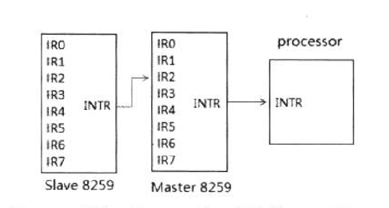

每个8259A PIC的IR口都接一条IRQ线。主片的IR0 ~ IR7对应着IRQ0 ~ IRQ7线，除了IR2 pin被接上从片的INTR pin外，从片的IR0 ~ IR7对应着IRQ8 ~ IRQ15线。由于从片串联到主片的IR2 pin上，从片的IR1 pin同时接到IRQ2和IRQ9线。

从IBM PC AT/XT时代开始，8259经历了数代的bus和芯片组的变革，保持了绝大部分的兼容性，某些pin的用途已经更改了，如下表所示。

8259 | pin | 典型中断请求源 | 连接pin及功能
---|---|---|---
master | IR0 | timer | 内部的timer counter 0输出，或HEPT timer0
master | IR1 | keyboard | IRQ1通过SERIRQ
master | IR2 | slave 8259 | 从片的INTR输出
master | IR3 | serial port A | IRQ3通过SERIRQ，PIRQ#
master | IR4 | serial port B | IRQ4通过SERIRQ，PIRQ#
master | IR5 | parallel port | IRQ5通过SERIRQ，PIRQ#
master | IR6 | floppy | IRQ6通过SERIRQ，PIRQ#
master | IR7 | parallel port | IRQ7通过SERIRQ，PIRQ#
slave | IR0 | real time clock | 内部的RTC/HPET timer1
slave | IR1 | generic | IRQ9通过SERIRQ，SCI，TCO，PIPQ#
slave | IR2 | generic | IRQ10通过SERIRQ，SCI，TCO，PIPQ#
slave | IR3 | generic | IRQ11通过SERIRQ，SCI，TCO，PIPQ#
slave | IR4 | PS/2 mouse | IRQ12通过SERIRQ，SCI，TCO，PIPQ#
slave | IR5 | internal | 通过处理器的FERR#
salve | IR6 | SATA | SATA primary
salve | IR7 | SATA | SATA secondary

## 2.1 IRQ的优先级

在8259中断控制器中，IR0 pin接收的中断请求优先级最高，IR7 pin接收的中断请求优先级最低。从片8259接在主片的IR2 pin时，从片的所有中断请求级别都相当于IRQ2。IRQ线优先级别由高到底的次序是：IRQ0，IRQ1，IRQ8 ~ IRQ15，IRQ3 ~ IRQ7。

## 2.2 中断请求状态——IRR寄存器

当每条IRQ线产生了中断请求时，8259内部的IRR（Interrupt Request Register）将记录着对应的IR pin发生中断请求。如果是IRQ10线发生中断请求，则记录在对应从片的IRR寄存器里（IR2 pin的状态）。这时使用in指令读从片的IRR寄存器可以知道IRQ10发生了中断请求。

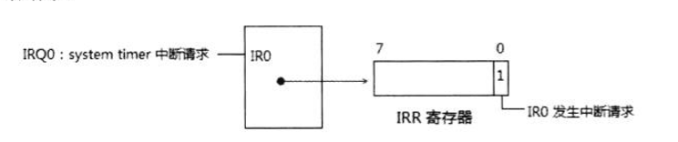

如上图所示，当IRQ0发生中断请求时，IRR寄存器的bit0置位，指示IR0发生了中断请求。

8259控制器内的IRR是一个8位的寄存器，每一位对应一个IR pin引脚。置位指示发生了中断请求。IRR寄存器中的各个位可以同时被置位，指示有多个中断请求发生。

## 2.3 中断服务状态——ISR寄存器

IRQ线上的中断请求，并不意味着会得到8259控制器的响应，允许被处理器响应的中断请求会在8259内部的ISR（Interrupt service register）里记录下来。ISR记录着8259各个IR pin的中断服务状态。

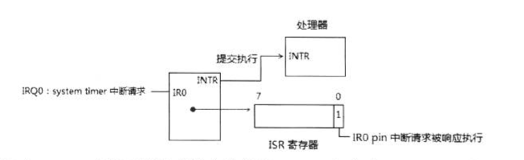

如上图所示，IR0口上的中断请求被允许执行，8259提交到处理器core执行。ISR对应的bit0置位记录着这个pin所接的IRQ0中断请求正在执行。

ISR和IRR一样，ISR也是一个8bit的寄存器，每一位对应一个IR pin引脚。置位指示该pin的中断请求得到响应执行。显然，ISR上的bit不能同时被置位。处理器某一时刻只能服务一个中断请求。

## 2.4 中断屏蔽状态——IMR寄存器

只有当IR pin上的中断请求被允许响应，并且没有更高优先级的中断请求发生时，IRQ线上的中断请求才能被执行。

8259内部的IMR（Interrupt Mask Register）控制着IR pin上的中断请求许可。

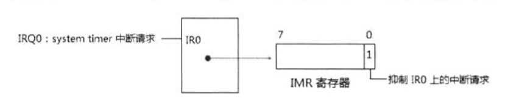

如上图所示，当IMR的bit0置位，则IRQ0上的中断请求被抑制；当IR2被屏蔽时，整个Slave 8259上的所有中断请求将被屏蔽。

IMR与IRR和ISR一样，也是一个8位寄存器，IMR的位可以同时被置位，当IMR的值为0FFh时，指示所有IR pin上的中断请求被屏蔽。对某一个IR pin的屏蔽不会影响到其他IR pin上的中断请求。

## 2.5 中断响应过程

我们可以从Intel提供的chipset datasheet文档里找到关于8259响应中断请求的流程。

1. 当IRQ线上发生中断请求时，8259内的IRR对应的位将置位，这个中断请求可以edge或者level模式触发。
2. 如果这个中断请求时允许的（没被屏蔽），则提交到处理器INTR pin上。
3. 处理器将以中断响应周期（interrupt acknowledge cycle）作为回复，这个cycle被host bridge（CPU-to-PCI bridge）传送到PCH（Platform Controller Hub）上。
4. PCH将这个cycle转化为8259可以响应的两个中断响应脉冲（interrupt acknowledge pulse）出现在master和slave 8259控制器的INTA# pin上。
5. 在接收到第1个INTA#脉冲后，8259进行优先级的仲裁，最高的中断请求得到响应，ISR寄存器相应的位置位，IRR寄存器对应的位被清0。
6. 如果slave 8259赢了中断仲裁（即slave上有优先级别高的中断请求），则master 8259通过一条3位宽的内部线向slave8259传送一个从片标识码（slave identification code），slave 8259会对这个code进行检查，决定是否在第2个INTA#脉冲时恢复一个interrupt vector，当这个code与slave 8259内部的identification code相符时（初始化设置），slave 8259必须回复一个interrupt vector通过data bus给processor。
7. 如果master 8259赢了中断裁决，则master 8259在第2个INTA#脉冲时，会回复一个interrupt vector通过data bus给processor。
8. 中断完成后，在AEOI（automatic End of Interrupt）模式里，8259在第2个INTA#结束后自动清ISR相应的位。否则必须发送EOI命令给8259。

### 2.5.1 edge触发

8259可以选择中断请求使用edge模式还是level模式触发，当选择edge模式时，IRQ的中断请求在一个low-to-high（低电平到高电平）的转化过程中触发。

### 2.5.2 level触发

当选择level模式触发时，中断请求将在high-level（高电平）时触发，IRQ不需要检测low-to-high这个转变过程。

我们看到了edge触发与level触发的不同：

- 在edge触发模式里，可以维持一个high level而不会触发第二次中断请求。
- 在level触发模式里，不能维持在high level上，否则会产生多次中断请求。

### 2.5.3 发送EOI命令

当中断服务例程执行完毕后，在非AEOI模式下应发送EOI（End Of Interrupt）命令到8259，指示这个中断请求已经相应并执行完毕。8259收到EOI命令会请ISR的相应位，指示没有中断请求被执行。

# 3. 8259编程

我们可以在intel提供的chipset datasheet文档里找到关于8259中断控制器上编程的详细说明。根据以往经验，不同的chipset（芯片组）中关于PCI-to-ISA bridge的LPC控制器功能大致上是一样的。

## 3.1 8259控制器I/O地址

8259中断控制器的寄存器实行I/O地址映射方式，使用IN和OUT指令来访问8259中断控制器寄存器。
1. 端口20H：属于master 8259的ICW1、OCW2、OCW3寄存器。
2. 端口21H：属于master 8259的ICW2、ICW3、ICW4、OCW1寄存器。
3. 端口A0H：属于slave  8259的ICW1、OCW2、OCW3寄存器。
4. 端口A1H：属于slave  8259的ICW2、ICW3、ICW4、OCW1寄存器。

多个寄存器共用一个端口，由写入的值来选择使用哪个寄存器。

## 3.2 8259初始化——ICW初始化命令字

在使用8259控制器前分别对master和slave进行初始化设置，每个8259初始化设置流程是依次写入4个ICW（Initialization Command Word，初始化命令字）：从ICW1到ICW4。

### 3.2.1 ICW1字（固定值）

master片上的ICW1寄存器在端口20h，slave片上的ICW1寄存器在A0h，它们的格式是一样的。

ICW1字所有位都需写入固定的值。
1. bit0（ICW4 write required）：这个位指示在后续的初始化字中需要写入ICW字，这个位必须写入1。
2. bit1（single or cascade）：必须为0值，指示使用两片8259的串联模式。
3. bit2：忽略，必须为0值。
4. bit3（edge/level select）：这个位设置8259的触发模式，现已忽略，必须为0值。这个功能已经被ELCR（edge/level triggered control register）所替代。
5. bit4（ICW/OCW select）：这个位指示写入的是ICW还是OCW，对于ICW1来说，必须写入1值。
6. bit5 ~ bit7：必须写入000值。

因此，实际上ICW1字时固定的00010001B值（11h）。

### 3.2.2 ICW2字（设置Interrupt vector）

8259的ICW2寄存器用来设置主/从片的interrupt vector，它的结构如下图所示：

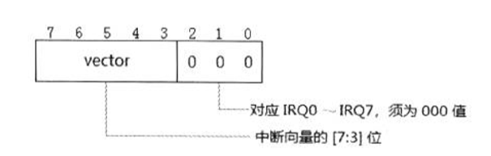

ICW2字的低3位[2:0]设置是IRQ0 ~ IRQ7的值，ICW2[7:3]用来设置Interrupt vector值，典型地：
1. 对于master片来说，ICW2字的值是08h，也就是IRQ0的中断向量是08h，IRQ1 为09h，以此类推，IRQ7 为0Fh。
2. 对于 slave片来说，ICW2字的值是70h，也就是IRQ9的中断向量是70h，IRQ10为71h，以此类推，IRQ15为77h。

然而，08h ~ 0Fh号中断向量属于x86体系预定义的vector号，08h是#DF异常使用的vector号。显然在保护模式下不能使用08h ~ 0Fh作为IRQ0 ~ IRQ7的中断向量。我们至少需要对主片的ICW2设置为其他的值。

### 3.2.3 ICW3字（固定值）

主片的ICW3字和从片的ICW3字的格式和意义是不同的。

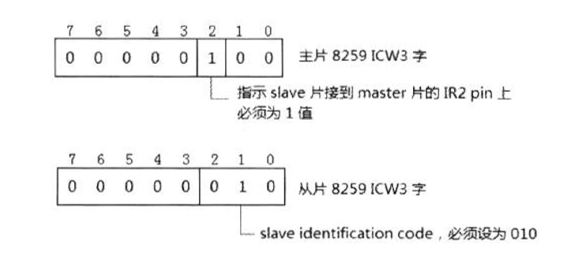

主片和从片的ICW3字的值都是固定的。

1. 主片ICW3字为04h值：bit2值须为1，指示slave片接到master片的IR2口上（或说IRQ2）。其他位必须为0值。
2. 从片ICW3字为02h值：ICW3[2:0]设置slave片的salve identification code（从片标识码），这个必须为02h。[7:3]域必须为0值。

> 在中断响应过程里，在接到第1个INTA#脉冲，slave片有更高优先级的中断请求时，master片会发送一个slave identification code给slave片，salve片会使用它的ICW3[2:0]域里的值，和master片发送的 slave identification code 进行比较，相等时，slave片必须回复一个interrupt vector给处理器，处理器会使用这个vector调用相应的中断服务例程。

slave片的ICW3[2:0]定义的值必须为02h，因此我们可以判断，master片广播的slave identification code应该是02h值。

### 3.2.4 ICW4字（设置AEOI/Nested模式）

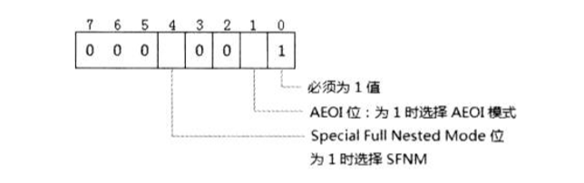

ICW4除了bit1和bit4外，其余位都须是固定值。

1. bit0：必须1值，指示是基于intel的体系。
2. bit1（AEOI）：当为1时选择AEOI（Automatic End Of Interrupt）模式。仅使用在master片上，不能使用在slave片上。
3. bit2（master/slave in buffer mode）：必须为0。
4. bit3（buffer module）：必须为0，使用non-buffer模式。
5. bit4（SFNM位）：当为1时使用Special Full Nested Mode，为1时使用Full Nested Mode。SFNM模式使用在master片上。
6. ICW4[7:5]：必须为000值。

**AEOI(Automatic End Of Interrupt)模式**

在AEOI模式里，在第2个INTA#脉冲时，8259自动发送一个non-specific EOI命令给master片，因此AEOI模式使用在多个8259串联的master片上。

**Full Nested Mode：**

这个模式下，中断请求的优先级次序是从IRQ0 ~ IRQ7（中断请求的优先级可以通过OCW2字改变），IRQ0高，IRQ7低。

当处理器响应执行中断，8259的ISR相应的位置位，指示中断服务例程正在执行。这个ISR的相应位直到下面情形被清位：
1. AEOI模式下：在第2个INTA#脉冲时，8259自动清位。
2. non-AEOI模式下：在中断服务例程返回前，发送EOI命令给8259进行清位。

当ISR的某位置位时，所有优先级相同及优先级较低的中断请求都会被抑制，优先级更高的中断请求得到响应。

特别是，当slave片的中断请求得到响应正在执行。由于slave片链接到master片的IR2 pin上，那么对应的master片ISR寄存器bit2置位（指示slave片的中断请求正在服务中），这个时候所有slave片的后续中断请求（在slave片中有优先级更高的）将被抑制。

    
**Special Full Nested Mode：**

然而，在master片设置为Special Full Nested Mode的情况下，在ISR的bit2置位时，master片并不会锁定IRQ2中slave片其他的中断请求。这时候，当slave中还有更高优先级的中断请求发生，slave中更高优先级的中断请求将会得到响应执行。

那么在这种情况下，在slave片的中断服务例程里必须检查slave片的ISR，判断是否有多个中断服务例程在执行（高优先级服务例程中断低优先级服务例程的情况）。当中断服务例程通过读取ISR的位检查到只有一个服务例程在执行，中断服务例程必须发送EOI命令给slave片，然后也需要发送EOI命令给master片（通知master片IRQ2已经没有中断服务例程执行），master片进行ISR的bit2清位。

## 3.3 8259操作字——OWC控制操作字

在8259中定义了三个OCW（operational control word，操作控制字），用来操作8259的运行。

### 3.3.1 中断屏蔽（写入OCW1字）

OCW1寄存器的每一位对应一条IRQ线，置位将屏蔽IRQ的中断请求。

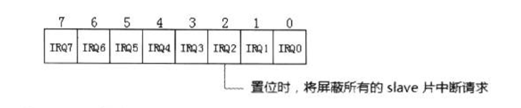

特别是，当OCW1寄存器bit2置位时将屏蔽slave片中的所有中断请求。

### 3.3.2 EOI命令/中断优先级（写入OCW2字）

在OCW2寄存器里可以设置中断优先级，以及给8259发送EOI命令。

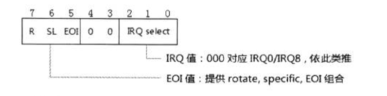

OCW2字分别3部分：
1. OCW2[2:0]：设置一个IRQ值，0 ~ 7对应于主/从片的IRQ0/IRQ8到IRQ7/IRQ15。
2. OCW2[4:3]：对应OCW2字必须为00，指示选择OCW2字。
3. OCW2[7:5]：提供一个Rotate、Specific、以及EOI的组合值，如下表所示。

rotate | specific | EOI | 描述
---|---|---|---
0 | 0 | 0 | rotate in AEOI mode(clear)
0 | 0 | 1 | non-specific EOI command
0 | 1 | 0 | no operation
0 | 1 | 1 | specific EOI command
1 | 0 | 0 | rotate in AEOI mode(set)
1 | 0 | 1 | rotate on non-specific EOI command
1 | 1 | 0 | set priority command
1 | 1 | 1 | rotate on specific EOI command

**提供Specific值**

如上表所示，当bit 6置位时提供一个specific IRQ值，这个值从OCW2字的[2:0]而来。

**普通的EOI命令**

当OCW2[7:5]域为001值（non-specific EOI command）时，发送一个普通的EOI命令。

**普通的automatic rotate**

OCW2字的R=1时使用automatic rotate模式，例如：当R=1，SL=0，EOI=1时，发送一个rorate on non-specific EOI（自动循环的普通EOI）命令，这个命令使用在数个优先级相同的设备上。

8259使用一个8位的循环队列形式，当一个中断服务例程完毕后（发送这个EOI命令）这个设备的优先级自动排在队列的后面（也就是降为最低优先级别）。

**特定的automatic rotate模式**
R=1，SL=1时，使用一个特定的automatic rotate模式，例如：当R=1，SL=1，EOI=1时，发送一个rotate on specific EOI（自动循环的指定EOI）命令。

OCW2[2:0]域需要提供一个IRQ值，这个IRQ对应的设备将自动降到最低优先级别。例如：假设IRQ5设为最低优先级，那么发送一个值为E5h(R=1, SL=1, EOI=1, IRQ=5)的OCW2字给8259，IRQ6将变成最高优先级。

### 3.3.3 OCW3字

OCW3字的用途使多样的。

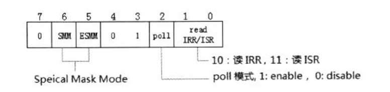

对于OCW3字来说，[4:3]必须为01值，指示选择OCW3字，[1:0]指示读IRR或ISR。
1. 10B：读IRR。
2. 11B：读ISR。
3. 00B或01B：无操作

bit2置位时，使用poll模式，下一个对8259的读操作被作为中断响应周期。

bit5使SMM enable位，为1时允许设置SMM位（bit6）。bit5为0，bit6被忽略。

**普通Mask Mode**

在一般情况下，IRQ的中断请求得到响应执行，ISR相应位置位，在中断服务例程发起EOI命令前，ISR的位不会清位，8259会抑制优先级低的IRQ。

例如：当IRQ0的timer中断服务例程在执行，ISR的bit0置位，在timer handler内IRQ1 ~ IRQ7的中断请求被抑制，知道timer handler发送EOI命令退出。

**Special Mask Mode**

然而，在中断服务例程里可以使用OCW3字来设置SMM（special mask mode），当发送一个OCW3字命令使用ESMM=1，SMM=1时，则使用special mask mode。

special mask mode允许在中断服务例程利动态依据IMR及IRR来响应中断请求，而不需要理会ISR。

回到上面的例子，在IRQ0的timer handler里，发送OCW3命令并使用SMM，那么8259动态根据IRR和IMR的情况来响应中断请求。这种情况下，即使优先级别低的IRQ1也会得到响应并执行。

## 3.4 设置edge和level触发模式

在8259里，可以设置IRQ的trigger mode（触发模式），在现在的8259里这个机制已经被增强。

### 3.4.1 ELCR寄存器

在ISA bus时代的ICW1字里的edge/level选择位已经被两个专门的ELCR（edge/level riggered control register）代替（ELCR1和ELCR2）。

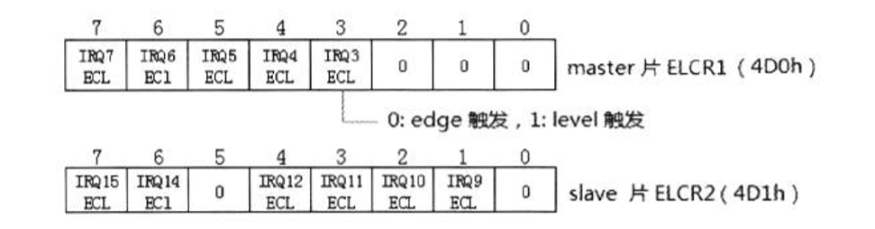

ELCR1的I/O端口使4D0h，ELCR2的I/O端口使4D1h，每一位对应一个IRQ设置，为0时属于edge触发模式，为1时属于level触发模式。

然后，主片的IRQ0、IRQ1、IRQ2必须为0值，也就是必须为edge触发模式，从片的IRQ8和IRQ13必须为0，也就是必须为edge触发模式。

因此，timer、RTC、keyboard中断请求都必须以edge形式触发。
