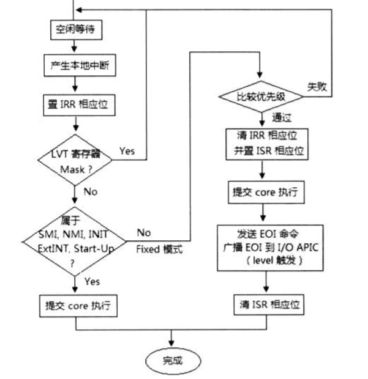
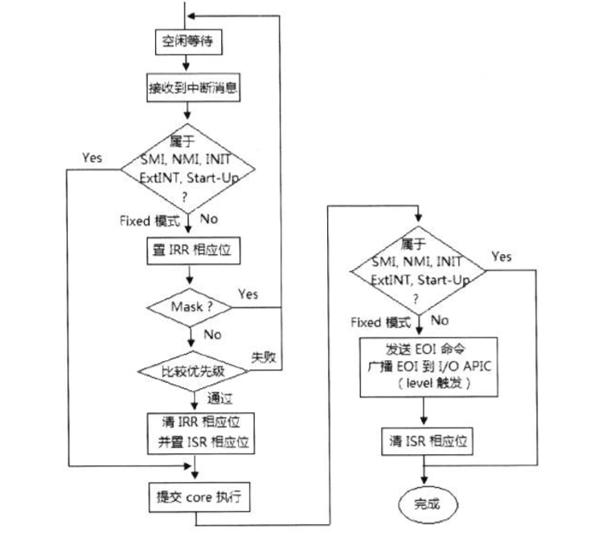
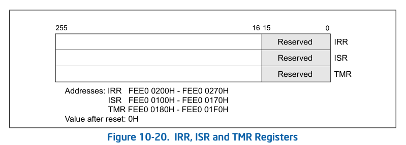
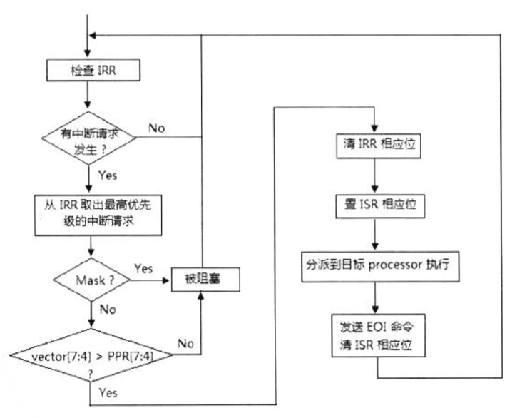

- 1 local APIC的中断处理
    - 1.1 local interrupt（本地中断源）的处理
    - 1.2 system bus上中断消息的处理
- 2 检查目标
- 3 IRR和ISR冲裁
    - 3.1 IRR寄存器的状态
    - 3.2 从IRR中取出最高优先级的中断请求
    - 3.3 ISR寄存器的状态
    - 3.4 是否被屏蔽
    - 3.5 判断优先级
    - 3.6 清IRR相应的位
    - 3.7 置ISR相应的位
- 4 发送EOI命令

# 1. local APIC的中断处理

在system bus上的所有处理器都能接收来自local APIC的本地中断源，来自system bus上的中断消息以及外部设备的I/O中断源。

## 1.1 local interrupt（本地中断源）的处理

local APIC的LVT寄存器能产生中断，LVT LINT0能接收外部8259中断控制器的中断请求，LVT LINT1能接收外部设备的NMI中断请求。



本地中断源受LVT寄存器的mask（屏蔽）位影响，当LVT寄存器的mask位置位时，本地中断源将被屏蔽不能被响应。

同时，本地中断受IRR（Interrupt Request Register）、ISR（In-Service Register）的仲裁影响，这部分的处理与system bus上使用Fixed交付模式的中断消息处理时一致的。

## 1.2 system bus上中断消息的处理

当local APIC接收到system bus上的中断消息，包括IPI消息及I/O APIC发送过来的中断消息，local APIC将首先判断自己是否属于中断消息请求的目标对象，正如我们前面使用logical目标模式发送IPI消息时，local APIC将比较destination field里的值，判断自己是否属于IPI消息的目标。如果是，按下面的典型中断处理流程执行。



对于使用SMI、NMI、INIT、ExtINT以及Start-up的delivery mode的中断请求，无须经过IRR和ISR寄存器的仲裁规则，直接发送processor core进行处理。

# 2. 检查目标

local APIC接收到system bus上来自I/O APIC的中断消息或者IPI（处理器间消息）后，需要检查是否在消息发送的目标内。而local APIC本地产生的中断源（即由LVT寄存器产生的中断）则不存在这个问题。

如前面的IPI机制所述，IPI消息目标的确定依赖于shorthand或no shorthand类型，还包括physical目标模式和logical目标模式。

# 3. IRR和ISR冲裁

对于使用Fixed交付模式的system bus上的中断消息以及本地中断，local APIC将使用IRR（Interrupt Request Register，中断请求寄存器）和ISR（In-Service Register，服务状态寄存器）进行仲裁。实际上还有受TPR（Task Priority Register）和PPR（Processor Priority Register）的影响。



IRR、ISR、TMR（Trigger Mode Register，触发模式寄存器）的每1位对应一个中断vector，共256位，对应256个vector。当中断请求发生，local APIC接受了中断请求并在IRR相应的位置位，则IRR中有多少位置位表示local APIC已经接受了多少个中断请求。



## 3.1 IRR寄存器的状态

local APIC会不断地检查IRR，看是否有中断处理需要，IRR会出现下列情况。
1. IRR为0，表示没有中断请求发生。
2. IRR有1个或数个位被置位，表示有1个或多个中断请求需要处理。

当处理器在运行着中断服务例程时，可能会不断有新的中断请求发生，IRR只能接受一个vector号对应的中断请求。当一个中断请求发生而IRR相应的位已经被置位，这个中断请求可能会被忽略、

当IRR寄存器取的中断派分到处理器执行，IRR的相应位会被清位，local APIC可以重新接受这个vector的中断请求。

## 3.2 从IRR中取出最高优先级的中断请求

当IRR记录着有数个中断请求时，local APIC抽取出最高优先级的中断请求，根据vector的大小来决定。

```asm
    bsr eax, IRR    ; 从IRR得到被置位的最高位
```

local APIC从IRR中找到为1的最高位，这个位就是最高优先级中断的vector值。

## 3.3 ISR寄存器的状态

local APIC会记录在已经分派给处理器正在处理的中断请求，ISR同样会有下列状态。

1. ISR为0，表示没有中断服务例程在执行。
2. ISR有1个或多个位被置位，表示有1个或多个中断服务例程正在执行。

出现有多个中断服务例程在执行时由于前一个中断服务例程在运行期间，有更高优先级的中断请求发生，local APIC分派这个更高优先级的中断请求给处理器执行。

前一个中断服务例程尚未执行完毕（未发送EOI命令给local APIC），ISR的相应位还未被清位。当高优先级的中断服务例程执行完毕后返回到被前一个被中断的服务例程继续执行，才有机会发EOI命令进行清位。

## 3.4 是否被屏蔽

对于可屏蔽的中断请求（LVT寄存器的local Interrupt源，以及Fixed交付模式的IPI消息），下面的情形下可以被屏蔽。

1. eflags.IF被清位，则所有可屏蔽的中断都被屏蔽。
2. LVT寄存器的mask位被置位，将屏蔽对应的中断请求。

system bus上的IPI消息（使用Fixed Delivery模式）也受到IF标志位的影响。值得注意的是，当中断服务例程使用Interrupt-gate时，进入中断服务例程处理器会自动清IF标志，屏蔽新的中断请求。

当中断请求被屏蔽，处理器将阻塞中断请求的执行，直至条件允许。

## 3.5 判断优先级

local APIC将从IRR抽取出来的最高优先级中断请求和“处理器当前优先级”进行比较，如前面所述，处理器当前优先级记录在PPR（Processor Priority Register）里。

当IRR寄存器记录的中断请求优先级高于PPR寄存器里的中断门坎值时，中断请求将得到响应。否则将处于pending状态悬挂着。

## 3.6 清IRR相应的位

当IRR记录的中断请求被允许响应时，local APIC将清IRR相应的位，表示该中断请求得到响应。

## 3.7 置ISR相应的位

local APIC将在ISR相应位置1，指示该中断请求正在执行，并提交到处理器core取执行中断处理程序。

# 4. 发送EOI命令

在使用Fixed delivery模式时，每次执行完中断处理程序必须发送EOI命令到local APIC。

```asm
    mov DWORD [APIC_BASE + EOI], 0      ; 发送EOI命令
```

发送EOI命令，使得local APIC将清ISR寄存器的相应位，指示中断服务例程已经完成。