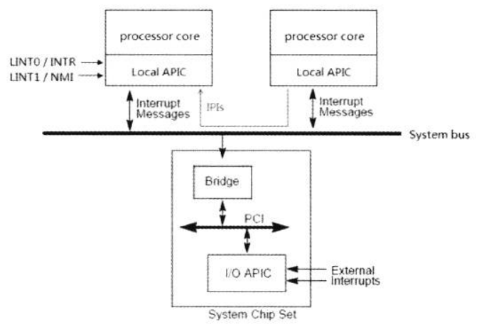

- 概述
- 1 Interrupt Source
    - 1.1 硬件中断
        - 1.1.1 Maskable Interrupt
        - 1.1.2 Non-Maskable Interrupt
    - 1.2 软件中断
- 2 Exception Source
    - 2.1 运行错误产生的异常
    - 2.2 由软件主动发起的异常
    - 2.3 Machine Check异常
- 3 Execption的恢复
    - 3.1 Fault类型的异常
    - 3.2 Trap类型的异常
    - 3.3 Abort类型的异常
        - 3.3.1 #DF（Double Fault）异常
- 4 中断Vector
- 5 中断的屏蔽
    - 5.1 可屏蔽的中断
        - 5.1.1 自动屏蔽中断
        - 5.1.2 当外部中断使用保留的vector时
        - 5.1.3 暂时抑制#DB异常
        - 5.1.4 当指令执行stack切换时
    - 5.2 不可屏蔽的中断
        - 5.2.1 使用NMI_EN寄存器
        - 5.2.2 使用LVT LINT1寄存器

# 概述

我们将对Interrupt（中断）和Exception（异常）进行总体上的探讨。在x86/x64体系中，中断与异常使用相同的执行环境和机制，包括：
1. 使用在同一个IDT（Interrupt DEscriptor Table）或IVT（Interrupt Vector Table）。
2. 同在一个Vector范围（0 ~ 255）内。
3. 在Handling Interrupt（中断处理）流程上是一致的，当然会有一些额外的区别。

中断和异常事件可以是主动发起和被动产生的，它们在处理器流程中有几个显著的区别。
1. 对于硬件产生的**可屏蔽中断**事件，在ISR（中断服务例程）处理完毕后比附发送EOI（End Of Interrupt）命令通知Interrupt Controller（中断控制器）。
2. 对于某些异常来说，处理器会产生相应的Error Code（错误码），Exception处理器程序可以根据情况进行处理。
3. 外部和内部的硬件中断请求，可以进行mask（屏蔽），除了NMI（不可屏蔽中断）和一些由处理器pin产生的中断事件（例如：SMI）外。
4. 对于异常来说是不可屏蔽的。

>  我们并不需要过多地关注于：什么是中断？  什么是异常？  它们的区别是什么？

在某些时候我们或许可以看到对中断进行synchronous（同步的）和asynchronous（异步的）之分，在Intel64手册没有看到过对中断进行这些区分。我们不必去过度关注这些概念，那并不是重点。

我们将区分使用Interrupt（中断）和Exception（异常）的术语，除非特别说明，否则他们将互不适用。

# 1. Interrupt Source

可产生中断的中断源来自：
1. 硬件上产生的中断
2. 软件上产生的中断

在硬件上的来自于处理器外部和处理器内部。处理器外部硬件中断来自各种pin信号接口和Local APIC的LINT0和LINT1引脚，以及由外部I/O APIC发送过来的中断消息。

在一个支持APIC模块的处理器上，典型地，LINT0被链接到ISA bus的8259A PIC（Programming Interrupt Controller）上，LINT1会链接到NMI pin上。

## 1.1 硬件中断

外部硬件中断来自处理器的INTR pin、NMI pin和I/O APIC的中断消息，我们看看下面关于APIC架构的图。



这是一幅很经典的APIC结构图，上面介绍了处理器所接受的中断源，包括：
1. 由local APIC的LINT0接口连接到8259A的INTR接口上，当APIC被disable的时，LINT0口被直接作为外部中断控制器8259A的INTR接口，接受来自8259A的中断请求。
2. LINT1接受来自外部的NMI请求。
3. 处理器也接收来自主板芯片组（Chipset）上的I/O APIC模块发送的Interrupt Message。
4. 在处理器内部local APIC产生的中断事件，例如：LVT timer事件或performance monitoring事件等。
5. 在MP环境中，处理器也响应其他processor core发过来的IPI（Inter-Processor Interrupt）处理器间的中断。

这些IPI中断通过system bus进行传递，或许并不能称为硬件中断，称为内部中断较为合适。

### 1.1.1 Maskable Interrupt

可屏蔽的中断如下：
1. 通过处理器的INTR pin接收到的中断请求，典型地，INTR链接到8259A中断控制器上。在支持APIC的处理器上，LINT0 pin被作为INTR使用连接外部中断控制器。
2. 通过local APIC产生的本地中断源。
3. 来自芯片组的I/O APIC产生的中断消息。

### 1.1.2 Non-Maskable Interrupt

通过处理器NMI pin接收的中断请求时不可屏蔽的，在支持APIC的处理器上LINT1 pin被作为NMI pin使用，接收来自外部的NMI信号。

## 1.2 软件中断

在软件上可以使用INT指令主动发起中断，进入中断处理程序，如下：
```
    int 0x80            ; 执行0x80号中断服务例程
```
这条指令将调用0x80的中断服务例程，INT指令可以使用0 ~ 255中的任何值作为中断向量进行调用。

Intel特别提到：当使用2号（即NMI中断vector）调用中断时，由硬件产生的NMI将不能被响应。

# 2. Exception Source

可产生异常的异常源来自：
1. 运行的代码产生了错误，从而引发异常产生。
2. 由软件主动引发的异常。
3. Machine-Check引发的异常。

异常是不能被屏蔽的，无论是执行错误还是主动引发异常，实质上是在处理器内部引发。

这个不可屏蔽与NMI是不同的：
1. NMI由硬件引发，包括：外部NMI源，local APIC，I/O APIC交付的NMI。
2. 对于外部NMI源可以通过de-assert PIN方式或屏蔽LINT1的方式来屏蔽中断。

## 2.1 运行错误产生的异常

由运行代码错误产生的异常时很常见的，在保护模式下我们或许会常与#GP（General Protected）异常或#PF（Page Fault）异常打交道。

在下面情况下代码会产生运行错误：
1. 代码产生逻辑错误：典型地，除0错误将产生#DE（Divide Error）异常。
2. 处理器遇到了无法执行的错误：例如#UD（Invalid Opcode）异常，处理器遇到不支持的指令，它不可能得到执行。
3. 代码违反了处理器的某些保护措施：典型地如#GP异常、#PF异常、#SS异常等。这些措施是处理器为了某些管理机制而设置，违反这些措施处理器将产生异常来提醒软件。

后面我们将会看到这些异常有些可以恢复，有些是并不能恢复的。

## 2.2 由软件主动发起的异常

软件可以使用下面的指令发起异常：
1. INT3指令：处理器遇到INT3指令（opcode码为0xCC）产生#BP（Bra查看Point）断点异常。
2. INTO指令：软件执行INTO指令，处理器检测到eflags寄存器的OF标志位置位时，将产生#PF（Overflow）溢出异常。
3. BOUND指令：软件执行BOUND指令，处理器检测到操作数越界时将产生#BR（Bound Range）异常。

## 2.3 Machine Check异常

处理器提供了对处理器内部或外部进行检查的机制，当检测到错误发生时，处理器将产生#MC（Machine Check异常）。

# 3. Execption的恢复

当异常发生时，处理器将进入异常处理程序，执行完毕后处理器将回到被中断的代码流程里继续执行。而回到代码的哪个位置执行，以及哪些异常的产生处理器是不能恢复的，这些都决定于异常的类型。

在x86/x64体系里，有三种异常，如下：
1. Fault类型
2. Trap类型
3. Abort类型

## 3.1 Fault类型的异常

当人家执行错误而产生fault类型的异常时，处理器允许（且必须）进入异常处理程序对这个错误进行修正后重新回到产生异常的指令继续执行。
因此，fault类型的异常将：
1. 处理器保存产生异常的指令执行之前的状态，包括：SS、ESP、EFLAGS、CS、EIP（当权限级别不变时为EFLAGS、CS、EIP），这个EIP（返回地址）是指向产生异常的指令。
2. 处理器将回到产生异常的指令继续执行。

典型地像#GP和#PF异常时属于fault类型。OS的#GP处理器里必须对这个错误进行改正，以便处理器回到产生异常的指令继续执行，否则只会继续引发异常。

对Fault类型的一些异常，典型地，OS的处理时强行终止进行的运行或者说杀死产生Fault类型异常的进行，以这种方式来跳出异常处理！（从逻辑上来说是忽略异常。）

## 3.2 Trap类型的异常

当产生Trap类型的异常时，处理器允许忽略异常继续往下执行。在异常处理程序里不必须修正错误回到发生异常指令的下一条指令继续执行。
因此，trap类型的异常将：
1. 处理器保存执行完产生异常指令后的状态，返回地址将指向下一条指令。
2. 处理器将回到发生异常指令的下一条指令继续执行。

事实上，属于Trap类型的异常很少，如下：
1. #BP（BrackPoint）异常
2. #PF （Overflow）异常
3. #DB（Debug）异常：在#DB异常中有部分是Trap类型，有部分是Fault类型。

我们看到，trap类型的异常发生并不影响后续的指令流的执行。因此，我们可以说trap类型的异常错误并不重要，甚至并不能说是错误。

Intel特别提出了一个事例：如果一个trap类型的异常发生在jmp指令后，那么处理器从异常处理程序返回后，将来到jmp指令的目标地址去执行，而不是jmp指令的下一条指令。

## 3.3 Abort类型的异常

当abort类型的异常产生时，意味着处理器遇到一个非常严重的错误。abort类型的异常将使处理器无法回到正常的指令流里继续执行。

有两类异常属于Abort类型：
1. #DF（Double Falut）异常
2. #MC（Machine Check）异常

当abort异常发生后，在异常处理器程序里唯一能做的是：如果可以就报告当前处理器状态，然后对机器进行shutdown或reset之类处理。

## 3.3.1 #DF（Double Fault）异常

当一个fault类型的异常发生，处理器正在调用这个异常的处理程序，可是并**没有成功**进入这个异常的处理器程序执行。
在这个**调用过程中**，处理器又检测到另一个fault异常的产生。于是处理器无法继续执行这个双重的fault异常，从而产生另一个异常#DF（Double Fault）。

并不是每个异常都可以产生#DF异常，以下是产生#DF异常的条件：

\ | 当调用下列的中断处理器程序时 | 再次产生下列中断
---|---|---
1 | #DE异常 | #DE异常
1 | #TS异常 | #TS异常
1 | #NP异常 | #NP异常
1 | #SS异常 | #SS异常
1 | #GP异常 | #GP异常
2 | #PF异常 | #DE异常
2 | #PF异常 | #TS异常
2 | #PF异常 | #NP异常
2 | #PF异常 | #SS异常
2 | #PF异常 | #PG异常
2 | #PF异常 | #PF异常

我们看到，第1类里不包括#PF（Page Fault）异常。也就是说，引发#GP异常，处理器准备执行#GP处理程序时，又发生了#PF异常，这个#PF异常将得到正确的处理，不会引发#DF异常。

> 问题其实很简单：第1次的异常处理程序并没有执行，第2次产生的异常处理程序也没有被执行。最后处理器会进入#DF处理器程序里执行。

# 4. 中断Vector

中断vector是一个字节宽，意味着可以有256个中断vector，从0号到255号，如下所示。


vector | 中断 | 描述 | 类型 | 错误码
---|---|---|---|---
0 | #DE | divide error | fault | 无
1 | #DB | debug异常 | fault/trap | 无
2 | #NMI | NMI | 由中断决定 | 无
3 | #BP | breakpoint | trap | 无
4 | #OF | overflow | trap | 无
5 | #BR | bound rage | fault | 无
6 | #UD | undefined opcode | fault | 无
7 | #NM | device not available | fault | 无
8 | #DF | double fault | abort | 有（0）
9 | - | - | - | -
10 | #TS | invalid TSS | fault | 有
11 | #NP | Segment not present | fault | 有
12 | #SS | stack-segment fault | fault | 有
13 | #GP | general protection | fault | 有
14 | #PF | page fault | fault | 有
15 | - | - | - 
16 | #MF | x87 FPU error | fault | 无
17 | #AC | alignment check | fault | 有（0）
18 | #MC | Machine check | abort | 无
19 | #XM | SIMD Exception | fault | 无
20 ~ 31 | - | - | -
32 ~ 255 | - | 用户使用 | Interrupt | - 

我们看到由0 ~ 31号的中断vector是intel为中断/异常预定义使用或保留的。从32 ~ 255号的中断vector可以开放给用户为自己的中断服务例程定义使用。

用户不应该使用0 ~ 31号作为自己的中断服务例程的vector，在local APIC LVT寄存器的vector使用0 ~ 15作为vector，将是非法的。
local APIC将作为错误记录下来。

# 5. 中断的屏蔽

对中断的屏蔽由两种情况：maskable（可屏蔽的）以及non-maskable（不可屏蔽的）。

## 5.1 可屏蔽的中断

由Interrupt Controller（中断控制器）管理的硬件中断属于可屏蔽的中断，包括：
1. 由8259A PIC控制的外部中断。对于Intel的处理器来说，8259A的INTR引脚接到处理器LINT0接口上。
2. 在local APIC里产生的中断。
3. 在I/O APIC里产生的中断。

对这些中断源，我们可以使用下面的方法进行屏蔽：
1. 清eflags.IF标志位：当eflags.IF=0时，处理器将不相应这些可屏蔽的中断。
2. 在8259中断控制器的IMR（Interrupt Mask Register）寄存器对IRQ相应的位置1将屏蔽对应的中断请求。
3. 在local APIC LVT寄存器和I/O APIC redirection table寄存器的mask位进行屏蔽。

在Intel中还可以对LVT LINT0屏蔽达到对所有8259中断控制器发出的中断请求屏蔽的需求。

在8259A中断控制器中，对Master和Slave的8259A写入OCW1（operation control word，也就是Interrupt mask字）屏蔽相应的IRQ。

对于清eflags.IF标志位，可以使用下面的方法：
1. 使用CLI指令清IF标志位
2. 使用POPF指令来修改eflags.IF标志位
3. 使用IRET指令来修改eflags.IF标志位

当使用CLI指令和POPF指令清IF标志位时，必须要有足够的权限：
- 当CPL <= eflags.IOPL时，IF标志位允许修改。
- 当CPL > eflags.IOPL时，使用POPF修改IF会被忽略，而使用CLI来清IF标志会产生#GP异常。

### 5.1.1 自动屏蔽中断

当中断或异常使用Interrupt-gate描述符来获得中断服务例程时，处理器响应中断和异常，进入ISR（中断服务例程）。处理器同时会自动清IF标志位，在中断/异常处理程序中屏蔽中断的请求。

当处理器从中断/异常处理程序中退出时，处理器将从stack中的eflags映射来恢复原来的IF标志位。而对于Trap-gate类型的中断服务例程，处理器并不会清IF标志位。

### 5.1.2 当外部中断使用保留的vector时

我们知道，0 ~ 31号vector是为exception预定义或被保留的。在下面的中断触发情形：
1. 通过INTR pin接到处理器的外部中断（8259中断控制器）。
2. 通过外部I/O APIC发送的中断消息。
3. 在处理器内部的本地中断源（local APIC）。

这些中断vector号使用0 ~ 15值将产生错误，处理器会拒绝执行并记录错误。如果使用16 ~ 31值不会发生错误，但这样做会执行错误的异常处理程序。

当处理器在接收到这些硬件中断请求，并使用这些保留的vector调用中断处理器程序，可是这里可能会产生问题：

- 譬如：19号vector是用于#XM处理程序（使用于SSE系列指令产生的numeric异常），加入8259A使用19号作为IRQ的vector，那么在处理器通过INTR接收并调用19号的处理器程序进行处理。

- 譬如：如果使用17号vector来执行外部中断服务例程，处理器并不会再stack中加入error code（错误码）。而这个处理程序是为一个正常的#AC异常而准备的（发生#AC异常时，处理器会压入error code），代码如下：
```asm
ac_handler:
    pop eax             ; 获得error code
    
    ...
    ...
    ...
    
    iret
```
如上图所示，在#AC处理程序中会从Stack中获得error code。但是当被用于硬件服务中断时，这里将会产生严重错误（Stack将被破坏）。

> 这个保留的vector是0 ~ 31而不是 0 ~ 32。

### 5.1.3 暂时抑制#DB异常

当eflags.RF=1时，可以起到对#DB异常进行暂时抑制的作用。可是RF标志位的作用只有一次，并且仅使用在fault类型的#DB异常才有意义。

当发生fault类型的#DB异常时，处理器将回到发生#DB异常的位置继续执行，对eflags.RF进行置位可以让处理器顺利执行发生#DB异常的指令。
然后eflags.RF被自动清0。

因此，我们看到RF标志的作用是防止发生#DB异常的指令或位置重复产生#DB异常（进入一个死循环中）。

### 5.1.4 当指令执行stack切换时

在执行下面的指令序列时：
```asm
    mov ss, ax                  ; 切换Stack
    mov esp, STACK_POINTER      ; 设置Stack pointer时，发生中断或#DB异常
```
当执行完mov ss,ax指令时发生中断或#DB异常，处理器将抑制中断或#DB异常的执行。这个中断是硬件中断，而异常仅限于#DB异常，这个#DB异常可以是：
1. TF=1引发的sing-step #DB异常。
2. 调试断点引发的#DB异常。

而其他异常将得到正常相应，典型地如#GP异常。

因此，Intel推荐使用LSS指令一次性装载SS和ESP寄存器。

## 5.2 不可屏蔽的中断

一般情况下non-maskable中断是不可屏蔽的，但是某些情况下又必须对NMI进行屏蔽，典型的是在系统初始化阶段。

有两种方式可以对NMI进行屏蔽：通过NMI_EN寄存器与LVT LINT1寄存器。

### 5.2.1 使用NMI_EN寄存器

在芯片组LPC bridge的processor interface Register（处理器接口寄存器）有一个NMI_EN寄存器，I/O端口地址是70h（实际上也是RTC的index寄存器），对Bit 7置位将屏蔽所有NMI源。
```asm
    ; macro: NMI_DISABLE
    ; description: set NMI_EN register bit7 to 1
    %macro NMI_DISABLE 0
        in al, NMI_EN_PORT              ; port 0x70
        or al, 0x80                     ; disbale all NMI sources
        out NMI_EN_PORT, al
    %endmacro
```
上面这个宏NMI_DISABLE将对70h端的bit7置位，实现屏蔽NMI。当清位时可重新开启NMI的许可。

### 5.2.2 使用LVT LINT1寄存器

在Intel的处理器上页可以通过对LVT LINT1寄存器的屏蔽来达到目的，这是因为NMI链接到LVT LINT1上：
```asm
    bts DWORD [APIC_BASE + LVT_LINT1], 16           ; mask位置位
```
上面这条代码对LVT LINT寄存器的16位（mask位）置位实现屏蔽NMI。
