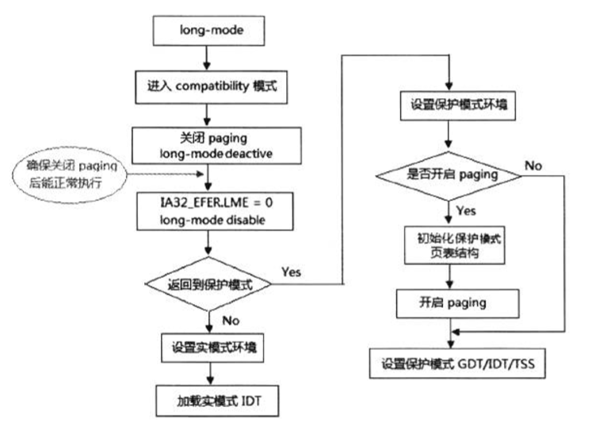

- 1 概述
    - 1.1 退出long-mode的制约条件
- 2 实验从long-mode返回到实模式中

# 1. 概述

退出long-mode的情景比进入long-mode要复杂。因为，我们需要确保退出long-mode能保持正常工作。



上面是退出long-mode的简要流程，我们看到可以分为两大类：退出long-mode返回到保护模式或者返回到实模式。

值得注意的是，当关闭paging机制时，我们需要保持后续的执行流能够得到正常的执行，也就是说，失去页的映射后，后续的指令地址还是正确的。
要达到这个要求，我们必须在关闭paging机制前，额外提供一对一的页映射模式（虚拟地址和物理地址一一对应，它们是相等的）。

## 1.1 退出long-mode的制约条件

同样，由于long-mode的enable与active状态。我们在退出long-mode时，也要遁循它的制约条件：
1. 在关闭long-mode（IA32\_EFER.LME=0）前，必须先使long-mode处于的active（非活动）状态，即先关闭paging机制。
2. 在关闭paging机制前，必须先退出64位模式（CS.L=1），也就是说，必须先使CS.L=0（即先切换到compatibility模式）。
3. 在关闭PAE分页模式前，必须先关闭paging机制。也就是说，不能在long-mode active的状态下对CR4.PAE进行修改。

因此，如上所示，最关键的退出操作次序如下：
1. 切换到compatibility模式。
2. CR0.PG=0关闭paging机制，使用long-mode处于非激活状态。
3. IA32\_EFER.LME=0，关闭long-mode。

# 2. 实验从long-mode返回到实模式中

```asm
    ; 切换到compatibility模式
    jmp DWORD far [compatibility_pointer]
    
compatibility_pointer:
    dd compatibility_entry                  ; 适用Intel64和AMD64
    dw 08h                                  ; 16位的compatibility模式
    
    ; 以下是16位compatibility模式代码
    bits 16

compatibility_entry:
    ; 关闭paging
    mov eax, cr0
    btr eax, 31                             ; CR0.PG = 0
    mov cr0, eax
    
    ; 关闭PAE
    mov eax, cr4
    btr eax, 5                              ; CR4.PAE = 0
    mov cr4, eax
    
    ; 关闭long-mode
    mov ecx, IA32_EFER
    rdmsr
    btr eax, 8                              ; IA32_EFER.LME = 0
    wrmsr
    
    ; 设置保护模式环境
    mov ax, 0x10                            ; 加载为16位的描述符
    mov es, ax
    mov ds, ax
    mov ss, ax
    mov esp, 0x7ff0
    
    ; 关闭保护模式
    mov eax, cr0
    btr eax, 0                              ; CR0.PE =0
    mov cr0, eax
    
    jmp 0:real_entry                        ; 刷新CS

real_entry:
    ; 设置实模式环境
    mov ax, 0
    mov es, ax
    mov ds, ax
    mov ss, ax
    mov sp, 0x7ff0
    
    ; 加载实模式IVT
    lidt [IVT_POINTER]                      ; 加载实模式IVT表
    mov si, msg1                            ; 打印实模式下测试信息
    call puts
    
    jmp $
```
这里直接切换到16位的compatibility模式（L=0并且D=0）。
在返回到实模式前，必须要对各段寄存器进行加载，加载的段描述符要符合：DPL为0值，limit为64K的段界限。

显然，这些属性是为实模式而准备的，当然如果还是使用4G的段界限，那么这个实模式属于big-read mode或者说unreal-mode形式（即实模式下访问4G的空间）。