- 1 概述
    - 1.1 处理器模式的判断
    - 1.2 64位模式下的段描述符
    - 1.3 long-mode的gate描述符
    - 1.4 long-mode的描述符表结构
    - 1.5 Long-mode的段寄存器
        - 1.5.1 设置FS和GS的base值
        - 1.5.2 交换GS.base值
    - 1.6 Long-mode的paging机制
- 2 long-mode的指令环境
    - 2.1 64位模式的操作数
        - 2.1.1 默认操作数大小
        - 2.1.2 默认操作数为64位的指令
    - 2.2 64位模式的无效指令
    - 2.3 64位模式的寻址模式
        - 2.3.1 默认地址大小
        - 2.3.2 stack address size（栈地址大小）
        - 2.3.3 stack address（栈地址）与operand address（操作数地址）
        - 2.3.4 指令指针size与operand size

# 1. 概述

long-mode存在两个子模式：compatibility模式和64位模式。因此在long-mode可能存在两个不同的执行环境：
- compatibility模式的执行环境，在compatibility模式下，处理器的行为与legacy模式一般无异。
- 64位模式的执行环境，在64位模式下，处理器可以使用的物理资源得到扩展。

## 1.1 处理器模式的判断

当Code Segment Descriptor被加载到CS寄存器时，CS内部cache内的属性得到更新，我们使用下面的逻辑判断处理器处于什么模式。
```c
    if (IA32_EFER.LMA == 1) { // long-mode
        if (CS.L == 0) {
            // compatibility模式
        } else if (CS.L == 1 && CS.D == 0) {
            // 64位模式
        }
    } else {
        // legacy模式
    }
```

IA32\_EFER寄存器的LMA位用来判断处理器是否处于long-mode，CS.L标志位用来判断是否处于64位模式。

在long-mode下，有效的64位模式标志是：CS.L=1并且CS.D=0，而CS.L=1并且CS.D=1这个组合是无效的。
在加载CS寄存器时，处理器判断到CS.L=1并且CS.D=1会产生#GP异常。（从这个角度看，实际只需要判断CS.L是否为1就足够了。）

## 1.2 64位模式下的段描述符

和legacy模式一样，在64位模式下，段描述符仍然是8字节宽，然而大部分域和属性都是无效的。

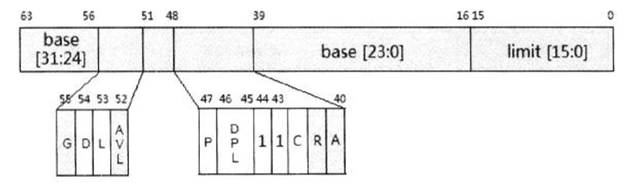

在上面的代码段描述符里，S标志（bit44）和C/D标志（bit43）固定为1值。实际上，在属性域里仅有C、DPL、P、L以及D标志位是有效的。

L和D标志位控制处理器在long-mode子模式的选择及其default operand size（默认操作数大小）。

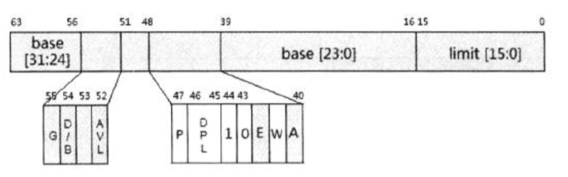

在数据段描述符里，S标志（bit44）为1，C/D标志（bit43）为0。W标志（bit41）仅用于作为Stack段描述符时，处理器在加载时会检查Stack段必须为Writable（可写的）段。而DPL和P标志在加载时会使用，当加载成功后，这些属性都被忽略。

## 1.3 long-mode的gate描述符

在long-mode下，所有的gate描述符的类型都是64位的（描述符的宽度为16字节），包括：
1. 64位Call-gate。
2. 64位Interrupt-gate。
3. 64位Trap-gate。

值得注意的是，在compatibility模式下这些gate描述符类型也是64位的，这根本决定了运行在compatibility模式下的代码当进入0级权限后（通过调用call gate，或者通过中断调用方式），必须从compatibility模式切换到64位模式。

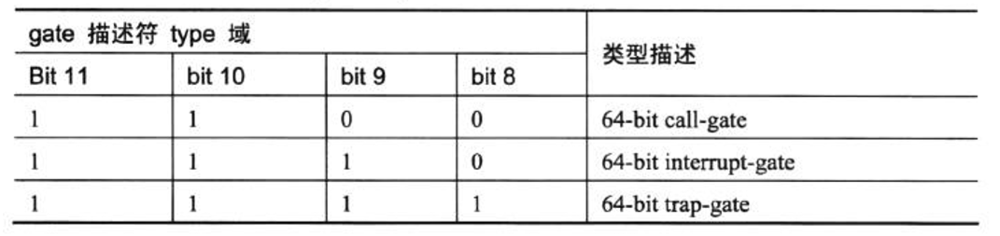

在long-mode下，gate描述符的类型除上表所列值外，其他值都是无效的。

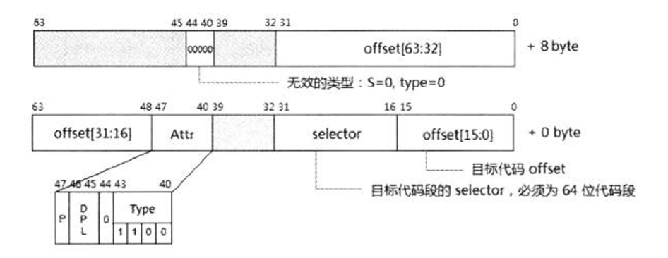

Call-gate描述符type值为1100B。由于call-gate放在GDT或LDT表里，因此在高8字节的S标志为0，type值为0，这是一个无效的描述符类型，用来防止对它的错误引用（即高8字节被错误当做段描述符来使用）。

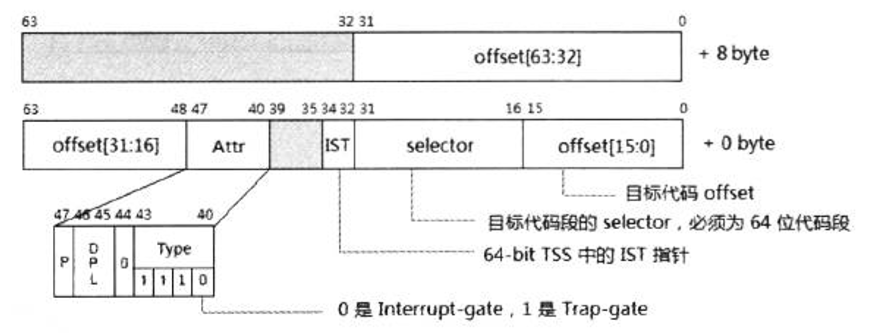

Interrupt-gate和Trap-gate描述符的结构是完全相同的，当type值为1110B时为Interrupt-gate，当type值为1111B时为Trap-gate。

在Interrupt/Trap-gate描述符里增加了一个IST域，可以为Interrupt Handler提供额外的stack指针，当IST值为非0时，IST值用来在当前TSS块里查找相应的stack指针值。

> 在long-mode下并不存在Task-gate描述符，基于TSS的任务切换机制将不再支持。

## 1.4 long-mode的描述符表结构

在long-mode下，除了IDT内的描述符固定为16字节外。GDT和LDT与legacy模式下一般无异（Call-gate是16自己外）。

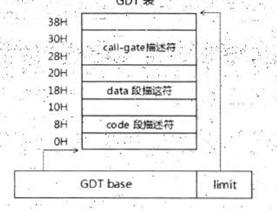

在这个GDT里可能会存在Call-gate描述符，它在long-mode下是16字节，它的高8位S与type值为0，可以有效地区别于其他的描述符。

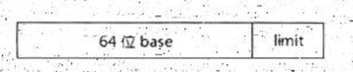

如上所示，在long-mode模式下GDTR和IDTR寄存器的base值被扩展为64位，而limit值仍然是16位不变。
即使在compatibility模式下，GDTR.base与IDTR.base都是64位。

然而，在compatibility模式下，所有段寄存器的base值只能使用低32位。例如：FS.base在64位模式使用64位基地址，而在compatibility模式下只能使用低32位。

GDT内的TSS与LDT描述符在compatibility模式下是32位类型，这与legacy模式下是一样的。
在compatibility模式下加载TSS或LDT描述符，处理器会以legacy模式的行为进行加载。

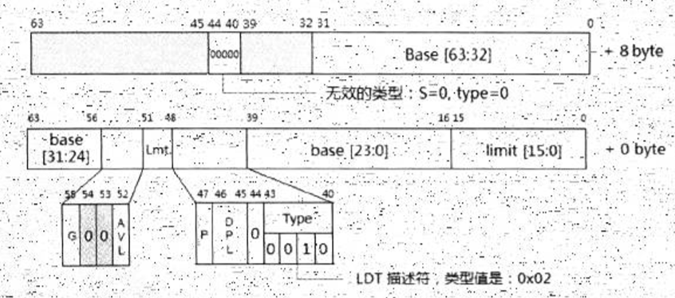

在compatibility模式下，LDT描述符与legacy模式是一致的（32位TSS类型8字节宽），而在64位模式下LDT描述符也被扩展为64位16字节宽。
与call-gate描述符同样的处理手法，高8字节的S和type值为0。

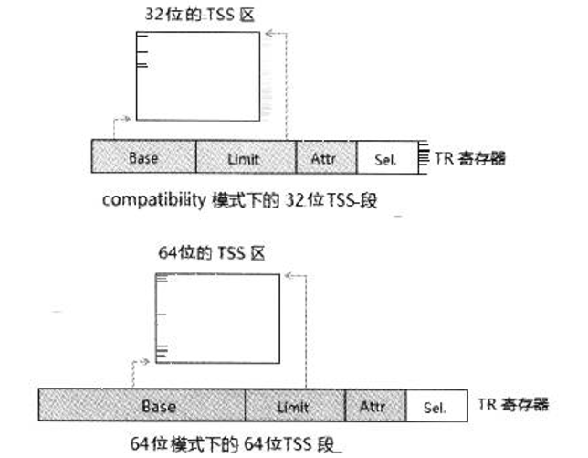

在64位模式下，LDTR寄存器与TR寄存器的base值扩展为64位，而在compatibility模式下与legacy模式下是一致的（base值仍然使用32位）。

对于TSS段的结构在64位模式和compatibility模式下也会不同，如上所示，在compatibility模式还是使用32位格式的TSS段。

## 1.5 Long-mode的段寄存器

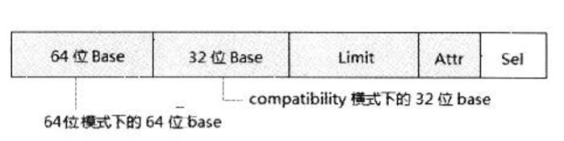

段寄存器的base域在64位模式下被扩展为64位，对于CS、ES、SS和SD寄存器来说这个64位的基地址值没什么意义。
在64位模式下，这些段的基地址值被强制为0值。

64位的段基地址值对于FS和GS寄存器来说才有意义，FS和GS寄存器可以由软件设置非0的64位值。

## 1.5.1 设置FS和GS的base值

使用段描述符的加载方法，只能加载一个32位的base值，在x64体系中，新增了两个MSR寄存器：IA32\_FS\_BASE和IA32\_GS\_BASE。
它们分别映射到FS.base和GS.base。

```asm
    ; 设置FS.base
    mov ecx, IA32_FS_BASE
    mov eax, fs_base_low32          ; 低32位
    mov edx, fs_base_hi32           ; 高32位
    wrmsr
    
    ; 设置GS.base
    mov ecx, IA32_GS_BASE
    mov eax, gs_base_low32          ; 低32位
    mov edx, gs_base_hi32           ; 高32位
    wrmsr
```
如上所示，对这两个寄存器进行写可以设置相应的64位base值。

## 1.5.2 交换GS.base值

SYSCALL指令使用一个特殊的方式来达到设置RSP寄存器的目的，x64体系提供了另一个寄存器：IA32\_KERNEL\_GS\_BASE。

IA32\_KERNEL\_GS\_BASE寄存器用来保存OS的Kernel数据结构：
```asm
    mov rax, kernel_data_table
    mov rdx, rax
    shr rdx, 32
    mov ecx, IA32_KERNEL_GS_BASE
    wrmsr
    
    ;; kernel数据结构实例
kernel_data_table:
    kernel_stack_pointer    dq   0xfffff80000fffff0     ; RSP值
    ... ...
```
在syscall指令进入系统服务例程里，使用SWAPGS指令来交换GS.base与IA32\_KERNEL\_GS\_BASE寄存器的值。
```asm
syscall_service:
    swapgs                          ; 交换GS.base与IA32_KERNEL_GS_BASE值
    mov rsp, gs:[0]                 ; 获得kernel的stack指针
    push rbp                        ; 在kernel stack上保存数据
    ...
    ...
    pop rbp
    swapgs                          ; 退出前交换原来的GS.base值
    db 0x48
    sysret
```
当然，IA32\_KERNEL\_GS\_BASE寄存器并不只是使用在获取RSP值上，完全可以作为他用。

## 1.6 Long-mode的paging机制

在long-mode下只能使用一种分页模式（long-mode分页模式，或者说IA-32e paging模式），在IA-32e paging模式下，使用4级的页转换表结构。
在x64体系中，在64位模式里实现的最高线性地址为48位。这48位的线性地址在4K页面映射下被分割成5个部分：
1. PML4TE index（bit47 ~ bit 39）
2. PDPTE index（bit38 ~ bit30）
3. PDE index（bit29 ~ bit21）
4. PTE index（bit20 ~ bit12）
5. page offset（bit11 ~ bit0）

IA-32e paging能使用的页面大小为：
1. 4K
2. 2M
3. 1G

# 2. long-mode的指令环境

在x86/x64体系的指令执行环境中，有几个知识是很重要的：
- operand-size（操作数大小）
- address-size（地址大小）
- stack-address size（栈地址大小）
- instruction pointer size（指令指针大小）

## 2.1 64位模式的操作数

在long-mode下，当CS.L=1并且CS.D=0时，处理器将运行在64位模式。可是并不代表指令的操作数是64位的。

### 2.1.1 默认操作数大小

在64位模式下，仅有少数指令的默认操作数是64位，大多数指令的默认操作数仍是32位的。
在默认操作数为32位的情况下，访问64位的操作数必须使用REX prefix。

在64位模式下可以使用16位的操作数，但是在下面的情形里是不能使用32位的操作数的:
- 当指令的default operand size（默认操作数）是64位的情况下，指令能通过operand override prefix来使用32位的操作数。

下表总结了64位模式下指令操作数的使用情况。

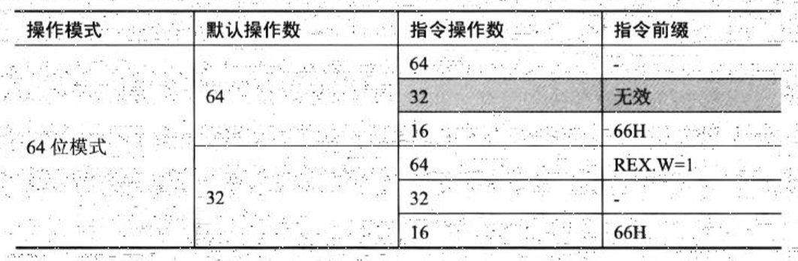

在上面这个表格里，我们看到了64位模式下的两种default operand size（默认操作数大小）：64位和32位。

当指令的默认操作数是64位时，使用64位的操作数无须加上REX prefix（前缀），使用66H prefix可以改成为16位的操作数，如下所示。
```asm
    bits 64         ; 为64位模式编译
    
    push ax         ; 加上66H prefix
    push eax        ; 无效的操作数！不能使用32位的操作数
    push rax        ; 无须加prefix
```
这条push指令的默认操作数是64位的，那么push eax这条指令时错误的（无效的32位操作数）。

当指令的默认操作数是32位时，使用64位的操作数需要加上REX prefix（REX.W=1），这个REX前缀的W标志必须为1值。

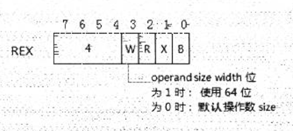

```asm
    bits 64         ; 为64位模式编译
    
    mov ax, bx      ; 加上66H prefix
    mov eax, ebx    ; 无须加prefix
    mov rax, rbx    ; 加上48H prefix
```
这条mov指令在64位模式下的默认操作数为32位，因此使用64位的操作数，编译器会自动生成一个REX prefix（48H）。

### 2.1.2 默认操作数为64位的指令

少数指令的默认操作数是64位的，这些指令分为两大类：
- 依赖于RIP指针的near branch（近程分支）指令
- 依赖于RSP指针的stack操作指令


指令 | 依赖于 | 描述
---|---|---
CALL | RIP与RSP | near call指令
RET | RIP与RSP | near ret指令
JMP | RIP | near jmp指令
Jcc | RIP | 条件jmp指令
LOOP | RIP | 循环指令
LOOPcc | RIP | 条件循环指令
PUSH | RSP | 压stack指令
POP | RSP | 出stack指令
PUSHF/Q | RSP | 压入flags/rflags寄存器
POPF/Q | RSP | 弹出flags/rflags寄存器
PUSH FS | RSP | 压入FS寄存器
PUSH GS | RSP | 加入GS寄存器
POP FS | RSP | 弹出FS寄存器
POP GS | RSP | 弹出GS寄存器

这些64位操作数的指令不使用far pointer（远程指针），而使用far pointer类的分支指令（如：ref指令与iret指令）默认操作数是32位的。
```asm
    db 48h          ; 在64位模式下手工加上REX.W=1
    retf            ; far ret指令
```
编译器不支持RETFQ（类似这种64位的助记符）形式，需要使用64位的操作数时，必须手工加上REX prefix。
不像IRETQ指令（支持64位的助记符），编译器会帮我们加上REX prefix。

## 2.2 64位模式的无效指令

部分指令在64位模式下将是无效的，如下表所示。

指令 | 描述
---|---
AAA | ASCII调整指令
AAD | ASCII调整指令
AAM | ASCII调整指令
AAS | ASCII调整指令
DAA | decimal调整指令
DAS | decimal调整指令
ARPL | 调整RPL指令
BOUND | 检查bound指令
INTO | overflow中断指令
CALL（direct far）| 远程的直接调用（call ptr16:32/64形式）
JMP（direct far）| 远程的直接跳转（jmp ptr16:32/64形式）
LDS | 加载DS far pointer
LES | 加载ES far pointer
PUSH CS | CS寄存器压入stack
PUSH DS | DS寄存器压入stack
PUSH ES | ES寄存器压入stack
PUSH SS | SS寄存器压入stack
POP DS | DS寄存器出stack
POP ES | ES寄存器出stack
POP SS | SS寄存器出stack
PUSHA，PUSHAD | GPR寄存器入stack
POPA，POPAD | GPR寄存器出stack
PUSHFD | EFLAGS寄存器入stack
POPFS | EFLAGS寄存器出stack
SALC | 设置AL寄存器
LAHF | 依赖于CPUID.80000001H:ECX[0] = 1
SAHF | 依赖于CPUID.80000001H:ECX[0] = 1
SYSENTER | 在AMD64的long-mode下无效
SYSEXIT | 在AMD64的long-mode下无效

SALC这条指令比较奇怪，在AMD的opcode表上出现并没对指令进行说明。
在Intel上是不存在的。
LAHF和ASHF指令在64位模式下依赖于CPUID.80000001H:ECX[0]的值是否为1。

- 在AMD64平台上，SYSENTER和SYSEXIT指令只支持在legacy模式上使用，在Long-mode是无效的。
- 在Intel64平台上，SYSCALL和SYSRET指令仅支持在64位模式下。

## 2.3 64位模式的寻址模式

64位的寻址模式在32位寻址模式的基础上扩展而来，最大的区别是：所有base和index寄存器都扩展为64位寄存器，并新增了一个RIP-relative（RIP相对）寻址。

### 2.3.1 默认地址大小

在64位模式下，指令的default address size（默认地址大小）是64位的，这与default operand size（默认操作数大小）有很大的区别。

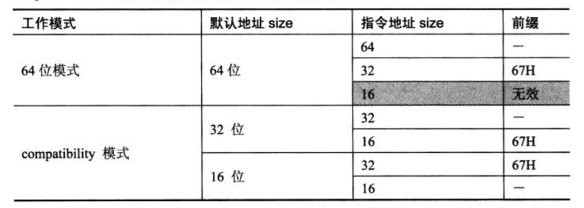

指令的默认地址大小相同由CS.L和CS.D标志决定：
1. 当CS.L=1并且CS.D=0时，默认的地址是64位。
2. 当CS.L=0并且CS.D=1时，在compatibility模式下，使用32位的默认地址。
3. 当CS.L=0并且CS.D=0时，在compatibility模式下，使用16位的默认地址。

在64位模式下，16位的地址是无效的。使用32位的地址，必须加上67H前缀（address override prefix）。
```asm
    bits 64
    
    mov rax, [esi]          ; 64位模式下使用32位的地址
```
在上面这条指令里，使用了32位的地址值，编译器在生成机器指令时会加入67H前缀。

### 2.3.2 stack address size（栈地址大小）

在64位模式下，stack地址大小（即RSP寄存器代表的stack pointer值）固定为64位，并不因为使用67H前缀而改变。

```asm
    bits 64
    
    push rax        ; 隐式使用64位rsp指针
    db 67h          ; 企图改变栈地址，实际上是改变操作数地址
    push rax        ; 固定使用64位的stack address值
```
在上面示例的最后一种情形里，企图加上67H前缀更改stack address大小，这将是失败的。
push rax指令使用固定的64位RSP值。这是因为stack address（栈地址）和operand size（操作数地址）由本质区别，后面我们将看到。

### 2.3.3 stack address（栈地址）与operand address（操作数地址）

stack地址大小与指令操作数地址大小是不同的概念：
- operand address size：是指操作数的寻址。
- stack address size：是指stack的地址宽度。

```asm
    mov rax, [esp]          ; operand address size是32位
    mov rax, [rsp]          ; operand address size是64位
    push qword [eax]        ; stack address是64位，operand address是32位
```
我们看到最后一条指令push qword [eax]将出现两个address size：
- operand address size
- stack address size

Stack address大小是由SS寄存器的B标志位决定，在legacy模式和compatibility模式下：
- B=1时，属于32位的ESP指针
- B=0时，属于16位的SP指针

然而在64位模式下，SS寄存器的B标志位是无效的，RSP固定为64位。因此stack address大小固定为64位，不会被改变。

### 2.3.4 指令指针size与operand size

在这里同样遭遇了“栈地址与操作数地址”的问题，Instruction Pointer（指令指针）RIP值如同stack pointer（栈指针）RSP值，在64位模式下固定为64位。

然而指令指针大小与操作数大小也是本质不同的事物。与push指令一样，jmp/call指令也会同时面对指令指针与操作数这两个事物。
```asm
    jmp eax                 ; 不被支持
    jmp ax                  ; 操作数为16位，RIP指针固定为64位
    jmp rax                 ; 64位的RIP值，操作数为64位
    jmp offset32            ; 32位offset值符号扩展到64位加上RIP
```
当jmp/call指令提供寄存器和内存操作数时，在64位模式下32位的操作数不被支持。
在jmp ax这条指令里，它的操作数是16位，ax寄存器的值最终会被零扩展到64位然后加载到RIP里。