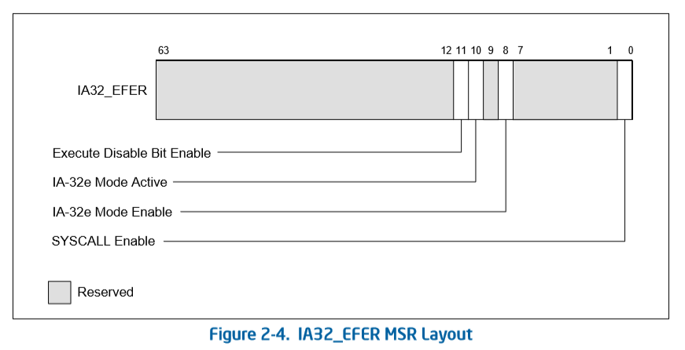
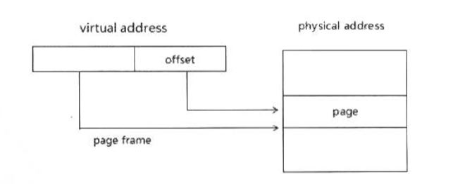

- 概述
- 1 物理页面大小
- 2 页面转换模式（Paging Mode）
    - 2.1 32位页转换模式
    - 2.2 PAE页转换模式
    - 2.3 IA-32e页转换模式
- 3 Paging机制下使用的资源
    - 3.1 控制寄存器介绍
    - 3.2 扩展特性标志寄存器介绍
    - 3.3 CPUID查询leaf
        - 3.3.1 CPUID.01H leaf功能
        - 3.3.2 CPUID.07H leaf功能
        - 3.3.3 CPUID.80000001H leaf功能
        - 3.3.4 CPUID.80000008H leaf功能
    - 3.4 分页机制相关寄存器及控制标志位
- 4 页面转换表资源
    - 4.1 32位paging模式
    - 4.2 PAE paging模式
    - 4.3 IA-32e paging模式
- 5 表项

# 概述

在代码中的logic address（逻辑地址）经过segmenation（段式管理）转化为linear address（线性地址）后，如果开启了paging（页式管理）机制，这些linear address是virtual address形式，在paging内存管理中，这些virtual address被分成内存page的形式映射到物理地址空间的物理页面上。

```
logic address --> [Segmentation] --> linear address --> [Paging] --> physical address
```


# 1. 物理页面大小

在整个x86/64体系里共有4种页面尺寸，如下表所示：


分页模式 | 小页面 | 大页面 | 巨型页
---|---|---|---
32-bit Paging | 4K | 4M | --
32-bit PAE Paging | 4K | 2M | --
IA-32e Paging | 4K | 2M | 1G

- 32位paging模式（non-PAE模式）：可以使用4K页面和4M页面。
- 32位paging模式（PAE模式）：可以使用4K页面和2M页面。
- IA-32e模式：可以使用4K、2M和1G页面。

4K页面的offset值：12bit
4M页面的offset值：22bit
2M页面的offset值：21bit
1G页面的offset值：30bit

> IA-32e模式下线性地址高16位作为符号扩展，因此只实现了48位线性地址。

# 2. 页面转换模式（Paging Mode）

按Intel的分类，页转换模式（Paging mode）可分为三类：
1. 32-bit paging（32位页面转换模式）：即non-PAE模式。
2. PAE paging（Physical Address Extensions页转换模式）。
3. IA-32e paging（IA-32e页转换模式）：对应于AMD64的long-mode。

## 2.1 32位页转换模式

在32位页转换模式里，CR4.PAE=0关闭PAE，32位的线性地址可以映射到超过32位的物理地址上（由MAXPHYADDR所决定），处理器可以使用2种页转换表。
1. 4K页面的page-translation table（页转换表）。
2. 4M页面的page-translation table（页转换表）。

> 这些页转换表结构都是32位宽的，意味着只能提供最高32位的物理地址。

## 2.2 PAE页转换模式

当开启CR4.PAE=1时，处理器使用PAE页转换模式。在PAE模式下可以使用最高52位的物理地址，当前x86/x64体系中所描述的最高的物理地址就是52位。

在PAE页转换模式下，使用2种页面转换表结构。
1. 4K页面的转换表结构。
2. 2M页面的转换表结构。

> 在PAE页转换模式里，处理器会忽略CR4.PSE控制位的作用

## 2.3 IA-32e页转换模式

使用IA-32e paging模式需要处理器支持IA-32e模式（即long-mode），进入了IA32e工作模式也就使用了IA-32e paging模式。

IA-32e paging必须开启CR0.PAE功能。因此，IA-32e paging模式是在PAE的基础上扩展而来，增加了一级页转换表结构。IA-32e paging使用了4级页转换结构，包括下面的页面结构。
1. 4K页面的转换表结构。
2. 2M页面的转换表结构。
3. 1G页面的转换表结构。

> 在64位模式下，处理器将48位的virtual address转换为物理地址。在compatibility模式下，处理器将转换32位的virtual address。

# 3. Paging机制下使用的资源

## 3.1 控制寄存器介绍


Bit | Description
---|---
CR0.PG | Paging (bit31 of CR0)
CR0.CD | Cache Disable (bit 30 of CR0)
CR0.NW | Not Write-through (bit 29 of CR0)
CR0.AM | Alignment Mask (bit18 of CR0)
CR0.WP | Write Protect (bit16 of CR0)
CR0.NE | Numeric Error (bit5 of CR0)
CR0.ET | Extension Type (bit4 of CR0)
CR0.TS | Task Switched (bit3 of CR0)
CR0.EM | Emulation (bit2 of CR0)
CR0.MP | Monitor Coprocessor (bit1 of CR0)
CR3.PCD | Page-level Cache Disable (bit4 of CR3)
CR3.PWT | Page-level Write-Through (bit3 of CR3)
CR4.VME | Virtual-8086 Mode Extensions (bit0 of CR4)
CR4.PVI | Protected-Mode Virtual Interrupts (bit1 of CR4)
CR4.TSD | Time Stamp Disable (bit2 of CR4)
CR4.DE | Debugging Extensions (bit3 of CR4)
CR4.PSE | Page Size Extensions (bit4 of CR4)
CR4.PAE | Physical Address Extension (bit4 of CR4)
CR4.MCE | Machine-Check Enable (bit6 of CR4)
CR4.PGE | Page Global Enable (bit7 of CR4)
CR4.PCE | Performance-Monitoring Counter Enable (bit8 of CR4)
CR4.OSFXSR | Operating System Support for FXSAVE and FXRSTOR instructions (bit9 of CR4)
CR4.OSXMMEXCPT | Operating System Support for Unmasked SIMD Floating-Point Execptions (bit10 of CR4)
CR4.UMIP | User-Mode Instruction Prevention
CR4.VMXE | VMX-Enable Bit (bit13 of CR4)
CR4.SMXE | SMX-Enable Bit (bit14 of CR4)
CR4.FSGSBASE | FSGSBASE-Enable Bit (bit16 of CR4)
CR4.PCIDE | PCID-Enable Bit (bit17 of CR4)
CR4.OSXSAVE | XSAVE and Processor Extended States-Enable Bit (bit18 of CR4)
CR4.SMEP | SMEP-Enable Bit (bit20 of CR4)
CR4.SMAP | SMAP-Enable Bit (bit21 of CR4)
CR4.PKE | Protection-Key-Enable Bit (bit22 of CR4)
CR8.TPL | Task Priority Level (bit3:0 of CR8)

## 3.2 扩展特性标志寄存器介绍

IA32_EFER（extended feature enable register）



Bit | Description
---|---
0 | SYSCALL Enable: IA32_EFER>SCE(R/W)
7:1 | Reserved
8 | IA-32e Mode Enable: IA32_EFER.LME(R/W)
9 | Reserved
10 | IA-32e Mode Active: IA32_EFER.LMA(R)
11 | Execute Disbale Bit Enable: IA32_EFER.NXE(R/W)
63:12 | Reserved


## 3.3 CPUID查询leaf

在paging机制里某些功能需要先查询处理器是否支持，在支持的情况下才可以enable功能。

测试平台：
```
处理器：Intel(R) Core(TM) i3-4160 CPU @ 3.60GHz
操作系统：CentOS 7.4 x86_64
```    

### 3.3.1 CPUID.01H leaf功能

1. ECX[17].PCID位：指示处理器是否支持PCID功能。
```
process context identifiers = true
```
2. EDX[3].PSE位：指示是否支持页面扩展。
```
page size extensions = true
```
3. EDX[6].PAE位：指示是否支持PAE(Physical Address Extensions)模式。
```
physical address extensions = true
```
4. EDX[16].PAT位：指示是否支持PAT(Page Attribute Table)功能。
```
page attribute table = true
```
5. EDX[13].PGE位：指示是否支持PGE(Page Global Enable)功能。
```
PTE global bit = true
```

### 3.3.2 CPUID.07H leaf功能

在07H叶的0H子叶里（EAX=07H，ECX=0H）返回以下内容。

1. EBX[7].SMEP位：指示是否支持SMEP(Supervisor-Mode Execution Prevention)功能。
```
SMEP supervisor mode exec protection = true
```
2. EBX[10].INVPCID位：指示是否支持INVPCID指令。
```
INVPCID instruction = true
```

### 3.3.3 CPUID.80000001H leaf功能

1. EDX[29].LM位：指示是否支持IA32e模式。
```
64-bit extensions technology available = true
```
2. EDX[20].DX位：指示是否支持Execution Disbale功能。
```
execution disable = true
```
3. EDX[26].1G-page位：指示处理器是否支持1G页面。
```
1-GB large page support = true
```

### 3.3.4 CPUID.80000008H leaf功能

这个叶功能将返回MAXPHYADDR值和最高virtual address值。
```
line size (bytes) = 0x40 (64)
maximum physical address bits         = 0x27 (39)
maximum linear (virtual) address bits = 0x30 (48)
```

## 3.4 分页机制相关寄存器及控制标志位

CR0和CR4有许多控制位被使用在pageing机制上。

重要控制寄存器：
- CR0和CR4：包含了很多与CPU工作模式关系密切的重要标志位。
- CR2：用来记录导致缺页错误异常的线性地址。
- CR3：称为页目录基地址寄存器（PDBR，Page-Directory Base Register），包含了页目录的基地址（物理地址）和两个用来控制页目录缓存（caching）的标志PCD和PWT。页目录基地址的低12位被假定位0，因此页目录所在的内存一定是按照页（4KB）边界对齐的。

重要的控制标志：
1. CR0.PG：在CR0.PE=1的基础上，置CR0.PG=1开启pageing机制。
2. CR0.WP：对CR0.WP置位可以启用Write Protect功能，使Supervisor用户也无权对Read-only页进行修改。
3. CR0.CD与CR0.NW：将影响到各级页转换表结构里的PCD和PWT标志，包括CR3。
4. CR4.PSE：置CR4.PSE=1时，配合PDE.PS标志位在32位paging模式里使用4M页面。
5. CR4.PAE：置CR4.PAE=1时，开启PAE pageing模式。CR4.PAE控制位将忽略CR4.PSE的作用。
6. CR4.PGE：置CR4.PGE=1时，配合PDE.G和PTE.G标志启用Global Page功能，当更新CR3时，TLB里Global Page不被刷新。
7. CR4.SMEP：置CR4.SMEP=1时，启用SMEP功能，防止Supervisor用户执行用户代码。
8. CR4.PCIDE：置CR4.PCIDE=1时，启用process-context identifier功能。
9. IA32_EFER.LME：置IA32_EFER.LME=1时，开启long-mode，但需要开启paging机制后才被激活。
10. IA32_EFER.LMA：置CR4.PAE=1，且CR4.PG=1时，激活long-mode。
11. IA32_EFER.NXE：置IA32_EFER.NXE=1时，在PAE paging模式和IA-32e paging模式里启用Execution Disable功能。

# 4. 页面转换表资源

处理器paging机制里使用的各级页转换表，最终是为了查找线性地址映射到物理地址空间上对应的page frame，再由page frame基地址加上page offset值得出最终的物理地址。



在三种paging模式里，根据不同的页面尺寸使用不同的页转换表结构。

## 4.1 32位paging模式

线性地址是32位宽，采用一级或两级页转换表，每个表项大小是4字节宽，CR3使用32位。

1. 4K页面下：使用PDT（Page directory table，页目录表）和PT（page table，页表）两级表格。
```
线性地址构成：
    10（PDT索引，1024个表项） + 10（PT索引，1024个表项） + 12（Page offset，4K页面）

两级页转换表：
    PDT大小是4KB（1024个表项 x 每个表项4字节）
    PT大小是4KB（1024个表项 x 每个表项4字节）
```

2. 4M页面下：使用PDT（Page directory table）一级表格。
```
线性地址构成：
    10（PDT索引，1024个表项） + 22（Page offset，4MB页面）

一级转换表：
    PDT大小是4KB（1024个表项 x 每个表项4字节）
```

## 4.2 PAE paging模式

线性地址32位宽，使用两级或三级页转换表，每个表项8字节宽，CR3还是32位，但只使用了27位，拼凑了32位PDPT物理地址。

1. 4K页面下：使用PDPT（Page directory pointer table，页目录指针表），PDT和PT。
```
线性地址构成：
    2（PDPT索引，4个表项）+ 9（PDT索引，512个表项）+ 9（PT索引，512个表项）+ 12（Page offset，4KB页面）

三级转换表：
    PDPT大小是32字节（4个表项 x 每个表项8个字节）
    PDT大小是4KB（512个表项 x 每个表项8字节）
    PT大小是4KB（512个表项 x 每个表项8字节）
```

2. 2M页面下：使用PDPT和PDT。
```
线性地址构成：
    2（PDPT索引，4个表项）+ 9（PDT索引，512个表项）+ 21（Page offset，2MB页面）

二级转换表：
    PDPT大小是32字节（4个表项 x 每个表项8个字节）
    PDT大小是4KB（512个表项 x 每个表项8个字节）
```

## 4.3 IA-32e paging模式

线性地址48位宽，使用两级到四级的页转换表，每个表项8个字节宽，CR3寄存器是64位宽，针对是否支持PCIDE功能，CR3使用不一样。

1. 4K页面下：使用PML4T（page map level-4 table，四级映射表），PDPT，PDT和PT。
```
线性地址构成：
    9（PML4T索引，512个表项）+ 9（PDPT索引，512个表项）+ 9(PDT索引，512个表项) + 9（PT索引，512个表项）+ 12（Page offset，4KB页面）

四级转换表：
    PML4T大小是4KB（512个表项 x 每个表项8个字节）
    PDPT大小是4KB（512个表项 x 每个表项8个字节）
    PDT大小是4KB（512个表项 x 每个表项8个字节）
    PT大小是4KB（512个表项 x 每个表项8个字节）
```

2. 2M页面下：使用PML4T，PDPT和PDT。
```
线性地址构成：
    9（PML4T索引，512个表项）+ 9（PDPT索引，512个表项）+ 9(PDT索引，512个表项) + 21（Page offset，2MB页面）

三级转换表：
    PML4T大小是4KB（512个表项 x 每个表项8个字节）
    PDPT大小是4KB（512个表项 x 每个表项8个字节）
    PDT大小是4KB（512个表项 x 每个表项8个字节）
```

3. 1G页面下：使用PML4T和PDPT。
```
线性地址构成：
    9（PML4T索引，512个表项）+ 9（PDPT索引，512个表项）+ 30（Page offset，1GB页面）

二级转换表：
    PML4T大小是4KB（512个表项 x 每个表项8个字节）
    PDPT大小是4KB（512个表项 x 每个表项8个字节）
```

# 5. 表项

每个table里的entry（表项）分别称为：
- PTE（Page Table Entry）
- PDT（Page Directory Table Entry）
- PDPE（Page Directory Pointer Table Entry）
- PML4E（Page-map Level-4 Table Entry）