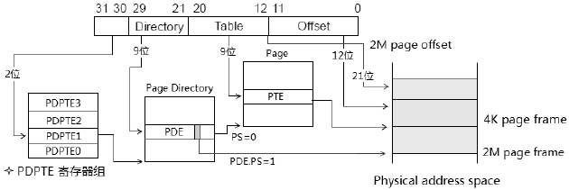
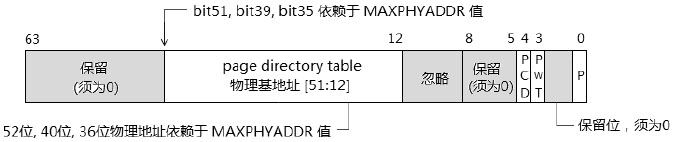
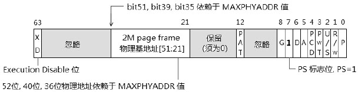
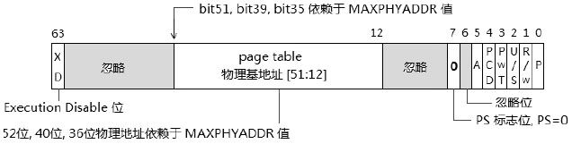
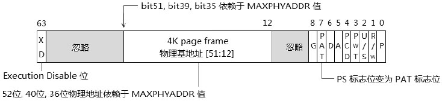

- 1 基本原理
    - 1.1 2M页面
    - 1.2 4K页面
    - 1.3 开启PAE标志
    - 1.4 支持最高52位的物理地址
    - 1.5 Table Entry（表项）的大小
    - 1.6 页表的大小
- 2 在intel64下的CR3与PDPTE寄存器
    - 2.1 CR3
    - 2.2 PDPTE寄存器
    - 2.3 PDPTE寄存器的加载
    - 2.4 PDPTE寄存器的重新加载
    - 2.5 intel64下的新PAE paging模式
- 3 PAE paging模式里的PDPTE结构
- 4 PAE paging模式里的PDE结构
    - 4.1 2M页面下的PDE结构
        - 4.1.1 XD（Execution Disable）标志位
        - 4.1.2 Cache页与Data页
    - 4.2 4K页面下的PDE结构
- 5 PAE paging模式里的PTE结构
- 6 使用和测试PAE paging模式
    - 6.1 设置PAE paging页表结构
    - 6.2 开启PAE paging机制
    - 6.3 开启paging机制
- 7 Page Fault(#PF(14))

# 1. 基本原理

在处理器支持PAE页转换机制的情况下，置CR4.PAE=1开始PAE paging模式，在PAE paging模式下virual address（linear address）依然使用32位宽，如下图所示。


与32位paging模式下不同，在PAE paging模式下使用了3种页表结构。

1. Page Directory Pointer Table（页目录指针表）及PDPT内的PDPE结构。线性地址的[31:30]域是PDPT的索引值，用来在PDPT内查找PDPE结构。PDPE索引值是2位，只能有4个PDPE表项。
2. Page Directory Table（页目录表）及PDT内的PDE结构。线性地址的[29:21]域是PDT的索引值。注意，这个PDT索引值在PAE paging模式下变成了9位，因此可以索引512个PDE表项。
3. Page Table（页表）及PT内的PTE结构。线性地址的[20:12]域是PT的索引值。注意，在PAE paging模式下，这个PT的索引值页变成了9位，因此可以索引512个PDE表项。

## 1.1 2M页面

```
线性地址构成：
    2（PDPT索引，4个表项）+ 9（PDT索引，512个表项）+ 21（Page offset，2MB页面）

二级转换表：
    PDPT大小是32字节（4个表项 x 每个表项8个字节）
    PDT大小是4KB（512个表项 x 每个表项8个字节）
```

灰色线路是2M页面的映射方式，设置PDE.PS=1，那么PDE将指向2M page frame的物理地址，线性地址的[20:0]域将是2M page frame内的offset值。

## 1.2 4K页面

```
线性地址构成：
    2（PDPT索引，4个表项）+ 9（PDT索引，512个表项）+ 9（PT索引，512个表项）+ 12（Page offset，4KB页面）

三级转换表：
    PDPT大小是32字节（4个表项 x 每个表项8个字节）
    PDT大小是4KB（512个表项 x 每个表项8字节）
    PT大小是4KB（512个表项 x 每个表项8字节）
```

黑色线路是4K页面的映射方式，设置PDE.PS=0，那么PDE将指向PT，再由线性地址的[20:12]域来获得PTE表项，得出最终的4K page frame物理地址。线性地址的[11:0]域将是4K page frame内的offset值。

## 1.3 开启PAE标志

在CPUID.10H.EDX[6].PAE位里查询PAE pageing模式是否支持，如果支持后置CR4.PAE为1值，这个PAE paging模式将忽略PSE机制（忽略PCUID.01H:EDX[3].PSE位和CR4.PSE控制位的作用）。


## 1.4 支持最高52位的物理地址

在PAE paging模式里支持最高52位的物理地址，依赖于MAXPHYADDR值。当MAXPHYADDR位36时，只能映射到36位的物理地址，以此类推。

## 1.5 Table Entry（表项）的大小

为了能够支持52位的物理地址甚至更多，每个Table Entry结构被扩展为8个字节64位宽，可是CR3依然只能使用低32位。

## 1.6 页表的大小

PDPT的索引值为2位，索引4个PDPE表项，因此PDPT的大小可以为4x8=32字节。
PDT和PT依然是4K大小，512x8=4K字节。

# 2. 在intel64下的CR3与PDPTE寄存器

Intel实现了一种在PAE paging模式下的全新CR3结构，引入了PDPTE寄存器。

## 2.1 CR3

在这种新实现下，CR3的bit3和bit4位被忽略（不再是PWT和PCD标志位），如下图所示。


这个新实现的CR3低5位被忽略，提供27位的PDPT基地址，32位的PDPT物理地址形成如下：
1. base of PDPT[31:5] = CR3[31:5]，高位27位由CR3提供。
2. base of PDPT[4:0] = 0值，低5位补0。

因此，PDPT的基地址是32字节边界对齐的。这是由于PDPT的size为32字节。

## 2.2 PDPTE寄存器

intel64实现了一组4个PDPTE寄存器，如下图所示。


PAE paging模式下的PDPT只有4个表项：PDPTE0 ~ PDPTE3。

在intel64处理器内部实现了一组PDPTE寄存器来优化PAE paging模式，它们分别是：PDPTE0、PDPTE1、PDPTE2和PDPTE3寄存器。

这些寄存器是处理器内部使用的，外部不可见。

PDPT里的表项（PDPTE）会被加载到相应的PDPTE寄存器，每个PDPTE寄存器控制1G的物理地址区域。

## 2.3 PDPTE寄存器的加载

在下列情况下，会引发加载PDPTE表项到PDPTE寄存器组。

1. 使用mov cr3,reg指令更新CR3时。
2. 在PAE paging模式下，CR0和CR3中与paging机制相关的控制位被修改时，它们包括：CR0.PG、CR0.CD和CR0.NW控制位；CR4.PAE、CR4.PGE、CR4.PSE和CR4.SMEP控制位。
3. 在执行任务切换加载CR3时。

在加载PDPTE寄存器时，处理器会一次性从PDPT里加载4个PDPTE到对应的PDPTE寄存器里。
如上图所示，PDPTE0加载到PDPTE0寄存器，PDPTE1加载到PDPTE1寄存器，PDPTE2加载到PDPTE2寄存器，PDPTE3加载到PDPTE3寄存器。注意下面2点。
1. 在加载时，PDPTE的P标志位为0时不会产生异常。而在使用相应的PDPTE寄存器访问地址时会产生#PF异常。
2. 在加载时，当P标志位=1时，处理器检查到PDPTE的保留位不为0时，会产生#GP异常（注意不是#PF异常）。

不像其他的table entry：当加载到TLB或Paging-Structure Cache中，处理器不会检查table entry的P标志，P标志位为0时将产生#PF异常。

然而PDPTE表项被加载到PDPTE寄存器时：P标志位为0并不产生#PF异常（在访问时检查）。在上面的2里描述另一个情形：当加载PDPTE寄存器时，P标志位为1会引起对PDPTE寄存器的检查（保留位必须为0值）。

在intel64手册里有一段关于PDPTE寄存器加载时的话：
```
    If any of the PDPTEs sets both the P flag(bit 0) and any reserved bit, the MOV to CR 
instruction causes a general-protection exception(#GP(0))and the PDPTEs are not loaded.
```
它表达的意思是，当PDPTE的P标志位为1，并且保留位被置位时，使用MOV指令对CR进行赋值会产生#GP异常，PDPTE寄存器不会被成功加载。

因此，在加载PDPTE寄存器时：
1. 当P=0时，可以通过。
2. 当P=1时，保留位必须为0，否则产生#GP异常。

## 2.4 PDPTE寄存器的重新加载

当OS的内存管理子系统对PDPTE进行修改时，需要对PDPTE寄存器进行重新加载，否则PDPTE寄存器只能维持原有的内容。

同样，可以使用上面所说的加载PDPTE寄存器的方法。

## 2.5 intel64下的新PAE paging模式

引入PDPTE寄存器后，Page Directory Table的物理基地址由PDPTE寄存器提供，如下图所示。



与1节开头的图所不同的是，PDT物理基地址不再由CR3提供，如上图的星标所示。

# 3. PAE paging模式里的PDPTE结构

在PAE paging模式下PDPTE结构是64位宽的，下面是PDPT表项（PDPTE）的结构图。



它对新的intel64处理器来说，也就是PDPTE寄存器的结构。
在PDT（page directory table）物理基地址上，它的地址为52位（最高支持）、40位或是36位，它的形成如下。
1. 当MAXPHYADDR为52位时，base of PDT[51:12] = PDPTE[51:12]，由PDPTE结构的[51:12]提供PDT的高40位。
2. 当MAXPHYADDR为40位时，base of PDT[39:12] = PDPTE[39:12]，由PDPTE结构的[39:12]提供PDT的高28位。</br>此时PDPTE[51:40]是保留位，必须为0值。
3. 当MAXPHYADDR为36位时，base of PDT[35:12] = PDPTE[35:12]，由PDPTE结构的[35:12]提供PDT的高24位。</br>此时PDPTE[51:36]是保留位，必须为0值。

因此，PDT的低12位将补0值，PDT物理基地址将在4K边界上对齐。

# 4. PAE paging模式里的PDE结构

与32位paging模式中的PDE结构情形一样，PAE paging模式里的PDE会分为两种格式：
1. 4K页面下的PDE结构
2. 2M页面下的PDE结构


根据PDE.PS标志位来解析两种格式，在PAE paging模式下PS=1时，使用2M页面的PDE结构，否则使用4K页面的PDE结构。

## 4.1 2M页面下的PDE结构

下图是PAE paging模式下64位宽的2M页面PDE结构。



这个PDE的PS=1时，指示PDE结构将指向2M页面的物理基地址，这个2M page frame的地址形式如下：
1. MAXPHYADDR为52位时，2M page frame地址的[51:21]由PDE[51:21]提供。
2. MAXPHYADDR为40位时，2M page frame地址的[39:21]由PDE[39:21]提供，</br>此时PDE[51:22]为保留位，必须为0。
3. MAXPHYADDR为36位时，2M page frame地址的[35:21]由PDE[35:21]提供，</br>此时PDE[51:36]为保留位，必须为0。

2M page frame地址的[20:0]补0，因此2M页面的地址在2M边界上对齐。

### 4.1.1 XD（Execution Disable）标志位

在PAE paging模式下，引入了XD标志位。Execution Disable功能需要处理器支持，使用CPUID.80000001H.EDX[20].XD查询是否支持该功能。最后需要在IA32_EFER.NXE置位，开启XD功能。

在PDE和PTE结构的bit64位是XD标志位，当IA32_EFER.NXE=0时，XD标志位是保留位，必须为0值。当PDX.XD=1时或PTE.XD=1时，page的属性是Data页（数据也，不可执行）。

### 4.1.2 Cache页与Data页

在处理器未实现Execution Disbale功能时，所有的page都是可以执行的。OS无法在paging管理阶段取阻止对page执行访问。典型地，在stack中数据可以被作为代码执行。

在进入Execution Disable功能后，使得paging阶段向segmentation阶段看齐（在segmentation中有Code段和Data段）。开启XD标志的页面不可执行，属于Data页。未开启XD标志的页面是可执行的，属于Code页。

## 4.2 4K页面下的PDE结构

当PDE.PS=0时，PDE使用4K页面的PDE格式，如下。



PDE[51:12]提供PT的物理基地址，PT地址的形成同3节描述的PDPTE结构中的PDT基本一致，PT地址为4K边界对齐。

在4K页面的PDE结构中不存在D标志、G标志、PAT标志。因此这3个属性仅用于page的描述上。

# 5. PAE paging模式里的PTE结构

PTE结构使用在4K页面上，由上面描述的PDE指出，下面是PTE结构。



PTE[51:12]提供4K页面的物理地址，4K page frame的物理地址形成同3节所描述的PDPTE地址形成一致。PTE的bit7位由PS标志位变为PAT标志位。

# 6. 使用和测试PAE paging模式

## 6.1 设置PAE paging页表结构

~~省略~~

## 6.2 开启PAE paging机制

编写一个pae_enable函数用来打开CR4.PAE控制位。

```asm
pae_enable:
    mov eax, 1
    cpuid
    bt edx, 6           ; PAE Support bit
    jnc pae_enable_done
    mov eax, cr4
    bts eax, PAE_BIT    ; CR4.PAE=1
    mov cr4, eax
pae_enable_done:
    ret
```

该函数检测是否支持PAE功能，然后对CR4.PAE置位来开启PAE paging模式。

## 6.3 开启paging机制

```asm
    ; 初始化paging环境
    call init_pae32_paging
    
    ; 设置PDPT地址
    mov eax, PDPT_BASE
    mov cr3, eax
    
    ; 设置CR4.PAE
    call pae_enable
    
    ; 开启paging机制
    mov eax, cr0
    bts eax, 31
    mov cr0, eax
```

这里CR3转入的是PDPT的物理基地址。

# 7. Page Fault(#PF(14))

引发#PF异常的有四大类错误。

1. 尝试访问page属于P=0。
2. 没有足够的权限访问page，包括：</br> - 只有3级权限的代码访问属于Supervisor权限的page。</br> - 只有3级权限的代码对Read-only的page进行写操作。</br> - 在CR0.WP=1时，Supervisor权限的代码尝试对Read-only的page进行写操作。
3. 在处理器进行fetch指令时产生的错误，包括：</br> - 对一个Data（即XD=1时，为不可执行）的page进行执行。</br> - 当CR4.SMEP=1时，Supervisor权限的代码尝试去执行属于User权限（即3级权限）的page，这表明在0、1和2级权限下不能执行U/S标志位1（属于User权限）的page。
4. 在各级table entry中的保留位被置为1的情况下访问page或table entry。

基于上面四大原因，#PF handler需要判断属于那种情况产生的异常，对于OS来说，下面的情况应该是坚决不能执行的。
1. 有权限不足引起的#PF异常时坚决不能执行的。
2. 由不可执行page产生的#PF异常，这种情况下OS是坚决不允许的。

排除上面两种情况下：
1. 当P=0时，我们可以修正这个错误，分配可用的物理地址区域，然后映射到发生异常的地址上。
2. 当保留位置1时，OS可以考虑接受，将table entry里面的保留位强制清0。

> 在#PF handler里，我们使用CR2来获得发生异常的位置（virtual address），#PF异常时fault类型的异常，需要修复。