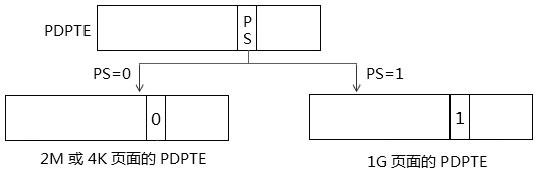
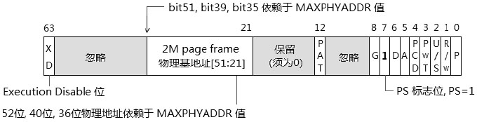

- 1 基本原理
    - 1.1 1G页面
    - 1.2 2M页面
    - 1.3 4K页面
    - 1.4 table和table entry结构
    - 1.5 支持3种页面size
    - 1.6 Intel64实现的新功能
- 2 IA-32e paging模式下的CR3
    - 2.1 CR4.PCIDE=0时，intel64的CR3
    - 2.2 CR4.PCIDE=1时，intel64的CR3
    - 2.3 PCID机制
        - 2.3.1 当前的PCID值
        - 2.3.2 默认的PCID值
        - 2.3.3 更新PCID值
        - 2.3.4 开启PCID值
        - 2.3.5 关闭PCID值
- 3 IA-32e paging模式下的PML4E结构
- 4 IA-32e paging模式下PDPTE结构
    - 4.1 1G页面的PDPTE结构
    - 4.2 2M和4K页面的PDPTE结构
- 5 IA-32e paging模式下的PDTE结构
    - 5.1 2M页面的PDTE结构
    - 5.2 4K页面的PDTE结构
- 6 IA-32e paging模式下PTE结构
- 7 SMEP机制
    - 7.1 检测SMEP是否支持
    - 7.2 SMEP的实施
- 8 使用IA-32e paging模式
    - 8.1 初始化paging结构
    - 8.2 进入IA-32e模式

# 1. 基本原理

IA-32e是intel的术语，在AMD中指long-mode paging模式。开启paging机制在IA-32e模式里是必须的。
只有开启paging机制IA-32e（long-mode）才能被激活（LA32\_EFER.LMA=1）。

在IA-32e paging模式里，必须开启的功能如下。
1. IA32\_EFER.LME=1；开启long-mode。
2. CR0.PG=1，CR4.PAE=1：进入PAE模式，并激活long-mode。

下面是在IA-32e paging模式下的页转换路径图。


## 1.1 1G页面

```
线性地址构成：
    9（PML4T索引，512个表项）+ 9（PDPT索引，512个表项）+ 30（Page offset，1GB页面）

二级转换表：
    PML4T大小是4KB（512个表项 x 每个表项8个字节）
    PDPT大小是4KB（512个表项 x 每个表项8个字节）
```

灰色线路是1G页面转换。

## 1.2 2M页面

```
线性地址构成：
    9（PML4T索引，512个表项）+ 9（PDPT索引，512个表项）+ 9(PDT索引，512个表项) + 21（Page offset，2MB页面）

三级转换表：
    PML4T大小是4KB（512个表项 x 每个表项8个字节）
    PDPT大小是4KB（512个表项 x 每个表项8个字节）
    PDT大小是4KB（512个表项 x 每个表项8个字节）
```

灰色路线是2M页面的转换。

## 1.3 4K页面

```
线性地址构成：
    9（PML4T索引，512个表项）+ 9（PDPT索引，512个表项）+ 9(PDT索引，512个表项) + 9（PT索引，512个表项）+ 12（Page offset，4KB页面）

四级转换表：
    PML4T大小是4KB（512个表项 x 每个表项8个字节）
    PDPT大小是4KB（512个表项 x 每个表项8个字节）
    PDT大小是4KB（512个表项 x 每个表项8个字节）
    PT大小是4KB（512个表项 x 每个表项8个字节）
```

黑色路线是4K页面的转换。

## 1.4 table和table entry结构

在IA-32e paging模式下，使用4个table和table entry结构：
1. PML4T（Page Map Level-4 Table）及表内的PML4E结构，每个表位4K字节。内包含512个PML4E结构。
2. PDPT（Page Directory Pointer Table）及表内的PDPTE结构，每个表4K字节，内含512个PDPTE结构。
3. PDT（Page Directory Table）及表内的PDTE结构，每个表4K字节，内含512个PDE结构。
4. PT（Page Table）及表内的PTE结构，每个表4K字节，内含512个PTE结构。

IA-32e paging模式是在PAE paging模式的基础上新增了一级table，virtual address可以使用48位宽。
在当前的x64体系里，处理器64位限定地址空间只实现了48位，高16位被用做符号扩展位，要么全0值，要么全1值，这是canonical address形式。

每个table entry结构都是8字节64位宽，而virtual address中的每个table entry索引值都是9位，因此每个table都是512x8=4K字节。

## 1.5 支持3种页面size

在IA-32e paging模式下新增1G页面，可以使用3种page size。
1. 4K页面：page frame从PTE里提供。
2. 2M页面：page frame从PDTE里提供。
3. 1G页面：page frame从PDPTE里提供。

## 1.6 Intel64实现的新功能

intel64实现了一些新功能，包括PCID功能和SMEP功能。其中SMEP功能叶可以使用在PAE paging模式里，而PCID功能必须用在IA-32e paging模式里。

# 2. IA-32e paging模式下的CR3

在IA-32e paging模式下，CR3是64位宽。在intel64中CR3结构分两种情况：
1. 支持PCIDE功能时
2. 不支持PCIDE功能时

## 2.1 CR4.PCIDE=0时，intel64的CR3

当CR4.PCIDE=0时，intel64在IA-32e paging模式下的CR3如下图所示。


CR3可以使用64位宽，它的PML4T物理地址同样受到MAXPHYADDR取值的情形有所不同，PML4T物理地址的形成与PAE paging模式3节描述情形的一致。

## 2.2 CR4.PCIDE=1时，intel64的CR3

intel的PCID功能只能用于IA-32e paging模式下，CR3的结构如下图所示。


在intel64提供的新机制下，CR3变得复杂起来，当CR4.PCIDE=1时，CR3的低12位提供一个PCID值，用来定义当前的process context ID。当对CR3进行更新时，bit64位提供一个值来决定是否需要invalidates处理器的TLB和Paging-structure cache。

1. 当CR3[63] = 0时，对CR3更新将使TLB和Paging-structre cache失效。
2. 当CR3[63] = 1时，对CR3更新不会使TLB和Paging-structure cache失效。

## 2.3 PCID机制

这个PCID是为了TLB和Paging-structure cache而产生的，CR3低12位的PCID值可以为不同的linear address space定义一个编号。处理器会在TLB和Paging-structure cache里为不同PCDID编号的linear address space维护一份cache。

> 由于PCID值是12位，可以定义最大值位0xFFF，共4K的PCID值。

基于上述的思考，我们可以认为每个处理器会维护工4K份的TLB和Paging-structure cache，这将是一个很大的cache块，若每份TLB为4K字节，那么将需要16M的TLB。


注意，上图是笔者对intel64手册里所理解出来的PCID与TLB及Paging-structure cache之间的对应关闭。每个PCID号对应一份TLB和Paging-structure cache。

### 2.3.1 当前的PCID值

处理器在TLB和Paging-structure cache中建立或者说生成TLB entry和Cache entry时，只基于当前的PCID值。
简单讲，处理器在一个时间上，只维护当前PCID编号的linear address space（virtual address space）的TLB和Paging-structure cache。

当使用mov CR3,reg64指令对CR3进行更新，并且使用不同的PCID值时，处理器会维护新的PCID值所对应的TLB与Paging-structure cache。

那么，当前的PCID就是在CR3里，随着使用新PCID值进行CR3切换而改变。

### 2.3.2 默认的PCID值

有三种情况使用默认的PCID值（000H）。
1. 当处理器不支持PCID功能时，使用默认的PCID值。
2. PCID只能使用在IA-32 paging模式里，因此当处理器在32位paging模式及PAE paging模式下，及IA32\_EFER.LME=0时，使用默认的PCID值。
3. 在IA-32e paging模式下，但CR4.PCIDE=0，即未开启PCID功能时，使用默认的PCID值。

默认的PCID值为000H，因此在上述情况下，处理器只维护000H编号的TLB和Paging-structure cache，实际效果等同于在legacy处理器上未实现PCID功能。

### 2.3.3 更新PCID值

当执行mov CR3,reg64指令对CR3进行刷新时，TLB和Paging-structure cache的失效依赖于CR3[63]位，如下面的代码所示。

```asm
    mov rax, PML4T_BASE | 0x1       ; PCID = 1
    mov cr3, rax                    ; 更新CR3
```
这个代码是在CR4.PCIDE=1的前提下，使用了PCID值为1去更新CR3，并且CR3[63]=0，表明需要更新TLB及Paging-structure cache，那么这时候指令对TLB和Paging-structure cache有下面几方面的情形。
1. 使原来PCID为0001H编号的TLB无效，即刷新TLB。
2. 使原来PCID为0001H编号的Paging-structure cache无效，即刷新Paging-structure cache。
3. 对global page无影响，不会刷新global page。
4. 对其他PCID编号的TLB和Paging-structure cache无影响，不会刷新其他编号的TLB和Paging-structure cache内存。

因此，处理器会保留其他PCID编号的virtual address space在TLB及Paging-structure cache的内容，即virtual address的page及table entry。

那么从这个角度看，处理应该需要保留0xFFF份virtual address space的page及table entry在TLB和Paging-structure cache里。

### 2.3.4 开启PCID值

在使用PCID功能前应检查处理器是否支持，通过检查CPUID.01H.ECX[17].PCID支持位是否值位。如果不支持，对CR4.PCIDE进行置位会产生#GP异常。

PCID功能只能使用在IA-32e模式下，如果当前处理器不是在IA-32e模式下（IA32\_EFER.LMA=0），对CR4.PCIDE进行置位会产生#GP异常。

只有在当PCID值为000H的时候（即当前是默认的PCID值）才能对CR4.PCIDE置位开启PCID功能。否则产生#GP异常（也就是说，之前已设置了PCID值）。

### 2.3.5 关闭PCID值

对CR4.PCIDE清0，处理器将立即关闭PCID功能，这时候当前PCID值将立即切换到000H默认值的PCID值。

在对CR4.PCIDE清位时，所有的TLB和Paging-structure cache都失效，包括global page和所有的PCID编号的TLB和Paging-structure cache。

同时CR3使用使用legacy格式，bit3和bit4位被解析位PWT和PCD标志位。

# 3. IA-32e paging模式下的PML4E结构

在IA-32e paging模式下新增的PML4E结构，如下图所示。


上图PML4E并没有PS标志位，因此Bit7是保留位，PML4E提供的PDPT物理地址的形成与PAE paging模式3节所描述的情形一致。

IA-32e paging模式下从最高级table entry开始使用XD标志，因此PML4E[63]是XD标志，而PAE paging模式从PDE开始（因为PDPTE在PDPTE寄存器内）。

# 4. IA-32e paging模式下PDPTE结构

在IA-32e paging模式下，由于新增了1G页面，因此在PDPTE结构里将控制1G页面的转换，由PDPTE.PS标志位进行转换，如下图所示。



- 当PDPTE.PS=1时，使用1G页面的PDPTE结构，那么此时PDPTE将提供1G page frame地址。
- 当PDPTE.PS=0时，使用非1G页面的PDPTE结构，那么它将提供下一级PDT的地址。

## 4.1 1G页面的PDPTE结构

使用1G页面，PDPTE结构被解析如下图所示。


同样，在PDPTE里提供的1G page frame物理地址将依赖于MAXPHYADDR值，1G page frame地址低30位将补0，意味着它将在1G边界上对齐。它也具有page的属性，包括D位、G位和PAT位。

## 4.2 2M和4K页面的PDPTE结构

当PDPTE.PS=0时，意味着PDPTE将提供下一级PDT的基地址，那么在根据PDTE.PS来决定使用2M页面还是4K页面。


PDT的地址是4K边界对齐，低12位补0，它的物理地址形成同PAE paging模式3节所描述的情形一致。

# 5. IA-32e paging模式下的PDTE结构

由于IA-32e paging模式是在PAE paging模式上扩展而来，因此从PDTE结构开始，IA-32e Paging模式和PAE paging是完全一致的。

在PAE Paging模式3节描述的PDE结构同样适合在IA-32e paging模式里。为了保持叙述的完整性，这里也将PDTE结构一一列出来。

## 5.1 2M页面的PDTE结构



## 5.2 4K页面的PDTE结构


# 6. IA-32e paging模式下PTE结构

在IA-32e paging模式下的PTE结构与PAE paging模式下是完全一致的，为了保持叙述的完整性，这里也列举出来。


# 7. SMEP机制

Intel64的SMEP（Supervisor-Mode Execution Prevention）机制用来防止Supervisor执行User权限的Page。
也就是说，在开启SMEP功能后，如果当前的CPL在0级、1级和2级权限里，处理器将拒绝执行属于User权限（U/S=1）的代码page。

- **User权限**</br>在table entry里的U/S标志位用来定义table或page的访问权限。当U/S=1时，table或page属于User权限，也就是说，它可以被User权限来访问（即3级权限）。当然在正常情况下，Supervisor是由权限访问的，除了开启SMEP功能的User Page页面。
- **Supervisor权限**</br>在U/S标志为0时，table或page属于Supervisor权限。在这种情况下，只有CPL在0级、1级和2级权限下才能被访问。
- **Data页和Code页**</br>在32位paging模式下（即non-PAE模式），page并不区分Data页或Code页，也就是说任何page都可以被执行。在PAE paging和IA-32e paging模式里，可以使用XD标志位来制定是否被允许执行。当然是在开启XD功能的前提下。

在IA32\_EFER.NXE=1下，table entry的XD=1时，page是不可执行的，这个page属于data页。当XD=0或者IA32\_EFER.NXE=0时，page是可执行的，这个page即属于code页也属于data页。

> 这个Code页和segmentation机制下的Code段有些不同，Code段是不可写的，Code页可以指定为Writable（可写）。

或许在paging机制下没有Code Page的概念，在Intel手册里似乎没有看到Code/Data page术语。

## 7.1 检测SMEP是否支持

在开启前，需要使用CPUID的07H leaf检测是否支持SMEP功能。

```asm
smep_enable:
    mov eax, 07
    mov ecx, 0              ; sub leaf=0
    cpuid
    bt ebx, 7               ; SMEP Support bit
    jnc smep_enable_done
    mov eax, cr4
    bts eax, SMEP_BIT       ; enable SMEP
    mov cr4, eax
smep_enable_done:
    ret
```

## 7.2 SMEP的实施

对于page的执行由下面几种情况：
1. 在PAE paging和IA-32e paging模式下，当IA32\_EFER.NXE=1，并且XD=1时，page不可执行。这种情况不属于SMEP的功能。
2. 在XD=0并且CR4.SEMP=1时，在Supervisor权限下（CPL=0|1|2）不能执行User权限（U/S=1）的page。
3. 在DX=0并且CR4.SEMP=0时，Supervisor权限可以执行User的Page。

SMEP功能是限制Supervisor对User page的执行，上面的2和3情形属于开启SMEP功能后的影响。

# 8. 使用IA-32e paging模式

在IA-32e paging模式下几乎与PAE paging模式是一致的，除了新增的PML4T和附加的新功能，要进入处理器的IA-32e模式（long-mode）就必须开启paging机制并且要使用PAE机制。

## 8.1 初始化paging结构

~~省略~~

## 8.2 进入IA-32e模式

下面代码将开启IA-32e paging模式，并使处理器进入IA-32e模式。

```asm
    ; 设置CR3
    mov eax, PML4T_BASE
    mov cr3, eax
    
    ; 设置CR4
    mov eax, cr4
    bts eax, 5              ; CR4.PAE=1
    mov cr4, eax
    
    ; 设置EFER
    mov ecx, IA32_EFER
    rdmsr
    bts eax, 8              ; EFER.LME = 1
    wrmsr
    
    ; 激活long mode
    mov eax, cr0
    bts eax, 31
    mov cr0, eax            ; EFER.LMA = 1
```

在激活long mode之前（IA32\_EFER.LMA=0），处理器还是保护模式，使IA-32e模式的激活条件时IA32\_EFER.LME=1并且CR0.PG=1，即开启paging机制，此时IA32\_EFER.LMA=1，在开启CR0.PG之前，必须：
1. CR4.PAE=1，开启PAE模式。
2. CR3指向有效的整个页面转换表结构的基地址，即PML4T的物理地址。