- 1 概述
    - 1.1 什么是TLB
    - 1.2 段的Cache
    - 1.3 页的Cache
        - 1.3.1 TLB
        - 1.3.2 Paging-Structure Cache
- 2 TLB
    - 2.1 线性地址的Page Number
        - 2.1.1 32位paging模式的Page Number
        - 2.1.2 PAE Paging模式的Page Number
        - 2.1.3 IA-32e paging模式的Page Number
    - 2.2 TLB中的转换
        - 2.2.1 page frame的访问权限
        - 2.2.2 page frame的读/写权限
        - 2.2.3 page frame的执行权限
        - 2.2.4 page frame的有效条件
        - 2.2.5 page frame的Dirty状态
        - 2.2.6 page frame的内存类型
    - 2.3 Global Page
    - 2.4 TLB entry的建立
        - 2.4.1 建立TLB entry的条件
    - 2.5 TLB entry的维护
        - 2.5.1 主动刷新TLB
        - 2.5.2 选择性地刷新TLB
        - 2.5.3 延迟刷新TLB
        - 2.5.4 需要刷新TLB的其他情形
    - 2.6 多种形式的TLB
        - 2.6.1 Instruction TLB
        - 2.6.2 Data TLB
        - 2.6.3 不同页面的TLB
        - 2.6.4 使用小页代替大页

# 1. 概述

由于页转换表在内存中，处理器如果要对一个地址进行访问，那么它需要在内存里根据table和table enry一级一级地walk下去直到找到最终的page frame。显而易见，如果这样做，这个访问将非常耗时。因此所有的处理器都会引入TLB。

## 1.1 什么是TLB

TLB（Translation Lookaside Buffers）就是Cache的一类。通过TLB处理器可以绕过内存里的table和table entry，直接在Cache里查找页的转换后结果（即page frame信息），这个结果包括了最终的物理页面的基地址和页面的属性。

## 1.2 段的Cache

TLB的作用令我们很容易联想到segment的Cache，回想一下，当一个段需要被访问时，它必须要加载到Segment Register（段选择器）里。那么在段选择器的内部就是这个段的Cache信息。

因此，在已经load进段选择器的Cache里后，当处理器访问这个段时，它不必再去GDT/LDT里加载相关的sement descriptor，这样处理器能绕过内存的段描述符直接访问段。

## 1.3 页的Cache

页的Cache就是TLB，可以在Intel64实现里不止TLB一个页Cache，在Intel64实现了两类关于页的Cache。

### 1.3.1 TLB

TLB，它实际是保存页的page frame信息（从虚拟地址到物理页面的转换结果）。

TLB是独立于常规的Cache，可以使用CPUID.02H leaf和CPUID.04H leaf获得TLB的相关信息。

```
cache and TLB information (2):
      0x63: data TLB: 1G pages, 4-way, 4 entries
      0x03: data TLB: 4K pages, 4-way, 64 entries
      0x76: instruction TLB: 2M/4M pages, fully, 8 entries
      0xff: cache data is in CPUID 4
      0xb5: instruction TLB: 4K, 8-way, 64 entries
      0xf0: 64 byte prefetching
      0xc1: L2 TLB: 4K/2M pages, 8-way, 1024 entries
```

### 1.3.2 Paging-Structure Cache 

Paging-structure cache（页表结构Cache），它保存页表的各级table entry结构（页就是：寻找page frame的过程，它是TLB相对互补的）。

Paging-structure Cache是常规Cache，在处理器内部的Cache里（L1、L2或L3 Cache）。

# 2. TLB

TLB作用是cache线性地址转换位物理地址的关系，与其说是cache转换关系，不如说是cache线性地址（或说virtual address）的Page Number。在讨论TLB之前，我们先了解几个术语。

- Page Offset：</br>线性地址的Page Offset也就是前面讲述的3中分页模式中线性地址在物理page frame内的offset。
- Page Number：</br>与Page Offset相对应，线性地址的Page Number用来查找最终的物理page frame地址。在其中忽略了各种table entry的Index值。
- Page Frame：</br>是物理地址空间里，一个页的起始地址（基地址），分为4种：4K page frame，4M page frame，2M page frame，以及1G page frame。

它们三者的关系如下图所示：

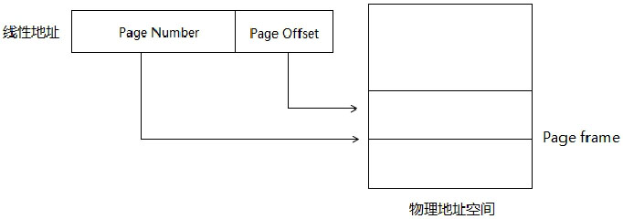

实际上，Page Number就是Page在物理地址的编号。


## 2.1 线性地址的Page Number

由于存在几种paging模式和几种页面的size，因此Page Number会不同。

### 2.1.1 32位paging模式的Page Number

32位paging模式下又两种页面size：4K页和4M页。

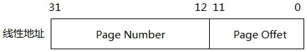

在上面的4K页面中，32位的线性地址中高20位为Page Number，低12位为Page offset。

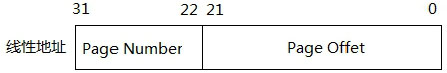

在上面的4M页面中，32位的线性地址中高10位为Page Number，低22位为Page offset。

### 2.1.2 PAE Paging模式的Page Number

在PAE paging模式下4K页的Page Number与Page Offset和在32位paging模式下是一致的。

在2M页面的Page Number和Page Offset如下。

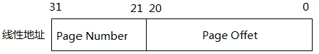

与32位paging模式下的4M页面仅仅是Page Number和Page Offset宽度不同。

### 2.1.3 IA-32e paging模式的Page Number

在IA-32e paging模式下有小的linear address被扩展为48位，Page Number将变得很宽。

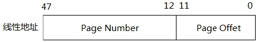

上图4K页面的Page Number有36位宽，Page offset为12位宽。

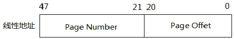

上图2M页面的Page Number有27位宽，Page offset为21位宽。

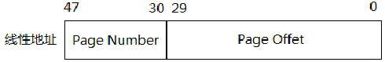

上图1G页面的Page Number有18位宽，Page offset为30位宽。

## 2.2 TLB中的转换

TLB的结构似乎很神秘，只能从Intel64手册里的描述推断出TLB内部的结构。

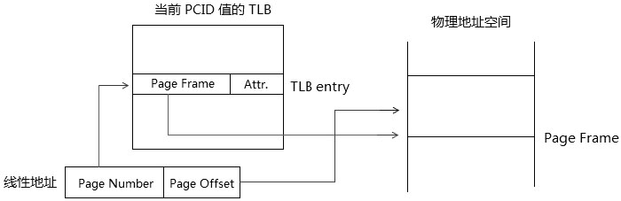

处理器只维护着当前PCID对应的TLB cache。在TLB里的每一个entry，包含下面的信息。
- 线性地址Page Number对应的物理Page frame
- Page frame的属性
    - U/S标志（访问权限）
    - R/W标志（读写权限）
    - XD标志（执行权限）
    - Dirty标志（已写状态）
    - PCD，PWT与PAT标志（page的内存类型）

### 2.2.1 page frame的访问权限

各级table entry的U/S标志决定最终page frame的访问权限。这个最终的访问权限是采用“从严”策略，也就是说：
1. 在32位paging模式下，PDE和PTE只有其中一个table entry属于Supervisor权限，那么最终的page frame就是Supervisor访问权限。
2. 在PAE paging模式下，PDPTE、PDE及PTE只要其中一个是Supervisor权限，那么最终的page frame就属于Supervisor访问权限。
3. 在IA-32e paging模式下，PML4E、PDPTE、PDE及PTE只要其中一个是Supervisor权限，最终的page frame就是Supervisor访问权限。

仅当所有table entry的U/S=1时，最终page frame的U/S才为1。用表达式来描述，可以是（以IA-32e paging 4K页为例）：
```
    page_frame.U/S = PML4E.U/S & PDPTE.U/S & PDE.U/S & PTE.U/S  
```
page frame的U/S值等于各级table entry的U/S标志进行AND操作。

### 2.2.2 page frame的读/写权限

各级table entry的R/W标志决定最终page frame的读写权限，与上面所述的U/S标志情景一样，仅当所有table entry的R/W=1时，最终的page frame的R/W=1，同样用表达式来描述，可以是（以IA-32e paging 4K页为例）：
```
    page_frame.R/W = PML4E.R/W & PDPTE.R/W & PDE.R/W & PTE.R/W
```
page frame的R/W值等于各级table entry的R/W标志进行AND操作。

### 2.2.3 page frame的执行权限

当table entry的XD为1时，指示为不可执行页，因此，从表达上与上面两个权限是不同的，同样基于“从严”的策略，仅当所有entry的XD=0时，page frame的XD才为0。用表达式来描述，可以是（以IA-32e paging 4K页为例）：
```
    page_frame.XD = PML4E.XD | PDPTE.XD | PDE.XD | PTE.XD
```
page frame的XD值等于各级table entry的XD进行OR操作。

> 这个XD需要在开启Execution Disable功能的前提下。

### 2.2.4 page frame的有效条件

能在TLB entry中保存的page frame，必须是有效的page frame。它必须是最终的P=1并且保留位为0，同样可以用表达式来描述（以IA-32e paging 4K页为例）：
```
    page_frame.P = PML4.P & PDPTE.P & PDE.P & PTE.P
```
仅当各级table entry的P标志都为1时，page frame的P才为1值，否则是无效的。并且仅当各级table entry的保留位为0时，page frame才为有效的。

一个无效的page frame处理器将不会在TLB中建立相应的entry。

### 2.2.5 page frame的Dirty状态

当对一个线性地址进行写操作时，线性地址对应的page frame的Dirty属性为1（D=1），指示page frame内某个地址已经被写过。

当D=0时发生写操作，处理器会对内存的PDPTE（PS=1）、PDE（PS=1）或PTE的D标志置位。处理器从不会对D标志进行清位操作。

### 2.2.6 page frame的内存类型

page frame的PCD、PWT以及PAT标志组合起来构成线性地址映射的page的内存cache类型。三个标志组合位一个0 ~ 7的数值，这个数值对应PAT里定义的内存Cache类型。

## 2.3 Global Page

在处理器内部实现一个全局的TLB cache结构。当page frame是被定义为Global页时（G标志=1），在Global TLB里（基于独立的TLB，或者current PCID的TLB）实现这个Global TLB entry。

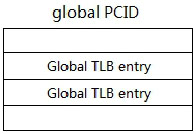

上图是对global page在TLB实现的推测，使用类似global PCID值而当前PCID值不同，当使用mov CR3,reg指令对TLB进行刷新时，global PCID的TLB中的global TLB entry不被刷新，继续保持有效。

## 2.4 TLB entry的建立

当处理器对首次成功访问的page frame（必须注意是成功范文，失败的访问不会建立TLB entry），会在当前PCID的TLB里建立相应的TLB entry来保存page frame或者建立global TLB entry来保存Global page frame（当page的G=1时）。

这个page frame必须是已经被访问过的（page的A标志为1），因此，TLB entry中的page frame属性里不必保留A标志。

处理器只会为有效的page frame进行cache。这个有效的page frame条件是P=1。对无效的page frame（例如：P=0），处理器会产生#PF异常。

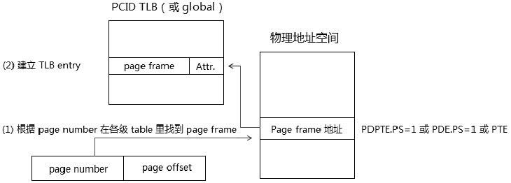

如上图所示，对线性地址的访问中，根据线性地址的page number在物理地址中的各级页转换表里找到最终的page frame，当它是有效的，处理器会在page number对应的TLB entry里建立相应的entry（或者说加载，或者说Cache fill操作）。当page是global的，处理器会在global TLB entry里建立对应的entry。

### 2.4.1 建立TLB entry的条件

处理器对首次成功的访问才会在TLB里建立Page Number对应的TLB entry或Global TLB entry（是global page时），page frame能访问的条件是P=1。
1. page frame是有效的（P=1，A=1）。
2. 访问page frame的各项权限是满足的，读写操作时访问权限和读写权限都需通过，执行时执行权限需通过（实现SMEP功能时，还要依赖于SMEP机制）。

当线性地址的page number对应的TLB entry建立后，下次对该page内存地址访问时，处理器会在线性地址page number对应的TLB entry里找到page frame，而不用在内存里walk查找page frame。

## 2.5 TLB entry的维护

处理器会维持TLB中的TLB entry不变，不会应为内存中各级的table entry被更改而修改TLB entry。
可是，如果遇到内存中的table entry被更改时，需要根据情况做手动的维护工作。
有两种情况会分别对待。

### 2.5.1 主动刷新TLB

有时候必须主动发起刷新TLB，可以使用INVLPG指令对当前PCID下的某个TLB entry进行刷新，代码如下。
```asm
    ; INVD	    Invalidate Internal Caches
    ; INVLPG	Invalidate TLB Entry
    invlpg [0x200000]       ; 线性地址0x200000地址所在的page frame
```

在上面这个实例中，指令刷新的TLB entry需根据情况而定。
1. 如果线性地址0x200000使用4K页，它将刷新0x200（Page Number）对应的TLB entry。
2. 如果线性地址0x200000使用2M页，它将刷新0x01（Page Number）对应的TLB entry。

以此类推到4M页和1G页上。还可以使用mov CR3,reg或mov CR4,reg指令通过更新控制寄存器的方式刷新所有TLB entry。

INVLPG指令虽然只能一次刷新一个TLB entry，可是，使用INVALPG指令页可以对当前PCID下线性地址page number对应的所有Page-Structure Cache entry进行刷新。页可以对线性地址所对应的global TLB entry进行刷新。

我们看看什么情况下需要主动刷新TLb，在Intel64的手册里列举了一些列推荐的必须刷新的情形，非常复杂和繁琐，总结成两大类情况。
1. 当指向page frame的table entry修改时，最终的page frame无论是由PTE指向改为由PDE或PDPTE指向，还有由PDE或PDPTE指向修改为由PTE指向。也就是说，4K页面、2M页面或者是1G页面映射的修改，都需要刷新TLB。
2. 当任何一级的table entry中的物理地址修改时，需要刷新TLB（例如：PDPTE中提供的PDE物理基地址修改时，需要刷新TLB）。

- **刷新多个TLB entry**

在前面我们看到了如何对单个TLB entry进行刷新，很多情况下需要刷新多个TLB entry，例如：将一个区域的页面映射去掉时，假设这个区域使用4K页面映射，线性地址为0x200000到0x3FFFFF。那么这个区域将包含512个4K页面，将需要为这些page number进行逐个刷新。
```asm
    mov eax, 0x200000
do_invalidate:
    invlpg[eax]         ; 刷新Page Number对应的TLB entry
    add eax, 0x1000     ; 下一个4K页
    cmp eax, 0x3FFFFF
    jb do_invalidate
```
上面的代码是对逐个4K页的Page number对应的TLB entry进行刷新的例子。实际情况可以更复杂，更多些，在这种情况下可以使用mov CR3,reg指令直接刷新当前PCID下所有的TLB entry。

- **刷新所有的TLB entry**

当CR4.PCIDE=0时，mov CR3,reg指令刷新PCID=000H下所有TLB entry（除global TLB entry外），以及PCID=000H下所有的Paging-structure Cache entry。

当CR4.PCIDE=1（开启PCIDE机制）时：
```asm
    mov cr3, 0x200001       ; 刷新PCID值为001H的所有TLB entry
```
上面这条指令将刷新PCID值为001H下的所有TLB entry（除global TLB entry外），并且也会刷新PCID=0001H下所有的Paging-Structure Cache entry。
```
    mov rax, 0x80000000002000001    ; bit63 = 1
    mov cr3, rax                    ; 不会刷新TLB entry
```
可是当源操作数的bit63位为1时，对CR3的更新不会更新TLB。

- **刷新global TLB entry**

对CR3的更新不会刷新Global page，可以使用更新CR4的方式刷新Global page。
```asm
    mov eax, cr4
    btc eax, 7      ; 修改CR4.PGE位
    mov cr4, rax    ; 刷新所有的TLB entry，包括global page
```
当对CR4.PGE位进行修改（由0改为1或由1改为0）时，对CR4的更改会刷新所有的global TLB entry，页包括所有的PCID下所有的TLB entry和所有PCID下的所有Paging-structure Cache entry。
将CR4.PCIDE标志从1改为0，也同样能达到这样的效果。

- **根据PCID来刷新TLB**

Intel64提供了一个新指令INVPCID来根据提供的invalidate type和descriptor这两个操作数做相应的刷新操作。
INVPCID指令是PCID功能配套指令，需要处理器支持，从CPUID.07H:EBX[10].INVPCID位里查询是否获得支持。

INVPCID指令可以做到上面所说的刷新TLB entry和Paging-structure cache entry的功能，它可以提供4个invalidate type：
- type 0：可以刷新当个entry
- type 1：可以刷新PCID下所有entry（除了global TLB entry）
- type 2：可以刷新所有PCID的所有entry（包括global TLB entry）
- type 3：可以刷新所有PCID的所有entry（除了global TLB entry）

```asm
    mov rax, 2                          ; invalidate type=2
    invpcid rax, [INVPCID_DESCRIPTOR]   ; 提供invpcid descriptor
```
上面将刷新所有PCID的所有TLB entry和Paging-Structure Cache entry，包括global TLB entry。

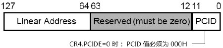

上面这个图是INVPCID descriptor的格式，低12位提供相应的PCID值，高64位提供线性地址，它们的作用依据相应的invalidation type而不同。

### 2.5.2 选择性地刷新TLB

在Intel手册列举了一些必须立即进行主动刷新TLB的情形，主要基于table entry的属性修改，我们可以认为这个修改操作属于OS内存管理子系统的管理。

1. table entry的P标志和A标志从0修改为1时，不需要刷新TLB entry。因此处理器只有当P和A为1时，才可能装载到TLb entry中。它们这样的修改不会对后续产生不良影响。
2. 当page frame的读写权限R/W由0修改为1时，意味着由原来的不可写变为可写的。那么OS可以选择不立即进行更新，采取延迟刷新策略。
3. 当page frame的访问权限U/S由0修改为1时，意味着由原来的Supervisor权限改变User权限。那么OS也可以选择采取延迟更新策略。
4. 当page frame的执行权限XD由1修改为0时，意味着由原来的不可执行改为可执行。那么OS页可以选择采取延迟刷新策略。

### 2.5.3 延迟刷新TLB

当遭遇上面的2、3和4情形时，page frame的R/W和U/S标志由0修改为1，XD标志由1修改为0时，如果尝试对不可写的page进行写，不可执行的page进行执行，以及使用User权限进行访问将产生#PF异常。

于是，在#PF handler处理中，可以对情况做出判断，然后在#PF handler里在做处刷新TLB entry和Page-Structure Cache entry的操作。在后续的执行中，TLB entry已经被刷新为正确的。

### 2.5.4 需要刷新TLB的其他情形

当page frame的P标志由1改为0时，我们需要进行刷新，采用前面所描述的刷新多个TLB entry的方法实现，Intel手册里似乎没描述到。
1. 当page frame的R/W由1修改为0时，意味着由原来的可写变为不可写。
2. 当page frame的U/S由1修改为0时，意味着由原来的User权限改为Supervisor权限。
3. 当page frame的XD由0修改为1时，意味着由可执行改为不可执行。

实际上，上面的三种情况都应该刷新TLB和Paging-Structure Cache。

## 2.6 多种形式的TLB

与Cache一样，TLB实现了Instruction（指令）和Data（数据）两大类，并且实现了4K页、4M/2M页面的TLB结构。

### 2.6.1 Instruction TLB

处理器对首次执行的代码page会在Instruction TLB里建立相应的TLB entry（或者说加载TLB，相对应与Segment的加载）。
Intel明确说明了在Instruction TLB entry里无须包含R/W和D标志位。

> 思考一下，对于一个可执行的page frame，当执行page frame和读写page frame时，处理器会分别在Instruction TLB和Data TLB里进行Cache。即，会建立两份TLB entry，一份为fetch指令，一份为访问数据。

按照Intel的说法，我们可以推断出上面的结论，在Instruction TLB里只为fetch指令。
当fetch指令时处理器从Instruction TLB entry里查找page frame，否则作为读写访问内存，则从Data TLB entry里找到page frame。

- **指令TLB entry的建立**

处理器对首次成功进行fetch指令的page frame建立相应的TLB entry。
对首次fetch指令失败的page frame不会建立TLB entry。
显然对于首次fetch指令时XD=1的page frame是不会建立TLB entry的。

- **fetch指令**

当目标地址page number对应的Instruction TLB entry未建立时，属于首次fetch指令，否则处理器将在Instruction TLB entry里查找page frame，Instruction TLB entry中的page frame属性必定会包括XD标志位，它用来判断page frame是否可执行。

当fetch指令时，处理器从当前eip/rip寄存器里得到指令的线性地址，首次fetch指令时将在内存里walk找到最终的page frame。否则根据线性地址的page number在Instruction TLB找到相对应的TLB entry，在查看page frame的属性。在IA32\_EFER.NXE=1的前提下，当XD=1时，fetch指令将失败。

当IA32\_EFER.NXE=0或者XD=0，在Intel64处理器上还会根据SMEP机制来决定fetch指令。
1. 当CR4.SMEP=1时，在Supervisor权限下，对属于User权限（U/S=1）的page frame进行fetch指令时，fetch指令将失败。
2. 当CR4.SEMP=0时，在Supervisor权限下不可以对属于User权限的page frame进行fetch指令。
3. 在User权限下，只能对User权限的page frame进行fetch指令。

### 2.6.2 Data TLB

对于读写访问内存，处理器根据线性地址page number从Data TLB里找到相应的TLB entry，在根据page frame的属性判断访问是否合法。

通过各种权限检查，使用page frame物理地址值加上线性地址的page offset得到最终的目标物理地址。

### 2.6.3 不同页面的TLB

在Intel上可以通过CPUID.02H leaf来查询处理器上的TLB信息，我们从Intel关于cache和TLB信息的表格里可以看到有为4K、2M/4M页面使用的TLB。

```
   L1 TLB/cache information: 2M/4M pages & L1 TLB (0x80000005/eax):
      instruction # entries     = 0x0 (0)
      instruction associativity = 0x0 (0)
      data # entries            = 0x0 (0)
      data associativity        = 0x0 (0)
   L1 TLB/cache information: 4K pages & L1 TLB (0x80000005/ebx):
      instruction # entries     = 0x0 (0)
      instruction associativity = 0x0 (0)
      data # entries            = 0x0 (0)
      data associativity        = 0x0 (0)
   L1 data cache information (0x80000005/ecx):
      line size (bytes) = 0x0 (0)
      lines per tag     = 0x0 (0)
      associativity     = 0x0 (0)
      size (KB)         = 0x0 (0)
   L1 instruction cache information (0x80000005/edx):
      line size (bytes) = 0x0 (0)
      lines per tag     = 0x0 (0)
      associativity     = 0x0 (0)
      size (KB)         = 0x0 (0)
   L2 TLB/cache information: 2M/4M pages & L2 TLB (0x80000006/eax):
      instruction # entries     = 0x0 (0)
      instruction associativity = L2 off (0)
      data # entries            = 0x0 (0)
      data associativity        = L2 off (0)
   L2 TLB/cache information: 4K pages & L2 TLB (0x80000006/ebx):
      instruction # entries     = 0x0 (0)
      instruction associativity = L2 off (0)
      data # entries            = 0x0 (0)
      data associativity        = L2 off (0)
   L2 unified cache information (0x80000006/ecx):
      line size (bytes) = 0x40 (64)
      lines per tag     = 0x0 (0)
      associativity     = 8-way (6)
      size (KB)         = 0x100 (256)
   L3 cache information (0x80000006/edx):
      line size (bytes)     = 0x0 (0)
      lines per tag         = 0x0 (0)
      associativity         = L2 off (0)
      size (in 512KB units) = 0x0 (0)
```

### 2.6.4 使用小页代替大页

在处理器TLB cache的实现中，可能会以小页代替大页进行Cache。
例如：对一个2M页面的映射方案，处理器可以在TLB entry里以数个4K页面的TLB entry来代替。

假设，0x200000到0x3FFFFF的2M区域以2M页面来映射，它的Page Number是0x01，如果代码中对0x201000到0x203FFF区域进行访问，那么处理器可以采用：
1. 在2M页面的TLB里Page Number为1对一个的TLB entry里Cache整个2M页面。
2. 在4K页面的TLB里Page Number为0x201、0x202以及0x203对应的TLB entry里Cache 3个4K页面。

使用小页代替大页实现Cache，对于软件层来说没什么影响的。软件层并不知道处理器内部是怎么Cache这些TLB entry的。

使用大页的好处是简单，可是需要额外增加TLB。使用小页面的好处是重复有效地利用TLB，可是需要更多的entry来Cache一个大页。一个典型的情况是，在Intel64处理器上并没有看到有1G页面的TLB存在。因此，我们可以推断1G页面必定是采用小页代替的（2M/4M页面，甚至4K页面）。
