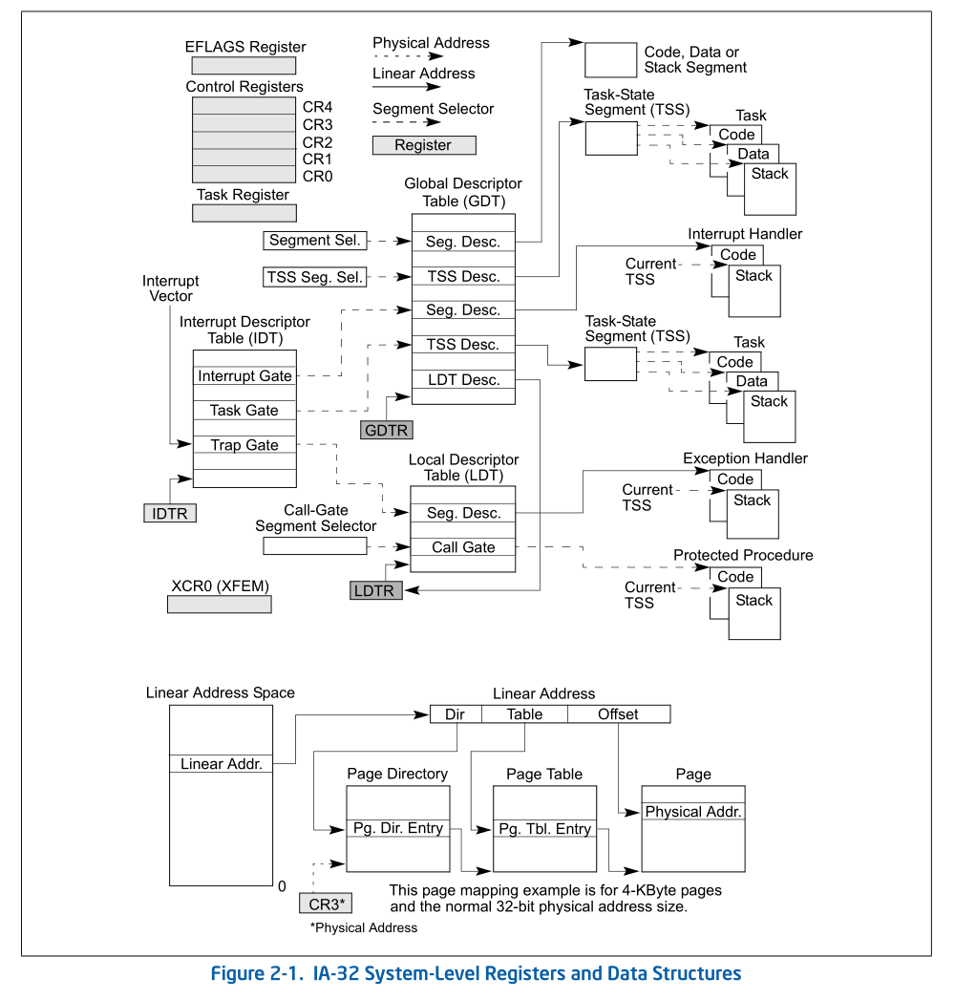
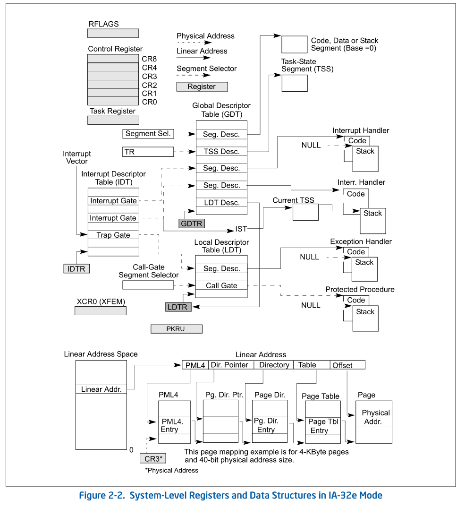

## 1. 指令集参考

x86 Instruction Set Reference: https://daizhiyuan.github.io/study/x86/

x86 and amd64 instruction reference：https://daizhiyuan.github.io/study/amd64/

## 2. IA-32系统级寄存器与数据结构

## 3. IA-32e系统级寄存器与数据结构

