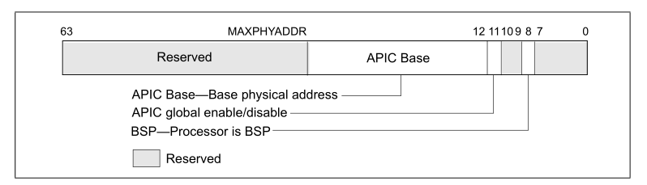
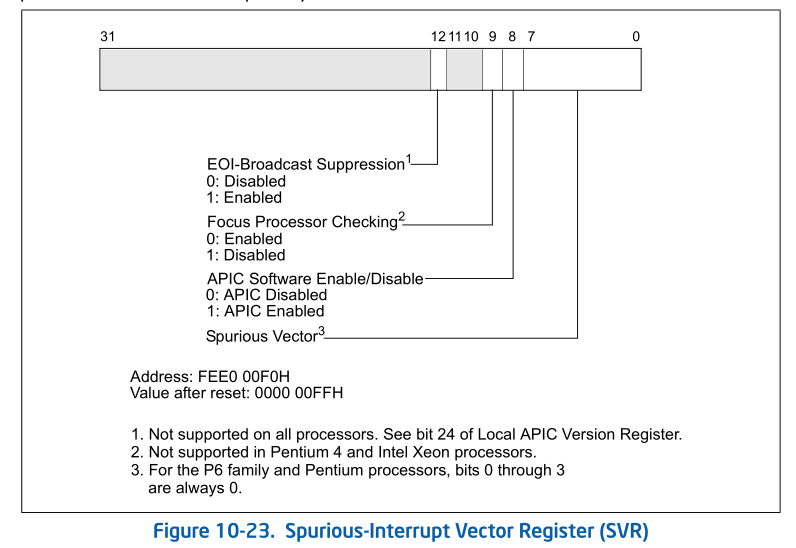

- 概述
- 1 检测local APIC版本
    - 1.1 检测是否支持xAPIC
    - 1.2 检测是否支持x2APIC
- 2 开启和关闭local APIC
    - 2.1 global enable/disable APIC
    - 2.2 software enable/disable APIC
    - 2.3 开启x2APIC模式

# 概述

local APIC的核心功能由一组可编程的APIC寄存器实现，在使用local APIC之前软件应该检测是否支持local APIC。

# 1. 检测local APIC版本

软件首先需要检测是否支持APIC on Chip上的local APIC。

## 1.1 检测是否支持xAPIC

使用CPUID.01:[EDX9].APIC标志位来检测，EDX[9]=1时支持local APIC。

```asm
support_apic:
    mov eax, 1
    cpuid
    bt edx, 9   ; APIC bit
    setc al
    movzx eax, al
    ret
```

> support_apic函数，返回1值时，处理器支持xAPIC版本。

## 1.2 检测是否支持x2APIC

使用CPUID.01:ECX[21]位来检测是否支持x2APIC。

```asm
support_x2apic:
    mov eax, 1
    cpuid
    bt ecx, 21
    setc al     ; x2APIC bit
    movzx eax, al
    ret 
```

> support_x2apic函数返回1时支持x2APIC体系。

# 2. 开启和关闭local APIC

可以使用两种方式开启和关闭local APIC：
1. global enable/disable APIC（在global层面上开启和关闭local APIC）
2. software enable/disable APIC（软件临时开启和关闭local APIC）

## 2.1 global enable/disable APIC

软件可以使用IA32\_APIC\_BASE寄存器来开启和关闭local APIC，它的结构如下。



上图中的IA32\_APIC\_BASE寄存器是支持x2APIC的体系下，在不支持x2APIC的情况下bit10位是保留位。
IA32\_APIC\_BASE寄存器还可以设置APIC寄存器的基地址。这个地址的宽度依赖于MAXPHYADDR值。

bit11位是APIC enable位，当enable=0时关闭APIC，在这个情况下等于处理器没有APIC on Chip的APIC，因此这个位影响到CPUID.10H:EDX[9]标志位的结果。

```asm
clear_apic:
    mov ecx, IA32_APIC_BASE
    rdmsr
    btr eax, 11     ; clear APIC enable flag
    wrmsr
    ret
```

> 在关闭APIC前，软件应该确认没有中断需要传送，local APIC寄存器设置的信息可能会丢失。

## 2.2 software enable/disable APIC

软件可以使用SVR（Spurious Interrupt Vector）来临时打开和关闭APIC，SVR如下图所示。



SVR的地址在APIC_BASE的F0h偏移量上，bit8是APIC software enable位。只有当IA32\_APIC\_BASE[11]为1时（即开启APIC），SVR的APIC software enable才有意义。

在IA32\_APIC\_BASE[11]为1时（即开启APIC），SVR的APIC enable才有意义。

在IA32\_APIC\_BASE[11]=1时，SVR[8]=0，才可以临时关闭APIC。只有当IA32_APIC_BASE[11]=1，SRV[8]=1时，APIC才真正开启。

```asm
enable_xapic:
    bts DWORD [APIC_BASE + SRV], 8      ; SVR.enable=1
    ret
    
disable_xapic：
    bts DWORD [APIC_BASE + SRV], 8      ; SVR.enable=0
```

> 在处理器reset时，SVR的初始值是0x000000FF，APIC是关闭的。在BIOS初始化运行期间，SRV[8]被置1，APIC是开启的。

## 2.3 开启x2APIC模式

当检测到处理器支持x2APIC版本时，处理器即支持xAPIC模式也支持x2APIC模式。经过BIOS的初始化后，处理器开启的是xAPIC模式。软件可以选择使用IA32\_APIC\_BASE寄存器来开启x2APIC模式，如下表所示。


global enbale位（IA32\_APIC\_BASE[11]） | X2APIC enable位（IA32\_APIC\_BASE[10]） | 描述
---|---|---
0 | 0 | 关闭local APIC
0 | 1 | 无效
1 | 0 | 启用xAPIC模式
1 | 1 | 启用x2APIC模式

只有当IA32\_APIC\_BASE寄存器的bit10和bit11位同时置位，才能启用x2APIC模式。
intel明确说明，当启用x2APIC模式后，必须同时清bit10和bit11，先关闭local APIC，才能重新启用xAPIC模式。
如果尝试单独清bit10和bit11任何一个位，都会引发#GP异常。