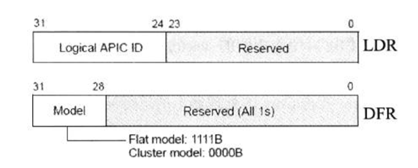
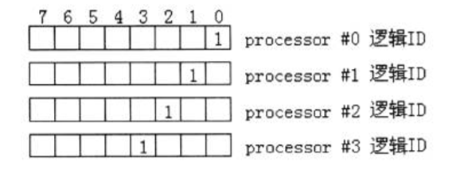

- 概述
- 1 IPI消息对象
    - 1.1 使用No shorthand目标类型
    - 1.2 使用physical目标模式
    - 1.3 使用logical目标模式
- 2 多处理器的初始化与编程
    - 2.1 logical processor的资源
        - 2.1.1 独立资源
        - 2.1.2 共享资源
        - 2.1.3 架构相关资源
    - 2.2 logical processor的初始化

# 概述

前面介绍的ICR（Interrupt Command Register）用于产生IPI（Inter-processor Interrupt）消息，当往ICR寄存器的低32位写入IPI命令字时，处理器就产生了IPI消息发送到system bus上。

```asm
    mov DOWRD[APIC_BASE + ICR0], 000c4620h  ; 写ICR低32位
```

这条指令往64位ICR寄存器的低32位写入IPI命令字000c4620h，这个命令会向所有的处理器（除了自己）发送SIPI消息。

> 当需要写完整的64位ICR命令字时，应先写高32位字，在写低32位字。

# 1. IPI消息对象

ICR的destination shorthand域设置了总的目标类型，只有No Shorthand目标类型才需要提供具体的IPI消息发送对象。在Self、All including self以及All excluding self目标类型中使用固定的目标对象。

## 1.1 使用No shorthand目标类型

在No Shorthand目标类型里，最终的IPI消息目标依赖于下面几个设置。
1. Destination mode（目标模式）：选择physical还是logical模式。
2. Destination field（目标域）：这个值对于physical还是logical模式有不同的解释。

## 1.2 使用physical目标模式

physical目标模式需要在ICR寄存器里的destination field域（高32位）里直接给出目标处理器的APIC ID值，如下面IPI命令字。
```asm
    mov DWORD [APIC_BASE + ICR1], 01000000h     ; 目标处理器APIC ID为01
    mov DWORD [APIC_BASE + ICR0], 00004030h     ; 发送IPI消息
```

由于使用Fixed交付模式，目标处理器（APIC ID为01）在通过中断请求的仲裁后，将执行30h号中断vector所对应的中断处理程序。

## 1.3 使用logical目标模式

当使用logical目标模式下，情况变得稍微复杂，ICR的destination field（目标域）并不直接提供目标处理器的APIC ID值，而是一个mask值。

当system bus上的处理器符合（匹配）这个mask值时，它们就是目标处理器，并且可以一次发送多个目标处理器。

这个目标处理器的匹配过程，收到LDR（logical destination register）和DFR（destination format register）的影响。实际上，它们定义了处理器的logical ID值，其结构如下。



每个local APIC可以额外自定义一个逻辑ID值，在LDR（logical destination register）的bit24 ~ bit31里提供。8位的local APIC ID值共可以为8个local APIC所使用（每个local APIC占用1位）。

假设当前的system bus上有4个处理器，那么每个处理器的local APIC里可以使用LDR定义一个逻辑ID值，如下图所示。



在上图的设置里，4个处理器的逻辑ID如下。
1. processor #0：逻辑ID为1。
2. processor #1：逻辑ID为2。
3. processor #2：逻辑ID为4。
4. processor #3：逻辑ID为8。

逻辑ID使用mask码方式设置（即每个位可以被mask），每个处理器的逻辑ID值在各自的初始化阶段在LDR设置。

当使用logical目标模式发送IPI消息时，ICR的destination field（目标域）提供一个mask值，这个mask值用来匹配和选择目标处理器。

DFR（destination format register）设置两种匹配模式：flat模式（1111B）和cluster模式（000B）。在flat模式里，当LDR的逻辑ID与IPI消息中的destination field值进行按位AND操作，结果为True，属于目标处理器。

```asm
    mov DWORD [APIC_BASE + ICR1], 0c000000h     ; logical ID值
    mov DWORD [APIC_BASE + ICR0], 4830h         ; 使用logical目标模式
```

在上面的代码里，使用logical目标模式发送IPI消息，ICR的destination field值为0c000000h，那么它将匹配两个处理器。

这个destination field值（0x0c）将找到两个符合的目标处理器（处理器2和处理器3），因此这个IPI消息将发送到两个处理器上。

# 2. 多处理器的初始化与编程

在MP系统平台上，system bus上有多个physical package，或者只有1个physical package，但包含了多个processor core和logical processor。这些processor需要经过初始化才能被使用。

BIOS会进行一些初步初始化，在支持多处理器的OS上，OS有责任初始化和配置所有处理器。

## 2.1 logical processor的资源

在支持Hyper-threading技术的intel处理器上，每个processor core有两个SMT（同步线程，也就是logical processor）。

这些logical processor的资源有三大类。
1. 部分资源是每个logical processor私有。也就是说每个逻辑处理器都有独立的这些资源。
2. 部分资源是core上的两个logical processor共享的。也就是说每个core有独立的这些资源，而对于两个SMT来说是共享的。一个SMT修改这些资源将影响另一个SMT。
3. 部分资源依赖于处理器的实现，这部分没有做明确的说明。

我们可以从intel手册里得到相关logical processor资源的说明，每个logical processor上独立的资源如下表所示。

### 2.1.1 独立资源

资源 | 注释
---|---
通用寄存器组 | 16个通用寄存器：RAX到R15
段寄存器 | CS，DS，SS，ES，FS及GS
RFLAGS寄存器与RIP指针 | 
控制寄存器 | CR0 ~ CR15
debug寄存器 | DR0 ~ DR15
x87 FPU单元里所有寄存器 | 
MM0 ~ MM7 | 
XMM0 ~ XMM15 |
YMM0 ~ YMM15 | 
系统寄存器 | GDTR，IDTR，LDTR及TR寄存器
所有的local APIC资源 | 
大部分MSR | 在MSR表里面说明的所有寄存器

### 2.1.2 共享资源

MTRR（memory type range register）：这个MTRR寄存器属于core内的两个logical processor共享。

### 2.1.3 架构相关资源

下面的寄存器依赖处理器实现，也就是可能属于SMT独有，也可能是SMT共享，根据不同的处理器架构实现。
1. IA32\_MISC\_ENABLE寄存器
2. 与Machine check机制有关的MSR。
3. 与performance monitoring机制有关的MSR，包括control寄存器与counter寄存器。

## 2.2 logical processor的初始化

当MP系统power-up（加电）或者reset（复位）后，每个processor会同时执行处理器内部的BIST代码。基于system bus硬件会赋予其上的每个logical processor唯一的APIC ID值，这个APIC ID值就是前面描述的initial APIC ID（即最初的APIC ID值）。

当处理器支持CPUID.9B功能叶时，这个initial APIC ID是32位的（尽管在不支持x2APIC模式下也是），否则initial APIC ID是8位的。

这个initial APIC ID值会被写入到local APIC的APIC ID寄存器里作为每个处理器的ID值，并且硬件会选择一个处理器作为BSP（bootstrap processor），BSP的APIC ID值通常为0h。在这个BSP的IA32\_APIC\_BASE寄存器的bit8（BSP标志位）会置位，指示属于BSP。

而其余处理器的IA32\_APIC\_BASE寄存器BSP标志位被清位，指示属于AP（application processor）。

在确定BSP后，BS从0FFFFFFF0地址（BIOS代码）处执行第一条CPU指令。我们知道，BSP接着执行BIOS的自举代码，完成BIOS设置。

在Intel手册的描述里，当BSP完成BIOS的bootstrap代码初始化工作后，应向system bus广播INIT-SIPI-SIPI消息序列（除了自己），唤醒其他AP处理器。BSP提供BIOS的boostrap routine地址给所有AP处理器接收，引导AP处理器完成初始化设置。