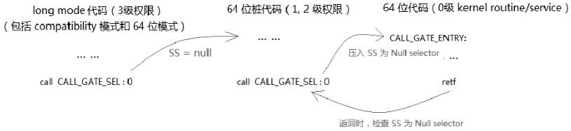
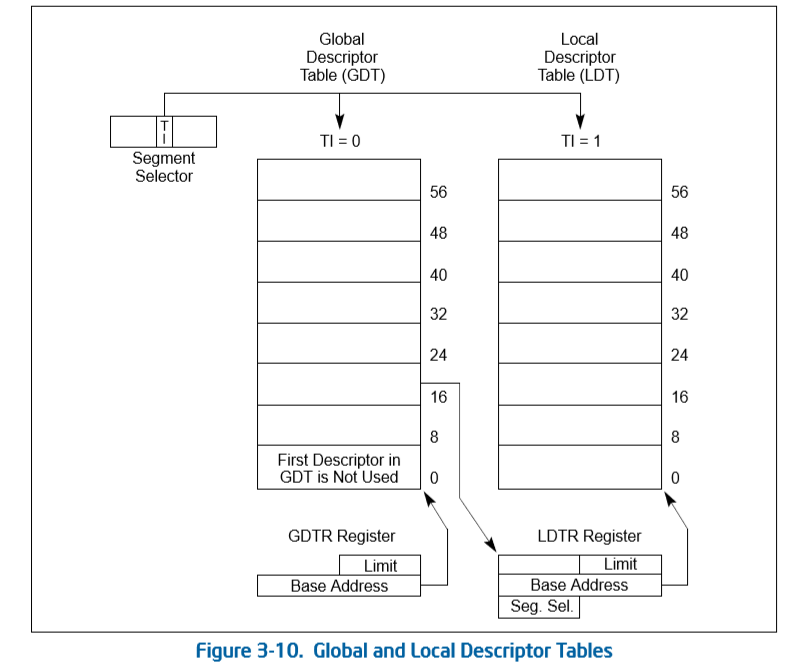

- 1 Segment Selector（段选择子）
    - 1.1 Segment Selector的加载
    - 1.2 Null Selector在64位模式下
        - 1.2.1 加载Null Selector到SS段寄存器
    - 1.3 隐式加载Null Selector
- 2 Descriptor Table（描述符表）
    - 2.1 描述符表寄存器
    - 2.2 GDTR
        - 2.2.1 GDTR的加载
        - 2.2.2 GDT的Limit
- 3 Segment Selector Register（段选择器）
- 4 Segment Descriptor（段描述符）
    - 4.1 描述符的种类

# 1. Segment Selector（段选择子）

Segment Selector结构是16位，它是一个段的标识符，结构如下。


- RPL：请求访问者所使用的权限级别，从0到3级。
- TI：描述符表索引位。当TI=0时，从GDT查找；当TI=1时，从LDT查找。
- Index：这是Descriptor在GDT/LDT中的序号，根据TI的值在相应的描述符表中查找descriptor。

当有下面的Selector时：
```
    selector = 0008H        ; RPL=0, TI=0, Index=1
```
表示将在GDT的第1项得到Descriptor，访问者使用的权限是0级。

> 当Index为0，并且TI为0时，它在GDT内的第0项，是一个无效的Selector，被称为Null Selector（TI=1时，有效）。

当selector的值为**000H到0003H**时，这个selector是Null selector，它指向GDT的第0项，第0项的Descriptor是**unused**（不被使用的）。Null Selector的作用类似于C指针中的NULL值，用于防止代码对unused segment register（未使用的寄存器）进行访问。

13位的Index取值范围是0 ~ 1FFFH（0 ~ 8191），表示select可以寻址8192个descriptor（而0号是Null Selector是无效）。

## 1.1 Segment Selector的加载

当代码被允许访问时，Selector值会直接被加载到segment selector register内，像下面两类典型的访问，就会发生selector的加载。

```asm
    mov ax, 0008H       ; selector = 08H
    mov ds, ax          ; 加载selector到DS寄存器
```

当descriptor的权限允许以及类型相符时，处理器会加载selector到DS寄存器的selector域里，同样对应的segment descriptor也会被加载到DS寄存器的Cache部分。

```asm
    jmp  0008h:00001000h     ; 执行一个far jmp 指令
    call 0008h:00001000h     ; 执行一个far call指令
```
像上面的指令提供一个far pointer进行jmp/call操作，同样在通过处理器的检查后，处理器会加载selector到CS寄存器的selector域里，同时相应的Code Segment Descriptor也会被加载到CS寄存器。

> 注意：Null Selector不允许加载到CS及SS寄存器，会产生#GP异常。允许被加载到ES、DS、FS、GS寄存器中，但是这些寄存器使用Null Selector进行访问时会产生#GP异常。

当加载一个Null Selector到上述允许的段寄存器时，处理器并不真正去读GDT的第0项segment descriptor到段寄存器中，而是以一个无聊的unused descriptor来初始化段寄存器（段寄存器内除了S标志为1外，其他都为0）。
```asm
    mov ax, 03H         ; selector = 03H
    mov dx, ax          ; Null-Selector加载
```
DS的结构式：DS.selector=03H，Base/limit/attribute=0H（除了S标志为1外）。

## 1.2 Null Selector在64位模式下

在64位模式下，处理器对Null Selector的使用并不检查。允许加载Null Selector到除CS寄存器外的任何一个段寄存器（SS段寄存器有条件限制），以及使用这些Null Selector进行访问。

### 1.2.1 加载Null Selector到SS段寄存器

64位模式下，在非3级权限里，允许为SS段寄存器加载一个Null Selector，即在0级、1级、2级权限下。

假设当前运行在2级权限下，则下面的代码是正确的。
```asm
    mov ax, 02h         ; RPL=2
    mov ss, ax          ; Null-Selector可以正常加载
```
如果是当前运行在3级权限下，则下面的代码是错误的。
```asm
    mov ax, 03H         ; RPL=3
    mov ss, ax          ; Null-Selector引发#GP异常
```

Null Selector的隐晦点时当使用ref指令（远调用返回）或iret指令（中断例程返回）时，如果发生权限的改变，引发stack切换的场景下变得很明显。
```asm
    push 3              ; SS =  Null Selector
    push USER_RSP   
    push USER_CS | 3    ; 切换到3级权限代码
    push USER_ENTRY
    retf                ; #GP异常，不允许位SS加载3级权限的Null Selector
```
在64位模式下，切换到3级的用户代码时，提供Null Selector是错误的。
明白了不能在3级权限下加载Null Selector到SS寄存器后一切都变得豁然开朗了，归根到底还是因为忽视了Null Selector的RPL的重要性。

## 1.3 隐式加载Null Selector

有时候处理器会隐式地为SS寄存器或其他Data Segment寄存器加载一个Null selector，这时候加载Null selector是有用的。
1. 在执行RETF（远过程返回）或IRET（中断返回）指令时：当发生权限的改变（**从高权限切换到低权限**）时，如果ES、DS、FS、GS段寄存器内的DPL值低于CPL（**DPL<CPL**），那么处理器将会为这些段寄存器隐式地加载Null Selector。
2. 在long mode下（包括64位模式和compatibility模式），使用call gate进行调用，发生权限改变（**从低权限切换到高权限**）时，处理器将会加载一个Null Selector到SS寄存器，SS.selector.RPL会被设为新CPL值。
3. 在long mode下（包括64位模式和compatibility模式），使用INT进行中断调用（或者发生中断/异常），发生权限改变（**从低权限切换到高权限**）时，处理器也会加载Null Selector到SS寄存器，SS.selector.RPL被设为新的CPL值。

在第一种情形里，由于从高权限切换到低权限代码，将Data Segment寄存器（ES、DS、FS、GS）隐式加载位Null Selector是为了防止在低权限代码里对高权限数据段进行访问。


在64位模式下无须重新加载，数据段寄存器可以使用Null Selector进行访问，而在legacy和compatibility模式下在使用这些段寄存器之前应该为它们重新加载。

在第二和第三种情形下，是承接了上面所述的64位模式下加载Null Selector到SS寄存器的条件。从低权限切换到高权限（也就是：非3级权限下）的64位代码下，处理器会为SS寄存器自动加载一个Null Selector，目的是在这个64位的代码里调用其他更高权限的64位例程时，在返回时可以判断调用者是64位的高权限代码。

下面是一个示意图。



在上图上，这种嵌套的64位代码权限改变调用时，图中的0级kernel service代码返回到稍低一级的桩代码的过程里，处理器检查到压入的SS是Null Selector，那么这个Null Selector作为一个标志（调用者是64位的非3级权限代码），就位kernel service的设计提供了一个灵活的处理手法（根据这个标志可以选择进行/或不进行一些相应的处理）。

在这个64位代码进行stack切换的返回过程中，处理器允许Null Selector被加载到SS寄存器中，不会产生#PG异常。
这个条件是，目标代码的DPL不是3级（返回到非3级权限的代码）。

> 在legac/compatibility模式下，以及在64位模式返回到3级代码的情形下，不允许从stack中pop出null selector。

# 2. Descriptor Table（描述符表）

Segment Selector用于在Descriptor Table（描述符表）里查找descriptor（描述符），在x86中有3类描述符表：
- GDT（Global Descriptor Table）
- LDT（Local Descriptor Table）
- IDT（Interrupt Descriptor Table）

## 2.1 描述符表寄存器

这些descriptor table由descriptor table register（描述符表寄存器）进行定位，因此，三种描述符表对应着三种描述符表寄存器：GDTR、LDTR和IDTR。

## 2.2 GDTR


GDTR的limit域是16位值，最大的limit是FFFFH，base可以在处理器linear address空间的任何位置。



如图所示，GDTR.base提供GDT的基地址，GDTR.limit提供GDT表界限。
在long-mode（包括64位模式和compatibility模式）下，GDTR.base是64位的GDT base值；在compatibility模式下，处理器也将读取64位的base值。

### 2.2.1 GDTR的加载

在Selector能够GDT之前，必须要对GDTR进行设置（加载寄存器），系统软件使用lgdt指令加载GDTR。
```asm
    lgdt [GDT_POINTER]          ; load GDTR

OR
    mov eax, GDT_POINTER
    lgdt [eax]
    
GDT_Pointer:
    DW  3FFh                    ; GDT limit
    DD  200000H                 ; GDT base
```

lgdt指令在0级权限里执行，必须为它提供一个内存操作数，这个内存地址里低16位是GDT的limit值，高32位是base值（在64位代码里使用64位的值），这些值将被装入GDTR的limit和base域里。

### 2.2.2 GDT的Limit

使用Selector对GDT进行访问时，处理器会检查Selector是否超出GDT的limit。若GDT的limit值为3FFh，那么GDT内的有效范围是0 ~ 3FFh（偏移量）。

当GDT的limit值为0C6h时，下列情形就超出了limit范围。

1. 当使用0xc0作为Selector访问GDT时。这个Selector的Index是0x18，所访问的空间应该是C0h ~ C7h（8个字节的空间），然而limit的值是C6h，这超出了GDT的limit，将应发#GP异常。
2. 当使用0xc8作为Selector访问GDT时，超出了GDT的limit。在GDT中segment descriptor是8个字节的，在1情形中，GDT的limit值不能容纳完整的descriptor宽度，使得Selector访问的descriptor最后一个字节超出了GDT的limit。

# 3. Segment Selector Register（段选择器）

段寄存器有时被表达为段选择子寄存器，包括两大部分：visible（可见部分）与hidden（隐藏部分）。


只有Selector域是可见部分，隐藏部分在寄存器内部只有处理器可用，有时也被称为Cache部分。

> Hidden部分由segment descriptor加载而来，作为一个段的cache作用。

在不改变段的情况下，对内存段进行访问，处理器从段寄存器内部的cache（Hidden部分）读取段的信息，避免重复加载segment descriptor。

在64位模式下，段寄存器的base地址部分被扩展为64位，limit域固定位32位，Attribute和Selector是16位宽。在compatibility模式下依然使用base的低32位值。

> 实质上，在x64体系的机器上，寄存器的宽度本来就是64位，在实模式下低16位可用，在32位保护模式和compatibility模式下，低32位可用。

- Base域：提供段的基地址。
- Limit域：提供段界限，这个32位的段界限是从Segment descriptor计算而来，Segment descriptor里提供了limit域20位宽的，加载到段寄存器后值被计算出32位。
- Attribute域：分别由Segment descriptor的Type、S、DPL、P、G、D/B、L以及AVL域组合而来。
- Selector域：使用Selector加载新的段时，Selector会被加载到段寄存器的Selector域。

在使用这些段寄存器之前，应该先加载，下面是一个典型的段描述符加载段寄存器的示意图。


当段寄存器发生加载时，根据Selector得到Segment descriptor，Selector将加载到段寄存器的Selector域，同时Segment descriptor也将加载到段寄存器的隐藏部分（Cache）。Segment Descriptor加载到段寄存器中几乎是一对一加载，除了limit域：在segment descriptor的limit域是20位，而段寄存器中的limit是32位宽的。descriptor内20位的limit计算位32位后加载到段寄存器的limit域。

**使用下列指令可以对Data segment寄存器进行显示加载：**
- mov指令：mov sreg,reg16
- pop指令：pop es, pop ds, pop ss, pop fs, pop gs
- lds, les, lss, lfs, lgs

**下列情形对CS寄存器或SS寄存器进行隐式加载：**
- 提供一个far pointer给jmp/call指令，进行远跳转/调用，根据提供的Selector进行加载
- 使用retf和iret指令进行返回时，根据stack中的image对CS寄存器进行加载，以及对SS寄存器（权限改变时）进行加载
- 使用int指令进行中断调用，或者发生中断/异常时，对CS和SS寄存器（权限改变时）进行加载
- 使用TSS/Task-Gate进行任务切换时，根据TSS段内的段寄存器image进行加载
- 使用sysenter/sysexit，syscall/sysret指令时，处理器对CS和SS进行Selector加载和一些强制性的设置。

> 在64位模式下，lds、les指令无效；pop ds、pop es以及pop ss指令无效；使用TSS机制进行任务切换将不再支持。

# 4. Segment Descriptor（段描述符）

段寄存器和段描述符（Segment Descriptor）在整个x86/x64体系里非常重要，前面的图揭示了段寄存器与段描述符的关系。
在保护模式里，段寄存器离不开段描述符，而段描述符也不能独立于段寄存器存在。
只有当段描述符加载到了段寄存器里才能发挥应有的作用。

> TSS descriptor是一个比较特殊的段描述符，当一个TSS descriptor被引用（被加载）时，处理器会将它置为Busy状态。Busy状态的TSS descriptor不能被加载，它存在于GDT中会发挥一定的作用。

段描述符要么存放在Descriptor Table（描述符表）里，要么被加载到段寄存器里。
一个段描述符在被加载到段寄存器后，它所描述的段编程active状态。

## 4.1 描述符的种类

段描述符只是众多描述符的一类，描述符由两大类：Segment Descriptor（段描述符）和Gate Descriptor（门描述符）。按系统性质来分，可分为：System Descriptor（系统描述符）和Code/Data Descriptor（非system描述符）。

- System Descriptor（系统描述符）
    - System Segment Descriptor（系统段描述符）：包括LDT Descriptor和TSS Descriptor
    - Gate Descriptor（门描述符）：包括Call-gate、Interrupt-gate、Trap-gate、Task-gate descriptor。
- Non-system Segment Descriptor（非系统描述符）
    - Code Segment Descriptor（代码段描述符）
    - Data Segment Descriptor（数据段描述符）

Descriptor的S域只是了描述符的类型，当S=0时，属于系统级的描述符，S=1时，属于Code/Data类描述符。

在legacy模式下，每个描述符是8字节64位宽，在long mode（包括compatibility模式）下，所有的gate描述符是16字节128位宽，而Code/Data段描述符依然是8字节宽。

LDT/TSS描述符在64位模式下是16字节128位宽，而在compatibility模式下依然是8字节64位宽。