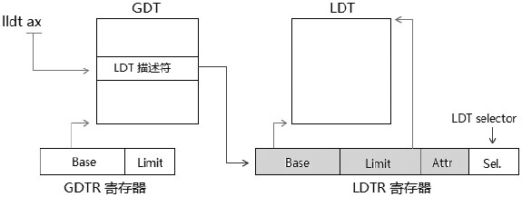
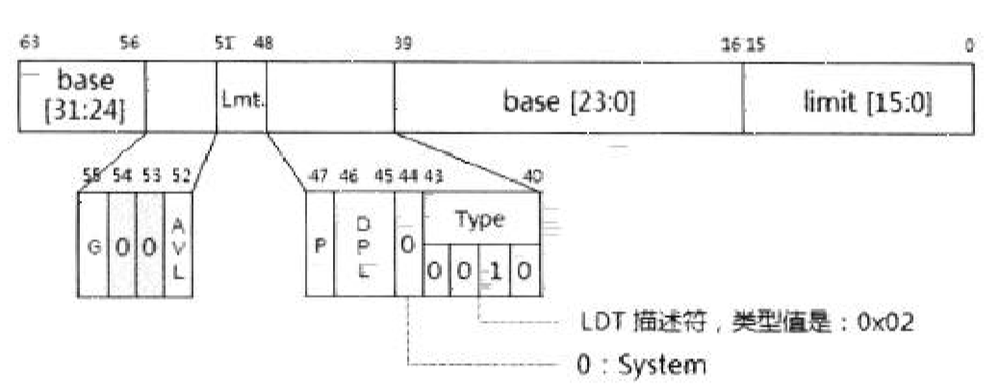
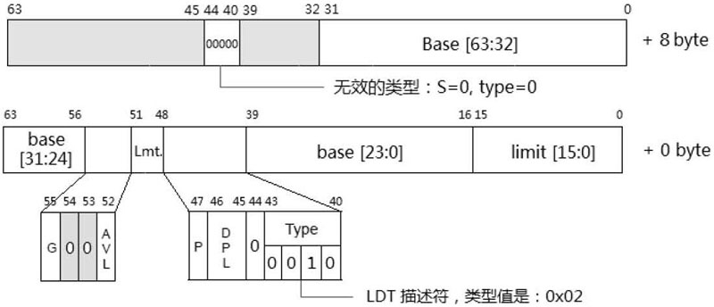

- 1 LDT描述符与LDT
    - 1.1 LDT描述符
    - 1.2 LDTR的加载
        - 1.2.1 Selector检查
        - 1.2.2 Limit检查
        - 1.2.3 LDT描述符类型检查
- 2 64位模式下的LDT描述符

# 1. LDT描述符与LDT

Local Descriptor Table是其中的一个描述符表，LDT由LDTR的Base域进行定位。



LDTR的结构与段寄存器的结构是完全一致的，包括：base、limit、attribute域，以及Selector域，base、limit、attribute组成LDTR的Cache部分，也是隐藏不可见的。

像段寄存器一样，LDTR需要使用LDT描述符进行加载，LDT描述符只能存放在GDT中。

32位的LDTR.base值能在LDT定位在4G的线性地址空间的任何位置，在64位模式下，LDTR.base被扩展位64位。

## 1.1 LDT描述符

LDT描述符属于系统级的描述符，它的结构与TSS完全一致。



LDT描述符的类型是0x02，S标志位为0值，表示属于一个system描述符。

## 1.2 LDTR的加载

系统使用LLDT指令进行显示加载，或在进行任务切换时隐式地从TSS段里加载。
```asm
    mov ax, LDT_SEL         ; LDT Selector
    lldt ax
```
lldt指令执行再0级权限里。处理器会检查以下内容。

### 1.2.1 Selector检查

对Selector检查两个方面。
1. 如果提供的Selector是Null Selector，则会产生#GP异常。
2. 如果Selector.TI=1，标志在LDT里，将产生#GP异常。

### 1.2.2 Limit检查

Selector是否超出GDT.limit值。

### 1.2.3 LDT描述符类型检查

能被加载到LDTR里的描述符必须如下：
1. S标志为0，属于system描述符。
2. P标志为1，标志在内存中。
3. Type值为0x02，它是LDT描述符。

# 2. 64位模式下的LDT描述符

和TSS描述符一样，在64位模式下LDT也被扩展为16字节，如下图所示。



高8字节的S标志位和Type值必须为0（00000B）值，用来确保高8字节不被作为Segment descriptor使用。

64位的LDT基址加载到LDTR的Base域。


