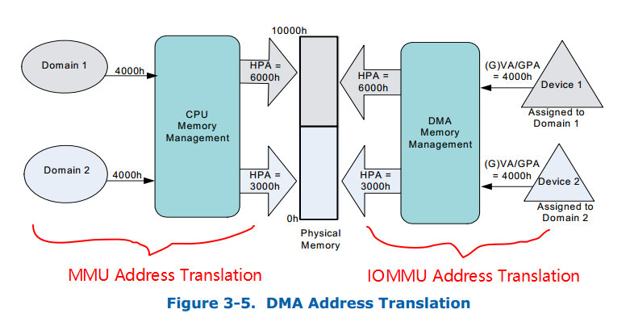

# 1. DMA简介

DMA传输将数据从一个地址空间（IO memory）复制到另外一个地址空间（System RAM），当CPU 初始化这个传输动作，传输动作本身是由 DMA控制器来实行和完成。其带来最大的好处是：CPU不需要干预数据传输的过程，这样就大大提高了CPU的利用率。

## 1.1 DMA Flow Chart

一个完整的DMA传输过程必须经过DMA请求、DMA应答、DMA传输数据、DMA终止4个步骤。

- DMA请求：CPU对DMA控制器初始化，并向I/O接口发出操作命令，I/O接口提出DMA请求。 

- DMA应答：DMA控制器对DMA请求判别优先级及屏蔽，向总线裁决逻辑提出总线请求。当CPU执行完当前总线周期即可释放总线控制权。此时，总线裁决逻辑输出总线应答，表示DMA已经响应，通过DMA控制器通知I/O接口开始DMA传输。 

- DMA传输：DMA控制器获得总线控制权后，CPU即刻挂起或只执行内部操作，由DMA控制器输出读写命令，直接控制RAM与I/O接口进行DMA传输。 

- DMA终止：当完成规定的成批数据传送后，DMA控制器即释放总线控制权，并向I/O接口发出结束信号。当I/O接口收到结束信号后，一方面停 止I/O设备的工作，另一方面向CPU提出中断请求，使CPU从不介入的状态解脱，并执行一段检查本次DMA传输操作正确性的代码。最后，带着本次操作结果及状态继续执行原来的程序。 

> 由此可见，DMA传输方式无需CPU直接控制传输，也没有中断处理方式那样保留现场和恢复现场的过程，通过硬件为RAM与I/O设备开辟一条直接传送数据的通路，使CPU的效率大为提高 

## 1.2 DMA硬件控制管脚

在Linux驱动开发中，使用DMA可能要操作DMAC（DMA控制器）的几个管脚介绍如下：
- 数据总线：用于传输数据；
- 地址总线：用于选择存储器地址；
- 数据传送信号：MEMR为存储器读操作信号，MEMW为存储器写操作信号，IOR为外设读操作信号，IOW为外设写操作信号；
- DRQ：DMA请求信号，外设向DMA控制器提出要求操作DMA操作的申请信号；
- DACK：DMA应答信号，DMAC响应外设提出的DMA请求操作；
- HOLD:总线请求信号，DMAC向CPU发出的临时占用总线的信号；
- HLDA：总线响应信号，CPU向DMAC发出的允许临时让出总线控制权的信号；

## 1.3 虚拟化环境中DMA相关问题

在设备直通(Device Passthough)的虚拟化场景下，直通设备在工作的时候同样要使用DMA技术来访问虚拟机的主存以提升IO性能。

那么问题来了，直接分配给某个特定的虚拟机的，我们必须要保证直通设备DMA的安全性：
- 一个VM的直通设备不能通过DMA访问到其他VM的内存
- 一个VM的直通设备不能直接访问Host的内存

> 否则会造成极其严重的后果。

因此，必须对直通设备进行`DMA隔离`和`DMA地址翻译`：
- 隔离：将直通设备的DMA访问限制在其所在VM的物理地址空间内保证不发生访问越界。
- 地址翻译：保证了直通设备的DMA能够被正确重定向到虚拟机的物理地址空间内。

**为什么直通设备会存在DMA访问的安全性问题呢？**

原因也很简单：由于直通设备进行DMA操作的时候guest驱动直接使用gpa来访问内存的，这就导致如果不加以隔离和地址翻译必然会访问到其他VM的物理内存或者破坏Host内存，因此必须有一套机制能够将gpa转换为对应的hpa这样直通设备的DMA操作才能够顺利完成。

**VT-d DMA Remapping的引入就是为了解决直通设备DMA隔离和DMA地址翻译的问题。**

# 2. DMA Remapping 简介

VT-d DMA Remapping的硬件能力主要是由IOMMU来提供，通过引入根`Context Entry`和`IOMMU Domain Page Table`等机制来实现直通设备`隔离`和`地址转换`的目的。

## 2.1 DMA Request

根据DMA Request是否包含地址空间标志(address-space-identifier)我们将DMA Request分为两类：
- Requests without address-space-identifier：不含地址空间标志的DMA Request，这种一般是`endpoint devices`的普通请求，请求内容仅包含`请求的类型(read/write/atomics)`，DMA请求的`address/size`以及请求设备的标志符等。

- Requests with address-space-identifier: 包含地址空间描述标志的DMA Request，此类请求需要包含额外信息以提供目标`进程的地址空间标志符(PASID)`，以及`Execute-Requested (ER) flag`和 `Privileged-mode-Requested`等细节信息。

为了简单，通常称上面两类DMA请求简称为：`Requests-without-PASID`和`Requests-with-PASID`。

## 2.2 DMA Isolation

首先要明确的是DMA Isolation是以`Domain`为单位进行隔离的，在虚拟化环境下可以认为**每个VM的地址空间为一个Domain**，**直通给这个VM的设备只能访问这个VM的地址空间**这就称之为“隔离”。

为了实现DMA隔离，我们需要对直通设备进行标志，而这是通过PCIe的Request ID来完成的。根据PCIe的SPEC，每个PCIe设备的请求都包含了PCI Bus/Device/Function信息，通过BDF号我们可以唯一确定一个PCIe设备。

同时为了能够记录直通设备和每个Domain的关系，VT-d引入了`root-entry/context-entry`的概念，通过查询`root-entry/context-entry table`就可以获得**直通设备和Domain之间的映射关系**。

### 2.2.1 Root-table

Root-table的基地址存放在Root Table Address Register当中。

Root-table是一个4K页，共包含了256项root-entry，分别覆盖了PCI的Bus0-255，每个root-entry占16-Byte。
记录了当前PCI Bus上的设备映射关系，通过PCI Bus Number进行索引。

Root-entry中记录的关键信息有：
- Present Flag：代表着该Bus号对应的Root-Entry是否呈现，CTP域是否初始化；
- Context-table pointer (CTP)：CTP记录了当前Bus号对应点Context Table的地址。 

### 2.2.2 context-table

context-table也是一个4K页，记录一个特定的PCI设备和它被分配的Domain的映射关系，即对应Domain的`DMA地址翻译结构`信息的地址。 

每个root-entry包含了该Bus号对应的context-table指针，指向一个context-table，而每张context-table包又含256个context-entry， 其中每个entry对应了一个Device Function号所确认的设备的信息。通过2级表项的查询我们就能够获得指定PCI被分配的Domain的地址翻译结构信息。

Context-entry中记录的信息有：
- Present Flag：表示该设备对应的context-entry是否被初始化，如果当前平台上没有该设备Preset域为0，索引到该设备的请求也会被block掉。
- Translation Type：表示哪种请求将被允许；
- Address Width：表示该设备被分配的Domain的地址宽度；
- Second-level Page-table Pointer：二阶页表指针提供了DMA地址翻译结构的HPA地址（这里仅针对Requests-without-PASID而言）；
- Domain Identifier: Domain标志符表示当前设备的被分配到的Domain的标志，硬件会利用此域来标记context-entry cache，这里有点类似VPID的意思；
- Fault Processing Disable Flag：此域表示是否需要选择性的disable此entry相关的remapping faults reporting。

因为多个设备有可能被分配到同一个Domain，这时只需要将其中每个设备context-entry项的`Second-level Page-table Pointer` 设置为对同一个Domain的引用， 并将Domain ID赋值为同一个Domian的就行了。

## 2.3 DMA Translation

根据软件的使用模型不同，直通设备的`DMA Address Space`可能是某个VM的`Guest Physical Address Space`或`某个进程的虚拟地址空间（由分配给进程的PASID定义）`或是由`软件定义的一段抽象的IO Virtual Address space (IOVA)`，总之DMA Remapping就是要能够将**设备发起的DMA Request进行DMA Translation重映射到对应的HPA上**。下面的图描述了DMA Translation的原理，这和MMU将虚拟地址翻译成物理地址的过程非常的类似。

Host平台上可能会存在一个或者多个DMA Remapping硬件单元，而每个硬件单元支持在它管理的设备范围内的所有设备的DMA Remapping。

例如，你的台式机CPU Core i7 7700k在MCH中只集成一个DMA Remapping硬件单元(IOMMU)，但在多路服务器上可能集成有多个DMA Remapping硬件单元。

每个硬件单元负责管理挂载到它所在的PCIe Root Port下所有设备的DMA请求。

BIOS会将平台上的DMA Remapping硬件信息通过ACPI DMAR表报告给操作系统，再由操作系统来初始化和管理这些硬件设备。

# 3. DMA隔离

VT-d中引入`root-table`和`context-table`的目的比较明显，这些额外的table的存在就是为了**记录每个直通设备和其被分配的Domain之间的映射关系**。 有了这个映射关系后，DMA隔离的实现就变得非常简单。

IOMMU硬件会截获直通设备发出的请求，然后根据其Request ID查表找到对应的Address Translation Structure即该Domain的IOMMU页表基地址，这样一来该设备的DMA地址翻译就只会按这个Domain的IOMMU页表的方式进行翻译，翻译后的HPA必然落在此Domain的地址空间内（这个过程由IOMMU硬件中自动完成）， 而不会访问到其他Domain的地址空间，这样就达到了DMA隔离的目的。

# 4. DMA地址翻译

DMA地址翻译的过程和虚拟地址翻译的过程是完全一致的，唯一不同的地方在于MMU地址翻译是将进程的虚拟地址(HVA)翻译成物理地址(HPA)，而IOMMU地址翻译则是将虚拟机物理地址空间内的GPA翻译成HPA。IOMMU页表和MMU页表一样，都采用了多级页表的方式来进行翻译。

例如，对于一个48bit的GPA地址空间的Domain而言，其IOMMU Page Table共分4级，每一级都是一个4KB页含有512个8-Byte的目录项。和MMU页表一样，IOMMU页表页支持2M/1G大页内存，同时硬件上还提供了IO-TLB来缓存最近翻译过的地址来提升地址翻译的速度。