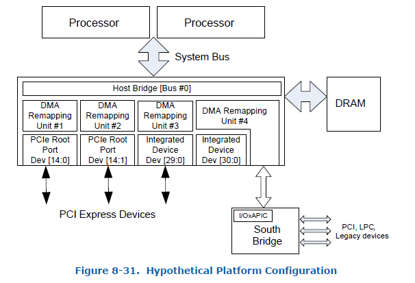
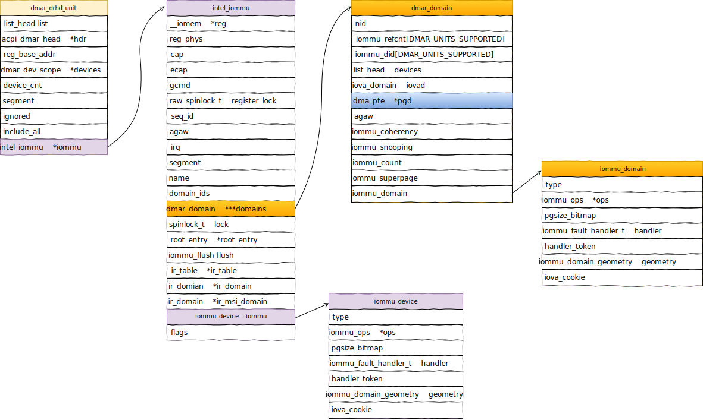

# 1. 概述

对于Intel的硬件辅助虚拟化方案而言核心的两大技术分别是VT-x和VT-d。 其中VT-x中主要引入了non-root模式(VMCS)以及EPT页表等技术，主要关注于vCPU的虚拟化和内存虚拟化。 而VT-d的引入则是重点关注设备直通(passthrough)方面（即IO虚拟化）。

- VT-x中在non-root模式下，MMU直接使用`EPT page table`来完成`GPA->HVA->HPA`的两级翻译
- VT-d中在non-root模式下，则由IOMMU来使用`Context Table`和`IOMMU page table`完成设备DMA请求过程中的`HPA->HVA->GPA`的翻译．


两者不同的是：
- CPU访问内存（Passthrough Devcie IO Memory）是通过MMU查找EPT页表完成地址翻译。
- Passthrough Device访问主存是通过IOMMU查找IOMMU页表来完成地址翻译的。

二者极为相似，唯一的不同之处在于CPU访问内存（直通设备IO Memory）是通过MMU查找EPT页表完成地址翻译， 而直通设备访问内存的请求则是通过IOMMU查找IOMMU页表来完成地址翻译的。

接下来讨论Intel IOMMU的工作机制。

# 2. Intel IOMMU概述

## 2.1 硬件结构

先看下一个典型的X86物理服务器视图：



在多路服务器上我们可以有多个DMAR Unit（这里可以直接理解为多个IOMMU硬件）， 每个DMAR会负责处理其下挂载设备的DMA请求进行地址翻译。 

例如上图中：
- PCIE Root Port (dev:fun) (14:0)下面挂载的所有设备的DMA请求由DMAR #1负责处理
- PCIE Root Port (dev:fun) (14:1)下面挂载的所有设备的DMA请求由DMAR #2负责处理
- DMAR #3下挂载的是一个Root-Complex集成设备[29:0]，这个设备的DMA请求被DMAR #3承包
- DMAR #4的情况比较复杂，它负责处理Root-Complex集成设备[30:0]以及I/OxAPIC设备的DMA请求。

这些和IOMMU相关的硬件拓扑信息需要BIOS通过ACPI表呈现给OS，这样OS才能正确驱动IOMMU硬件工作。

关于硬件拓扑信息呈现，这里有几个概念需要了解一下：

- DRHD: DMA Remapping Hardware Unit Definition 用来描述DMAR Unit(IOMMU)的基本信息
- RMRR: Reserved Memory Region Reporting 用来描述那些保留的物理地址，这段地址空间不被重映射
- ATSR: Root Port ATS Capability 仅限于有Device-TLB的情形，Root Port需要向OS报告支持ATS的能力
- RHSA: Remapping Hardware Static Affinity Remapping亲和性，在有NUMA的系统下可以提升DMA Remapping的性能

BIOS通过在ACPI表中提供一套DMA Remapping Reporting Structure 信息来表述物理服务器上的IOMMU拓扑信息， 这样OS在加载IOMMU驱动的时候就知道如何建立映射关系了。

```bash
#> acpidump --table DMAR -b > dmar.out
#> iasl -d dmar.out
#> cat dmar.dsl    
```

## 2.2 数据结构

Intel IOMMU Driver的关键数据结构可以描述为：



按照自上而下的视图来看，首先是IOMMU硬件层面，`struct dmar_drhd_unit`数据结构从系统BIOS角度去描述了一个IOMMU硬件：


成员 | 描述
---|---
list  | 用来把所有的DRHD串在一个链表中便于维护
acpi_dmar_head *hdr | 指向IOMMU设备的ACPI表信息
device_cnt | 表示当前IOMMU管理的设备数量
include_all | 表示该IOMMU是否管理平台上所有的设备（单IOMMU的物理物理服务器）
reg_base_addr | 表示IOMMU的寄存器基地址
intel_iommu *iommu | 指针指向struct intel_iommu数据结构
struct intel_iommu | 进一步详细描述了IOMMU的所以相关信息
cap和ecap | 记录IOMMU硬件的Capability和Extended Capability信息
root_entry | 指向了此IOMMU的Root Entry Table
ir_table | 指向了IOMMU的Interrupt Remapping Table（中断重映射表）
struct iommu_device iommu | 从linux设备驱动的角度描述这个IOMMU并用来绑定sysfs
struct dmar_domain ***domains | 比较关键，它记录了这个IOMMU下面管理的所有dmar_domain信息

在虚拟化场景下多个设备可以直通给同一个虚拟机，他们共享一个`IOMMU Page Table`， 这种映射关系就是通过DMAR Domain来表述的， 也就是说多个直通设备可以加入到一个DMAR Domain中， 他们之间使用同一套页表完成地址DMA请求的地址翻译。


那我们接着往下走，来看DMAR Domain：

成员 | 描述
---|---
struct dmar_domain | 数据结构用来描述DMAR Domain这种映射关系的
struct list_head devices | 链表记录了这个Domain中的所有设备
struct iova_domain iovad | 数据结构用一个红黑树来记录iova->hpa的地址翻译关系
struct dma_pte *pgd | 这个指针指向了IOMMU页表的基地址是IOMMU页表的入口
bool has_iotlb_device | 表示这个Domain里是否有具备IO-TLB的设备
struct iommu_domain domain | 主要包含了iommu_ops *ops指针，记录了一堆与domain相关的操作

## 2.3 Intel IOMMU初始化

首先探测平台环境上是否有IOMMU硬件：`IOMMU_INIT_POST(detect_intel_iommu)`， `detect_intel_iommu`函数中调用`dmar_table_detect`函数从ACPI表中查询DMAR相关内容：

```c
/**     
 * dmar_table_detect - checks to see if the platform supports DMAR devices
 */             
static int __init dmar_table_detect(void)
{
        acpi_status status = AE_OK;

        /* if we could find DMAR table, then there are DMAR devices */
        status = acpi_get_table(ACPI_SIG_DMAR, 0, &dmar_tbl);

        if (ACPI_SUCCESS(status) && !dmar_tbl) {
                pr_warn("Unable to map DMAR\n");
                status = AE_NOT_FOUND;
        }       

        return ACPI_SUCCESS(status) ? 0 : -ENOENT;
}
```

如果查询到信息就`validate_drhd_cb`验证DRHD的有效性设置`iommu_detected = 1`， 如果查询不到DMAR信息那么认为没有IOMMU硬件，跳过后续初始化流程。

接着`pci_iommu_init`中调用`x86_init.iommu.iommu_init()`来初始化Intel IOMMU，主要的流程为：
```c
intel_iommu_init
        |-> dmar_table_init -> parse_dmar_table -> dmar_walk_dmar_table
        |-> dmar_dev_scope_init 
            |-> dmar_acpi_dev_scope_init -> dmar_acpi_insert_dev_scope
            |-> dmar_pci_bus_add_dev -> dmar_insert_dev_scope
            |-> bus_register_notifier
        |-> dmar_init_reserved_ranges   // init RMRR
        |-> init_no_remapping_devices   // init no remapping devices
        |-> init_dmars
        |-> dma_ops = &intel_dma_ops
        |-> iommu_device_sysfs_add, iommu_device_set_ops, iommu_device_register
        |-> bus_set_iommu(&pci_bus_type, &intel_iommu_ops)
        |-> bus_register_notifier(&pci_bus_type, &device_nb)
```

在`dmar_table_init`函数中我们完成了DMA Remapping相关的ACPI表解析流程，这个`parse_dmar_table`的函数实现非常精妙，不禁让人感叹！它将每种`Remapping Structure Types`的解析函数封装成`dmar_res_callback`，然后调用`dmar_walk_dmar_table`通过一个for循环撸一遍就完成了全部的解析，代码精简思路清晰、一气呵成。

```c
static int __init
parse_dmar_table(void)
{
    struct acpi_table_dmar *dmar;
    int drhd_count = 0;
    int ret;
    struct dmar_res_callback cb = {
        .print_entry = true,
        .ignore_unhandled = true,
        .arg[ACPI_DMAR_TYPE_HARDWARE_UNIT] = &drhd_count,
        .cb[ACPI_DMAR_TYPE_HARDWARE_UNIT] = &dmar_parse_one_drhd,
        .cb[ACPI_DMAR_TYPE_RESERVED_MEMORY] = &dmar_parse_one_rmrr,
        .cb[ACPI_DMAR_TYPE_ROOT_ATS] = &dmar_parse_one_atsr,
        .cb[ACPI_DMAR_TYPE_HARDWARE_AFFINITY] = &dmar_parse_one_rhsa,
        .cb[ACPI_DMAR_TYPE_NAMESPACE] = &dmar_parse_one_andd,
    };

    /*
     * Do it again, earlier dmar_tbl mapping could be mapped with
     * fixed map.
     */
    dmar_table_detect();    // 重新detect dmar table

    /*
     * ACPI tables may not be DMA protected by tboot, so use DMAR copy
     * SINIT saved in SinitMleData in TXT heap (which is DMA protected)
     */
    dmar_tbl = tboot_get_dmar_table(dmar_tbl);

    dmar = (struct acpi_table_dmar *)dmar_tbl;
    if (!dmar)
        return -ENODEV;

    if (dmar->width < PAGE_SHIFT - 1) {
        pr_warn("Invalid DMAR haw\n");
        return -EINVAL;
    }

    pr_info("Host address width %d\n", dmar->width + 1);
    ret = dmar_walk_dmar_table(dmar, &cb);  //遍历ACPI表完成解析
    if (ret == 0 && drhd_count == 0)
        pr_warn(FW_BUG "No DRHD structure found in DMAR table\n");

    return ret;
}
```

`dmar_dev_scope_init`函数负责完成IOMMU的Device Scope解析。 `dmar_acpi_insert_dev_scope`中多层的遍历，建立了IOMMU和设备之间的映射关系。

```c
static void __init dmar_acpi_insert_dev_scope(u8 device_number,
                          struct acpi_device *adev)
{
    struct dmar_drhd_unit *dmaru;
    struct acpi_dmar_hardware_unit *drhd;
    struct acpi_dmar_device_scope *scope;
    struct device *tmp;
    int i;
    struct acpi_dmar_pci_path *path;

    for_each_drhd_unit(dmaru) {
        drhd = container_of(dmaru->hdr,
                    struct acpi_dmar_hardware_unit,
                    header);

        for (scope = (void *)(drhd + 1);
             (unsigned long)scope < ((unsigned long)drhd) + drhd->header.length;
             scope = ((void *)scope) + scope->length) {
            if (scope->entry_type != ACPI_DMAR_SCOPE_TYPE_NAMESPACE)
                continue;
            if (scope->enumeration_id != device_number)
                continue;

            path = (void *)(scope + 1);
            pr_info("ACPI device \"%s\" under DMAR at %llx as %02x:%02x.%d\n",
                dev_name(&adev->dev), dmaru->reg_base_addr,
                scope->bus, path->device, path->function);
            for_each_dev_scope(dmaru->devices, dmaru->devices_cnt, i, tmp)
                if (tmp == NULL) {
                    dmaru->devices[i].bus = scope->bus;
                    dmaru->devices[i].devfn = PCI_DEVFN(path->device,
                                        path->function);
                    rcu_assign_pointer(dmaru->devices[i].dev,
                               get_device(&adev->dev));
                    return;
                }
            BUG_ON(i >= dmaru->devices_cnt);
        }
    }
    pr_warn("No IOMMU scope found for ANDD enumeration ID %d (%s)\n",
        device_number, dev_name(&adev->dev));
}
```

`init_dmars`函数最后再对描述IOMMU的intel_iommu结构进行初始化，主要的流程包括：

```c
 init_dmars
    |-> intel_iommu_init_qi         // qeueu invalidation
    |-> iommu_init_domains
    |-> init_translation_status
    |-> iommu_alloc_root_entry      //创建Root Entry
    |-> translation_pre_enabled
    |-> iommu_set_root_entry
    |-> iommu_prepare_rmrr_dev
    |-> iommu_prepare_isa           // 0-16MiB 留给ISA设备
    |-> dmar_set_interrupt          // IOMMU中断初始化
```