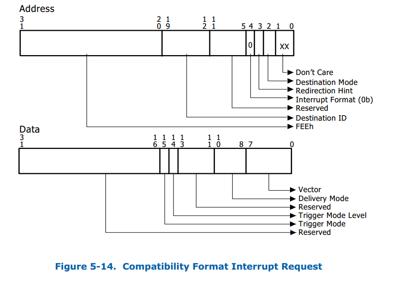

# 1. 概述

Intel VT-d 虚拟化方案主要目的是解决IO虚拟化中的安全和性能这两个问题，这其中最为核心的技术就是DMA Remapping和Interrupt Remapping。 DMA Remapping通过IOMMU页表方式将直通设备对内存的访问限制到特定的domain中，在提高IO性能的同时完成了直通设备的隔离，保证了直通设备DMA的安全性。Interrupt Remapping则提供IO设备的`中断重映射`和`路由功能`，来达到`中断隔离`和`中断迁移`的目的，提升了虚拟化环境下直通设备的中断处理效率。

# 2. Interrupt Remapping 简介

Interrupt Remapping的出现改变了x86体系结构上的中断投递方式，外部中断源发出的中断请求格式发生了较大的改变， 中断请求会先被`中断重映射硬件截获`后再通过查询`中断重映射表`的方式最终投递到目标CPU上。 

这些外部设备中断源则包括了中断控制器(I/O APIC)以及MSI/MSIX兼容设备PCI/PCIe设备等。
**Interrupt Remapping是需要硬件来支持的**，这里的硬件应该主要是指的`IOMMU`，Interrupt Remapping的`Capability`是通过`Extended Capability Register`来报告的。


## 2.1 Compatlibility format

在 disbale Interrupt Remapping的情况下，设备**中断请求格式**称之为`Compatibility format`，其结构主要包含**一个32bit的Address**和**一个32bit的Data字段**，Address字段包含了中断要投递的目标CPU的`local APIC ID`信息，Data字段主要包含了要投递的`vecotr号`和`投递方式`。结构如下图：



其中Address的bit 4为`Interrupt Format`位，用来标志这个`Request`是`Compatibility format（bit4=0）`还是`Remapping format (bit 4=1)`。

## 2.2 Remapping format

在 enbale Interrupt Remapping之后，设备的**中断请求格式**称之为`Remapping format`，其结构同样由**一个32bit的Address**和**一个32bit的Data字段**构成。但与Compatibility format不同的是此时**Adress字段不再包含目标CPU的APIC ID信息**而是提供了**一个16bit的HANDLE索引**，并且Address的bit 4为"1"表示Request为`Remapping format`。同时bit 3是`一个标识位(SHV)`，用来标志Request是否包含了`SubHandle`，当该位置位时表示**Data字段的低16bit为SubHandle索引**。

Remapping format的中断请求格式如下图：


在Interrupt Remapping模式下，硬件查询系统软件在**内存中预设**的`中断重映射表(Interrupt Remapping Table)`来投递中断。

中断重映射表由`中断重映射表项(Interrupt Remapping Table Entry)构成`，每个`IRTE`占用`128bit`（具体格式介绍见文末），中断重映射表的基地址存放在`Interrupt Remapping Table Address Register`中。硬件通过下面的方式去计算中断的interrupt_index：

```c
if (address.SHV == 0) {
    interrupt_index = address.handle;
} else {
    interrupt_index = (address.handle + data.subhandle);
}
```

`中断重映射硬件`通过`interrupt_index`去`重映射表`中`索引对应的IRTE`，中断重映射硬件可以缓存那些经常使用的IRTE以提升性能。

> 由于handle为16bit，故每个IRT包含65536个IRTE，占用1MB内存空间。

# 3. 外设的中断投递方式和中断处理

针对不同的中断源，需要采用不同的方式来投递Remapping格式的中断。

对I/O APIC而言，其Remapping格式中断投递格式如下图，软件需要按图中的格式来发起Remapping中断请求，这就要求需要修改“中断重定向表项”(Interrupt Redirection Table Entry)，值得注意的是**bit48这里需要设置为"1"用来标志此RTE为Remapping format**，并**且RTE的bit10:8固定为000b(即没有SubHandle)**。而**且vector字段必须和IRTE的vector字段相同**！


对于MSI和MSI-X而言，其Remapping格式中断投递格式如下图，值得注意的是在Remapping格式下MSI中断支持`multiple vector`（大于32个中断向量），但软件必须连续分配N个连续的IRTE并且interrupt_index对应HANDLE号必须为N个连续的IRTE的首个。**同样bit 4必须为"1"用来表示中断请求为Remapping格式。Data位全部设置为"0"**。


# 4. 中断重映射处理流程

## 4.1 硬件部分

`fee00000-fee00fff : Local APIC`

1. 硬件识别到物理地址`0xFEEx_xxxx`范围内的DWORD写请时，将该请求认定为中断请求；
2. 当`Interrupt Remapping disbale`时，所有的中断都按照`Compatibility format`来处理；
3. 当`当Intgrrupt Remapping enable`时，中断请求处理流程如下：
    1. 如果中断请求为`Compatibility format`：先检测`IRTA寄存器`的`EIME位`，如果该位为“1”那么`Compatibility format`的`中断被blocked`，否则`Compatibility format`中断请求都按照`pass-through方式处理（传统方式）`。
    2. 如果中断请求为`Remapping format`：先检测`reserved fileds`是否为0，如果检查失败那么中断请求被blocked。接着硬件按照上面提到的算法计算出`interrupt_index`并检测其是否合法，如果该`interrupt_index`合法那么根据`interrupt_index`索引`中断重映射表`找到对应的`IRTE`，然后检测`IRTE中的Present位`，如果`Preset位为0那么中断请求被blocked`，如果`Present位为1`，硬件校验IRTE其他field合法后按照IRTE的约定产生一条中断请求。

## 4.2 软件部分

1. 分配一个IRTE并且按照`IRTE的格式要求填好IRTE的每个属性`；
2. 按照`Remapping format`的要求对`中断源进行编程`，在合适的时候触发一个`Remapping format格式的中断请求`。


# 5. Remapping格式中断重映射表项的格式

Interrupt Remapping格式的中断重映射表项的格式为：


其中比较关键的中断描述信息为：

位域 | 描述
---|---
Present域(P) | 0b表示此IRTE还没有被分配到任何的中断源，索引到此IRTE的Remapping中断将被blocked掉，1b表示此IRTE是有效的，已经被分配到某个设备。
Destination Mode域(DM) | 0b表示Destination ID域为Physical APIC-ID，1b表示Destination ID域是Logical APIC-ID。
IRTE Mode域(IM) | 0b表示此中断请求是一个Remapped Interrupt中断请求，1b表示此中断请求是一个Posted Interrupt中断请求。
Vector域(V) | 共8个Byte表示了此Remapped Interrupt中断请求的vector号(Remapped Interrupt)。
Destination ID域(DST) | 表示此中断请求的目标CPU，根据当前Host中断方式不同具有不同的格式。xAPIC Mode (Cluster)为bit[40:47]， xAPIC Mode (Flat)和xAPIC Mode (Physical)为bit[47:40]， x2APIC Mode (Cluster)和x2APIC Mode (Physical)为bit[31:0]。
SID, SQ, SVT | 则联合起来表示了中断请求的设备PCI/PCI-e request-id信息。

