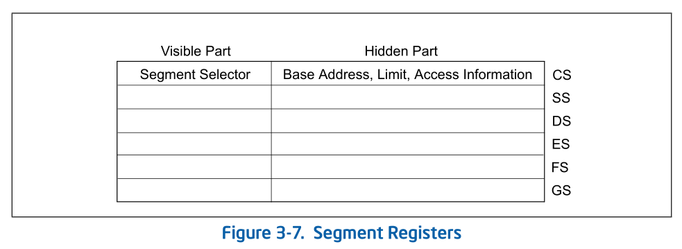
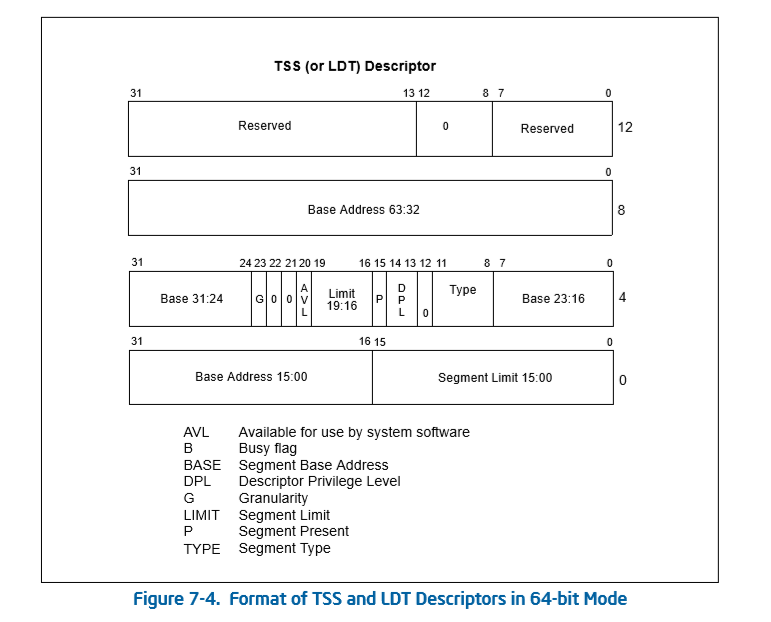
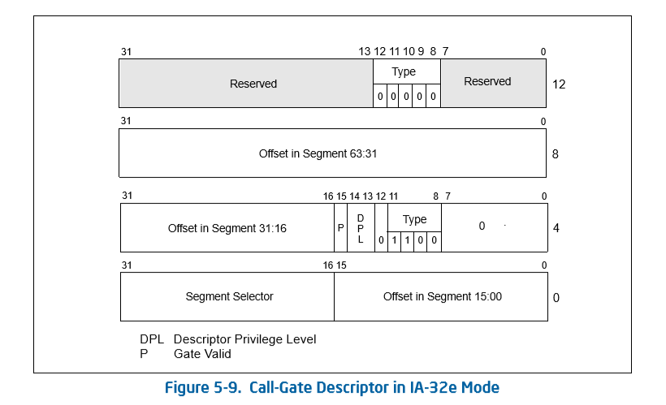
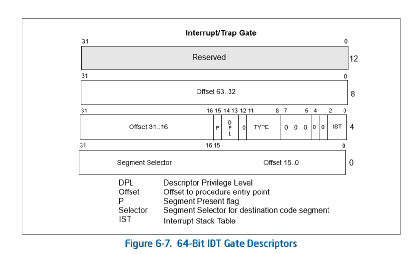
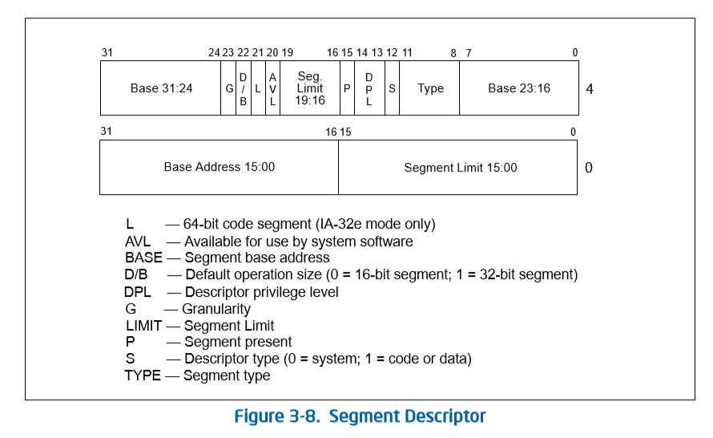
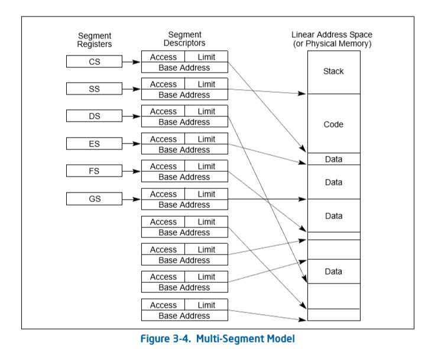

[toc]

# 1 基本概念

## 1.1 Segment Selectors

段选择子（Segment Selector）：是一个16位的标识符。
- Index：在GDT或LDT描述符表8192个选择子中的一个。
- Table Indicator flags（TI）：描述符表索引位。当TI=0时，从GDT查找；当TI=1时，从LDT查找。
- Requested Privilege Level（RPL）：请求访问者所使用的权限级别，从0到3级。

## 1.2 Segment Registers

段寄存器（Segment Registers）：处理器提供6个寄存器支持6个段选择子。
- Code-segment(CS)：代码段。
- Data-segment(DS)：数据段。
- Stack-segment(SS)：堆栈段。
- Data-segment(ES)：附加的数据段寄存器。
- Data-segment(FS)：附加的数据段寄存器。
- Data-segment(GS)：附加的数据段寄存器。

如图所示，可视部分只有Selector域。不可视部分隐藏在寄存器内部只有处理器可用，有时也被称为Cache部分。

段寄存器的Base Address在64位模式下被扩展为64位，对于CS、ES、SS和DS寄存器来说这个64位的基值没什么意义。在64位模式下，这些段的基值都被强制为0值。

64位的段基值对于FS和GS寄存器来说才有意义，FS和GS寄存器可以由软件设置非0的64位值。

使用代码段或数据段描述符的加载方法，只能加载一个32位的base值，在x64体系中，新增了两个MSR寄存器：IA32_FS_BASE和IA32_GS_BASE。它们分别映射到FS.base和GS.base。

## 1.2 Segment Descriptor Table

段描述符表（Segment Descriptor Table）是一个段描述符的数组，一个描述符表是变长的可以包含8192个8字节描述符。
系统必须有一个GDT，所有程序和任务都可以使用这个GDT。可选一个或多个LDT。

- Global Descriptor Table(GDT)：通过GDTR寄存器索引该表
- Local Descriptor Tables(LDT)：通过LDTR寄存器索引该表

## 1.3 Segment Descriptor

### 1.2.1 System descriptor types
        
系统段描述符：
- Local Descriptor Table (LDT)
- Task State segment(TSS)

        
门描述符：

- call-gate：

- interrupt-gate：
- trap-gate：

### 1.2.2 no-system descriptor 
- Code Segment
- Data Segment

## 1.4 分段模型

## 1.5 IA-32e系统级寄存器与数据结构

